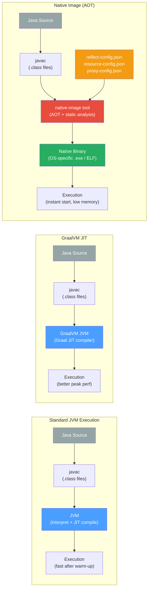

# 🔮 GraalVM and Native Image

> [!abstract] TL;DR
> GraalVM is a high-performance polyglot VM that replaces the HotSpot JIT (C2) with the Graal compiler and adds the `native-image` tool for ahead-of-time (AOT) compilation to a self-contained native binary. Native images start in milliseconds and use a fraction of the JVM memory — ideal for CLI tools, serverless functions, and microservices — but require explicit configuration for reflection, dynamic proxies, and resource loading because the closed-world assumption forbids dynamic class discovery at runtime.

---

## Intuition — the Sous-Vide vs Instant-Pot Analogy

- **Standard JVM**: like a slow-cooker that improves output the longer it runs. The HotSpot JIT profiles your code while it executes, then optimizes the hot paths. First 30 seconds are sluggish (interpreter) then it gets fast. Excellent for long-running servers.
- **GraalVM with Graal JIT**: a faster slow-cooker with a smarter thermostat. Same warm-up concept, but the Graal compiler produces better machine code for complex inlining and escape analysis scenarios.
- **Native Image**: freeze-dried meals — the entire "cooking" (compilation, class loading, static analysis) happens at build time. The resulting binary runs instantly with no warm-up. But you can't add new ingredients at runtime (no dynamic class loading, limited reflection).
- **Closed-world assumption**: the freeze-drying machine must know every ingredient before it starts. If you add new ingredients dynamically (reflection, `Class.forName`), it cannot handle them — unless you pre-declare them in a configuration file.

---

## How It Works



---

## Key Concepts / Details

### Graal JIT Compiler vs C2 (HotSpot)

```java
// ── Using GraalVM as a drop-in JVM replacement ────────────────────────────────
// GraalVM Community Edition includes the Graal JIT — run normal JARs with better
// optimizations (partial escape analysis, aggressive inlining, speculative opts)

// Install via SDKMAN:
// sdk install java 21.0.2-graalce

// Run existing JAR with GraalVM JIT (no code changes needed):
// java -jar myapp.jar          ← GraalVM JIT kicks in automatically

// Graal JIT advantages over C2:
//   - Written in Java (easier to extend and optimize)
//   - Better partial escape analysis (fewer allocations)
//   - More aggressive method inlining
//   - Truffle API for polyglot language interop
//
// Graal JIT may NOT win on:
//   - Short-lived processes (warm-up still needed)
//   - Integer-heavy number crunching (C2 is well-tuned for this)
//   - Applications already heavily tuned for C2 behavior
```

### Native Image — AOT Compilation

```java
// ── Building a native image ──────────────────────────────────────────────────
// Prerequisites: GraalVM + native-image tool
//   gu install native-image    (GraalVM Component Updater)

// Simple compilation:
//   native-image -jar myapp.jar -o myapp-native
//   ./myapp-native             ← runs immediately, no JVM needed

// With Maven (native-image-maven-plugin or GraalVM Reachability Metadata):
// <plugin>
//   <groupId>org.graalvm.buildtools</groupId>
//   <artifactId>native-maven-plugin</artifactId>
//   <version>0.9.28</version>
//   <configuration>
//     <imageName>myapp</imageName>
//     <buildArgs>
//       <buildArg>--no-fallback</buildArg>
//       <buildArg>-H:+ReportExceptionStackTraces</buildArg>
//     </buildArgs>
//   </configuration>
// </plugin>
// mvn -Pnative native:compile


// ── Startup and memory comparison ────────────────────────────────────────────
//
//  Metric               │ Standard JVM (Spring Boot)  │ Native Image
//  ─────────────────────┼─────────────────────────────┼─────────────────────
//  Startup time         │ 2–8 seconds                 │ 20–100 ms
//  Peak throughput      │ High (after JIT warm-up)    │ Lower (no JIT opts)
//  Memory (RSS)         │ 200–500 MB                  │ 30–80 MB
//  Binary size          │ JDK + JAR (~200 MB+)        │ Self-contained (~50 MB)
//  Build time           │ Seconds                     │ Minutes (AOT analysis)
//  Best for             │ Long-running services       │ CLI, serverless, init-sensitive
```

### Reflection and the Closed-World Assumption

```java
// ── The closed-world assumption ───────────────────────────────────────────────
// native-image performs static analysis at build time to determine which classes,
// methods, and fields are reachable. ONLY reachable code is included in the binary.
//
// Reflection, dynamic proxies, serialization, and resource loading break this
// because they reference classes by name strings — not detectable by static analysis.

// ── reflect-config.json: declare what reflection is needed ───────────────────
// Location: src/main/resources/META-INF/native-image/reflect-config.json
/*
[
  {
    "name": "com.example.MyService",
    "allPublicMethods": true,
    "allDeclaredFields": true,
    "allDeclaredConstructors": true
  },
  {
    "name": "com.example.dto.UserDTO",
    "allPublicMethods": true,
    "fields": [
      { "name": "id" },
      { "name": "name" }
    ]
  }
]
*/

// ── Other config files ────────────────────────────────────────────────────────
// resource-config.json: declare classpath resources accessed via getResourceAsStream
/*
{
  "resources": {
    "includes": [
      { "pattern": "\\QMETA-INF/services/.*\\E" },
      { "pattern": "\\Qapplication.properties\\E" }
    ]
  }
}
*/

// proxy-config.json: declare interfaces that need dynamic proxy support
/*
[
  { "interfaces": ["com.example.MyRepository", "org.springframework.data.repository.Repository"] }
]
*/

// ── Generating config automatically with the tracing agent ────────────────────
// Run your app with the tracing agent — it records all reflection/proxy/resource access
// and writes config files automatically.
//
// java -agentlib:native-image-agent=config-output-dir=src/main/resources/META-INF/native-image \
//      -jar myapp.jar
// [exercise all code paths — run integration tests!]
// [config files are written to the specified directory]
//
// Then include the generated config in your build — review it before committing!
```

### Spring Boot 3 Native Support

```java
// ── Spring Boot 3 + Spring Native (GraalVM Reachability Metadata) ────────────
// Spring Boot 3+ has first-class native image support via AOT processing engine.
// Spring generates reflect-config, proxy-config etc. at build time from annotations.

// application.properties / application.yml — no changes needed for basic apps
// Most @Component, @Service, @Repository, @Controller are handled automatically

// pom.xml additions:
// <parent>
//   <groupId>org.springframework.boot</groupId>
//   <artifactId>spring-boot-starter-parent</artifactId>
//   <version>3.2.0</version>
// </parent>
//
// Build native image with Spring Boot plugin:
//   mvn spring-boot:build-image -Pnative
//   (uses Buildpacks + Paketo builder with GraalVM — no local GraalVM install needed)
//
// OR with local GraalVM:
//   mvn -Pnative native:compile

// ── What Spring AOT does automatically ─────────────────────────────────────────
// 1. Runs AOT engine at build time → generates:
//    - BeanDefinition sources (avoids reflection for bean creation)
//    - Proxy classes (no dynamic proxies needed at runtime)
//    - reflect-config.json for things that still need reflection
// 2. Replaces @Configuration class enhancement with static factory methods
// 3. Inlines property values (no more PropertySources lookup overhead)

// ── Hints for non-standard reflection ─────────────────────────────────────────
import org.springframework.aot.hint.annotation.RegisterReflectionForBinding;

@RegisterReflectionForBinding(MyDTO.class) // tells AOT this class needs reflection
@RestController
public class MyController {
    // ...
}

// Or programmatic:
// RuntimeHintsRegistrar: register hints for custom reflection, resources, proxies
```

### GraalVM Polyglot — Running Other Languages

```java
// ── GraalVM polyglot API — embed JS/Python/Ruby in Java ──────────────────────
// Only on GraalVM JVM (not native image by default — requires polyglot libs)

import org.graalvm.polyglot.*;

try (Context context = Context.create()) {
    // Execute JavaScript
    Value result = context.eval("js", "Math.sqrt(16)");
    System.out.println(result.asDouble()); // 4.0

    // Pass Java objects to JavaScript
    context.getBindings("js").putMember("javaList", List.of(1, 2, 3));
    context.eval("js", "javaList.forEach(x => print(x))");

    // Execute Python (requires python component: gu install python)
    context.eval("python", "print('Hello from Python!')");
}

// Use cases:
//   - Embed user-defined rules/scripts in Java apps
//   - Run existing Python ML scripts from Java
//   - Plugin systems where plugins are written in a scripting language
```

### GraalVM CE vs EE

```
Community Edition (CE) — free, open source (GPLv2 + Classpath Exception)
  ✅ Graal JIT compiler
  ✅ native-image
  ✅ Truffle polyglot framework
  ❌ No enterprise optimizations (G1/ZGC tuning, profiling, etc.)
  ❌ No Oracle-proprietary components

Enterprise Edition (EE) — commercial license (free on OCI)
  ✅ All CE features
  ✅ Profile-guided optimization (PGO) for native images → faster native binaries
  ✅ G2 (improved GC for native image)
  ✅ Better diagnostic tools (Mission Control enterprise features)
  ✅ Better peak JIT performance
  Pricing: free on Oracle Cloud Infrastructure; licensed elsewhere
```

---

## Real-World Notes

- **AWS Lambda cold starts**: Native image reduces cold start from 2–5 seconds to ~50ms — critical for latency-sensitive serverless functions. AWS Lambda SnapStart (for JVM) is an alternative that doesn't require AOT.
- **Quarkus and Micronaut** are frameworks designed from the ground up for native image — they use compile-time DI (no runtime reflection) and generate metadata eagerly.
- **Testcontainers and H2** work in native tests via Testcontainers JUnit 5 integration with `@ClassRule` — ensure `testcontainers-junit-jupiter` is on the test classpath.
- **PGO (Profile-Guided Optimization)**: GraalVM EE supports building a native image in two passes — first instrument, then profile under real load, then recompile with profile data → typically 15–50% better throughput than unoptimized native.
- **Debugging native images**: Use `-H:+GenerateDebugInfo=1` at build time; then use `gdb` or `lldb`. Java-level debugger is not available — this is a significant operational trade-off.
- **GraalVM 23.1+ (JDK 21 base)**: experimental support for lifting some closed-world restrictions via the Layered Native Image feature — watch JEPs for updates.

---

## Common Pitfalls

1. **Forgetting the tracing agent for library reflection**: Framework code (Jackson, JPA, JAXB) uses extensive reflection. Without the tracing agent or community reachability metadata, native builds fail at runtime with `ClassNotFoundException` or `NoSuchMethodException`.

2. **Dynamic `Class.forName()` without config**: `Class.forName("com.example." + type)` where `type` is a runtime string is invisible to static analysis. Provide `reflect-config.json` or replace with a switch/factory pattern.

3. **`--no-fallback` omission**: Without this flag, native-image generates a "fallback" binary that bundles a JVM as backup — you lose all size/startup benefits. Always add `--no-fallback` to catch incompatible code early.

4. **Build time minutes vs seconds**: Native image compilation takes 2–10 minutes for large apps. Set up a CI pipeline where native builds are a separate, nightly or release-gated job, not the default dev loop.

5. **Thread-unsafe class initialization at build time**: Static initializers that open sockets, access system properties, or start threads run at build time, not at application start. Use `--initialize-at-run-time=com.example.MyClass` to defer specific class initialization.

6. **Missing resource patterns in `resource-config.json`**: `getClass().getResourceAsStream("messages.properties")` fails at runtime if `messages.properties` is not declared in resource config. The tracing agent catches these — run a complete integration test suite under the agent.

---

## Related Concepts

- [[JVM_Memory_Areas]] — standard JVM runtime vs. native image runtime (no JIT, no heap generations in same form)
- [[Object_Memory_Layout]] — native image has different object representation (no biased locking, no mark word for GC)
- [[Spring_Boot_Core]] — Spring Boot 3 AOT engine and native support
- [[Performance_Profiling]] — JFR for JVM, gdb/perf for native images
- [[_MOC_JVM_Memory|↑ Section MOC]]

---

## Review Questions

1. What is the "closed-world assumption" in GraalVM native image, and why does it make Java reflection problematic? What are the three mechanisms to declare reflective access to the native-image tool?

2. Compare startup time, peak throughput, and memory footprint between a standard Spring Boot application on the JVM and a Spring Boot native image. For what deployment targets does each excel?

3. What does Spring Boot 3's AOT engine generate at build time, and how does it reduce the amount of hand-written native image configuration needed for typical Spring applications?

---

## Sources

- GraalVM Documentation — https://www.graalvm.org/latest/docs/
- JEP 295 — AOT Compilation (early proposal): https://openjdk.org/jeps/295
- Spring Native — https://docs.spring.io/spring-boot/docs/current/reference/html/native-image.html
- Quarkus native guide — https://quarkus.io/guides/building-native-image

#Java #GraalVM #NativeImage #AOT #Performance #SpringBoot #Polyglot
