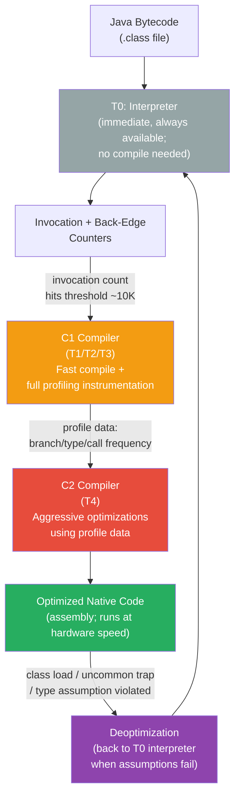

# 🚀 JIT Compilation and Tuning

> [!abstract] TL;DR
> JVM **tiered compilation**: Interpreter (T0, immediate start) → C1 with profiling (T1/T2/T3, fast compile, instruments call/branch counts) → C2 (T4, aggressive optimization using profile data). Compilation triggered by invocation counter (~10K calls default). Key JIT optimizations: **method inlining** (highest impact; limit ~35 bytes bytecode), **escape analysis** (stack allocation + lock elision for non-escaping objects), **loop unrolling**, **constant folding**, and **intrinsics** (hardware-optimized implementations for `Math.sqrt`, `Arrays.copy`, CRC32). **Deoptimization** reverts compiled code to interpreter when speculative optimizations fail (class loading breaks type assumptions). **JMH** (Java Microbenchmark Harness) is the only correct tool for Java microbenchmarks — naive timing is meaningless without controlled warmup, dead-code elimination prevention, and fork isolation.

---

## Intuition

- **JIT** = an interpreter who learns your speech patterns. Day 1: translates word-by-word (interpreter — slow). Week 2: memorizes common phrases (C1 — faster). Month 3: has internalized the language and thinks in it (C2 — native speed).
- **Warmup period** = the learning phase. A new Java service is slow for 30–60 seconds. This is normal and expected — the JIT is profiling hot paths and compiling them.
- **Method inlining** = eliminating the overhead of saying "see instructions on page 47" — instead, you just include the instructions inline. Now the CPU can optimize them together.
- **Escape analysis** = the JIT asking: "does this object ever leave this method?" If no, it can live on the stack (no GC) or its lock can be removed (no synchronization overhead).
- **Deoptimization** = the JIT saying "I was wrong — I assumed all callers pass a String, but now someone passed a StringBuffer." Back to the interpreter until a new, better-informed compilation.

---

## How It Works

### Tiered Compilation Pipeline



### Compilation Tiers

| Tier | Name | Profiling | Optimization level | Trigger | Notes |
|---|---|---|---|---|---|
| T0 | Interpreter | N/A (collects counters) | None | Immediately on method load | Always available; slow; enables fast startup |
| T1 | C1 (no profiling) | None | Basic | Trivial methods | Fast compilation for simple code |
| T2 | C1 (limited profiling) | Invocation counts | Basic | Moderately invoked | Invocation count threshold |
| T3 | C1 (full profiling) | Branch, type, call counts | Basic | Hot methods | Full profile data collection |
| T4 | C2 (optimized) | Uses T3 profile data | Aggressive | After T3 threshold | Inlining, EA, loop opts, intrinsics |

Typical hot method path: **T0 → T3 → T4**. Very hot loops may use OSR (On-Stack Replacement) to compile while already executing.

---

### Java Code Examples

```java
// ── JIT warmup demonstration ─────────────────────────────────────────────────
public class JITWarmupDemo {

    public static void main(String[] args) {
        // Phase 1: Cold (T0 interpreter) — slow
        long start = System.nanoTime();
        for (int i = 0; i < 100_000; i++) {
            compute(i);   // first ~10K calls: interpreted; ~10K-30K: C1; ~30K+: C2
        }
        System.out.printf("Cold run: %,dns%n", System.nanoTime() - start);

        // Phase 2: Hot (fully C2 compiled) — much faster
        start = System.nanoTime();
        for (int i = 0; i < 100_000; i++) {
            compute(i);   // C2-compiled; runs at near-native speed
        }
        System.out.printf("Hot run:  %,dns%n", System.nanoTime() - start);
        // Typical ratio: hot is 5–50× faster than cold for compute-heavy methods
    }

    // Math.sqrt is a JIT intrinsic — replaced with hardware SQRTSD instruction
    static double compute(int n) {
        return Math.sqrt(n * n + 2 * n + 1);
    }
}


// ── Method inlining: keep hot methods small ───────────────────────────────────
public class InliningDemo {

    // Small method (< 35 bytes bytecode) — JIT will inline at call sites
    // Inlining eliminates call overhead AND enables further optimizations
    private static int add(int a, int b) {
        return a + b; // ~3 bytecode instructions
    }

    public static int compute(int[] data) {
        int sum = 0;
        for (int v : data) {
            sum = add(v, sum); // JIT inlines add() here → becomes: sum += v
        }
        return sum;
        // After inlining + loop optimization: equivalent to a simple accumulator loop
    }

    // Large method > MaxInlineSize (35 bytes) — harder to inline
    // Break large hot methods into smaller helper methods for better JIT optimization
    // -XX:+PrintInlining shows which methods were inlined/not inlined

    // Virtual call inlining: possible if call site is monomorphic or bimorphic
    // Monomorphic = always same concrete type → JIT speculatively inlines the single impl
    // Bimorphic = two types → JIT emits a two-way branch inline
    // Megamorphic (3+ types) → not inlined → interpret interface dispatch (slower)
}


// ── Escape analysis: stack allocation and lock elision ───────────────────────
public class EscapeAnalysisDemo {

    record Point(int x, int y) {}

    // Point does NOT escape sumPoint() → JIT stack-allocates it (no heap, no GC)
    // After inlining + constant folding: return 7; (all at compile time)
    public static int sumPoint() {
        Point p = new Point(3, 4); // stack-allocated by JIT via escape analysis
        return p.x() + p.y();      // constant folded to 3 + 4 = 7
    }

    // Lock elision: synchronized on a non-escaping local object → lock is removed
    public static void lockElision() {
        Object localLock = new Object(); // doesn't escape this method
        synchronized (localLock) {       // JIT detects lock is uncontended → elides it
            doWork();                    // runs without acquiring any lock at all
        }
    }

    // COUNTER-EXAMPLE: object that DOES escape — must heap-allocate
    private static Point escapingPoint;
    public static void createEscaping() {
        Point p = new Point(1, 2);
        escapingPoint = p;  // escapes to static field → must be heap-allocated
    }

    private static void doWork() { /* compute */ }
}


// ── JMH: the only correct way to micro-benchmark Java ───────────────────────

// Add to pom.xml:
// <dependency>
//   <groupId>org.openjdk.jmh</groupId>
//   <artifactId>jmh-core</artifactId>
//   <version>1.37</version>
// </dependency>

@BenchmarkMode(Mode.AverageTime)        // measure average execution time per operation
@OutputTimeUnit(TimeUnit.MICROSECONDS)  // report in microseconds
@State(Scope.Thread)                    // state object per thread (not shared)
@Warmup(iterations = 5, time = 1, timeUnit = TimeUnit.SECONDS)       // 5 warmup iterations
@Measurement(iterations = 10, time = 1, timeUnit = TimeUnit.SECONDS) // 10 measurement iterations
@Fork(2)                                // run in 2 separate JVM forks (eliminate JVM bias)
public class StringConcatBenchmark {

    private static final int SIZE = 1000;
    private String[] words;

    @Setup(Level.Trial)  // runs once before all iterations in a fork
    public void setup() {
        words = new String[SIZE];
        for (int i = 0; i < SIZE; i++) words[i] = "word" + i;
    }

    @Benchmark
    public String concatenation() {
        // Baseline: String + in a loop → O(n²) allocations (Java 8 and earlier)
        // Java 9+: javac may optimize simple cases, but not complex loop patterns
        String result = "";
        for (String w : words) result += w;
        return result;
    }

    @Benchmark
    public String stringBuilder() {
        StringBuilder sb = new StringBuilder();
        for (String w : words) sb.append(w);
        return sb.toString(); // single allocation at end
    }

    @Benchmark
    public String joining() {
        // String.join delegates to StringJoiner → StringBuilder internally
        return String.join("", words);
    }

    // Blackhole: prevents dead code elimination (JIT would remove results not used)
    @Benchmark
    public void withBlackhole(Blackhole bh) {
        StringBuilder sb = new StringBuilder();
        for (String w : words) sb.append(w);
        bh.consume(sb.toString()); // JIT cannot eliminate — Blackhole "uses" the result
    }
}
// Run: java -jar benchmarks.jar StringConcatBenchmark
// Output: Benchmark   Mode  Cnt   Score    Error  Units
//  concatenation  avgt   20  892.3 ± 12.1  us/op
//  stringBuilder  avgt   20    8.4 ±  0.3  us/op   ← 100× faster
//  joining        avgt   20    9.1 ±  0.4  us/op
```

```bash
# ── JIT Diagnostic Flags ─────────────────────────────────────────────────────
-XX:+PrintCompilation               # log each method compilation: tier, method, size
# Output format: timestamp  compile-id  flags  tier  class::method  (size bytes)
# 't' flag = on stack replacement (OSR); 'n' = native; 'j' = java method

-XX:CompileThreshold=10000          # invocation count before method compiled (default)
-XX:Tier4InvocationThreshold=5000   # C2 compilation threshold (tiered)

-XX:MaxInlineSize=35                # max bytecode size to always inline (bytes)
-XX:FreqInlineSize=325              # max for frequently-invoked methods (hot call sites)
-XX:+PrintInlining                  # log inlining decisions (very verbose)

-XX:+DoEscapeAnalysis               # enable escape analysis (default: on)
-XX:+EliminateAllocations           # stack-allocate non-escaping objects (default: on)
-XX:+EliminateLocks                 # elide locks on non-escaping objects (default: on)

-XX:-TieredCompilation              # disable tiered: T0 → T4 directly (avoid; slower warmup)
-XX:ReservedCodeCacheSize=256m      # JIT compiled code cache (increase if "CodeCache full" warning)
-XX:+UseCodeCacheFlushing           # allow JIT to flush old code when cache full (default: on)

# Intrinsics
# Math.sqrt, Math.sin/cos, System.arraycopy, String.equals, Arrays.copyOf,
# Integer.bitCount, Long.reverseBytes, CRC32.update are all JIT intrinsics
# → replaced with hardware-optimized assembly (SSE/AVX instructions)

# Deoptimization
-XX:+PrintDeoptimization            # log when compiled methods are deoptimized
# Causes: class loading violates type assumptions; uncommon traps; OSR replacement
```

---

## Key Concepts

### Tiered Compilation in Detail

The path of a typical hot method:

```
T0 (interpreter):     method is loaded; invocation counter starts at 0
                      ↓ ~200 calls
T3 (C1 full profile): JIT compiles fast C1 version with full instrumentation
                      — counts: method invocations, loop back-edges, branch outcomes, type profiles
                      ↓ ~10K calls + profile data gathered
T4 (C2 aggressive):   JIT compiles optimized C2 version using profile data
                      — inlines based on call frequency
                      — specializes for observed types (monomorphic inlining)
                      — loop unrolling, SIMD vectorization, constant propagation
```

**OSR (On-Stack Replacement)**: if a method is already running in a loop and reaches the compilation threshold, JIT compiles it and switches the currently-running loop to the compiled version mid-execution. Enables hot loop optimization without waiting for next call.

### Method Inlining — The Most Important Optimization

Inlining eliminates method call overhead (frame push/pop, argument copying) and — crucially — enables the inlined code to be **optimized in context** with the caller.

| Effect of Inlining | How |
|---|---|
| Eliminates call overhead | No frame push/pop/argument copy |
| Enables constant propagation | Literal arguments flow into inlined code |
| Enables dead code elimination | `if (false)` branches removed |
| Enables further inlining | Exposed callees of inlined methods also eligible |

Size limit: `-XX:MaxInlineSize=35` bytes of bytecode. Frequently-called methods up to `-XX:FreqInlineSize=325` bytes.

**Impact on code design**: keep hot methods small. Extract complex logic into smaller helper methods — JIT will inline them and optimize the whole.

### Escape Analysis — Two Key Optimizations

**Escape analysis** determines whether an object reference escapes its creating context:
- **Escapes method**: returned, stored in field/static, passed to other methods that store it.
- **Escapes thread**: shared with other threads (stored in shared data structure).

| Escape scope | Optimization |
|---|---|
| Doesn't escape method | **Stack allocation** — no heap, no GC pressure |
| Doesn't escape thread | **Lock elision** — synchronized block on this object removed entirely |

Both enabled by default. To verify: `-XX:-DoEscapeAnalysis` and measure difference.

### Intrinsics — Hardware-Speed Standard Library

JIT replaces certain standard library calls with hand-written assembly:

| Method | JIT Intrinsic | Hardware Instruction |
|---|---|---|
| `Math.sqrt(d)` | Yes | SSE2 `SQRTSD` |
| `Integer.bitCount(i)` | Yes | `POPCNT` |
| `System.arraycopy()` | Yes | `rep movs` or AVX copy |
| `Arrays.equals()` | Yes | SIMD comparison |
| `String.equals()` | Yes | SIMD string comparison |
| `CRC32.update()` | Yes | Hardware CRC32 instruction |
| `Math.abs()`, `Math.min()`, `Math.max()` | Yes | Conditional move / SIMD |

Intrinsics are faster than any Java implementation because they use hardware instructions Java bytecode cannot express.

### Deoptimization — When JIT's Bets Are Wrong

C2 makes speculative optimizations based on profiling data. When assumptions are violated:

| Trigger | What happened | JIT response |
|---|---|---|
| New class loaded that breaks type assumption | Called method with new type; monomorphic inline wrong | Deoptimize + re-profile |
| Uncommon trap | Branch taken that profiling said was rare (<0.1%) | Deoptimize; recompile with that path |
| OSR replacement | Better compiled version available for running loop | Swap to new compiled loop mid-iteration |
| Aggressive inlining limit | Inlined call graph too deep | Partial deoptimization of deep stack |

Deoptimization is visible in `-XX:+PrintDeoptimization`. Frequent deoptimization indicates unstable type profiles (megamorphic call sites) — investigate with async-profiler.

### JMH — Why Naive Benchmarks Are Wrong

Without JMH, naive benchmarks fail for multiple reasons:

| Problem | JVM Behavior | JMH Solution |
|---|---|---|
| Warmup not accounted | First N iterations run in interpreter → biased timings | `@Warmup(iterations=5)` — iterations excluded from measurement |
| Dead code elimination | JIT removes unused return values → code vanishes | `@Benchmark` return value or `Blackhole.consume()` prevents elimination |
| Constant folding | JIT replaces `Math.sqrt(4)` with `2.0` at compile time | JMH `@State` ensures values are not compile-time constants |
| JVM-level artifacts | GC pauses, JIT re-compilations during measurement | `@Fork(2)` runs in fresh JVM; multiple iterations smooth variance |
| Thread competition | Single-thread benchmark misses contention effects | `@State(Scope.Benchmark)` shares state; `Threads = N` for contention |

---

## Real-World Notes

- **Quarkus Native (GraalVM AOT)**: compiles Java to native binary ahead of time — no JIT warmup, instant cold start, lower memory. Trade-off: no runtime recompilation, some JDK features limited.
- **Spring Boot warmup**: Kubernetes readiness probes should wait 30–60 seconds for JIT to reach steady state. Use `ReadinessProbe.initialDelaySeconds=30`.
- **async-profiler**: production-safe Java profiler (no safepoint bias). Identifies hot methods (candidates for optimization), inlining failures, and allocation hot spots. Run with `-e cpu,alloc`.
- **JFR (Java Flight Recorder)**: `-XX:StartFlightRecording` captures JIT compilation events, GC events, and method profiling with ~2% overhead. Analyze in JDK Mission Control.

---

## Common Pitfalls

1. **Micro-benchmarking without JMH**: any timing done with `System.nanoTime()` in a simple loop is meaningless — JIT warmup, dead-code elimination, and constant folding make results completely unreliable. JMH is not optional for performance work.

2. **Not warming up in load tests**: k6/Gatling/Locust tests that start measuring from t=0 include the interpreter phase. Always add a 60-second ramp-up period before recording percentiles.

3. **Large methods blocking inlining**: a 500-line service method will never be inlined. Extract hot paths into small helper methods. Use `-XX:+PrintInlining -XX:+UnlockDiagnosticVMOptions` to verify inlining decisions.

4. **Disabling tiered compilation for "performance"**: `-XX:-TieredCompilation` means methods jump from T0 to T4 directly — no C1 profiling data means C2 cannot make type-specific optimizations. This is almost always slower. Only disable in specific AOT scenarios.

5. **Code Cache full → JIT stops**: if Code Cache fills (`CodeCache is full, compiler has been disabled`), JIT stops compiling new methods. All new code runs interpreted — major performance regression. Fix: `-XX:ReservedCodeCacheSize=256m` (increase) or investigate if a code generation library is leaking compiled classes.

---

## Related

- [[_MOC_JVM_Memory|↑ Section MOC]]
- [[JVM_Memory_Areas]] — Code Cache is a non-heap memory area; escape analysis reduces GC pressure
- [[Garbage_Collection_Algorithms]] — JIT cooperates with GC (string deduplication in G1 uses JIT write barriers)
- [[Virtual_Threads_and_Modules]] — GraalVM native mode replaces JIT with AOT compilation

---

## Review Questions

1. Describe the complete tiered compilation journey of a hot method from its first invocation to stable C2 execution. What profiling data does C1 collect that C2 uses?

2. What is escape analysis and what two optimizations does it enable? Give a concrete code example where each optimization would apply.

3. Why is JMH necessary for Java micro-benchmarks? Name three specific ways naive `System.nanoTime()` benchmarks produce wrong results, and explain how JMH addresses each.

---

#Java #JVM #JIT #Performance #Optimization
