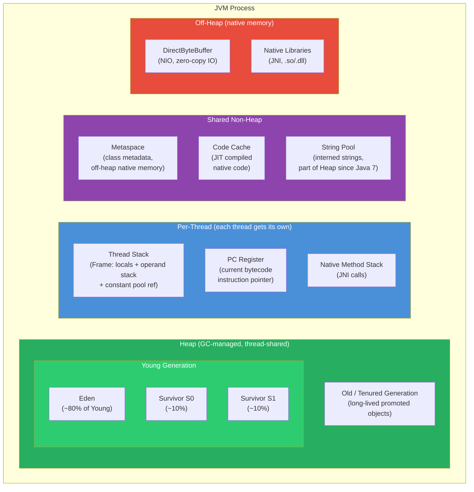

# 🧠 JVM Memory Areas

> [!abstract] TL;DR
> JVM runtime data areas: **Heap** (Young gen: Eden + S0 + S1; Old/Tenured gen — thread-shared, GC-managed; `-Xmx`/`-Xms`), **Thread Stack** (per-thread; one frame per method call with local variables, operand stack, constant pool reference; `-Xss`), **PC Register** (per-thread; current bytecode instruction), **Native Method Stack** (JNI), **Metaspace** (class metadata in off-heap native memory since Java 8; replaces PermGen; `-XX:MaxMetaspaceSize`), **Code Cache** (JIT-compiled native code; `-XX:ReservedCodeCacheSize`). Reference strength controls GC behavior: `Strong` (never collected) → `Soft` (before OOM) → `Weak` (next GC) → `Phantom` (post-collection cleanup).

---

## Intuition

- **Heap** = the apartment complex's shared common areas (pool, gym, parking lot). Everyone uses them; a cleaning staff (GC) periodically removes abandoned items.
- **Thread Stack** = each resident's private apartment. Only they see their personal belongings (local variables). The building has a height limit (stack depth).
- **Metaspace** = the management office's blueprint room. Blueprints (class definitions) are stored there — not in the common areas. Lost blueprints (class leaks) cause this room to overflow.
- **Code Cache** = laminated speed-dial cards posted in the lobby. JIT writes frequently used phone numbers (hot methods) there so everyone can call them instantly without looking up the directory.
- **Off-heap (DirectByteBuffer)** = storage units outside the building. The building manager (GC) doesn't maintain them. You arrange your own pickup (Cleaner), or they just sit there.

---

## How It Works

### JVM Memory Layout



### Memory Area Reference Table

| Memory Area | Thread-shared? | GC managed? | Stores | OOM type | Key flag | Typical production size |
|---|---|---|---|---|---|---|
| Heap (Young) | Yes | Yes (minor GC) | New objects, short-lived | `OutOfMemoryError: Java heap space` | `-Xmx`, `-Xms` | 25% of heap |
| Heap (Old) | Yes | Yes (major/full GC) | Long-lived, promoted objects | `OutOfMemoryError: Java heap space` | `-XX:NewRatio` | 75% of heap |
| Thread Stack | No (per-thread) | No (frame push/pop) | Method frames, local vars, references | `StackOverflowError` | `-Xss` | 256KB–1MB per thread |
| Metaspace | Yes | No (native free) | Class structures, bytecode, constant pool | `OutOfMemoryError: Metaspace` | `-XX:MaxMetaspaceSize` | Unbounded (cap at 256–512MB) |
| Code Cache | Yes | No (JIT manages) | JIT-compiled native machine code | `Warning: CodeCache is full` | `-XX:ReservedCodeCacheSize` | 48–240MB (JVM default) |
| Off-Heap | Yes | No (Cleaner/manual) | DirectByteBuffer, native libs | `OutOfMemoryError: Direct buffer memory` | `-XX:MaxDirectMemorySize` | Varies |

---

### Java Code Examples

```java
// ── Stack depth / StackOverflowError ────────────────────────────────────────
public class StackDemo {
    static int depth = 0;

    public static void recurse() {
        depth++;
        recurse(); // Each call pushes a new frame onto the thread stack
                   // Eventually: java.lang.StackOverflowError
    }
    // Fix: convert to iterative (Deque-based stack), or increase -Xss for
    // legitimate deep recursion (tree traversal, parser)
}


// ── Heap: runtime memory stats ──────────────────────────────────────────────
public class HeapInspection {
    public static void printMemory() {
        Runtime rt = Runtime.getRuntime();
        long maxHeap   = rt.maxMemory()   / (1024 * 1024); // -Xmx
        long totalHeap = rt.totalMemory() / (1024 * 1024); // current committed heap
        long freeHeap  = rt.freeMemory()  / (1024 * 1024); // free within committed
        long usedHeap  = totalHeap - freeHeap;

        System.out.printf("Heap: used=%dMB  committed=%dMB  max=%dMB%n",
            usedHeap, totalHeap, maxHeap);
    }
    // Also available via: ManagementFactory.getMemoryMXBean().getHeapMemoryUsage()
}


// ── Metaspace: dynamic class generation causes growth ───────────────────────
public class MetaspaceDemo {
    // Each call to Proxy.newProxyInstance generates a new synthetic class
    // → new class metadata entry in Metaspace
    // Spring CGLIB creates proxy subclasses per bean → Metaspace grows at startup
    public static Class<?> generateProxy() {
        return Proxy.newProxyInstance(
            MetaspaceDemo.class.getClassLoader(),
            new Class<?>[]{Runnable.class},
            (proxy, method, args) -> null
        ).getClass();
    }
    // In a hot-deploy scenario (Tomcat), each redeploy creates a new ClassLoader.
    // If the old ClassLoader is still referenced (by a static field, thread), its
    // classes cannot be unloaded → Metaspace leak → OutOfMemoryError: Metaspace
}


// ── Off-Heap: DirectByteBuffer ───────────────────────────────────────────────
public class OffHeapDemo {
    public static void demonstrate() {
        // Allocates memory OUTSIDE Java heap — invisible to GC
        ByteBuffer directBuffer = ByteBuffer.allocateDirect(1024 * 1024); // 1MB off-heap

        // vs heap buffer (GC-managed)
        ByteBuffer heapBuffer = ByteBuffer.allocate(1024 * 1024);         // 1MB on heap

        // DirectBuffer advantages:
        // - Zero-copy for IO: OS can DMA directly from/to this buffer
        // - No GC pressure for the buffer payload
        // DirectBuffer disadvantages:
        // - Allocation/deallocation is expensive (native malloc/free)
        // - Freed only when ByteBuffer object becomes unreachable + Cleaner runs
        // - Subject to: OutOfMemoryError: Direct buffer memory (capped by -XX:MaxDirectMemorySize)

        // Explicit cleanup (Java 9+):
        // sun.misc.Unsafe or the Cleaner mechanism; not public API
        // Best practice: use as field, rely on GC + Cleaner for cleanup
        // Or: channel.close() implicitly releases mapped buffers
    }
}


// ── Reference types: controlling GC behavior ────────────────────────────────
import java.lang.ref.*;

// Strong reference (default) — object never collected while reachable
User user = new User("Alice");   // strong ref — kept alive


// SoftReference: cleared BEFORE OutOfMemoryError — ideal for memory-sensitive caches
public class ImageCache {
    private final Map<String, SoftReference<byte[]>> cache = new ConcurrentHashMap<>();

    public byte[] get(String key) {
        SoftReference<byte[]> ref = cache.get(key);
        if (ref != null) {
            byte[] data = ref.get(); // returns null if GC collected it
            if (data != null) return data;        // cache hit
            cache.remove(key);                     // stale entry: ref cleared
        }
        byte[] data = loadFromDisk(key);           // cache miss
        cache.put(key, new SoftReference<>(data));
        return data;
    }
    private byte[] loadFromDisk(String key) { return new byte[0]; }
}


// WeakReference: cleared at NEXT GC cycle — canonical mappings, listeners
WeakReference<Widget> weakRef = new WeakReference<>(new Widget());
Widget w = weakRef.get(); // null after GC if no other strong refs to Widget

// WeakHashMap: entries auto-removed when keys are GC'd
WeakHashMap<Connection, ConnectionMeta> connectionRegistry = new WeakHashMap<>();
Connection conn = new Connection();
connectionRegistry.put(conn, new ConnectionMeta());
conn = null; // → after GC, the WeakHashMap entry is automatically removed


// PhantomReference: notification AFTER object is collected (post-finalization)
// Used for cleanup of native resources without relying on finalizers (deprecated)
ReferenceQueue<Object> refQueue = new ReferenceQueue<>();
Object heavyResource = loadNativeResource();
PhantomReference<Object> phantom = new PhantomReference<>(heavyResource, refQueue);
heavyResource = null;

// On a cleanup thread:
Reference<?> collected = refQueue.poll(); // non-null when heavyResource collected
if (collected != null) {
    releaseNativeResource(); // safe to free native side now
}

// Modern alternative: Cleaner (Java 9+)
Cleaner cleaner = Cleaner.create();
Cleaner.Cleanable cleanable = cleaner.register(
    heavyResource,
    () -> System.out.println("Native resource cleaned up")
);
// Cleaner action runs after object is GC'd — no need for finalizer or PhantomReference


// ── JVM flags for memory management ──────────────────────────────────────────
```

```bash
# ── Heap sizing ──────────────────────────────────────────────────
-Xmx4g                          # maximum heap size
-Xms4g                          # initial heap size (= Xmx avoids expensive resize pauses)
-XX:NewRatio=2                  # Old:Young ratio (default 2 means Old is 2× Young gen)
-XX:SurvivorRatio=8             # Eden:Survivor ratio (default 8: Eden = 8 × one Survivor)
-XX:MaxTenuringThreshold=15     # max GC cycles before promoting to Old gen

# ── Non-heap ──────────────────────────────────────────────────────
-Xss512k                        # thread stack size (default 512KB-1MB; lower saves RAM for many threads)
-XX:MaxMetaspaceSize=256m       # cap Metaspace (prevent runaway class leaks; no cap = potential OOM)
-XX:MetaspaceSize=64m           # initial Metaspace commit (avoids early GC triggers)
-XX:ReservedCodeCacheSize=256m  # JIT native code cache (increase if "CodeCache is full" warning)
-XX:MaxDirectMemorySize=512m    # cap off-heap DirectByteBuffer memory

# ── Diagnostics ───────────────────────────────────────────────────
-XX:+HeapDumpOnOutOfMemoryError  # automatically dump heap on OOM (always enable in prod)
-XX:HeapDumpPath=/var/log/app.hprof
-Xlog:gc*:file=/var/log/gc.log:time,uptime:filecount=5,filesize=20m  # Java 9+ GC logging
-verbose:gc                      # simple GC logging to stdout
-XX:+PrintGCDetails              # Java 8 detailed GC logging
```

---

## Key Concepts

### Heap Structure and Object Lifecycle

- **Eden space** (~80% of Young gen): all new objects are allocated here (TLAB — Thread Local Allocation Buffer, a pre-allocated chunk per thread for contention-free allocation).
- **Minor GC** (Young GC): when Eden fills, mark live objects and **copy** them to a Survivor space (S0 or S1, alternating). Dead objects are simply abandoned — no sweep needed. Very fast (milliseconds).
- **Survivor spaces** (S0, S1): after each minor GC, live objects move between S0 and S1. Age counter increments each time.
- **Promotion**: when an object's age reaches `MaxTenuringThreshold` (default 15), it is copied to Old gen. Also promoted if too large for Survivor space.
- **Major GC / Full GC**: when Old gen fills, GC must collect it — slower because Old gen is larger and requires compaction.

### Thread Stack — Frame Structure

Each method call pushes a **frame** containing:
- **Local variable array**: method parameters and declared local variables (primitive values stored directly; object references stored as slots).
- **Operand stack**: working memory for bytecode instructions (think: calculator scratch pad).
- **Constant pool reference**: pointer to the class's runtime constant pool (method/field names, string literals).

`StackOverflowError` occurs when the stack exceeds `-Xss`. Default is 512KB–1MB. Deep recursion, or many large frames (many local variables), causes this.

### Metaspace vs PermGen

| Aspect | PermGen (pre-Java 8) | Metaspace (Java 8+) |
|---|---|---|
| Location | Heap (special region) | Native off-heap memory |
| Default max | Fixed (often 64–256MB) | Unbounded (OS limit) |
| Flag | `-XX:MaxPermSize` | `-XX:MaxMetaspaceSize` |
| OOM message | `OutOfMemoryError: PermGen space` | `OutOfMemoryError: Metaspace` |
| GC integration | GC'd with heap | Native memory freed when ClassLoader GC'd |

PermGen was replaced because its fixed size caused OOM even when native memory was available, and tuning it correctly required guesswork.

### Reference Strength — GC Interaction

| Strength | Class | GC'd when | Primary use |
|---|---|---|---|
| Strong | Direct field/local | Never (while reachable) | Normal objects |
| Soft | `SoftReference<T>` | Just before `OutOfMemoryError` | Memory-sensitive caches |
| Weak | `WeakReference<T>` | Next GC cycle (no strong refs) | Canonical mappings, listeners |
| Phantom | `PhantomReference<T>` | After collected (queue notification) | Native resource cleanup |

### Memory Leak Patterns

| Pattern | Cause | Symptom | Fix |
|---|---|---|---|
| Static collection | `static List<Event>` grows forever | Heap fills gradually | Bound size; use `WeakHashMap`; TTL eviction |
| ThreadLocal in pool | No `remove()` after request | Previous request data in next; OOM | `try { ... } finally { tl.remove(); }` |
| ClassLoader leak | Old ClassLoader referenced by static or thread | Metaspace OOM on hot deploy | Remove statics that reference app classes; isolate ClassLoaders |
| Event listener | Registered but never unregistered | Heap fills with stale listeners | `WeakReference<Listener>`; explicit unregister |
| Finalizer backlog | `finalize()` method; GC queues finalizers | Memory builds up before finalization | Replace with `Cleaner`; avoid finalizers |

---

## Real-World Notes

- **Spring Boot Actuator** `/actuator/heapdump` downloads a live heap dump — enable in production with appropriate security.
- **Eclipse MAT (Memory Analyzer Tool)**: open `.hprof` files, run "Leak Suspects" report, find "Biggest Retained Objects" — identifies the root cause of heap OOM in minutes.
- **`jcmd <pid> VM.native_memory`**: shows native memory breakdown including Metaspace, Code Cache, and off-heap usage.
- **`jmap -histo:live <pid>`**: prints live object histogram — find unexpected class counts indicating ClassLoader leaks.
- **Micrometer** (`JvmMemoryMetrics`): exposes `jvm.memory.used`, `jvm.memory.max` per area in Prometheus/Grafana dashboards.

---

## Common Pitfalls

1. **Metaspace OOM from ClassLoader leak**: each hot-redeploy in Tomcat creates a new `WebappClassLoader`. If anything holds a reference to a class loaded by the old loader (static map, thread), the old loader can't be GC'd → Metaspace fills. Fix: eliminate statics that reference app classes; use `-XX:MaxMetaspaceSize` to get early OOM (easier to diagnose than gradual degradation).

2. **`StackOverflowError` from deep recursion**: tree traversal, XML parsing, recursive descent parsers — convert to iterative using an explicit `Deque` as a stack. For legitimate deep recursion (compiler), increase `-Xss` (e.g., `-Xss4m`) but be aware of the memory cost per thread.

3. **DirectByteBuffer not freed**: `Cleaner` fires only when the `ByteBuffer` object is GC'd. Under heavy allocation, GC may not run frequently, leading to native memory pressure. Use a pool of `DirectByteBuffer` (e.g., Netty's `ByteBufAllocator`) rather than allocating per-request.

4. **Confusing Metaspace OOM with heap OOM**: they have different root causes. Heap OOM → check heap dump for large object graph. Metaspace OOM → check class loader count (`jmap -histo`). Fixing Metaspace OOM with `-Xmx` does nothing.

---

## Related

- [[_MOC_JVM_Memory|↑ Section MOC]]
- [[JVM_Execution_Model]] — bytecode, class loading, bootstrap
- [[Garbage_Collection_Algorithms]] — how heap memory is reclaimed
- [[JIT_Compilation_and_Tuning]] — how Code Cache fills and what happens when it's full

---

## Review Questions

1. What is the difference between `Metaspace` and `PermGen`? Why was PermGen replaced in Java 8, and what problem does this solve?

2. Describe the complete lifecycle of a Java object from allocation in Eden to promotion into the Old generation, including what triggers each transition.

3. Why might a web application experience `OutOfMemoryError: Metaspace` even though heap usage is healthy (50% free)? Name two concrete causes and how to diagnose each.

---

#Java #JVM #Memory #Heap #Metaspace
