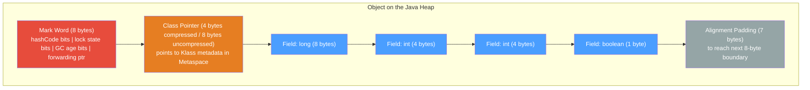

# 🧱 JVM Object Memory Layout

> [!abstract] TL;DR
> Every Java object on the heap consists of a **header** (mark word + class pointer, 12–16 bytes) followed by **instance fields** (reordered by the JVM to minimize padding gaps), and finally **alignment padding** to reach a multiple of 8 bytes. Compact strings (Java 9+) store Latin-1 text as 1-byte-per-char `byte[]` instead of 2-byte `char[]`, halving string memory for ASCII-heavy applications. Use the `jol-core` library to measure actual object sizes — intuition alone is almost always wrong.

---

## Intuition — Packaging an Amazon Order

- **Object header** = the shipping label and barcode on the outside of the box — mandatory overhead regardless of contents.
- **Mark word** = a multipurpose sticker on the label that changes its meaning: hashCode when first computed, lock metadata when contested, GC age counter during collection.
- **Class pointer** = a QR code linking to the product catalog (the class metadata) — tells the JVM what type this box contains.
- **Field reordering** = the warehouse packs items to fit perfectly in the box with least air-gap. The JVM reorders fields by size to avoid wasted padding bytes.
- **Compressed OOPs** = using a short postal code (4 bytes) instead of a full GPS coordinate (8 bytes) to reference objects — works as long as the total addressable heap fits within a known range (32 GB).

---

## How It Works



**Total size** = 8 (mark word) + 4 (compressed class ptr) + fields + padding = aligned to 8 bytes.
`new Object()` = 8 + 4 + 0 fields + 4 padding = **16 bytes**.

---

## Key Concepts / Details

### Object Header Structure

```java
// ── Mark Word (8 bytes on 64-bit JVM) ────────────────────────────────────────
// The mark word is a multipurpose bitfield; its interpretation changes by state:
//
//  Object state          | Bits layout (simplified)
//  ─────────────────────────────────────────────────────────────────────────────
//  Unlocked (normal)     | identity hashCode(31 bits) | GC age(4 bits) | 01
//  Biased locked         | threadID(54 bits) | epoch | GC age | 1
//  Lightweight locked    | ptr to lock record on stack | 00
//  Heavyweight (monitor) | ptr to ObjectMonitor | 10
//  Marked for GC         | forwarding pointer | 11
//
// The 2 low-order bits serve as the "tag" to determine the mode.
// In Java 15+, biased locking was deprecated (JEP 374) and removed in Java 21.


// ── Class Pointer (Klass pointer) ────────────────────────────────────────────
// Points to the class's Klass structure in Metaspace (not on the Java heap).
// With -XX:+UseCompressedClassPointers (default, Java 8–21):  4 bytes
// Without (or heap > ~30 GB):                                  8 bytes
```

### Object Sizes and Field Ordering

```java
// ── JVM field reordering to minimize padding ─────────────────────────────────
// The JVM (HotSpot) reorders fields by descending size to pack them tightly:
// Order: longs/doubles (8), ints/floats (4), shorts/chars (2), bytes/booleans (1), references (4/8)
// Parent class fields come first, then subclass fields (within each size group)

class Inefficient {
    boolean flag;     // 1 byte → 7 bytes padding before next field
    long    value;    // 8 bytes
    int     count;    // 4 bytes → 4 bytes padding
    // declared size = 1 + 7 + 8 + 4 + 4 = 24 bytes wasted layout
}
// JVM reorders to: value(8), count(4), flag(1), padding(3) = header(12) + 13 + 3 pad = 28 bytes

class Efficient {
    long    value;    // 8 bytes  — declared in natural order
    int     count;    // 4 bytes
    boolean flag;     // 1 byte
    // header(12) + 8 + 4 + 1 + 3 pad = 28 bytes (same — JVM would reorder Inefficient too)
}
// JVM reorders BOTH to the same layout. The declaration order doesn't matter — HotSpot always reorders.
// Exception: -XX:+FieldsAllocationStyle=0 disables reordering (rarely used)


// ── Measuring with JOL (Java Object Layout) ──────────────────────────────────
// Add dependency: org.openjdk.jol:jol-core:0.17

import org.openjdk.jol.info.ClassLayout;
import org.openjdk.jol.info.GraphLayout;
import org.openjdk.jol.vm.VM;

public class MemoryLayoutDemo {
    static class Sample {
        boolean a;
        long    b;
        int     c;
        String  d;
    }

    public static void main(String[] args) {
        // Print VM info (compressed OOPs status, etc.)
        System.out.println(VM.current().details());

        // Print field layout for class
        System.out.println(ClassLayout.parseClass(Sample.class).toPrintable());
        // Output (compressed OOPs on, 64-bit):
        // com.example.Sample object internals:
        // OFF  SZ      TYPE DESCRIPTION
        //   0   8           (object header: mark)
        //   8   4           (object header: class)
        //  12   4       int c
        //  16   8      long b
        //  24   1   boolean a
        //  25   7           (object alignment)
        // Instance size: 32 bytes

        // Deep size of an object graph (follows all references)
        Sample s = new Sample();
        s.d = "hello";
        System.out.println(GraphLayout.parseInstance(s).toFootprint());
        // Shows total retained size including String + char[]/byte[] internals
    }

    // Programmatic size estimation (without JOL — less accurate)
    public static long estimateSize(Object o) {
        // Approximation via Instrumentation (requires -javaagent or --add-opens)
        // Use Instrumentation.getObjectSize(o) for shallow size
        return 0; // placeholder
    }
}


// ── Reference sizes ──────────────────────────────────────────────────────────
//   Compressed OOPs ON  (-XX:+UseCompressedOops, default up to ~32 GB heap):  4 bytes per ref
//   Compressed OOPs OFF (heap > 32 GB or explicitly disabled):                 8 bytes per ref
//
// Impact on ArrayList<String> of 1M elements:
//   Compressed:   Object[] = 4MB of references + object header
//   Uncompressed: Object[] = 8MB of references + object header
//   → keeping heap < 32 GB can halve reference memory overhead
```

### Array Object Layout

```java
// ── Array layout: header + length field + elements ──────────────────────────
//
//  int[] arr = new int[10]:
//  ┌──────────────────────┬────────────────────────┬──────────────────────────┐
//  │  Mark Word (8 bytes) │ Class Ptr  (4 bytes)   │  Length field (4 bytes)  │
//  ├──────────────────────┴────────────────────────┴──────────────────────────┤
//  │  Element[0] (4 bytes) | Element[1] (4 bytes) | … | Element[9] (4 bytes)  │
//  └───────────────────────────────────────────────────────────────────────────┘
//  Total: 8 + 4 + 4 (length) + 10*4 (elements) + 0 padding = 56 bytes
//
//  Object[] arr = new Object[10]:  (compressed OOPs)
//  Total: 8 + 4 + 4 (length) + 10*4 (refs) + 0 padding = 56 bytes
//  Without compressed OOPs: 8 + 8 + 4 (length) + 10*8 (refs) + 4 pad = 104 bytes

// Empty array minimum size:
int[]    emptyInt  = new int[0];    // 16 bytes (header 12 + length 4)
Object[] emptyObj  = new Object[0]; // 16 bytes
```

### String Memory Layout — Java 9 Compact Strings

```java
// ── Before Java 9: String backed by char[] ──────────────────────────────────
// char[] = 2 bytes per character (UTF-16)
// "hello" → char[] {h,e,l,l,o} = 5 * 2 = 10 bytes of content
// + array header (16 bytes) = 26 bytes for the array alone
// + String object header + fields ≈ 32 bytes
// Total: ~58 bytes for "hello"


// ── Java 9+ Compact Strings: byte[] with coder field ────────────────────────
// If all chars fit in Latin-1 (ISO 8859-1): stored as byte[] with 1 byte per char
// If any char requires UTF-16: falls back to byte[] with 2 bytes per char
// Controlled by -XX:+CompactStrings (enabled by default)

// Inspecting a String's internal layout:
String latin1Str = "hello";    // stored as byte[] {104, 101, 108, 108, 111}
String utf16Str  = "héllo";    // 'é' is outside Latin-1 → UTF-16 byte[] (2 bytes/char)

// String fields (Java 21):
//   byte[]  value   — the char data (Latin-1 or UTF-16)
//   byte    coder   — 0 = LATIN1, 1 = UTF16
//   int     hash    — cached hashCode (0 = not yet computed)
//   boolean hashIsZero — true if actual hash is 0 (avoids recompute)

// Memory savings for ASCII-heavy applications:
// Before Java 9: 100,000 ASCII strings avg 40 chars → 100k * (40*2 + overhead) ≈ 120 MB
// Java 9+:       100,000 ASCII strings avg 40 chars → 100k * (40*1 + overhead) ≈ 80 MB
// Approximately 33% heap reduction for Latin-1 string-heavy apps (e.g., log messages, SQL)


// ── Interning and string deduplication ──────────────────────────────────────
String s1 = new String("hello");         // new heap object
String s2 = "hello";                     // string pool (interned)
System.out.println(s1 == s2);            // false (different references)
System.out.println(s1.intern() == s2);   // true (intern returns pool reference)

// GC string deduplication: -XX:+UseStringDeduplication (G1 GC only)
// Detects char[] arrays with equal content and makes them share one array
// Reduces heap but has minor GC overhead; not the same as interning
```

### Compressed OOPs Deep Dive

```java
// ── Compressed Ordinary Object Pointers (OOPs) ───────────────────────────────
// 64-bit JVM: native pointer = 8 bytes → huge reference overhead
// Solution: encode heap addresses as 32-bit values with an implicit shift
//
// Trick: all objects are 8-byte aligned → bottom 3 bits always 000
//         JVM stores (address >> 3) in 32 bits → can address 2^32 * 8 = 32 GB
//         On read:  real_addr = compressed_oop << 3
//
// -XX:+UseCompressedOops     — compress regular object references (default ON up to ~28-30 GB)
// -XX:+UseCompressedClassPointers — compress class pointers (default ON, works up to larger heaps)
//
// The "threshold" is actually controlled by -XX:ObjectAlignmentInBytes (default 8)
//   With 16-byte alignment: can address up to 64 GB with compressed OOPs
//   Trade-off: objects are padded to 16 bytes minimum → more wasted space
//
// If heap > threshold:
//   Compressed OOPs disabled automatically → all references become 8 bytes
//   WARNING: a heap bump from 28 GB to 33 GB can INCREASE memory usage due to larger refs!

// Check compressed OOP status in running JVM:
// jcmd <pid> VM.flags | grep Compressed
// Or: java -Xmx26g -XX:+PrintFlagsFinal -version 2>&1 | grep CompressedOops
```

---

## Real-World Notes

- **JOL is the gold standard** for measuring actual object sizes. Never guess — the JVM silently reorders fields, adds padding, and compresses pointers in ways that violate developer intuition.
- **`sun.misc.Unsafe.objectFieldOffset(field)`** returns the byte offset of a field within an object — used by `AtomicFieldUpdater` and off-heap frameworks like Chronicle Map.
- **Off-heap memory** (ByteBuffer.allocateDirect, Unsafe.allocateMemory) has no object header overhead. High-performance caches (Ehcache, Hazelcast) store serialized data off-heap to reduce GC pressure from large object graphs.
- **Heap sizing and compressed OOPs**: Running at -Xmx30g is often better than -Xmx32g because at 30g compressed OOPs are still active, saving ~25% of reference memory. Jumping to 32g or above disables them.
- **Valhalla (future)**: Project Valhalla's value types (JEP 401) aim to eliminate object headers for small value-like objects, allowing Java to store `int`-like types without boxing overhead.

---

## Common Pitfalls

1. **Assuming field order equals declaration order**: The JVM reorders fields by size group. `ClassLayout.parseClass()` is the only reliable way to see the actual layout. Code that uses `Unsafe.objectFieldOffset()` based on assumed layout will silently read wrong memory.

2. **Heap jump past compressed OOP threshold**: Increasing heap from 28 GB to 33 GB can paradoxically *increase* memory usage (larger references for all object graphs) and slow GC. Profile before expanding heap past ~29 GB.

3. **String interning for all strings**: `String.intern()` caches strings in PermGen/Metaspace. Interning millions of dynamic strings (UUIDs, log messages) fills the string pool → OOM or high GC pause. Reserve interning for a small, stable set of strings (status codes, enum-like labels).

4. **Neglecting array header overhead for many small arrays**: `new int[1]` costs 24 bytes (header 16 + 4 length + 4 element). A million single-element int arrays = 24 MB just in headers — often better to pool or batch into larger arrays.

5. **Forgetting the `coder` byte in String size estimates**: A `String` holding 100 chars costs ~116 bytes (header + byte[] header + 100 bytes data + String fields), not 200 bytes (the old char[] pre-Java-9 estimate). Update your sizing estimates for Java 9+ applications.

---

## Related Concepts

- [[JVM_Memory_Areas]] — heap generations, Metaspace, stack vs. heap overview
- [[Garbage_Collection]] — GC age in mark word, object promotion, G1 regions
- [[GraalVM_and_Native_Image]] — native image has no mark word (no dynamic locking needed)
- [[Performance_Profiling]] — JFR, JOL, heap dumps for memory analysis
- [[_MOC_JVM_Memory|↑ Section MOC]]

---

## Review Questions

1. Describe the fields inside an object header on a 64-bit HotSpot JVM with compressed OOPs enabled. What is the total size of a plain `new Object()` and why?

2. What is the compressed OOP threshold (~32 GB) and what happens to reference sizes when the heap exceeds it? Why might a heap increase from 30 GB to 33 GB actually *increase* total memory consumption?

3. How do Java 9 compact strings reduce memory usage for ASCII text? What field determines whether a `String` uses Latin-1 or UTF-16 encoding, and how can you inspect it?

---

## Sources

- JOL (Java Object Layout) — https://openjdk.org/projects/code-tools/jol/
- JEP 254 — Compact Strings (Java 9): https://openjdk.org/jeps/254
- JEP 374 — Disable and Deprecate Biased Locking: https://openjdk.org/jeps/374
- HotSpot Memory Management Whitepaper — Oracle

#Java #JVM #Memory #ObjectLayout #CompressedOops #CompactStrings #Performance
