# JVM Memory — Map of Content

This section demystifies what the JVM does with memory: how it's structured, how objects are allocated and reclaimed, and how the Just-In-Time compiler turns bytecode into native machine code for maximum performance. Understanding these internals is essential for diagnosing production incidents — OOM errors, GC pauses, and unexpected latency spikes.

---

## Concept Map

```mermaid
graph TD
    JVM["JVM Process"]

    Heap["Heap\n(GC managed, shared)"]
    YoungGen["Young Gen\n(Eden + S0 + S1)"]
    OldGen["Old / Tenured Gen\n(long-lived objects)"]

    NonHeap["Non-Heap"]
    Stack["Thread Stack\n(frames, local vars)"]
    Metaspace["Metaspace\n(class metadata,\noff-heap native)"]
    CodeCache["Code Cache\n(JIT-compiled native)"]
    OffHeap["Off-Heap\n(DirectByteBuffer,\nnative memory)"]

    GC["GC Algorithms"]
    Serial["Serial\n(single-thread STW)"]
    Parallel["Parallel\n(multi-thread STW)"]
    G1["G1 GC\n(region-based, Java 9+)"]
    ZGC["ZGC\n(sub-ms pauses, Java 21+)"]
    Shen["Shenandoah\n(concurrent compact)"]

    JIT["JIT Compilation"]
    Interp["Interpreter T0\n(immediate)"]
    C1["C1 Compiler\n(fast, profiling)"]
    C2["C2 Compiler\n(aggressive optimizations)"]
    Opts["JIT Optimizations\n(inlining / escape analysis\n/ intrinsics)"]

    JVM --> Heap
    JVM --> NonHeap
    JVM --> GC
    JVM --> JIT

    Heap --> YoungGen
    Heap --> OldGen

    NonHeap --> Stack
    NonHeap --> Metaspace
    NonHeap --> CodeCache
    NonHeap --> OffHeap

    GC --> Serial
    GC --> Parallel
    GC --> G1
    GC --> ZGC
    GC --> Shen

    JIT --> Interp
    JIT --> C1
    JIT --> C2
    C1 --> Opts
    C2 --> Opts

    style JVM fill:#2C3E50,color:#fff
    style Heap fill:#27AE60,color:#fff
    style NonHeap fill:#4A90D9,color:#fff
    style GC fill:#E74C3C,color:#fff
    style JIT fill:#8E44AD,color:#fff
    style Metaspace fill:#F39C12,color:#fff
    style CodeCache fill:#16A085,color:#fff
```



---

## Learning Path

| Step | Topic | Note | Why |
|------|--------|------|-----|
| 1 | JVM Memory Layout | [[JVM_Memory_Areas]] | Foundation — understand what memory areas exist before tuning them |
| 2 | Reference Types | [[JVM_Memory_Areas]] | Soft/Weak/Phantom references power caches and memory-sensitive structures |
| 3 | GC Fundamentals | [[Garbage_Collection_Algorithms]] | Mark-sweep-compact, generational hypothesis, GC roots |
| 4 | GC Algorithm Comparison | [[Garbage_Collection_Algorithms]] | Serial/Parallel/G1/ZGC trade-offs; choose the right one |
| 5 | JIT Tiered Compilation | [[JIT_Compilation_and_Tuning]] | Why Java warms up; how code goes from bytecode to native |
| 6 | JIT Optimizations | [[JIT_Compilation_and_Tuning]] | Inlining, escape analysis, intrinsics — code patterns that help |
| 7 | JMH Benchmarking | [[JIT_Compilation_and_Tuning]] | The only correct way to measure Java performance |

---

## Notes in This Section

| Note | Topics Covered | Difficulty | Key Tools / Flags |
|------|---------------|------------|-------------------|
| [[JVM_Memory_Areas]] | Heap (Young/Old), Thread Stack, Metaspace, Code Cache, Off-Heap, Reference types, memory leaks, JVM flags | Advanced | `-Xmx`, `-Xss`, `-XX:MaxMetaspaceSize`, `jmap`, Eclipse MAT |
| [[Garbage_Collection_Algorithms]] | Mark-sweep-compact, GC roots, generational hypothesis, Serial/Parallel/G1/ZGC/Shenandoah, GC log analysis | Advanced | `-XX:+UseG1GC`, `-XX:+UseZGC`, `-XX:MaxGCPauseMillis`, GCEasy.io |
| [[JIT_Compilation_and_Tuning]] | Tiered compilation T0–T4, inlining, escape analysis, deoptimization, JMH benchmarking | Advanced | `-XX:+PrintCompilation`, JMH, `@Benchmark`, `-XX:+DoEscapeAnalysis` |

---

## Key Questions

> Self-test after studying each note.

1. **G1 GC vs ZGC**: What is the fundamental difference in pause model? At what heap size and latency requirement would you switch from G1 to ZGC?

2. **Escape analysis**: What does it mean for an object to "escape" a method? What two optimizations does non-escape enable?

3. **Diagnosing a heap memory leak**: Walk through the steps — what JVM flag do you set, what tool do you use on the dump, what patterns indicate a leak?

4. **Metaspace OOM**: The heap is healthy (50% free), but the process crashes with `OutOfMemoryError: Metaspace`. What are the likely causes and how do you fix each?

5. **JIT warmup**: Why does a Java service exhibit high latency for the first 30–60 seconds after startup? How does tiered compilation address this? What does Quarkus Native do differently?

6. **GC roots**: Name four types of GC roots. Why must GC start from roots rather than scanning all objects?

7. **Humongous objects**: What happens when you allocate a `byte[]` larger than G1's region size divided by 2? Why is this a problem?

---

## JVM Flags Quick Reference

```bash
# Heap
-Xmx4g -Xms4g                        # max and initial heap (set equal to avoid resize)
-XX:NewRatio=2                         # Old:Young ratio

# Non-heap
-Xss512k                               # stack size per thread
-XX:MaxMetaspaceSize=256m             # prevent Metaspace OOM from class leaks
-XX:ReservedCodeCacheSize=256m        # JIT code cache

# GC selection
-XX:+UseG1GC                          # G1 (Java 9+ default)
-XX:+UseZGC                           # ZGC (Java 15+)
-XX:MaxGCPauseMillis=200             # G1 pause target

# Diagnostics
-XX:+HeapDumpOnOutOfMemoryError
-XX:HeapDumpPath=/var/log/app.hprof
-Xlog:gc*:file=/var/log/gc.log:time,uptime:filecount=5,filesize=20m
```

---

## Memory Leak Checklist

| Pattern | Symptom | Detection | Fix |
|---|---|---|---|
| Static collection grows unbounded | Heap fills slowly over hours/days | Heap dump → MAT → biggest retained set | Bound size or use `WeakHashMap` |
| ThreadLocal not removed in pool | Request cross-contamination | Thread dump shows thread-local references | `remove()` in finally |
| ClassLoader not GC'd on hot deploy | Metaspace fills, OutOfMemoryError: Metaspace | Metaspace OOM + class count via `jmap -histo` | Fix ClassLoader isolation; set `-XX:MaxMetaspaceSize` |
| Listener/observer not unregistered | Heap fills; listeners accumulate | Heap dump → many registered listener objects | Use `WeakReference` listeners or explicit unregister |
| Unclosed resource (stream, connection) | Native memory or file descriptor leak | `lsof -p <pid>` for FDs; native memory profiling | Try-with-resources everywhere |

---

## Related MOCs

- [[_MOC_Java_Fundamentals]] — object lifecycle, class loading
- [[_MOC_Java_Concurrency]] — thread stacks, ThreadLocal, GC pressure from concurrency
- [[_MOC_Modern_Java]] — virtual threads change stack model (cheap stacks)
