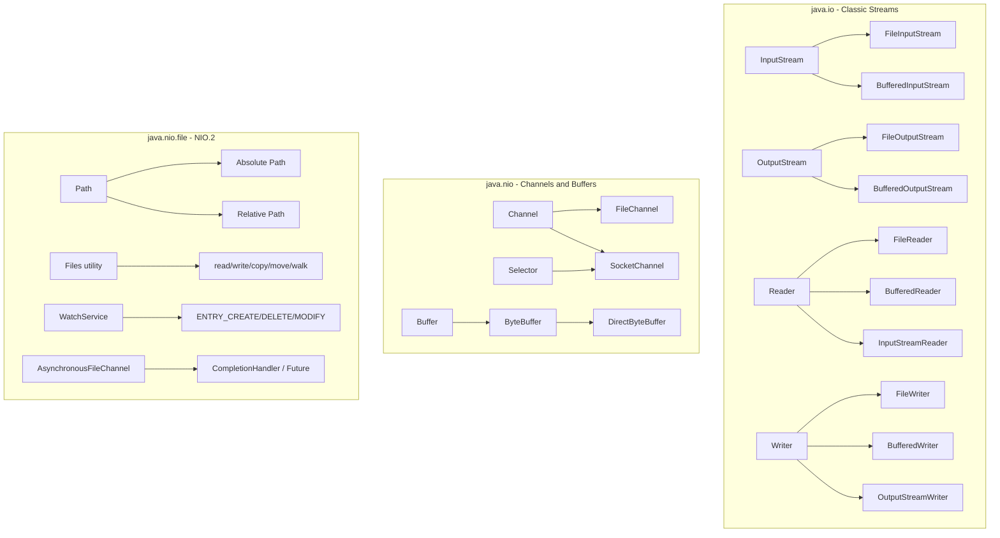

# Classic IO and NIO

## TL;DR

Classic `java.io` uses blocking, stream-oriented I/O: `InputStream`/`OutputStream` for bytes; `Reader`/`Writer` for characters; `Buffered*` wrappers for performance. `java.nio` (Java 1.4+) adds `Channel`s (bidirectional, non-blocking capable) and `Buffer`s (direct/indirect `ByteBuffer`). `java.nio.file.Path` + `Files` (Java 7) provides a modern file API with atomic operations, symbolic links, and permissions. `WatchService` monitors filesystem events. `AsynchronousFileChannel` provides truly async file I/O. Memory-mapped files via `FileChannel.map()` enable large file processing without loading the entire file into heap.

---

## Intuition

| Analogy | Concept |
|---------|---------|
| Garden hose | Classic IO — stream flows one direction, byte at a time |
| Bidirectional pipe | NIO Channel — data can flow both ways, buffered |
| Editing a book in-place on a shelf | Memory-mapped file — you change the file without copying it to your desk first |

---

## How It Works

### Class Hierarchy



---

### Classic IO — Byte Streams

```java
import java.io.*;
import java.nio.charset.StandardCharsets;

public class ClassicIOExamples {

    // Reading bytes from a file with buffering (always buffer!)
    public static byte[] readBytes(String filePath) throws IOException {
        try (InputStream in = new BufferedInputStream(new FileInputStream(filePath))) {
            return in.readAllBytes(); // Java 9+
        }
    }

    // Writing bytes to a file
    public static void writeBytes(String filePath, byte[] data) throws IOException {
        try (OutputStream out = new BufferedOutputStream(new FileOutputStream(filePath))) {
            out.write(data);
            // flush is called automatically on close, but explicit flush is good
            // practice before close in case you need the data persisted
        }
    }

    // Reading text line by line with BufferedReader
    public static void readTextLines(String filePath) throws IOException {
        // Always specify charset explicitly — don't rely on platform default
        try (BufferedReader reader = new BufferedReader(
                new InputStreamReader(new FileInputStream(filePath), StandardCharsets.UTF_8))) {
            String line;
            while ((line = reader.readLine()) != null) {
                System.out.println(line);
            }
        }
    }

    // Writing text with BufferedWriter
    public static void writeText(String filePath, String content) throws IOException {
        try (BufferedWriter writer = new BufferedWriter(
                new OutputStreamWriter(new FileOutputStream(filePath), StandardCharsets.UTF_8))) {
            writer.write(content);
            writer.newLine(); // platform-independent newline
        }
    }

    // Scanner for parsing structured text
    public static void parseWithScanner(String filePath) throws IOException {
        try (Scanner scanner = new Scanner(new File(filePath), StandardCharsets.UTF_8)) {
            scanner.useDelimiter(",");
            while (scanner.hasNext()) {
                String token = scanner.next().trim();
                System.out.println(token);
            }
        }
    }
}
```

---

### NIO.2 — Path and Files API

```java
import java.io.IOException;
import java.nio.charset.StandardCharsets;
import java.nio.file.*;
import java.nio.file.attribute.BasicFileAttributes;
import java.util.List;
import java.util.stream.Stream;

public class PathAndFilesExamples {

    public static void pathOperations() {
        Path base = Path.of("/home/user/projects");      // Java 11+
        Path child = base.resolve("myapp/src");          // joins paths
        Path relative = base.relativize(child);          // src relative to base
        Path normalized = Path.of("/a/b/../c").normalize(); // /a/c
        Path absolute = Path.of("relative/path").toAbsolutePath();

        System.out.println("Parent: " + child.getParent());
        System.out.println("Filename: " + child.getFileName());
        System.out.println("Root: " + child.getRoot());
        System.out.println("Name count: " + child.getNameCount());
    }

    public static void filesOperations() throws IOException {
        Path source = Path.of("/tmp/source.txt");
        Path dest   = Path.of("/tmp/dest.txt");
        Path dir    = Path.of("/tmp/mydir");

        // Create directories (mkdir -p equivalent)
        Files.createDirectories(dir);

        // Write all text at once
        Files.writeString(source, "Hello NIO.2", StandardCharsets.UTF_8);

        // Read all lines
        List<String> lines = Files.readAllLines(source, StandardCharsets.UTF_8);

        // Copy (with REPLACE_EXISTING option)
        Files.copy(source, dest, StandardCopyOption.REPLACE_EXISTING);

        // Atomic move — rename within same filesystem
        Files.move(dest, dir.resolve("moved.txt"), StandardCopyOption.ATOMIC_MOVE);

        // Delete safely
        Files.deleteIfExists(source);

        // Probe content type
        String type = Files.probeContentType(dir.resolve("file.pdf"));

        // Check attributes
        BasicFileAttributes attrs = Files.readAttributes(dir, BasicFileAttributes.class);
        System.out.println("Size: " + attrs.size() + " bytes");
        System.out.println("Last modified: " + attrs.lastModifiedTime());
    }

    // Walk directory tree
    public static void walkFileTree(Path root) throws IOException {
        // Stream-based walk (Java 8+) — cleaner than FileVisitor for simple cases
        try (Stream<Path> stream = Files.walk(root)) {
            stream
                .filter(Files::isRegularFile)
                .filter(p -> p.toString().endsWith(".java"))
                .forEach(System.out::println);
        }

        // FileVisitor for full control (pre/post directory, error handling)
        Files.walkFileTree(root, new SimpleFileVisitor<>() {
            @Override
            public FileVisitResult visitFile(Path file, BasicFileAttributes attrs) {
                System.out.println("File: " + file);
                return FileVisitResult.CONTINUE;
            }

            @Override
            public FileVisitResult visitFileFailed(Path file, IOException exc) {
                System.err.println("Failed to visit: " + file + " — " + exc.getMessage());
                return FileVisitResult.CONTINUE; // skip, don't abort
            }
        });
    }
}
```

---

### FileChannel and ByteBuffer

```java
import java.io.*;
import java.nio.*;
import java.nio.channels.*;
import java.nio.file.*;

public class ChannelAndBufferExamples {

    // Read file using FileChannel + ByteBuffer
    public static void readWithChannel(Path path) throws IOException {
        try (FileChannel channel = FileChannel.open(path, StandardOpenOption.READ)) {
            // Heap buffer — lives in JVM heap
            ByteBuffer buffer = ByteBuffer.allocate(8192);

            while (channel.read(buffer) != -1) {
                buffer.flip();           // switch from write mode to read mode
                while (buffer.hasRemaining()) {
                    byte b = buffer.get();
                    // process byte
                }
                buffer.clear();          // reset for next write
            }
        }
    }

    // Write file using FileChannel + ByteBuffer
    public static void writeWithChannel(Path path, byte[] data) throws IOException {
        try (FileChannel channel = FileChannel.open(path,
                StandardOpenOption.WRITE, StandardOpenOption.CREATE,
                StandardOpenOption.TRUNCATE_EXISTING)) {

            // Direct buffer — off-heap, avoids JVM→native copy for I/O
            ByteBuffer buffer = ByteBuffer.allocateDirect(data.length);
            buffer.put(data);
            buffer.flip();               // switch to read mode before writing
            channel.write(buffer);
        }
    }

    // Memory-mapped file for large file processing
    public static void memoryMappedExample(Path path) throws IOException {
        try (FileChannel channel = FileChannel.open(path, StandardOpenOption.READ)) {
            long fileSize = channel.size();

            // Map entire file into virtual memory — OS handles paging
            MappedByteBuffer mappedBuffer = channel.map(
                FileChannel.MapMode.READ_ONLY, 0, fileSize);

            // Now access file data as if it's in memory
            // This is efficient even for GB-sized files
            while (mappedBuffer.hasRemaining()) {
                byte b = mappedBuffer.get();
                // random access: mappedBuffer.get(position) also works
            }
            // No explicit close needed — GC cleans up, but timing is not guaranteed
        }
    }

    // Zero-copy file transfer (extremely efficient)
    public static void transferFile(Path source, Path dest) throws IOException {
        try (FileChannel src  = FileChannel.open(source, StandardOpenOption.READ);
             FileChannel dst  = FileChannel.open(dest,
                     StandardOpenOption.WRITE, StandardOpenOption.CREATE)) {
            // Transfers data at OS level — no Java heap buffer involved
            src.transferTo(0, src.size(), dst);
        }
    }
}
```

---

### WatchService and Async IO

```java
import java.io.IOException;
import java.nio.channels.*;
import java.nio.file.*;

public class WatchAndAsyncExamples {

    // Watch a directory for filesystem events (e.g., hot-reload)
    public static void watchDirectory(Path dir) throws IOException, InterruptedException {
        try (WatchService watcher = FileSystems.getDefault().newWatchService()) {
            dir.register(watcher,
                StandardWatchEventKinds.ENTRY_CREATE,
                StandardWatchEventKinds.ENTRY_DELETE,
                StandardWatchEventKinds.ENTRY_MODIFY);

            while (true) {
                WatchKey key = watcher.take(); // blocks until event arrives
                for (WatchEvent<?> event : key.pollEvents()) {
                    WatchEvent.Kind<?> kind = event.kind();
                    if (kind == StandardWatchEventKinds.OVERFLOW) continue;

                    Path changed = dir.resolve((Path) event.context());
                    System.out.println(kind.name() + ": " + changed);
                }
                if (!key.reset()) break; // key invalid (dir deleted)
            }
        }
    }

    // Asynchronous file read with CompletionHandler
    public static void asyncRead(Path path) throws IOException {
        AsynchronousFileChannel channel = AsynchronousFileChannel.open(
                path, StandardOpenOption.READ);

        java.nio.ByteBuffer buffer = java.nio.ByteBuffer.allocate(1024);
        channel.read(buffer, 0, buffer, new CompletionHandler<Integer, java.nio.ByteBuffer>() {
            @Override
            public void completed(Integer bytesRead, java.nio.ByteBuffer attachment) {
                attachment.flip();
                byte[] data = new byte[attachment.remaining()];
                attachment.get(data);
                System.out.println("Read " + bytesRead + " bytes: " + new String(data));
            }

            @Override
            public void failed(Throwable exc, java.nio.ByteBuffer attachment) {
                System.err.println("Read failed: " + exc.getMessage());
            }
        });
        // Channel must remain open until completion handler fires
    }
}
```

---

## API Comparison Table

| API | Blocking? | Buffered? | Direction | Best For | Java Version |
|-----|-----------|-----------|-----------|----------|--------------|
| `FileInputStream` / `FileOutputStream` | Yes | No (wrap with Buffered) | Unidirectional | Small binary files | 1.0 |
| `BufferedInputStream` / `BufferedReader` | Yes | Yes (8 KB default) | Unidirectional | Text files, line-by-line | 1.0 |
| `Files.readAllLines` / `writeString` | Yes | Internal | Unidirectional | Small-medium text files | 7 / 11 |
| `Files.walk` / `walkFileTree` | Yes | N/A | Directory traversal | Recursive directory operations | 7 / 8 |
| `FileChannel` + `ByteBuffer` | Yes (default) | Manual | Bidirectional | Large binary, random access | 1.4 |
| `MappedByteBuffer` | N/A (OS) | OS page cache | Random access | Large file random reads | 1.4 |
| `WatchService` | Blocking `take()` | N/A | Event-driven | Filesystem monitoring | 7 |
| `AsynchronousFileChannel` | No | Manual | Bidirectional | Async IO with callbacks | 7 |

---

## Key Concepts

### Classic IO Streams
Java IO follows the **decorator pattern** — you wrap a raw stream in a `Buffered*` wrapper which adds an internal 8 KB buffer, reducing syscall frequency dramatically. `InputStreamReader`/`OutputStreamWriter` bridge bytes↔characters with explicit charset.

### ByteBuffer Flip Pattern
A `ByteBuffer` has three state variables: `capacity` (total), `limit` (end of data), `position` (current read/write cursor). After writing into the buffer, call `flip()` to set `limit = position` and `position = 0`, making the data readable. After reading, call `clear()` or `compact()` to prepare for the next write.

### Memory-Mapped Files
`FileChannel.map()` returns a `MappedByteBuffer` backed by the OS virtual memory subsystem. Page faults load data on demand — you never read the whole file into heap. Ideal for: binary search on sorted flat files, parsing large CSVs, random-access log reading. Not ideal for files that are written to concurrently or on network filesystems.

### WatchService
`WatchService` is event-driven, not polling. On Linux it uses `inotify`, on macOS `kqueue`, on Windows `ReadDirectoryChangesW`. It does **not** work reliably on network drives (NFS, SMB) because remote file changes don't trigger local OS events.

---

## Real-World Usage

- **Spring ResourceLoader** uses `ClassPathResource` and `FileSystemResource`, both backed by streams and NIO.
- **Spring Batch** `FlatFileItemReader` wraps `BufferedReader` for high-throughput CSV parsing.
- **Multipart file upload** in Spring MVC uses `transferTo()` (backed by `FileChannel.transferTo()`) for zero-copy disk writes.
- **Configuration hot-reload** in embedded servers uses `WatchService` to detect changes to `application.yml`.

---

## Common Pitfalls

1. **Forgetting to flush or close** — `FileOutputStream` without `flush()` or `close()` may silently drop the last buffer's worth of data. Always use `try-with-resources`.
2. **Reading text as bytes without specifying charset** — `new FileReader(path)` uses the JVM platform default charset (often `UTF-8` on Linux, `Windows-1252` on Windows). Always use `new InputStreamReader(stream, StandardCharsets.UTF_8)`.
3. **Not calling `flip()` on ByteBuffer before reading** — without `flip()`, `position` is at the end of what you just wrote and `hasRemaining()` returns false; you read nothing.
4. **Using `WatchService` on network drives** — events are never delivered for remote filesystem changes. Poll manually or use a dedicated library like Apache VFS for cross-platform network drive monitoring.

---

## Review Questions

1. Explain the `position`/`limit`/`capacity` model of `ByteBuffer`. What does `flip()` do, and why is it required before reading from a buffer you just wrote to?
2. When would you prefer `Files.readAllBytes()` over `FileChannel` + `ByteBuffer`? When would you switch to `MappedByteBuffer`?
3. A `WatchService` deployed in production is not detecting changes to files on an NFS mount. Why, and what are your options?

---

## Related Notes

- [[_MOC_IO_NIO|↑ Section MOC]]
- [[Serialization_and_Alternatives]]
- [[_MOC_Java_Concurrency]]

---
#Java #IO #NIO #Files #Channels
