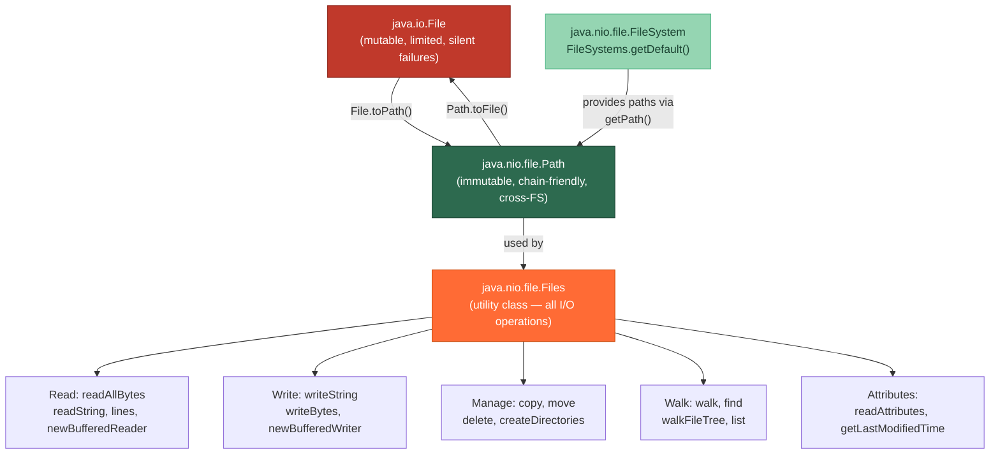

# 📂 Files and Paths (NIO.2)

> [!abstract] TL;DR
> Java NIO.2 (Java 7+) introduced `java.nio.file.Path` as the modern replacement for the legacy `java.io.File` — `Path` is immutable, works across file systems, and integrates with the powerful `Files` utility class that covers reading, writing, copying, moving, deleting, and directory traversal in a single, consistent API. Unlike `File`, which returns silent `false` on failure, `Files` methods throw checked `IOException` (or subclasses like `NoSuchFileException`) so failures are never silently swallowed. For large-scale traversal, `Files.walk()` and `Files.find()` return lazy `Stream<Path>` pipelines that handle millions of entries without loading them all into memory.

---

## Intuition

Think of `java.io.File` as an old paper map — it describes a location but is inflexible, has no real operations, and often lies about whether roads (files) exist. `Path` is a GPS coordinate — precise, immutable, system-aware — while `Files` is the car with all the tools: it can actually drive there, pick things up, or reroute when the road is blocked (throws informative exceptions instead of returning `false`).

---

## How It Works

### Path vs File and the Files Utility



---

## Key Concepts

### 1. Creating Paths

```java
import java.nio.file.*;

// Modern: Path.of() (Java 11+) — preferred
Path p1 = Path.of("/home/user/docs/report.pdf");
Path p2 = Path.of("/home", "user", "docs", "report.pdf");  // varargs join

// Legacy (Java 7-10): Paths.get() — same thing, different entry point
Path p3 = Paths.get("/home/user/docs/report.pdf");

// Relative path
Path rel = Path.of("src", "main", "resources", "config.yml");

// Path arithmetic
Path base  = Path.of("/app/data");
Path child = base.resolve("uploads/image.png"); // /app/data/uploads/image.png
Path sibling = base.resolveSibling("logs");      // /app/logs
Path rel2    = base.relativize(child);           // uploads/image.png

// Path inspection
System.out.println(p1.getFileName());   // report.pdf
System.out.println(p1.getParent());     // /home/user/docs
System.out.println(p1.getRoot());       // / (or C:\ on Windows)
System.out.println(p1.getNameCount()); // 4 (home, user, docs, report.pdf)
System.out.println(p1.getName(0));     // home
System.out.println(p1.normalize());    // resolves . and ..

// Convert to/from legacy File
File f = p1.toFile();
Path back = f.toPath();
```

### 2. Reading Files

```java
import java.nio.file.*;
import java.nio.charset.StandardCharsets;
import java.util.List;
import java.io.BufferedReader;

Path path = Path.of("/app/config/settings.yml");

// Small files: read entire content at once
byte[]      bytes   = Files.readAllBytes(path);
String      text    = Files.readString(path);                          // Java 11+
String      textUtf = Files.readString(path, StandardCharsets.UTF_8); // explicit charset
List<String> lines  = Files.readAllLines(path);                       // all lines into List

// Large files: streaming — lazy, one line at a time
try (var stream = Files.lines(path)) {          // Stream<String>, must be closed
    stream.filter(l -> l.startsWith("#"))
          .forEach(System.out::println);
}

// Buffered reader for custom parsing
try (BufferedReader br = Files.newBufferedReader(path, StandardCharsets.UTF_8)) {
    String line;
    while ((line = br.readLine()) != null) {
        process(line);
    }
}
```

### 3. Writing Files

```java
import java.nio.file.*;
import static java.nio.file.StandardOpenOption.*;

Path out = Path.of("/tmp/output.txt");

// Simple write (overwrites existing file)
Files.writeString(out, "Hello, World!\n");
Files.writeBytes(out, "binary".getBytes());

// Write with options
Files.writeString(out, "appended line\n", APPEND);
Files.writeString(out, "new file\n",      CREATE, TRUNCATE_EXISTING);
Files.writeString(out, "create only\n",   CREATE_NEW);               // fails if exists

// Write collection of lines
List<String> data = List.of("line1", "line2", "line3");
Files.write(out, data, StandardCharsets.UTF_8, CREATE, TRUNCATE_EXISTING);

// Buffered writer for many writes (fewer syscalls)
try (var bw = Files.newBufferedWriter(out, StandardCharsets.UTF_8, CREATE, APPEND)) {
    for (int i = 0; i < 10_000; i++) {
        bw.write("record " + i);
        bw.newLine();
    }
}
```

**`StandardOpenOption` flags reference:**

| Flag | Meaning |
|------|---------|
| `CREATE` | Create if absent; open if present |
| `CREATE_NEW` | Create; fail with exception if already exists |
| `APPEND` | Write to end of file |
| `TRUNCATE_EXISTING` | Empty file before writing |
| `SYNC` | Flush to storage device on each write |
| `DELETE_ON_CLOSE` | Delete file when channel/stream is closed |

### 4. File Management (Copy, Move, Delete)

```java
Path src  = Path.of("/data/old.txt");
Path dest = Path.of("/data/new.txt");

// Copy
Files.copy(src, dest);                                      // fail if dest exists
Files.copy(src, dest, StandardCopyOption.REPLACE_EXISTING); // overwrite
Files.copy(src, dest, StandardCopyOption.COPY_ATTRIBUTES);  // preserve timestamps/perms

// Move / rename (atomic on same filesystem)
Files.move(src, dest);
Files.move(src, dest, StandardCopyOption.REPLACE_EXISTING,
                       StandardCopyOption.ATOMIC_MOVE);

// Delete
Files.delete(src);                   // throws NoSuchFileException if missing
Files.deleteIfExists(src);           // silent if missing (returns boolean)

// Create directories
Files.createDirectory(Path.of("/app/logs"));          // parent must exist
Files.createDirectories(Path.of("/app/a/b/c/logs"));  // creates entire tree (mkdir -p)
Files.createTempFile("prefix-", ".tmp");              // in system temp dir
Files.createTempDirectory("work-");
```

### 5. Directory Walking

```java
// Files.walk — depth-first stream of all entries
Path root = Path.of("/project/src");

try (var stream = Files.walk(root)) {              // walk entire tree
    stream.filter(Files::isRegularFile)
          .filter(p -> p.toString().endsWith(".java"))
          .forEach(System.out::println);
}

try (var stream = Files.walk(root, 2)) {           // max depth = 2
    long count = stream.filter(Files::isDirectory).count();
    System.out.println("Subdirs (up to depth 2): " + count);
}

// Files.find — walk + BiPredicate on (path, attributes) simultaneously
try (var found = Files.find(root, Integer.MAX_VALUE,
        (path, attrs) -> attrs.isRegularFile() && attrs.size() > 1_000_000)) {
    found.map(Path::getFileName).forEach(System.out::println); // large files
}

// Files.list — non-recursive, just immediate children
try (var children = Files.list(root)) {
    children.filter(Files::isDirectory).forEach(System.out::println);
}
```

### 6. File Attributes

```java
import java.nio.file.attribute.*;

Path f = Path.of("/data/report.pdf");

// Basic attributes (all file systems)
BasicFileAttributes basic = Files.readAttributes(f, BasicFileAttributes.class);
System.out.println(basic.size());                    // bytes
System.out.println(basic.creationTime());
System.out.println(basic.lastModifiedTime());
System.out.println(basic.isDirectory());
System.out.println(basic.isSymbolicLink());

// POSIX attributes (Unix/Linux/macOS only)
PosixFileAttributes posix = Files.readAttributes(f, PosixFileAttributes.class);
System.out.println(posix.owner().getName());
System.out.println(PosixFilePermissions.toString(posix.permissions())); // rwxr-xr--

// Convenience methods (no need to read all attributes)
System.out.println(Files.size(f));
System.out.println(Files.isReadable(f));
System.out.println(Files.isWritable(f));
System.out.println(Files.isHidden(f));
System.out.println(Files.getLastModifiedTime(f));
```

---

## Real-World Notes

- **Configuration loading in Spring Boot**: Use `Files.readString(Path.of(configPath))` instead of `File` for cleaner code; inject the path string via `@Value` and convert with `Path.of()`.
- **Log rotation**: Use `Files.move(current, archive, ATOMIC_MOVE)` for safe atomic rename — ensures no partial file state is observed by readers.
- **Test fixtures**: `Files.createTempDirectory("test-")` in `@BeforeEach`, then register `Files.deleteIfExists` in `@AfterEach` — no manual cleanup code.
- **Classpath resources**: `Path.of(getClass().getResource("/data.json").toURI())` converts a classpath resource URL to a `Path` for `Files` operations.
- **Large CSV import**: Always stream with `Files.lines()` inside a try-with-resources rather than `readAllLines()` — a 5 GB CSV will OOM if loaded entirely into a `List<String>`.

---

## Common Pitfalls

| Pitfall | Consequence | Fix |
|---------|-------------|-----|
| Not closing `Files.walk()` / `Files.lines()` streams | File descriptor leak under load | Always use try-with-resources |
| Using `File.exists()` (old API) before operating | TOCTOU race condition | Let `Files` operations throw `NoSuchFileException`; catch and handle |
| `Files.copy()` without `REPLACE_EXISTING` when dest may exist | `FileAlreadyExistsException` | Add `StandardCopyOption.REPLACE_EXISTING` intentionally |
| `Files.readAllLines()` on a huge file | `OutOfMemoryError` | Use `Files.lines()` streaming instead |
| `Path.of()` on Windows with hard-coded `/` separators | Works in test, breaks in prod | Use `Path.of()` with varargs or let the OS separate; avoid `File.separator` concatenation |
| Ignoring charset in `readString` / `writeString` | Mojibake on non-UTF-8 systems | Always pass `StandardCharsets.UTF_8` explicitly |

---

## Related Notes

- [[_MOC_IO_NIO|↑ Section MOC — IO & NIO]]
- [[Classic_IO_and_NIO]] — InputStream/OutputStream and ByteBuffer foundations
- [[NIO2_and_Watchers]] — WatchService, FileVisitor, AsynchronousFileChannel
- [[Serialization_and_Alternatives]] — writing object graphs rather than raw bytes

---

## Review Questions

1. A junior developer writes `if (new File("config.yml").exists()) { processFile(); }` — what race condition lurks here, and how would you rewrite this using NIO.2 idioms that eliminate the TOCTOU problem?

2. Your application processes a directory of 2 million small JSON files. A colleague uses `Files.walk(root).collect(Collectors.toList())` then iterates. What is the problem, and what change makes this scalable?

3. Explain the difference between `StandardOpenOption.CREATE` and `CREATE_NEW`, and give a concrete scenario where using the wrong one causes a data-loss bug in a multi-instance deployment.

---

#Java #IO_NIO #Files #Path #NIO2 #Intermediate
