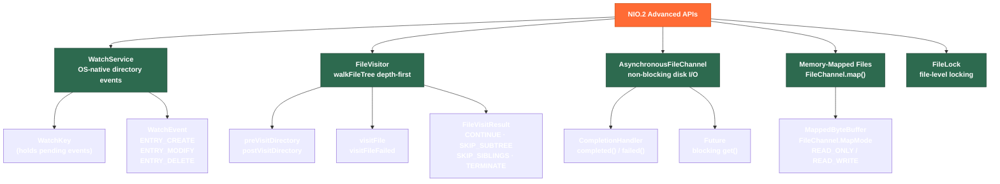

# 👁️ NIO2 and File Watchers

> [!abstract] TL;DR
> Java NIO.2 (Java 7+) goes beyond basic file I/O with four advanced capabilities: **WatchService** monitors directory changes (create/modify/delete) using OS-native events so your app reacts to file changes without polling; **FileVisitor** lets you walk entire directory trees with full control over enter/exit decisions; **AsynchronousFileChannel** performs non-blocking disk I/O without tying up a thread; and **memory-mapped files** (`MappedByteBuffer`) map a file's bytes directly into process address space for near-memory-speed access on large files. Together these enable hot-reload systems, file indexers, async log processors, and zero-copy data pipelines.

---

## Intuition

WatchService is like hiring a security guard (OS kernel) to watch a room (directory) and ring you (deliver a WatchKey event) whenever someone enters, moves furniture, or leaves — far more efficient than you walking in every second to check. FileVisitor is a systematic floor-by-floor building inspection with the authority to skip whole wings. AsynchronousFileChannel is mailing a letter with a return address (CompletionHandler) instead of waiting at the post office for a reply. Memory-mapped files make the OS page cache look like a plain Java byte array — no explicit read calls, the OS handles cache misses invisibly.

---

## How It Works

### NIO2 Advanced API Map



---

## Key Concepts

### 1. WatchService — Directory Monitoring

```java
import java.nio.file.*;
import static java.nio.file.StandardWatchEventKinds.*;

public class ConfigWatcher implements Runnable {

    private final Path watchDir;

    public ConfigWatcher(Path dir) { this.watchDir = dir; }

    @Override
    public void run() {
        try (WatchService watcher = FileSystems.getDefault().newWatchService()) {

            // Register the directory for all three event types
            watchDir.register(watcher,
                ENTRY_CREATE,   // new file/dir appeared
                ENTRY_MODIFY,   // file content changed
                ENTRY_DELETE);  // file/dir removed

            System.out.println("Watching: " + watchDir);

            while (!Thread.currentThread().isInterrupted()) {

                // take() BLOCKS until an event arrives (use poll(timeout) for non-blocking)
                WatchKey key = watcher.take();

                for (WatchEvent<?> event : key.pollEvents()) {
                    WatchEvent.Kind<?> kind = event.kind();

                    // OVERFLOW means events were dropped (system queue full)
                    if (kind == OVERFLOW) {
                        System.err.println("Events overflowed — some changes may be missed");
                        continue;
                    }

                    // Context is the relative path of the changed entry
                    @SuppressWarnings("unchecked")
                    WatchEvent<Path> pathEvent = (WatchEvent<Path>) event;
                    Path changed = watchDir.resolve(pathEvent.context());

                    if (kind == ENTRY_CREATE) {
                        System.out.println("Created: " + changed);
                        if (changed.toString().endsWith(".properties")) {
                            reloadConfig(changed);
                        }
                    } else if (kind == ENTRY_MODIFY) {
                        System.out.println("Modified: " + changed);
                    } else if (kind == ENTRY_DELETE) {
                        System.out.println("Deleted: " + changed);
                    }
                }

                // MUST reset the key — without this, no further events are delivered
                boolean valid = key.reset();
                if (!valid) {
                    System.out.println("Directory no longer accessible, stopping watch");
                    break;
                }
            }

        } catch (InterruptedException e) {
            Thread.currentThread().interrupt();
        } catch (IOException e) {
            throw new RuntimeException("WatchService failed", e);
        }
    }

    private void reloadConfig(Path p) { /* re-read properties file */ }
}
```

**Key points:** `take()` blocks; `poll()` returns null immediately; `poll(timeout, unit)` waits up to a duration. Always call `key.reset()` or the key is cancelled and you receive no more events. Use `OVERFLOW` handling — on busy directories, the OS may drop events.

### 2. FileVisitor — Tree Walking with Control

```java
import java.nio.file.*;
import java.nio.file.attribute.BasicFileAttributes;
import java.io.IOException;
import java.util.ArrayList;
import java.util.List;

public class JavaFileCollector implements FileVisitor<Path> {

    private final List<Path> javaFiles = new ArrayList<>();
    private int depth = 0;

    @Override
    public FileVisitResult preVisitDirectory(Path dir, BasicFileAttributes attrs) {
        // Skip hidden directories and build output folders
        String name = dir.getFileName().toString();
        if (name.startsWith(".") || name.equals("target") || name.equals("build")) {
            return FileVisitResult.SKIP_SUBTREE;  // don't descend into this directory
        }
        depth++;
        System.out.println(" ".repeat(depth * 2) + "[DIR] " + dir.getFileName());
        return FileVisitResult.CONTINUE;
    }

    @Override
    public FileVisitResult visitFile(Path file, BasicFileAttributes attrs) {
        if (file.toString().endsWith(".java")) {
            javaFiles.add(file);
        }
        return FileVisitResult.CONTINUE;
    }

    @Override
    public FileVisitResult visitFileFailed(Path file, IOException exc) {
        System.err.println("Failed to visit: " + file + " — " + exc.getMessage());
        return FileVisitResult.CONTINUE;  // keep going despite permission errors
    }

    @Override
    public FileVisitResult postVisitDirectory(Path dir, IOException exc) {
        depth--;
        return FileVisitResult.CONTINUE;
    }

    public List<Path> collect(Path root) throws IOException {
        Files.walkFileTree(root, this);
        return javaFiles;
    }
}

// Usage:
// var collector = new JavaFileCollector();
// List<Path> files = collector.collect(Path.of("/project/src"));
```

`SimpleFileVisitor<Path>` provides no-op defaults for all four methods — extend it when you only need to override `visitFile`.

### 3. AsynchronousFileChannel — Non-Blocking Disk I/O

```java
import java.nio.ByteBuffer;
import java.nio.channels.AsynchronousFileChannel;
import java.nio.channels.CompletionHandler;
import java.nio.file.*;
import java.util.concurrent.Future;

Path file = Path.of("/data/large-dataset.bin");

// ── Option A: CompletionHandler (callback-style) ─────────────────────────
try (var channel = AsynchronousFileChannel.open(file, StandardOpenOption.READ)) {

    ByteBuffer buf = ByteBuffer.allocate(4096);
    long position = 0;

    channel.read(buf, position, buf, new CompletionHandler<Integer, ByteBuffer>() {

        @Override
        public void completed(Integer bytesRead, ByteBuffer attachment) {
            if (bytesRead == -1) { System.out.println("EOF"); return; }
            attachment.flip();
            byte[] data = new byte[attachment.limit()];
            attachment.get(data);
            System.out.println("Read " + bytesRead + " bytes on thread: "
                + Thread.currentThread().getName());
            // no blocking — callback runs on a pool thread
        }

        @Override
        public void failed(Throwable exc, ByteBuffer attachment) {
            System.err.println("Read failed: " + exc.getMessage());
        }
    });

    // Main thread is free to do other work here
    Thread.sleep(100); // simulate other work while I/O runs
}

// ── Option B: Future (blocking get, simpler but defeats async purpose) ───
try (var channel = AsynchronousFileChannel.open(file, StandardOpenOption.READ)) {
    ByteBuffer buf = ByteBuffer.allocate(1024);
    Future<Integer> future = channel.read(buf, 0);
    int bytesRead = future.get(); // blocks until done
}

// ── Async Write ──────────────────────────────────────────────────────────
try (var channel = AsynchronousFileChannel.open(file,
        StandardOpenOption.WRITE, StandardOpenOption.CREATE)) {

    ByteBuffer data = ByteBuffer.wrap("async write\n".getBytes());
    channel.write(data, 0, null, new CompletionHandler<Integer, Void>() {
        public void completed(Integer result, Void a) { System.out.println("Written: " + result); }
        public void failed(Throwable exc, Void a)     { exc.printStackTrace(); }
    });
}
```

### 4. Memory-Mapped Files

```java
import java.nio.MappedByteBuffer;
import java.nio.channels.FileChannel;
import java.nio.file.*;

Path bigFile = Path.of("/data/10gb-log.bin");

// Map entire file (or a region) into process memory
try (var fc = FileChannel.open(bigFile, StandardOpenOption.READ)) {

    long fileSize = fc.size();

    // READ_ONLY map — changes to MappedByteBuffer throw ReadOnlyBufferException
    MappedByteBuffer mapped = fc.map(FileChannel.MapMode.READ_ONLY, 0, fileSize);

    // Read like a normal ByteBuffer — OS handles paging from disk
    while (mapped.hasRemaining()) {
        byte b = mapped.get(); // triggers page fault on first access of each page
        // process(b);
    }

    // Random access without seeking
    mapped.position(1_000_000);
    int value = mapped.getInt();  // reads 4 bytes at offset 1,000,000
}

// READ_WRITE map — modifications flush to the file
try (var fc = FileChannel.open(bigFile,
        StandardOpenOption.READ, StandardOpenOption.WRITE)) {

    MappedByteBuffer rw = fc.map(FileChannel.MapMode.READ_WRITE, 0, fc.size());
    rw.position(512);
    rw.putLong(System.currentTimeMillis()); // writes directly to file's page cache
    rw.force(); // explicitly flush dirty pages to storage (like fsync)
}
```

**When to use:** Files > 100 MB where you need random access; zero-copy inter-process communication via shared memory files; high-performance log reading.

### 5. FileLock — Coordinating Multi-Process File Access

```java
import java.nio.channels.*;
import java.nio.file.*;

Path lockFile = Path.of("/var/run/myapp.lock");

try (var channel = FileChannel.open(lockFile,
        StandardOpenOption.CREATE, StandardOpenOption.WRITE)) {

    // Exclusive lock — blocks until no other process holds a lock
    FileLock lock = channel.lock();           // blocking
    // FileLock lock = channel.tryLock();     // returns null if cannot acquire immediately

    try {
        System.out.println("Lock acquired — sole owner of resource");
        // ... exclusive operation ...
    } finally {
        lock.release();  // always release in finally
    }

    // Shared (read) lock — multiple readers allowed, blocks writers
    FileLock shared = channel.lock(0, Long.MAX_VALUE, true /* shared */);
    shared.release();
}
```

FileLock is **advisory** on Linux — only cooperating processes that also request locks are coordinated. It is not a substitute for intra-JVM synchronization (`synchronized`/`ReentrantLock`).

---

## Real-World Notes

- **Hot config reload**: WatchService in a daemon thread watches `/config/` directory; on `ENTRY_MODIFY`, reload properties and republish to the Spring `Environment` via `EnvironmentChangeEvent`. This is exactly how Spring Cloud Config's `@RefreshScope` works with local files.
- **Deployment detection**: CI/CD pipelines drop a `DEPLOY.trigger` file; the application's WatchService sees `ENTRY_CREATE`, kicks off a graceful restart without polling.
- **Log file indexer**: `FileVisitor` with `SimpleFileVisitor` skips non-`.log` files and accumulates offsets; `MappedByteBuffer` then enables seeking directly to a byte offset for tail-like random access.
- **IPC via shared memory**: Two JVM processes can share a `READ_WRITE` mapped file region — one writes metrics, the other reads without socket overhead.

---

## Common Pitfalls

| Pitfall | Consequence | Fix |
|---------|-------------|-----|
| Forgetting `key.reset()` in WatchService loop | Key is cancelled; no more events | Always call `key.reset()` after `pollEvents()` |
| Ignoring `OVERFLOW` events | Silent missed changes | Handle `OVERFLOW` by full re-scan of directory |
| `MappedByteBuffer` not unmapped | Native memory held until GC; `FileChannel` cannot be deleted on Windows | Call `((sun.nio.ch.DirectBuffer) mapped).cleaner().clean()` or use Java 14+ `MemorySegment` |
| Using `FileLock` for intra-JVM thread safety | `FileLock` has no effect between threads in the same JVM | Use `ReentrantLock` for threads; `FileLock` only for separate processes |
| Modifying visited collection during `walkFileTree` | `ConcurrentModificationException` or missed files | Collect results into a new list; don't modify the directory during walk |

---

## Related Notes

- [[_MOC_IO_NIO|↑ Section MOC — IO & NIO]]
- [[Files_and_Paths]] — foundation `Files` utility and `Path` API
- [[Classic_IO_and_NIO]] — ByteBuffer, channels, and selector-based non-blocking I/O
- [[Serialization_and_Alternatives]] — structured data formats over file I/O

---

## Review Questions

1. A microservice watches a directory for uploaded CSV files using WatchService, processes each one, then deletes it. During a traffic spike, events arrive faster than they are processed, and some uploads are silently missed. What event type indicates this, and what is the correct recovery strategy?

2. Your team needs to parse a 50 GB binary log file to extract records at known byte offsets (stored in an external index). Compare two approaches: (a) `Files.readAllBytes()` then array indexing, and (b) `FileChannel.map()` with a `MappedByteBuffer`. What are the trade-offs in memory, speed, and simplicity?

3. A FileVisitor must scan `/data/` but must skip any directory named `quarantine` without processing its contents. Which `FileVisitResult` value do you return from `preVisitDirectory`, and what happens if you return `CONTINUE` instead?

---

#Java #IO_NIO #NIO2 #WatchService #FileVisitor #AsyncIO #MemoryMappedFiles #Advanced
