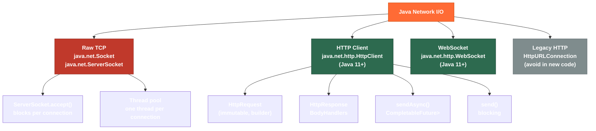

# 🌐 Network I/O in Java

> [!abstract] TL;DR
> Java provides two generations of network I/O: the classic `ServerSocket`/`Socket` API (Java 1.0) for raw TCP connections, and the modern `java.net.http.HttpClient` (Java 11+) which supports HTTP/1.1, HTTP/2, and WebSocket with both synchronous `send()` and fully async `sendAsync()` returning `CompletableFuture`. The modern client is immutable, thread-safe, and far more ergonomic than the old `HttpURLConnection` — it handles redirects, timeouts, cookies, and body publishers/subscribers in a clean builder API without adding a dependency. For high-level REST calls in application code, contrast it with Apache HttpClient 5 and OkHttp which add richer middleware (interceptors, connection pooling configuration, logging).

---

## Intuition

`ServerSocket` is like running your own telephone exchange — you manually pick up each call, hand it to a worker, and manage wires yourself. `java.net.http.HttpClient` is like a modern smartphone app: you compose a message (HttpRequest), hand it to the OS networking stack (client), and either wait for the reply (`send()`) or register a callback and walk away (`sendAsync()`) — HTTP/2 multiplexing and TLS are handled invisibly.

---

## How It Works

### Network I/O Generations



---

## Key Concepts

### 1. Classic ServerSocket / Socket (Raw TCP)

```java
import java.net.*;
import java.io.*;

// ── SERVER SIDE ───────────────────────────────────────────────────────────
public class EchoServer {
    public static void main(String[] args) throws IOException {
        int port = 8080;
        // backlog=50: max queue of pending connections before OS starts refusing
        try (ServerSocket server = new ServerSocket(port, 50)) {
            System.out.println("Listening on port " + port);

            while (true) {
                Socket client = server.accept(); // BLOCKS until client connects
                // Spawn a new thread per client (simple but doesn't scale)
                new Thread(() -> handleClient(client)).start();
            }
        }
    }

    private static void handleClient(Socket client) {
        try (client;
             var in  = new BufferedReader(new InputStreamReader(client.getInputStream()));
             var out = new PrintWriter(client.getOutputStream(), true)) {

            client.setSoTimeout(30_000); // read timeout: 30s
            String line;
            while ((line = in.readLine()) != null) {
                out.println("ECHO: " + line);
            }
        } catch (IOException e) {
            System.err.println("Client error: " + e.getMessage());
        }
    }
}

// ── CLIENT SIDE ───────────────────────────────────────────────────────────
public class EchoClient {
    public static void main(String[] args) throws IOException {
        try (Socket socket = new Socket("localhost", 8080);
             var out = new PrintWriter(socket.getOutputStream(), true);
             var in  = new BufferedReader(new InputStreamReader(socket.getInputStream()))) {

            socket.setSoTimeout(5_000);   // read timeout
            socket.setTcpNoDelay(true);   // disable Nagle's algorithm for low-latency

            out.println("Hello Server");
            System.out.println(in.readLine()); // ECHO: Hello Server
        }
    }
}
```

### 2. HttpClient — Synchronous GET and POST (Java 11+)

```java
import java.net.http.*;
import java.net.URI;
import java.time.Duration;

// Build a shared, thread-safe client (create once, reuse everywhere)
HttpClient client = HttpClient.newBuilder()
    .version(HttpClient.Version.HTTP_2)              // prefer HTTP/2, fall back to 1.1
    .connectTimeout(Duration.ofSeconds(10))
    .followRedirects(HttpClient.Redirect.NORMAL)     // follow non-HTTPS-to-HTTP redirects
    .build();

// ── GET request ─────────────────────────────────────────────────────────
HttpRequest getReq = HttpRequest.newBuilder()
    .uri(URI.create("https://api.example.com/users/42"))
    .header("Accept", "application/json")
    .header("Authorization", "Bearer " + token)
    .timeout(Duration.ofSeconds(5))                  // per-request timeout
    .GET()
    .build();

HttpResponse<String> response = client.send(getReq, HttpResponse.BodyHandlers.ofString());

System.out.println("Status: " + response.statusCode());  // 200
System.out.println("Body:   " + response.body());         // JSON string
System.out.println("Headers: " + response.headers().map());

// ── POST with JSON body ──────────────────────────────────────────────────
String jsonBody = """
        {"name": "Alice", "email": "alice@example.com"}
        """;

HttpRequest postReq = HttpRequest.newBuilder()
    .uri(URI.create("https://api.example.com/users"))
    .header("Content-Type", "application/json")
    .POST(HttpRequest.BodyPublishers.ofString(jsonBody))
    .build();

HttpResponse<String> created = client.send(postReq, HttpResponse.BodyHandlers.ofString());
System.out.println("Created: " + created.statusCode()); // 201

// ── Download to file ─────────────────────────────────────────────────────
HttpRequest download = HttpRequest.newBuilder()
    .uri(URI.create("https://example.com/large-file.zip"))
    .build();

Path dest = Path.of("/tmp/large-file.zip");
client.send(download, HttpResponse.BodyHandlers.ofFile(dest));

// ── Useful BodyHandlers ──────────────────────────────────────────────────
// ofString()           → HttpResponse<String>
// ofByteArray()        → HttpResponse<byte[]>
// ofFile(path)         → HttpResponse<Path>  (streams to disk, low memory)
// ofInputStream()      → HttpResponse<InputStream>
// discarding()         → HttpResponse<Void>  (status/headers only)
// ofLines()            → HttpResponse<Stream<String>>
```

### 3. Async Requests with sendAsync()

```java
import java.util.concurrent.CompletableFuture;
import java.util.List;

// Fire 100 requests concurrently without blocking 100 threads
List<URI> uris = List.of(
    URI.create("https://api.example.com/products/1"),
    URI.create("https://api.example.com/products/2"),
    URI.create("https://api.example.com/products/3")
);

List<CompletableFuture<String>> futures = uris.stream()
    .map(uri -> HttpRequest.newBuilder(uri).build())
    .map(req -> client.sendAsync(req, HttpResponse.BodyHandlers.ofString()))
    .map(cf -> cf
        .thenApply(HttpResponse::body)                    // extract body
        .exceptionally(ex -> "ERROR: " + ex.getMessage()) // handle failure gracefully
    )
    .toList();

// Wait for all to complete
List<String> results = futures.stream()
    .map(CompletableFuture::join)  // blocks until each is done
    .toList();

results.forEach(System.out::println);

// Combining multiple async calls
CompletableFuture<String> combined = client
    .sendAsync(postReq, HttpResponse.BodyHandlers.ofString())
    .thenCompose(resp -> {
        String id = extractId(resp.body());
        HttpRequest follow = HttpRequest.newBuilder(
            URI.create("https://api.example.com/users/" + id)).build();
        return client.sendAsync(follow, HttpResponse.BodyHandlers.ofString());
    })
    .thenApply(HttpResponse::body);
```

### 4. WebSocket Client

```java
import java.net.http.WebSocket;
import java.util.concurrent.CompletableFuture;
import java.util.concurrent.CountDownLatch;

CountDownLatch latch = new CountDownLatch(1);

WebSocket ws = client.newWebSocketBuilder()
    .header("Authorization", "Bearer " + token)
    .buildAsync(URI.create("wss://stream.example.com/events"),
        new WebSocket.Listener() {

            @Override
            public CompletableFuture<?> onText(WebSocket ws, CharSequence data, boolean last) {
                System.out.println("Received: " + data);
                ws.request(1); // MUST call to receive next message (backpressure)
                return CompletableFuture.completedFuture(null);
            }

            @Override
            public CompletableFuture<?> onClose(WebSocket ws, int statusCode, String reason) {
                System.out.println("Closed: " + statusCode + " " + reason);
                latch.countDown();
                return CompletableFuture.completedFuture(null);
            }

            @Override
            public void onError(WebSocket ws, Throwable error) {
                System.err.println("WS error: " + error.getMessage());
                latch.countDown();
            }
        })
    .join(); // wait for handshake

ws.request(1); // seed the first request
ws.sendText("subscribe:prices", true).join(); // send a message

latch.await(); // block until connection closes
```

**Key:** `ws.request(N)` controls how many messages the listener will receive next — this is WebSocket-level backpressure. Always call it after processing each message.

### 5. Timeouts, Redirects, and Cookies

```java
import java.net.CookieManager;
import java.net.CookiePolicy;

HttpClient configured = HttpClient.newBuilder()
    // Timeouts
    .connectTimeout(Duration.ofSeconds(5))           // TCP handshake timeout
    // Per-request timeout set on HttpRequest.Builder.timeout()

    // Redirects
    .followRedirects(HttpClient.Redirect.ALWAYS)     // follow all, including HTTP→HTTPS
    // NORMAL: follow all except HTTPS→HTTP (downgrade)
    // NEVER:  never follow redirects

    // Cookie management
    .cookieHandler(new CookieManager(null, CookiePolicy.ACCEPT_ALL))

    // Custom executor for async callbacks (default: shared ForkJoinPool)
    .executor(Executors.newFixedThreadPool(10))

    // Authenticator for Basic/Digest auth
    .authenticator(new Authenticator() {
        @Override
        protected PasswordAuthentication getPasswordAuthentication() {
            return new PasswordAuthentication("user", "pass".toCharArray());
        }
    })
    .build();
```

### 6. Comparing HTTP Client Libraries

| Feature | `java.net.http.HttpClient` | Apache HttpClient 5 | OkHttp |
|---------|---------------------------|---------------------|--------|
| Zero dependencies | Yes | No (many jars) | No |
| HTTP/2 | Yes | Yes | Yes |
| HTTP/3 (QUIC) | No | No | OkHttp 4+ |
| WebSocket | Yes | No (separate lib) | Yes |
| Interceptors / Middleware | No | Yes (request/response interceptors) | Yes (powerful interceptor chain) |
| Synchronous API | Yes | Yes | Yes (`.execute()`) |
| Async / Reactive | `CompletableFuture` | `Future` | `Callback`-based |
| Connection pool config | Limited | Rich | Rich |
| Logging | Limited | Log4j integration | Built-in `HttpLoggingInterceptor` |
| Best for | Standard apps, no extra deps | Enterprise, complex auth | Android, rich middleware |

---

## Real-World Notes

- **Spring's `RestClient` / `WebClient`**: Both delegate to the JDK `HttpClient` (or Reactor Netty) underneath. Understanding `HttpClient` directly helps debug connection pool exhaustion and timeout mis-configurations that surface in Spring logs.
- **Integration tests**: Use `HttpClient` to drive actual HTTP calls against a `@SpringBootTest(webEnvironment = RANDOM_PORT)` server — no mocking needed for true integration validation.
- **Correlation IDs**: Add request tracing headers in one place using a helper method wrapping `HttpRequest.newBuilder()` — since there are no interceptors, the wrapper pattern is idiomatic.
- **Connection reuse**: A single `HttpClient` instance manages an internal connection pool. Creating a new `HttpClient` per request defeats HTTP/2 multiplexing and causes socket exhaustion under load.

---

## Common Pitfalls

| Pitfall | Consequence | Fix |
|---------|-------------|-----|
| Creating `HttpClient` per request | Connection pool not shared; socket exhaustion; no HTTP/2 multiplexing | Create one client as a singleton/Spring bean |
| No `connectTimeout` set | Thread hangs indefinitely on unreachable host | Always set `connectTimeout` and per-request `.timeout()` |
| Ignoring `ws.request(N)` in WebSocket listener | `IllegalStateException` — receive quota exhausted | Call `ws.request(1)` at end of each `onText`/`onBinary` handler |
| Using `HttpURLConnection` (old API) in new code | Verbose, no HTTP/2, poor async support | Replace with `HttpClient` |
| Not checking `response.statusCode()` | 4xx/5xx silently treated as success | Check status; throw on non-2xx or use a helper |

---

## Related Notes

- [[_MOC_IO_NIO|↑ Section MOC — IO & NIO]]
- [[Classic_IO_and_NIO]] — low-level channel and selector model
- [[Files_and_Paths]] — file-based I/O counterpart
- [[_MOC_Spring_WebFlux|Reactive Network I/O → Spring WebFlux]]

---

## Review Questions

1. A service calls 50 external APIs on each incoming request using a `HttpClient` created inside the request handler method. Under load, the application runs out of file descriptors. Explain why this happens and how to fix it with a one-line architectural change.

2. You need to call API endpoint A, then use the result to call endpoint B — and you cannot block a thread between the two calls. Using `sendAsync()` and `CompletableFuture`, sketch the composition that achieves this. What method chains the two asynchronous calls so the second starts only when the first completes?

3. Compare the `WebSocket.Listener.onText()` backpressure mechanism to a classical blocking `InputStream.read()`. Why is explicit `ws.request(N)` necessary in the async model, and what happens if you never call it?

---

#Java #IO_NIO #Network #HttpClient #WebSocket #HTTP2 #Sockets #Intermediate
