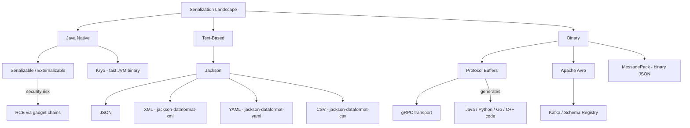

# Serialization and Alternatives

## TL;DR

Java built-in serialization (`Serializable` interface) converts objects to byte streams for persistence or transport; `serialVersionUID` ensures version compatibility; `transient` fields are excluded. **Security risk**: deserialization of untrusted byte streams enables arbitrary code execution via gadget chains (similar to Log4Shell in impact). Alternatives: **Jackson** (JSON/XML/YAML, flexible, fast, REST-native), **Protobuf** (binary, strongly typed, cross-language, compact, gRPC-native), **Avro** (schema evolution, Kafka-native with Schema Registry), **Kryo** (fast binary for same-JVM use), **MessagePack** (binary JSON). Prefer Jackson for REST APIs, Protobuf for gRPC/inter-service, Avro for Kafka pipelines.

---

## Intuition

| Analogy | Concept |
|---------|---------|
| Photocopying an object's entire state including internal wiring | Java native serialization — everything, including private fields and implementation details |
| Filling out a structured, human-readable form | Jackson — explicit, readable, schema-flexible |
| Sending a compressed, strongly typed telegram | Protobuf — compact, typed, schema-enforced |
| A form that can add new fields without breaking old readers | Avro — designed for schema evolution |

---

## How It Works

### Serialization Landscape



---

### Java Native Serialization

```java
import java.io.*;

// Always declare serialVersionUID — prevents fragile auto-computed UID
public class UserProfile implements Serializable {
    private static final long serialVersionUID = 1L;

    private String username;
    private String email;
    private transient String sessionToken; // excluded from serialization
    private int loginCount;

    public UserProfile(String username, String email, int loginCount) {
        this.username = username;
        this.email = email;
        this.loginCount = loginCount;
    }

    // Custom serialization for validation or transformation
    private void writeObject(ObjectOutputStream oos) throws IOException {
        oos.defaultWriteObject(); // write non-transient fields normally
        // can write additional data after
    }

    private void readObject(ObjectInputStream ois)
            throws IOException, ClassNotFoundException {
        ois.defaultReadObject(); // read non-transient fields
        // validate after deserialization
        if (username == null || username.isBlank()) {
            throw new InvalidObjectException("username must not be blank");
        }
    }

    // Getters omitted for brevity
}

public class SerializationUsage {
    // Serialize object to byte array
    public static byte[] serialize(Object obj) throws IOException {
        try (ByteArrayOutputStream bos = new ByteArrayOutputStream();
             ObjectOutputStream oos = new ObjectOutputStream(bos)) {
            oos.writeObject(obj);
            return bos.toByteArray();
        }
    }

    // Deserialize — NEVER do this with untrusted data
    @SuppressWarnings("unchecked")
    public static <T> T deserialize(byte[] bytes) throws IOException, ClassNotFoundException {
        try (ByteArrayInputStream bis = new ByteArrayInputStream(bytes);
             ObjectInputStream ois = new ObjectInputStream(bis)) {
            return (T) ois.readObject();
        }
    }

    // Safer: use look-ahead ObjectInputStream to whitelist allowed classes
    public static Object safeDeserialize(byte[] bytes) throws IOException, ClassNotFoundException {
        try (ByteArrayInputStream bis = new ByteArrayInputStream(bytes);
             ObjectInputStream ois = new ObjectInputStream(bis) {
                 @Override
                 protected Class<?> resolveClass(ObjectStreamClass desc)
                         throws IOException, ClassNotFoundException {
                     String name = desc.getName();
                     if (!name.startsWith("com.myapp.")) { // whitelist
                         throw new InvalidClassException("Unauthorized class: " + name);
                     }
                     return super.resolveClass(desc);
                 }
             }) {
            return ois.readObject();
        }
    }
}
```

---

### Jackson JSON

```java
import com.fasterxml.jackson.annotation.*;
import com.fasterxml.jackson.databind.*;
import com.fasterxml.jackson.databind.type.TypeFactory;
import com.fasterxml.jackson.core.type.TypeReference;
import com.fasterxml.jackson.datatype.jsr310.JavaTimeModule;
import java.time.LocalDate;
import java.util.List;

// Jackson annotations on a POJO
public class Product {
    @JsonProperty("product_id")          // map to snake_case in JSON
    private Long id;

    @JsonProperty("product_name")
    private String name;

    @JsonIgnore                           // never include in JSON output
    private String internalCode;

    @JsonAlias({"price", "cost"})         // accept multiple names on input
    private double unitPrice;

    @JsonInclude(JsonInclude.Include.NON_NULL) // skip null fields in output
    private String description;

    private LocalDate releaseDate;        // needs JavaTimeModule

    // Jackson requires either @JsonCreator constructor or no-arg constructor
    public Product() {}

    public Product(Long id, String name, double unitPrice) {
        this.id = id;
        this.name = name;
        this.unitPrice = unitPrice;
    }
    // Getters/setters omitted for brevity
}

public class JacksonExamples {

    // ObjectMapper is thread-safe — create once, reuse everywhere
    private static final ObjectMapper MAPPER = buildMapper();

    private static ObjectMapper buildMapper() {
        return new ObjectMapper()
            // Register module for java.time types (LocalDate, Instant, etc.)
            .registerModule(new JavaTimeModule())
            // Don't fail on unknown properties (forward-compatible)
            .configure(DeserializationFeature.FAIL_ON_UNKNOWN_PROPERTIES, false)
            // Write dates as ISO strings, not timestamps
            .configure(SerializationFeature.WRITE_DATES_AS_TIMESTAMPS, false)
            // Serialize null fields (change per use case)
            .setSerializationInclusion(JsonInclude.Include.NON_NULL)
            // snake_case naming for all fields
            .setPropertyNamingStrategy(PropertyNamingStrategies.SNAKE_CASE);
    }

    // Serialize object → JSON string
    public static String toJson(Object obj) throws Exception {
        return MAPPER.writeValueAsString(obj);
    }

    // Serialize with pretty-print
    public static String toPrettyJson(Object obj) throws Exception {
        return MAPPER.writerWithDefaultPrettyPrinter().writeValueAsString(obj);
    }

    // Deserialize JSON string → object
    public static <T> T fromJson(String json, Class<T> clazz) throws Exception {
        return MAPPER.readValue(json, clazz);
    }

    // Deserialize to generic type (List<Product>, Map<String, Product>, etc.)
    public static List<Product> fromJsonList(String json) throws Exception {
        // TypeReference preserves generic type at runtime
        return MAPPER.readValue(json, new TypeReference<List<Product>>() {});
    }

    // Convert between object types (e.g., Map → POJO, DTO → Entity)
    public static <T> T convert(Object source, Class<T> targetType) {
        return MAPPER.convertValue(source, targetType);
    }

    // Custom deserializer sketch
    // public class ProductDeserializer extends StdDeserializer<Product> {
    //     @Override
    //     public Product deserialize(JsonParser p, DeserializationContext ctx)
    //             throws IOException {
    //         JsonNode node = p.getCodec().readTree(p);
    //         return new Product(
    //             node.get("product_id").asLong(),
    //             node.get("product_name").asText(),
    //             node.get("unit_price").asDouble()
    //         );
    //     }
    // }
}
```

---

### Protocol Buffers (Protobuf)

```protobuf
// product.proto — schema file (compile with protoc to generate Java code)
syntax = "proto3";
package com.example;
option java_package = "com.example.proto";
option java_outer_classname = "ProductProto";

message Product {
  int64  product_id   = 1;
  string product_name = 2;
  double unit_price   = 3;
  string description  = 4; // optional in proto3 (default empty string if absent)
  repeated string tags = 5; // list field
}
```

```java
// After running protoc, use generated Java class:
import com.example.proto.ProductProto.Product;

public class ProtobufUsage {

    public static byte[] serializeProduct() {
        Product product = Product.newBuilder()
            .setProductId(42L)
            .setProductName("Widget Pro")
            .setUnitPrice(19.99)
            .addTags("electronics")
            .addTags("sale")
            .build();

        return product.toByteArray(); // compact binary encoding
    }

    public static void deserializeProduct(byte[] bytes) throws Exception {
        Product product = Product.parseFrom(bytes);
        System.out.println("ID: " + product.getProductId());
        System.out.println("Name: " + product.getProductName());
        System.out.println("Tags: " + product.getTagsList());
    }
}
```

---

## Serialization Format Comparison

| Format | Type | Human-Readable | Schema Required | Cross-Language | Relative Speed | Kafka-Native | Primary Use Case |
|--------|------|----------------|-----------------|----------------|----------------|--------------|-----------------|
| Java `Serializable` | Binary | No | No (implicit) | JVM only | Slow | No | Legacy persistence, RMI |
| Jackson JSON | Text | Yes | Optional | Yes | Moderate | No | REST APIs, config files |
| Jackson XML | Text | Yes | Optional (XSD) | Yes | Slow | No | SOAP, legacy integration |
| Protocol Buffers | Binary | No | Yes (.proto) | Yes | Fast | No | gRPC, inter-service |
| Apache Avro | Binary/JSON | No (binary) | Yes | Yes | Fast | Yes | Kafka, big data pipelines |
| Kryo | Binary | No | No | JVM only | Very fast | No | Spark, in-JVM caching |
| MessagePack | Binary | No | No | Yes | Fast | No | Compact JSON replacement |

---

## Key Concepts

### Java Native Serialization
`Serializable` is a marker interface (no methods). The JVM uses reflection to read all non-`transient`, non-`static` fields. `ObjectOutputStream` writes a header, class descriptor, and field values. `Externalizable` (extends `Serializable`) requires `writeExternal()`/`readExternal()` giving full control but requiring explicit implementation.

### serialVersionUID
If not declared, the JVM computes a UID from the class structure (field names, types, method signatures). Adding any field changes the UID, making old serialized data unreadable. **Always declare `private static final long serialVersionUID = 1L;`** and increment manually when making breaking changes.

### Deserialization Security Risk
When `ObjectInputStream.readObject()` loads a byte stream, it instantiates classes and calls their `readObject()` methods. Attackers craft byte streams that trigger chains of `readObject()` calls across popular library classes (Apache Commons Collections, Spring Framework internals), ultimately executing shell commands. This is the class of vulnerability exploited in real-world attacks. The fix: never deserialize untrusted data with `ObjectInputStream`, or use a look-ahead `ObjectInputStream` that whitelists allowed classes.

### Jackson ObjectMapper Configuration
`ObjectMapper` is **thread-safe after configuration** — build once, share everywhere. Key configurations: `FAIL_ON_UNKNOWN_PROPERTIES` (default true — causes failures when API adds fields; set to false for robustness), `WRITE_DATES_AS_TIMESTAMPS` (default true — set to false for ISO-8601 strings), `JavaTimeModule` (required for `java.time` types), `PropertyNamingStrategies.SNAKE_CASE` (maps camelCase fields to snake_case JSON).

### Protocol Buffers
Field numbers (1, 2, 3...) are the schema — **never reuse or reorder field numbers**. Proto3 fields are optional by default with zero-value defaults. Binary encoding is extremely compact for numeric types (varint encoding for integers). The `.proto` file is compiled by `protoc` to generate Java/Python/Go/C++ code. Backward/forward compatible: new fields ignored by old readers; missing fields get defaults.

### Apache Avro
Schema stored with data (in file headers) or separately in a Schema Registry (Confluent). Supports schema evolution rules: new fields with defaults are backward compatible; deleted fields must have defaults. Native to Kafka ecosystem: `KafkaAvroSerializer`/`KafkaAvroDeserializer` use the Schema Registry to store schemas by ID and embed only the ID in Kafka messages.

---

## Real-World Usage

- **Spring Boot** auto-configures a `Jackson2ObjectMapperBuilder`-backed `ObjectMapper`; customize via `@Bean ObjectMapper`.
- **Spring Kafka** with Confluent Schema Registry uses Avro for type-safe, schema-evolved Kafka messages.
- **gRPC** (Spring gRPC, grpc-java) uses Protobuf as the wire format; `.proto` files define service contracts.
- **REST API** controllers use Jackson via `@RequestBody`/`@ResponseBody` with Spring's `MappingJackson2HttpMessageConverter`.
- **Apache Spark** uses Kryo for fast in-memory serialization of RDD objects when configured.

---

## Common Pitfalls

1. **Deserializing untrusted data** with `ObjectInputStream` — this is a critical security vulnerability. Even data from "internal" systems can be poisoned if those systems are compromised. Use Jackson/Protobuf for any data crossing trust boundaries.
2. **Jackson failing on unknown properties** — when a downstream service adds a new JSON field, `FAIL_ON_UNKNOWN_PROPERTIES` (default true) causes `UnrecognizedPropertyException`. Set it to false for resilient consumers.
3. **`serialVersionUID` mismatch** — deploying a class with a modified field without updating `serialVersionUID` causes `InvalidClassException` when reading previously serialized data from disk or a queue.
4. **Reusing `ObjectMapper`... or not** — creating a `new ObjectMapper()` on every request is expensive (25–100 ms for the first instantiation, module scanning). Conversely, modifying a shared `ObjectMapper` after creation is not thread-safe. Build once, reuse immutably.

---

## Review Questions

1. Why is Java's built-in `Serializable` mechanism considered a security risk? What specific attack class does it enable, and what is the recommended mitigation?
2. You receive a `JsonMappingException: Unrecognized field "new_field"` in production after a partner API added a field. What is the root cause and what are two ways to fix it?
3. Your team needs to publish events to Kafka that must support schema evolution (new fields added over time) without breaking existing consumers. Which serialization format would you choose and why?

---

## Related Notes

- [[_MOC_IO_NIO|↑ Section MOC]]
- [[Classic_IO_and_NIO]]

---
#Java #IO #Serialization #Jackson #Protobuf
