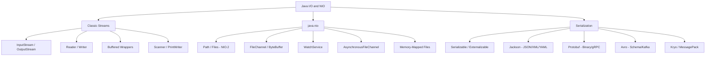

# Java I/O and NIO — Section Map of Content

This section covers Java's full I/O stack: the classic blocking stream-based API from `java.io`, the Channel/Buffer/Selector model from `java.nio`, the modern file API from `java.nio.file`, and the serialization landscape from native Java serialization to production-grade alternatives like Jackson, Protobuf, and Avro.

---

## Concept Map

---

## Learning Path

Follow this order for a structured understanding:

1. **Classic IO** — understand `InputStream`/`OutputStream` byte streams and `Reader`/`Writer` character streams. Learn the decorator pattern (wrapping streams with `Buffered*` wrappers). Understand `try-with-resources` for safe resource management.
2. **NIO.2 File API** — learn `Path`, `Paths`, and the `Files` utility class (Java 7+). These replace `java.io.File` in most modern code and provide atomic operations, symbolic link support, and directory walking.
3. **Channels and Buffers** — understand `FileChannel`, `ByteBuffer`, the `flip()` pattern, direct vs heap buffers. Learn when to use channels over streams.
4. **Memory-Mapped Files** — understand `FileChannel.map()` and `MappedByteBuffer` for large file processing without reading all data into heap.
5. **WatchService and Async IO** — learn filesystem event monitoring and `AsynchronousFileChannel` for non-blocking file operations.
6. **Serialization Landscape** — understand why native Java serialization is insecure, and when to use Jackson vs Protobuf vs Avro for different use cases.

---

## Notes in This Section

| Note | Description | Difficulty |
|------|-------------|------------|
| [[Classic_IO_and_NIO]] | Byte/char streams, NIO channels, ByteBuffer, Path/Files, WatchService, async IO | Intermediate |
| [[Serialization_and_Alternatives]] | Java Serializable, Jackson JSON, Protocol Buffers, Avro, security risks | Intermediate |

---

## Key Questions

These questions test genuine understanding — not just API recall:

1. **When to use NIO vs classic IO?** — Classic IO is simpler for small files and text; NIO Channels shine for large binary files, random access (ByteBuffer), and non-blocking network IO. NIO.2 (`Path`/`Files`) is preferred for all file system operations in modern code regardless of size.

2. **Why is Java serialization insecure?** — Deserialization of untrusted byte streams can trigger arbitrary code execution via "gadget chains" — sequences of `readObject()` implementations in popular libraries (Apache Commons, Spring) that can be chained to execute shell commands. This is a structural flaw, not a bug. Never deserialize data from untrusted sources using `ObjectInputStream`.

3. **When to use memory-mapped files?** — Use `FileChannel.map()` when processing large files (>10 MB) where you need random access rather than sequential reading. The OS maps the file into virtual memory; reads/writes go through page cache without explicit `read()`/`write()` calls, reducing syscall overhead and enabling efficient random access patterns like binary search over sorted flat files.

---

## Key Relationships

| Concept | Replaces / Improves Upon | Relationship |
|---------|--------------------------|--------------|
| `Path` / `Files` | `java.io.File` | Complete replacement; prefer always |
| `FileChannel` | `FileInputStream` for binary | Better for large files, random access |
| `AsynchronousFileChannel` | `FileChannel` | Non-blocking; completion handler pattern |
| Jackson | Native `Serializable` | Safer, human-readable, widely supported |
| Protobuf | Jackson for inter-service RPC | Binary, typed, schema-driven |
| Avro | Protobuf in Kafka pipelines | Schema registry integration, evolution |

---

## Related Sections

- [[_MOC_Java_Concurrency]] — Async IO patterns connect to CompletableFuture, thread pools, and virtual threads
- [[_MOC_Modern_Java]] — Java 21 virtual threads change how blocking IO scales; NIO.2 integrates with modern APIs
