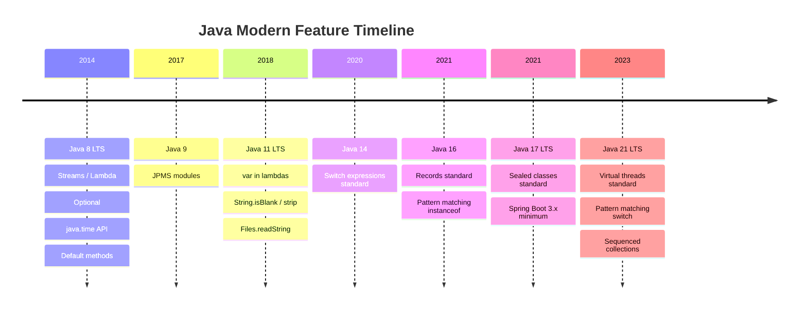

# Modern Language Features

## TL;DR

Java has evolved rapidly across its LTS releases: **switch expressions** (Java 14) add arrow labels and `yield`, eliminating fall-through bugs; **text blocks** (Java 15) remove string escape boilerplate for JSON, SQL, and HTML; **pattern matching `instanceof`** (Java 16) eliminates explicit casts after type checks; **records** (Java 16) generate `equals`/`hashCode`/`toString`/accessors for immutable data carriers; **sealed classes** (Java 17) define exhaustive type hierarchies; **pattern matching `switch`** (Java 21) combines type patterns with guards for expressive dispatch. The **Java Time API** (Java 8+): `LocalDate`/`LocalDateTime`/`ZonedDateTime`/`Instant`/`Duration`/`Period` replace the broken `Date`/`Calendar` API with immutable, thread-safe types.

---

## Intuition

Each feature removes a specific boilerplate category:

| Feature | Boilerplate Removed |
|---------|---------------------|
| Switch expression | `break`, fall-through bugs, manual return from `switch` |
| Text blocks | `\"`, `+` concatenation, `\n` escape sequences |
| Pattern matching `instanceof` | `if (x instanceof Foo) { Foo f = (Foo) x; ... }` |
| Records | 10+ lines of getters, `equals`, `hashCode`, `toString`, constructor |
| Sealed classes | Open `if/else` chains for known type sets |
| Java Time API | `SimpleDateFormat` threading bugs, `Calendar` confusion |

---

## How It Works

### Java Version Timeline



---

### Switch Expressions

```java
public class SwitchExpressionExamples {

    // OLD: switch statement (fall-through risk, no expression value)
    public static String getDayTypeOld(int day) {
        String type;
        switch (day) {
            case 1: case 7:
                type = "Weekend";
                break;
            case 2: case 3: case 4: case 5: case 6:
                type = "Weekday";
                break;
            default:
                type = "Unknown";
                break; // forget this → fall-through bug
        }
        return type;
    }

    // NEW: switch expression with arrow labels (Java 14+)
    public static String getDayTypeNew(int day) {
        return switch (day) {
            case 1, 7  -> "Weekend";
            case 2, 3, 4, 5, 6 -> "Weekday";
            default    -> "Unknown";
        };
    }

    // switch expression with yield (for multi-statement blocks)
    public static int computeScore(String grade) {
        return switch (grade) {
            case "A+" -> 100;
            case "A"  -> 95;
            case "B"  -> {
                System.out.println("Logging B grade");
                yield 80; // yield returns the value from the block
            }
            default -> {
                throw new IllegalArgumentException("Unknown grade: " + grade);
            }
        };
    }

    // switch expression with sealed types (must be exhaustive — Java 21)
    sealed interface Shape permits Circle, Rectangle, Triangle {}
    record Circle(double radius) implements Shape {}
    record Rectangle(double width, double height) implements Shape {}
    record Triangle(double base, double height) implements Shape {}

    public static double area(Shape shape) {
        return switch (shape) {
            case Circle c         -> Math.PI * c.radius() * c.radius();
            case Rectangle r      -> r.width() * r.height();
            case Triangle t       -> 0.5 * t.base() * t.height();
            // No default needed — sealed hierarchy is exhaustive
        };
    }
}
```

---

### Text Blocks

```java
public class TextBlockExamples {

    // JSON — before and after
    static String jsonOld = "{\"name\": \"Alice\", \"age\": 30, \"city\": \"NYC\"}";

    static String jsonNew = """
            {
                "name": "Alice",
                "age": 30,
                "city": "NYC"
            }
            """; // closing """ position controls indentation stripping

    // SQL text block
    static String sql = """
            SELECT u.id, u.name, o.total
            FROM users u
            JOIN orders o ON u.id = o.user_id
            WHERE u.active = true
              AND o.created_at > :since
            ORDER BY o.total DESC
            """;

    // HTML template
    static String html = """
            <html>
                <body>
                    <h1>Hello, %s!</h1>
                </body>
            </html>
            """.formatted("World"); // String.formatted() works well with text blocks

    // Escape sequences in text blocks
    static String withContinuation = """
            This is a very long line that \
            continues on the next line without a newline.\
            """;
    // Result: "This is a very long line that continues on the next line without a newline."

    static String withTrailingSpace = """
            Line with trailing space   \s
            """;
    // \s marks the end of significant content and preserves space before it
}
```

---

### Pattern Matching instanceof

```java
public class PatternMatchingExamples {

    // BEFORE Java 16 — verbose and error-prone
    public static void processObjectOld(Object obj) {
        if (obj instanceof String) {
            String s = (String) obj; // redundant explicit cast
            System.out.println(s.toUpperCase());
        } else if (obj instanceof Integer) {
            Integer i = (Integer) obj;
            System.out.println(i * 2);
        }
    }

    // AFTER Java 16 — pattern variable is scoped and typed
    public static void processObjectNew(Object obj) {
        if (obj instanceof String s) {           // s is bound here
            System.out.println(s.toUpperCase()); // no cast needed
        } else if (obj instanceof Integer i) {
            System.out.println(i * 2);
        }
    }

    // Pattern matching with guards (Java 21)
    public static String categorize(Object obj) {
        return switch (obj) {
            case Integer i when i < 0  -> "negative int: " + i;
            case Integer i when i == 0 -> "zero";
            case Integer i             -> "positive int: " + i;
            case String s when s.isBlank() -> "blank string";
            case String s              -> "string: " + s;
            case null                  -> "null value";
            default                    -> "other: " + obj.getClass().getSimpleName();
        };
    }
}
```

---

### Records

```java
import java.util.Objects;

// Simple record — auto-generates constructor, accessors, equals, hashCode, toString
public record Point(double x, double y) {

    // Compact constructor for validation (no parameters — implicit this.x = x etc.)
    public Point {
        if (Double.isNaN(x) || Double.isNaN(y)) {
            throw new IllegalArgumentException("Coordinates must not be NaN");
        }
    }

    // Additional methods are allowed
    public double distanceTo(Point other) {
        double dx = this.x - other.x;
        double dy = this.y - other.y;
        return Math.sqrt(dx * dx + dy * dy);
    }

    // Custom accessor (override the auto-generated one)
    @Override
    public double x() {
        return Math.round(x * 1000.0) / 1000.0; // rounded to 3 decimals
    }
}

// Records can implement interfaces
public interface Printable { void print(); }

public record Order(long id, String product, int quantity) implements Printable {
    // Additional constructor (must delegate to canonical)
    public Order(String product, int quantity) {
        this(System.currentTimeMillis(), product, quantity);
    }

    @Override
    public void print() {
        System.out.printf("Order #%d: %d x %s%n", id, quantity, product);
    }
}

// Records work as DTO, value object, projection
// Records CANNOT: extend a class, be extended, have mutable fields, have instance initializers
```

---

### Sealed Classes

```java
// Sealed class — permits clause lists ALL allowed subclasses
public sealed interface Result<T> permits Result.Success, Result.Failure {

    record Success<T>(T value) implements Result<T> {}

    record Failure<T>(String errorCode, String message) implements Result<T> {}

    // Utility method on the sealed interface
    default boolean isSuccess() {
        return this instanceof Success<T>;
    }
}

// Exhaustive pattern switch — compiler verifies all cases covered
public class SealedUsage {
    public static <T> void handleResult(Result<T> result) {
        switch (result) {
            case Result.Success<T> s  -> System.out.println("Success: " + s.value());
            case Result.Failure<T> f  -> System.err.println("Error " + f.errorCode() + ": " + f.message());
            // No default needed — sealed permits only Success and Failure
        }
    }

    // Sealed classes enforce exhaustive handling at compile time
    public static <T> String describe(Result<T> result) {
        return switch (result) {
            case Result.Success<T> s -> "OK: " + s.value();
            case Result.Failure<T> f -> "FAIL: " + f.errorCode();
        };
    }
}
```

---

### Java Time API

```java
import java.time.*;
import java.time.format.*;
import java.time.temporal.*;

public class JavaTimeExamples {

    public static void localDateExamples() {
        LocalDate today = LocalDate.now();               // current date, no time/zone
        LocalDate birthday = LocalDate.of(1990, 3, 15);
        LocalDate nextWeek = today.plusWeeks(1);
        LocalDate startOfMonth = today.withDayOfMonth(1);
        LocalDate endOfYear = today.withDayOfYear(today.lengthOfYear());

        long daysBetween = ChronoUnit.DAYS.between(birthday, today);
        boolean isLeap = today.isLeapYear();

        // Comparisons
        boolean isBefore = birthday.isBefore(today);
        boolean inRange = !today.isBefore(startOfMonth) && !today.isAfter(endOfYear);
    }

    public static void localDateTimeExamples() {
        LocalDateTime now = LocalDateTime.now();         // date + time, NO timezone
        LocalDateTime meeting = LocalDateTime.of(2026, 8, 1, 14, 30, 0);
        LocalDateTime inTwoHours = now.plusHours(2);

        // Conversion
        LocalDate dateOnly = now.toLocalDate();
        LocalTime timeOnly = now.toLocalTime();
    }

    public static void zonedDateTimeExamples() {
        ZoneId utc   = ZoneId.of("UTC");
        ZoneId ist   = ZoneId.of("Asia/Kolkata");
        ZoneId est   = ZoneId.of("America/New_York");

        ZonedDateTime nowUTC = ZonedDateTime.now(utc);
        ZonedDateTime nowIST = nowUTC.withZoneSameInstant(ist); // convert timezone

        // Start of day in a specific timezone
        ZonedDateTime startOfDayIST = LocalDate.now(ist).atStartOfDay(ist);

        // Convert to Instant for cross-system comparison
        Instant instant = nowUTC.toInstant();
    }

    public static void instantExamples() {
        Instant now = Instant.now();                     // UTC epoch, nanosecond precision
        Instant future = now.plus(Duration.ofHours(1));
        long epochMilli = now.toEpochMilli();

        // Convert Instant to ZonedDateTime
        ZonedDateTime zdt = now.atZone(ZoneId.of("Asia/Kolkata"));
    }

    public static void durationAndPeriodExamples() {
        // Duration — time-based (hours, minutes, seconds, nanos)
        Duration oneHour = Duration.ofHours(1);
        Duration twoMins = Duration.ofMinutes(2);
        Duration combined = oneHour.plus(twoMins);

        Instant start = Instant.now();
        // ... do work ...
        Instant end = Instant.now();
        Duration elapsed = Duration.between(start, end);
        System.out.println("Elapsed: " + elapsed.toMillis() + " ms");

        // Period — date-based (years, months, days)
        Period twoWeeks = Period.ofWeeks(2);
        Period threeMonths = Period.ofMonths(3);
        LocalDate futureDate = LocalDate.now().plus(threeMonths);

        // Age calculation using Period
        Period age = Period.between(LocalDate.of(1990, 3, 15), LocalDate.now());
        System.out.printf("Age: %d years, %d months%n", age.getYears(), age.getMonths());
    }

    public static void formatterExamples() {
        // DateTimeFormatter is thread-safe — create once, reuse
        DateTimeFormatter isoDate = DateTimeFormatter.ISO_LOCAL_DATE;
        DateTimeFormatter custom  = DateTimeFormatter.ofPattern("dd-MMM-yyyy HH:mm");
        DateTimeFormatter localized = DateTimeFormatter
            .ofLocalizedDateTime(FormatStyle.MEDIUM)
            .withLocale(java.util.Locale.US);

        LocalDateTime now = LocalDateTime.now();
        String formatted = now.format(custom);           // "26-Jul-2026 14:30"
        LocalDateTime parsed = LocalDateTime.parse("26-Jul-2026 14:30", custom);

        // NEVER use SimpleDateFormat — it's not thread-safe
    }
}
```

---

## Feature Summary Table

| Feature | Java Version | Problem Solved | Key Syntax |
|---------|-------------|----------------|------------|
| Switch expression | 14 (standard) | Fall-through, no expression value | `switch (x) { case A -> val; }` |
| Text blocks | 15 (standard) | String escape boilerplate | `"""..."""` |
| Pattern matching `instanceof` | 16 (standard) | Redundant casts after type check | `if (x instanceof Foo f)` |
| Records | 16 (standard) | DTO/value object boilerplate | `record Point(int x, int y) {}` |
| Sealed classes | 17 (standard) | Open type hierarchies | `sealed interface S permits A, B` |
| Pattern matching `switch` | 21 (standard) | Complex `if/else instanceof` chains | `case Foo f when f.x() > 0 ->` |
| `LocalDate` / `ZonedDateTime` | 8 | Thread-unsafe `Date`/`Calendar` | `LocalDate.now()`, `ZonedDateTime.now(zone)` |

---

## Real-World Usage

- **Spring Boot 3.x** requires Java 17+; Spring supports records as `@RequestBody` POJOs and Spring Data projections.
- **Jackson 2.12+** supports records natively via the canonical constructor; no extra configuration needed.
- **Spring Data** interface projections can be replaced with record projections in Spring Data 3.x.
- `DateTimeFormatter` with `withZone()` is essential for correctly formatting `Instant` values in API responses.

---

## Common Pitfalls

1. **Switch exhaustiveness not enforced for open hierarchies** — `switch` on a non-sealed type requires a `default` case; the compiler cannot verify exhaustiveness without sealed classes.
2. **Records cannot extend a class** — records implicitly extend `java.lang.Record`; you cannot use them to extend your own class hierarchy. Use sealed interfaces for polymorphism with records.
3. **`ZonedDateTime` vs `OffsetDateTime` for database storage** — `ZonedDateTime` includes DST rules which change over time; storing it and reading it later may give different results. For database persistence, store `Instant` (UTC epoch) or `OffsetDateTime` (which stores the fixed UTC offset, not timezone rules).
4. **Text block trailing whitespace** — trailing spaces on a line are stripped by default. Use `\s` at the end of a line to preserve intentional trailing spaces.

---

## Review Questions

1. What does `yield` do inside a `switch` expression block, and how does it differ from `return`?
2. Given a sealed interface `Shape` with implementations `Circle`, `Rectangle`, `Triangle`, write an exhaustive pattern matching `switch` expression that computes the area. What happens at compile time if you add a new permitted type?
3. A `DateTimeFormatter` created with `ofPattern("dd/MM/yyyy")` is stored as a static field and used concurrently by 100 threads. Is this safe? Would the same be true for a `SimpleDateFormat`?

---

## Related Notes

- [[_MOC_Modern_Java|↑ Section MOC]]
- [[Virtual_Threads_and_Modules]]
- [[Interfaces_and_Modern_Types]]

---
#Java #ModernJava #SwitchExpressions #Records #Sealed #PatternMatching
