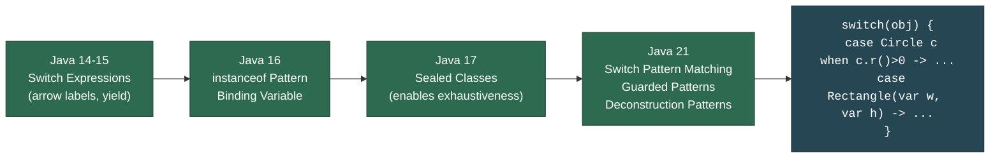

# 🔍 Pattern Matching in Java

> [!abstract] TL;DR
> Pattern matching progressively eliminates boilerplate type-check-then-cast sequences. **`instanceof` pattern matching** (Java 16) binds a typed variable in the same expression — `if (obj instanceof String s)` — removing the redundant cast. **Switch pattern matching** (Java 21 final) extends this to `switch` expressions and statements, letting each `case` bind a typed pattern variable and optionally add a `when` guard clause. Combined with **sealed classes**, the compiler enforces exhaustiveness — a switch over a sealed hierarchy is a compile error if any permitted subtype is unhandled. **Deconstruction patterns** (Java 21) go further, destructuring records directly in a `case` clause.

---

## Intuition

Classic Java is like a border agent who checks your passport (instanceof), writes down your name manually (cast to String), then asks follow-up questions (field access). Pattern matching is a modern agent with a scanner: one action identifies *and* registers you (`instanceof String s`), and you can walk straight through with the badge (`s`) already in hand. Switch pattern matching is the full smart gate — it reads your badge, routes you to the correct lane, and the gate physically cannot open if any lane is unregistered (exhaustiveness).

---

## How It Works

### Pattern Matching Evolution



---

## Key Concepts

### 1. Classic instanceof vs Pattern Matching

```java
// ── BEFORE: Java 15 and earlier ─────────────────────────────────────────
Object obj = "Hello Pattern Matching";

if (obj instanceof String) {            // type test
    String s = (String) obj;            // redundant cast — compiler already knows
    System.out.println(s.length());     // 22
}

// ── AFTER: Java 16+ pattern matching instanceof ──────────────────────────
if (obj instanceof String s) {          // test + bind in one step
    System.out.println(s.length());     // s is in scope here
}
// s is NOT in scope here (outside the if block)

// Pattern variable in complex expressions
if (obj instanceof String s && s.length() > 5) {
    // s is valid in the && right side (definite assignment analysis)
    System.out.println("Long string: " + s);
}

// Negation — s is in scope in the else branch (Java knows obj IS NOT String here)
if (!(obj instanceof String s)) {
    System.out.println("Not a string");
} else {
    System.out.println(s.toUpperCase()); // s in scope in else
}
```

### 2. Pattern Matching with instanceof — Scope Rules

```java
// Scope rule: pattern variable is in scope where the compiler can
// prove the instanceof test is true via definite-assignment analysis

Object value = getFromCache();

// Pattern variable in condition (short-circuit && — right side only reached if left is true)
boolean result = value instanceof Integer i && i > 0 && i < 100;

// Pattern variable in OR — NOT in scope (could be false path)
// boolean bad = value instanceof Integer i || i > 0;  // COMPILE ERROR

// Pattern in ternary
String display = (value instanceof Integer i) ? "Int: " + i : "Other: " + value;

// Multiple patterns in nested if
void process(Object o) {
    if (o instanceof String s) {
        log(s.toLowerCase());
    } else if (o instanceof Integer i) {
        log("Number: " + i);
    } else if (o instanceof List<?> list && !list.isEmpty()) {
        log("List with " + list.size() + " items");
    } else {
        log("Unknown: " + o);
    }
}
```

### 3. Switch Pattern Matching (Java 21)

```java
sealed interface Shape permits Circle, Rectangle, Triangle {}
record Circle(double radius) implements Shape {}
record Rectangle(double width, double height) implements Shape {}
record Triangle(double base, double height) implements Shape {}

// ── Type patterns in switch expression ──────────────────────────────────
double area(Shape shape) {
    return switch (shape) {
        case Circle c     -> Math.PI * c.radius() * c.radius();
        case Rectangle r  -> r.width() * r.height();
        case Triangle t   -> 0.5 * t.base() * t.height();
        // No default needed — sealed hierarchy is exhaustive
    };
}

// ── Pattern matching with Object (open hierarchy — default required) ─────
String describe(Object obj) {
    return switch (obj) {
        case Integer i -> "Integer: " + i;
        case Long l    -> "Long: " + l;
        case String s  -> "String: " + s;
        case null      -> "null";         // explicit null case (Java 21)
        default        -> "Other: " + obj.getClass().getSimpleName();
    };
}

// ── Ordering rules ───────────────────────────────────────────────────────
// More specific patterns must come BEFORE less specific ones (compile error otherwise)
String typed(Object obj) {
    return switch (obj) {
        case Integer i when i < 0 -> "Negative int";   // guarded: more specific
        case Integer i            -> "Non-negative int"; // unguarded Integer
        case Number n             -> "Other number";     // supertype of Integer — AFTER
        default                   -> "Other";
    };
    // COMPILE ERROR if "case Number n" came before "case Integer i"
}
```

### 4. Guarded Patterns with `when`

```java
// when clause adds a boolean condition to a type pattern
sealed interface Payment permits Cash, Card, Crypto {}
record Cash(double amount) implements Payment {}
record Card(String type, double amount, boolean declined) implements Payment {}
record Crypto(String coin, double amount) implements Payment {}

String processPayment(Payment p) {
    return switch (p) {
        case Cash cash when cash.amount() > 10_000 ->
            "Large cash payment — requires reporting";
        case Cash cash ->
            "Cash payment of " + cash.amount();

        case Card card when card.declined() ->
            "Card declined for " + card.amount();
        case Card card when card.type().equals("AMEX") ->
            "AMEX surcharge applied";
        case Card card ->
            "Card payment of " + card.amount();

        case Crypto crypto when crypto.coin().equals("BTC") ->
            "Bitcoin — confirm 6 blocks";
        case Crypto crypto ->
            crypto.coin() + " payment";
    };
}
```

**Evaluation order:** Cases are tested top-to-bottom. The first matching pattern (type test passes AND `when` guard is true) wins. Unguarded cases dominate all subsequent guarded cases of the same type — compiler enforces ordering.

### 5. Deconstruction Patterns (Java 21)

```java
// Deconstruct a record's components directly in the case clause
record Point(int x, int y) {}
record Line(Point start, Point end) {}

void printLine(Object obj) {
    switch (obj) {
        // Deconstruct Line → start Point → its x, y
        case Line(Point(int x1, int y1), Point(int x2, int y2)) ->
            System.out.printf("(%d,%d) to (%d,%d)%n", x1, y1, x2, y2);

        // Deconstruct with var (inferred type)
        case Line(var s, var e) ->
            System.out.println("Line from " + s + " to " + e);

        default -> System.out.println("Not a line");
    }
}

// Deconstruction in if (instanceof)
Object shape = new Circle(5.0);
if (shape instanceof Circle(double r)) {
    System.out.printf("Circle radius: %.1f%n", r); // r = 5.0
}

// Nested deconstruction with sealed hierarchy
sealed interface Expr permits Num, Add {}
record Num(int val) implements Expr {}
record Add(Expr left, Expr right) implements Expr {}

int eval(Expr e) {
    return switch (e) {
        case Num(int v)          -> v;
        case Add(var l, var r)   -> eval(l) + eval(r);
    };
}

// Eval: Add(Num(1), Add(Num(2), Num(3))) → 6
System.out.println(eval(new Add(new Num(1), new Add(new Num(2), new Num(3)))));
```

### 6. Null Handling in Switch

```java
// Pre-Java 21: switch(null) throws NullPointerException
// Java 21: explicit null case prevents NPE

Object value = null;

// Safe null handling with explicit case
String result = switch (value) {
    case null          -> "null value";
    case String s      -> "String: " + s;
    case Integer i     -> "Integer: " + i;
    default            -> "Other";
};
// result = "null value"

// Combine null with a type (null, default pattern)
String compact = switch (value) {
    case null, default -> "null or unknown";  // matches null OR anything else
};
```

### 7. Exhaustiveness in Switch Patterns

```java
// With sealed types — NO default needed, compiler checks all cases
sealed interface Color permits Red, Green, Blue {}
record Red() implements Color {}
record Green() implements Color {}
record Blue() implements Color {}

String name(Color c) {
    return switch (c) {
        case Red r   -> "Red";
        case Green g -> "Green";
        case Blue b  -> "Blue";
        // No default — compiler verifies all 3 permits are covered
    };
}

// If a new type is added: sealed interface Color permits Red, Green, Blue, Yellow {}
// then name() is a COMPILE ERROR — must add "case Yellow y" or a default
// This is the key safety advantage over instanceof chains or enums
```

---

## Real-World Notes

- **Visitor pattern replacement**: The classic Visitor pattern exists primarily to dispatch behavior by subtype. With sealed interfaces and switch pattern matching, the dispatch is inline and the compiler enforces exhaustiveness — no separate Visitor class hierarchy needed.
- **JSON parsing**: Deserializing unknown JSON structures (using `Object` or a `JsonNode` type) benefits from pattern matching — `case Map<?,?> m -> ...`, `case List<?> l -> ...`.
- **Command pattern**: `sealed interface Command permits CreateUser, DeleteUser, UpdateUser` + switch gives a type-safe command dispatcher without reflection.
- **Error handling**: `sealed interface Result<T> permits Ok<T>, Err` + switch is idiomatic Railway-Oriented Programming in Java — exhaustive handling of success and failure without `instanceof`.

---

## Common Pitfalls

| Pitfall | Consequence | Fix |
|---------|-------------|-----|
| Pattern variable used outside the guarded scope | Compile error — variable not in scope | Check definite assignment rules; restructure to keep variable in scope |
| Unguarded case before guarded case of same type | Compile error — unguarded dominates | Put guarded (`when`) cases before the unguarded catch-all of the same type |
| Missing `null` case with nullable input | `NullPointerException` at runtime | Add `case null ->` or guard the switch with a null check |
| `default` in sealed switch hides missing cases | New permitted type added later is silently swallowed | Omit `default` on sealed switches to get exhaustiveness checking |
| Deconstruction on mutable classes (non-records) | Not supported — deconstruction only works on records in Java 21 | Use type patterns with explicit field access for non-record types |

---

## Related Notes

- [[_MOC_Modern_Java|↑ Section MOC — Modern Java]]
- [[Records_and_Sealed_Classes]] — sealed hierarchies that make switch exhaustive
- [[Text_Blocks_and_Switch_Expressions]] — switch expressions foundation (arrow labels, yield)
- [[Modern_Language_Features]] — broader Java 14-21 features overview

---

## Review Questions

1. Given `Object o = "test"`, explain why `if (o instanceof String s || s.length() > 0)` is a compile error, but `if (o instanceof String s && s.length() > 0)` compiles correctly. What is the compiler's reasoning called?

2. A switch over a sealed interface `Shape` works without a `default` clause today. The team adds a new permitted type `Polygon` six months later. Walk through exactly what happens to every switch statement over `Shape` in the codebase — what the compiler reports, and how pattern matching provides a safety guarantee that a chain of `instanceof` checks cannot.

3. Rewrite this classic visitor-pattern dispatch as a switch pattern expression: `if (event instanceof LoginEvent e) { auditLogin(e); } else if (event instanceof LogoutEvent e) { auditLogout(e); } else if (event instanceof PurchaseEvent e && e.amount() > 1000) { flagLarge(e); } else if (event instanceof PurchaseEvent e) { recordPurchase(e); }`. Include a `sealed interface` definition.

---

#Java #Modern_Java #PatternMatching #instanceof #SwitchExpression #DeconstructionPatterns #Intermediate
