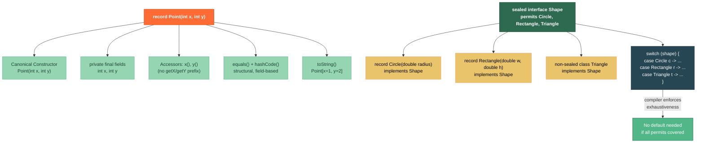

# 🗂️ Records and Sealed Classes

> [!abstract] TL;DR
> **Records** (Java 16 stable) are transparent, immutable data carriers: declare `record Point(int x, int y) {}` and the compiler generates a canonical constructor, private final fields, `equals()`, `hashCode()`, and `toString()` automatically — eliminating the boilerplate DTO/value-object class. **Sealed classes** (Java 17 stable) restrict which classes can extend an interface or class using a `permits` clause, making the set of subtypes exhaustively known at compile time; combined with switch pattern matching, the compiler enforces that every case is handled. Together, records and sealed classes are Java's answer to algebraic data types (sum + product types), enabling safer domain modeling without a full functional-language jump.

---

## Intuition

A **record** is a Post-it note with labeled fields — it carries data, anyone can read it, you cannot erase and re-write it, and two notes with the same labels and values are considered identical (structural equality). A **sealed class** is a walled conference room with a guest list on the door — only those explicitly on the list (`permits`) can enter (extend), so you always know exactly who's inside, making "handle all guests" (exhaustive switch) possible and compiler-verified.

---

## How It Works

### Records and Sealed Classes Architecture



---

## Key Concepts

### 1. Basic Record Syntax

```java
// Compact declaration — compiler generates EVERYTHING below
record Point(int x, int y) {}

// What the compiler generates (equivalent class):
// public final class Point extends Record {
//     private final int x;
//     private final int y;
//     public Point(int x, int y) { this.x = x; this.y = y; }
//     public int x() { return x; }           // accessor (no "get" prefix!)
//     public int y() { return y; }
//     @Override public boolean equals(Object o) { ... field-by-field ... }
//     @Override public int hashCode() { ... }
//     @Override public String toString() { return "Point[x=" + x + ", y=" + y + "]"; }
// }

Point p1 = new Point(3, 4);
Point p2 = new Point(3, 4);

System.out.println(p1.x());          // 3 — accessor method
System.out.println(p1.y());          // 4
System.out.println(p1);              // Point[x=3, y=4]
System.out.println(p1.equals(p2));   // true — structural equality
System.out.println(p1 == p2);        // false — different objects
```

### 2. Compact Constructors for Validation

```java
// Compact constructor: body runs BEFORE field assignment
record Range(int min, int max) {

    // Compact constructor — no parameter list, fields auto-assigned after body runs
    Range {
        if (min > max) {
            throw new IllegalArgumentException(
                "min (%d) must be <= max (%d)".formatted(min, max));
        }
        // Can normalize values:
        // min = Math.max(0, min);  // clamp to zero
    }
}

// Explicit canonical constructor (traditional style)
record Email(String address) {
    Email(String address) {
        if (!address.contains("@")) throw new IllegalArgumentException("Invalid email");
        this.address = address.strip().toLowerCase(); // normalize
    }
}

// Custom extra constructor (non-canonical — must delegate to canonical)
record Timestamp(long epochMillis) {
    Timestamp(java.time.Instant instant) {
        this(instant.toEpochMilli()); // must call canonical constructor
    }
}
```

### 3. Records as DTO and Value Objects

```java
// API response DTO
record UserDto(long id, String name, String email) {}

// Nested records
record Address(String street, String city, String country) {}
record Customer(String name, Address address, List<String> tags) {
    // Records CAN have instance methods
    public boolean isFromCountry(String country) {
        return address.country().equalsIgnoreCase(country);
    }

    // Records CAN have static methods and fields
    public static Customer anonymous() {
        return new Customer("Anonymous", new Address("", "", ""), List.of());
    }
}

// Records implementing interfaces
interface Measurable {
    double area();
}

record Circle(double radius) implements Measurable {
    @Override
    public double area() {
        return Math.PI * radius * radius;
    }
}

record Rectangle(double width, double height) implements Measurable {
    @Override
    public double area() {
        return width * height;
    }
}

// Records work with generics
record Pair<A, B>(A first, B second) {
    public Pair<B, A> swap() {
        return new Pair<>(second, first);
    }
}

Pair<String, Integer> p = new Pair<>("hello", 42);
Pair<Integer, String> swapped = p.swap(); // Pair[first=42, second=hello]
```

### 4. Sealed Classes and Interfaces

```java
// sealed keyword + permits clause restricts subtyping
// All permitted subclasses must be in the same compilation unit (or module/package)
public sealed interface Shape permits Circle, Rectangle, Triangle {}

// Each subclass must be one of: final, sealed, or non-sealed
public record Circle(double radius) implements Shape {}          // final implicitly (record)
public record Rectangle(double width, double height) implements Shape {}

// non-sealed re-opens the hierarchy — anyone can extend Triangle
public non-sealed class Triangle implements Shape {
    public Triangle(double base, double height) { /* ... */ }
    // subclasses of Triangle are unrestricted
}

// Sealed class (not interface)
public abstract sealed class Expr
    permits Literal, Add, Multiply {}

public record Literal(int value) extends Expr {}
public record Add(Expr left, Expr right) extends Expr {}
public record Multiply(Expr left, Expr right) extends Expr {}
```

### 5. Exhaustive Pattern Matching with Sealed Classes

```java
// With sealed hierarchy, switch can be exhaustive without default
// Compiler error if any permitted subtype is not handled
double area(Shape shape) {
    return switch (shape) {
        case Circle c     -> Math.PI * c.radius() * c.radius();
        case Rectangle r  -> r.width() * r.height();
        case Triangle t   -> 0.5 * t.base() * t.height(); // non-sealed, still checked
    };  // no default needed — compiler knows exactly 3 subtypes
}

// Expression evaluator with sealed ADT (recursive)
int eval(Expr expr) {
    return switch (expr) {
        case Literal(int v)         -> v;                        // deconstruction pattern (Java 21)
        case Add(var l, var r)      -> eval(l) + eval(r);
        case Multiply(var l, var r) -> eval(l) * eval(r);
    };
}

// Guarded patterns (Java 21 when clause)
String describe(Shape shape) {
    return switch (shape) {
        case Circle c when c.radius() > 100 -> "Large circle";
        case Circle c                        -> "Small circle";
        case Rectangle r when r.width() == r.height() -> "Square";
        case Rectangle r                               -> "Rectangle";
        case Triangle t -> "Triangle";
    };
}
```

### 6. Limitations of Records

```java
// Records CANNOT:
// 1. Extend another class (records implicitly extend java.lang.Record)
// 2. Be abstract
// 3. Have non-final instance fields (can add static fields)
// 4. Be generic-instantiated with raw types and retain type info (type erasure applies)

// Records CAN:
// - Have static fields and methods
// - Implement multiple interfaces
// - Be generic (record Pair<A, B>(...))
// - Have instance methods
// - Be annotated

record Config(String host, int port) {
    static final int DEFAULT_PORT = 8080;  // static field: OK

    // Annotation on component = on both field and accessor
    record Validated(@NotNull String host, @Min(1) int port) {}
}

// Wither pattern (records are immutable — create modified copies)
record Person(String name, int age) {
    public Person withName(String newName) { return new Person(newName, age); }
    public Person withAge(int newAge)      { return new Person(name, newAge); }
}

Person alice = new Person("Alice", 30);
Person older  = alice.withAge(31);  // new object; alice unchanged
```

---

## Real-World Notes

- **Spring Boot 3 DTOs**: Spring's Jackson integration fully supports records — `@RequestBody record CreateUserRequest(String name, String email) {}` deserializes JSON directly, no `@JsonCreator` needed (Jackson 2.12+).
- **Domain-Driven Design value objects**: Replace hand-written immutable value objects (`Money`, `Email`, `PhoneNumber`) with records — you get equals/hashCode/toString for free and the domain concept is explicit.
- **Event sourcing**: Model domain events as sealed interfaces with record implementations — `sealed interface OrderEvent permits OrderPlaced, OrderShipped, OrderCancelled {}` — then switch-pattern-match over event streams.
- **Error modeling**: `sealed interface Result<T> permits Success<T>, Failure<T>` with record subtypes gives Rust-style `Result` in Java without an external library.

---

## Common Pitfalls

| Pitfall | Consequence | Fix |
|---------|-------------|-----|
| Mutable fields inside a record | Record appears immutable but field content can be mutated | Use `List.copyOf()` and unmodifiable wrappers in compact constructor |
| Calling `getX()` instead of `x()` | `NoSuchMethodException` — records use field-name accessors | Use `point.x()` not `point.getX()` |
| Omitting `permits` clause on sealed type | Compiler allows any subtype; sealing is defeated | Always list all permitted subtypes |
| Adding `default` to exhaustive sealed switch | Masks compiler error when new subtype is added later | Omit `default` in sealed switches to get compile-time safety |
| Using record as JPA `@Entity` | JPA requires no-arg constructor and mutable fields — records have neither | Use plain classes for JPA entities; use records for DTOs only |

---

## Related Notes

- [[_MOC_Modern_Java|↑ Section MOC — Modern Java]]
- [[Pattern_Matching]] — `instanceof` and switch pattern matching that pairs with sealed/records
- [[Text_Blocks_and_Switch_Expressions]] — switch expressions (prerequisite for switch patterns)
- [[Modern_Language_Features]] — broader modern Java feature overview
- [[Virtual_Threads_and_Modules]] — other Java 17-21 additions

---

## Review Questions

1. A record `record Money(BigDecimal amount, Currency currency)` is used as a map key. What must be true for it to work correctly as a `HashMap` key, and does a record satisfy those requirements automatically?

2. Your team models payment methods as `sealed interface PaymentMethod permits CreditCard, BankTransfer, Crypto`. A new `WalletPay` type is added six months later. What happens to all existing switch statements over `PaymentMethod`, and why is this safer than using an open class hierarchy?

3. Explain why `record Person(List<String> hobbies)` is not truly immutable, and write a compact constructor that fixes this.

---

#Java #Modern_Java #Records #SealedClasses #AlgebraicDataTypes #PatternMatching #Intermediate
