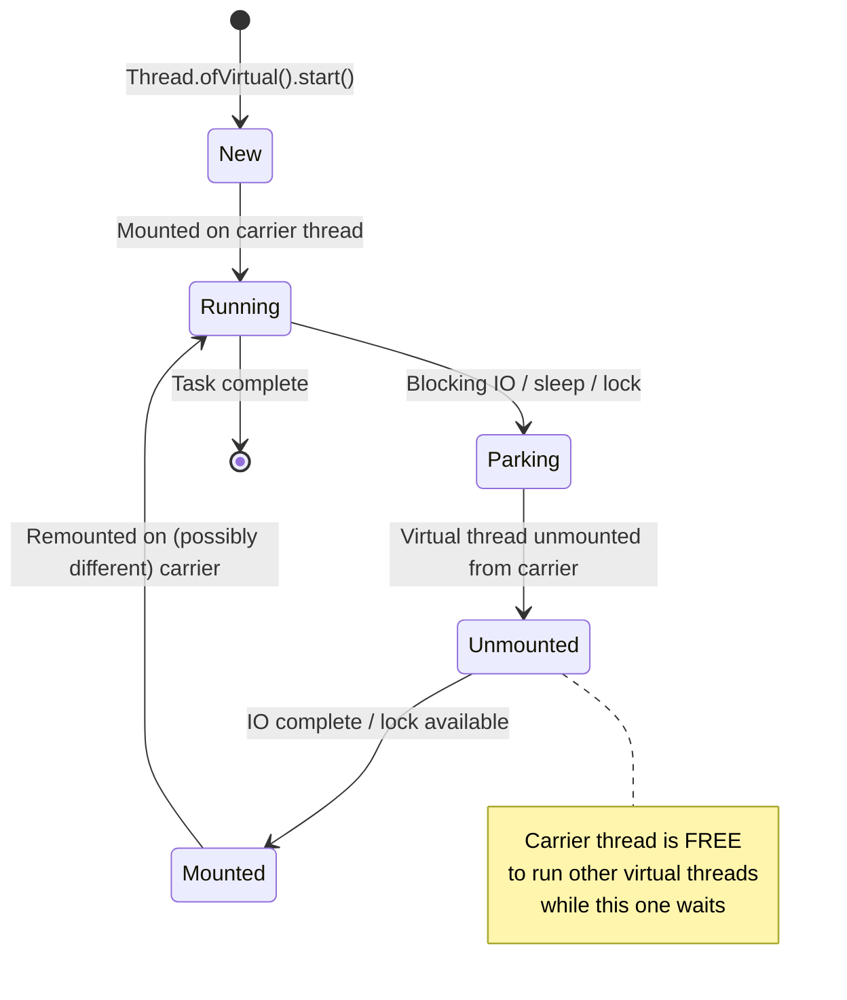
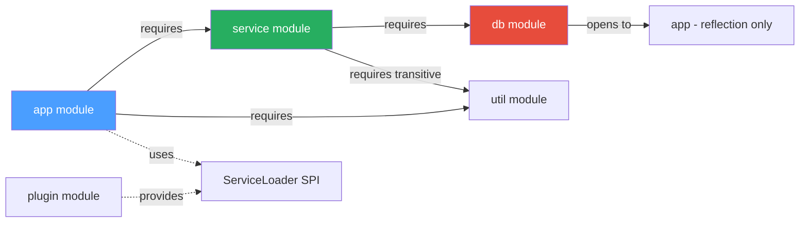

# Virtual Threads and Modules

## TL;DR

**Virtual threads** (Java 21, Project Loom) are lightweight JVM-managed threads — not bound 1:1 to OS threads. Carrier threads (platform threads from a small fork-join pool) mount and unmount virtual threads; blocking IO suspends the virtual thread but does NOT block the carrier thread, enabling millions of concurrent tasks. **JPMS** (Java 9, `module-info.java`) adds module-level encapsulation: `requires` (dependencies), `exports` (public API surface), `opens` (reflection access), `uses`/`provides` (ServiceLoader). Both features solve scalability problems at different levels: virtual threads address concurrency throughput; JPMS addresses large-scale code organization and security.

---

## Intuition

| Analogy | Concept |
|---------|---------|
| A supermarket with many shoppers but few cashiers — each shopper mounts a cashier only when actively being served, freeing the cashier to serve others while a shopper waits at the deli counter | Virtual threads — OS threads (cashiers) are shared across many virtual threads (shoppers); blocking unmounts the virtual thread from the carrier |
| Fire doors between apartment blocks — a fire in one block cannot spread to another; residents in one block cannot walk into another without explicit permission | JPMS — modules cannot access each other's internals without explicit `exports`/`opens` declarations |

---

## How It Works

### Virtual Thread Lifecycle



### JPMS Module Graph



---

### Virtual Threads — Code Examples

```java
import java.util.concurrent.*;
import java.util.stream.*;

public class VirtualThreadExamples {

    // 1. Start a single virtual thread
    public static void basicVirtualThread() throws InterruptedException {
        Thread vt = Thread.ofVirtual()
            .name("my-virtual-thread")
            .start(() -> {
                System.out.println("Running in: " + Thread.currentThread());
                System.out.println("Is virtual: " + Thread.currentThread().isVirtual()); // true
            });
        vt.join();
    }

    // 2. Virtual thread per task executor — the recommended pattern for IO-bound work
    public static void virtualThreadExecutor() throws Exception {
        try (ExecutorService executor = Executors.newVirtualThreadPerTaskExecutor()) {
            // Submit 10,000 tasks — each gets its own virtual thread (no pool sizing needed)
            List<Future<String>> futures = IntStream.range(0, 10_000)
                .mapToObj(i -> executor.submit(() -> {
                    Thread.sleep(100); // blocks virtual thread, NOT carrier thread
                    return "Result-" + i;
                }))
                .toList();

            for (Future<String> f : futures) {
                System.out.println(f.get());
            }
        } // executor.close() waits for all tasks to complete
    }

    // 3. Platform thread pool vs virtual thread — throughput comparison
    public static void compareThroughput() throws Exception {
        int taskCount = 10_000;

        // Platform thread pool — limited by pool size and OS thread count
        try (ExecutorService pool = Executors.newFixedThreadPool(200)) {
            long start = System.currentTimeMillis();
            List<Future<?>> f = new ArrayList<>();
            for (int i = 0; i < taskCount; i++) {
                f.add(pool.submit(() -> Thread.sleep(50))); // 50ms blocking IO simulation
            }
            for (Future<?> future : f) future.get();
            System.out.println("Platform threads: " + (System.currentTimeMillis() - start) + "ms");
            // ~2500ms: 10000 tasks / 200 threads * 50ms each
        }

        // Virtual threads — carrier pool (default = CPU cores), but IO is non-blocking
        try (ExecutorService vPool = Executors.newVirtualThreadPerTaskExecutor()) {
            long start = System.currentTimeMillis();
            List<Future<?>> f = new ArrayList<>();
            for (int i = 0; i < taskCount; i++) {
                f.add(vPool.submit(() -> Thread.sleep(50)));
            }
            for (Future<?> future : f) future.get();
            System.out.println("Virtual threads: " + (System.currentTimeMillis() - start) + "ms");
            // ~50ms: all 10000 tasks overlap; carriers not blocked during sleep
        }
    }

    // 4. WRONG: Pooling virtual threads defeats the purpose
    // Never do this:
    // ExecutorService pool = Executors.newFixedThreadPool(100, Thread.ofVirtual().factory());
    // Virtual threads are cheap — create one per task, don't pool them
}
```

---

### Pinning — The Key Pitfall

```java
import java.util.concurrent.locks.ReentrantLock;

public class PinningExamples {

    private static final Object MONITOR = new Object();
    private static final ReentrantLock LOCK = new ReentrantLock();

    // BAD: synchronized block PINS the virtual thread to its carrier
    // The carrier thread is blocked until the synchronized block exits
    public static void pinnedSynchronized() throws InterruptedException {
        Thread.ofVirtual().start(() -> {
            synchronized (MONITOR) {          // virtual thread PINNED here
                Thread.sleep(1000);           // carrier thread blocked for 1 second
            }
        }).join();
    }

    // GOOD: ReentrantLock allows the virtual thread to unmount while waiting
    public static void unpinnedReentrantLock() throws InterruptedException {
        Thread.ofVirtual().start(() -> {
            LOCK.lock();
            try {
                Thread.sleep(1000);           // virtual thread UNMOUNTS, carrier is free
            } catch (InterruptedException e) {
                Thread.currentThread().interrupt();
            } finally {
                LOCK.unlock();
            }
        }).join();
    }

    // Diagnose pinning in production:
    // java -Djdk.tracePinnedThreads=full -jar myapp.jar
    // JVM prints a stack trace whenever a virtual thread pins to its carrier
}
```

---

### Structured Concurrency (Java 21 Preview)

```java
import java.util.concurrent.*;
import jdk.incubator.concurrent.StructuredTaskScope;

public class StructuredConcurrencyExamples {

    record UserData(String name) {}
    record OrderData(long id) {}
    record Response(UserData user, OrderData order) {}

    // Fetch user and orders in parallel; fail fast if either fails
    public static Response fetchUserAndOrders(long userId) throws Exception {
        try (var scope = new StructuredTaskScope.ShutdownOnFailure()) {
            // Fork two concurrent subtasks
            StructuredTaskScope.Subtask<UserData>  userTask  =
                scope.fork(() -> fetchUser(userId));
            StructuredTaskScope.Subtask<OrderData> orderTask =
                scope.fork(() -> fetchOrders(userId));

            scope.join();           // wait for both subtasks
            scope.throwIfFailed();  // propagate any exception

            // Both succeeded — results are available
            return new Response(userTask.get(), orderTask.get());
        }
        // scope closes here — any unfinished subtasks are cancelled
        // Lifetime of subtasks is bounded by the scope block
    }

    // ShutdownOnSuccess: returns first successful result, cancels others
    public static UserData fetchFromFastestSource(long userId) throws Exception {
        try (var scope = new StructuredTaskScope.ShutdownOnSuccess<UserData>()) {
            scope.fork(() -> fetchFromPrimaryDB(userId));
            scope.fork(() -> fetchFromCache(userId));
            scope.join();
            return scope.result(); // returns whichever finished first successfully
        }
    }

    // Stubs
    static UserData fetchUser(long id) throws Exception { return new UserData("Alice"); }
    static OrderData fetchOrders(long id) throws Exception { return new OrderData(id * 10); }
    static UserData fetchFromPrimaryDB(long id) throws Exception { Thread.sleep(200); return new UserData("Alice"); }
    static UserData fetchFromCache(long id) throws Exception { Thread.sleep(50); return new UserData("Alice"); }
}
```

---

### JPMS — module-info.java

```java
// module-info.java — placed at source root (src/main/java/module-info.java)
module com.myapp.service {

    // Dependencies on other modules
    requires java.sql;                          // JDK module for JDBC
    requires java.logging;                      // JDK module
    requires com.myapp.util;                    // internal module
    requires transitive com.myapp.api;          // transitive: consumers of THIS module also get com.myapp.api

    // Packages this module makes available to all other modules
    exports com.myapp.service.api;              // public API only
    exports com.myapp.service.dto;

    // Packages available ONLY to specific modules (targeted exports)
    exports com.myapp.service.internal to com.myapp.test;  // test module can see internals

    // Open packages for reflection (needed by Spring, Hibernate, Jackson)
    opens com.myapp.service.dto to com.fasterxml.jackson.databind;  // Jackson can reflect
    opens com.myapp.service.entity to org.hibernate.orm.core;       // Hibernate can reflect

    // ServiceLoader SPI — this module consumes a service interface
    uses com.myapp.plugin.Plugin;

    // This module provides an implementation of a service interface
    provides com.myapp.plugin.Plugin with com.myapp.service.DefaultPlugin;
}
```

```java
// Another module's module-info.java
module com.myapp.util {
    exports com.myapp.util.string;
    exports com.myapp.util.date;
    // Internal packages NOT exported — truly private at module level
}
```

---

### Multi-Module Maven Structure

```
my-project/
├── pom.xml                          (parent POM)
├── app-api/
│   ├── pom.xml
│   └── src/main/java/
│       ├── module-info.java         (module com.myapp.api { exports ...; })
│       └── com/myapp/api/...
├── app-service/
│   ├── pom.xml
│   └── src/main/java/
│       ├── module-info.java         (module com.myapp.service { requires com.myapp.api; ... })
│       └── com/myapp/service/...
└── app-main/
    ├── pom.xml
    └── src/main/java/
        ├── module-info.java         (module com.myapp.main { requires com.myapp.service; ... })
        └── com/myapp/main/Main.java
```

---

## Platform Thread vs Virtual Thread Comparison

| Aspect | Platform Thread | Virtual Thread |
|--------|----------------|----------------|
| Backing resource | OS thread (1:1) | JVM continuation (many:few carrier threads) |
| Memory per thread | ~1 MB stack | ~few KB (heap-allocated, grows dynamically) |
| Practical max concurrent | ~10,000 | ~millions |
| Creation cost | Expensive (OS syscall) | Cheap (heap allocation) |
| Blocking IO behavior | Blocks OS thread | Unmounts from carrier; carrier is freed |
| Synchronization (synchronized) | Blocks OS thread | Pins to carrier (bad!) — use ReentrantLock |
| CPU-bound work | Efficient | No improvement (same OS thread) |
| ThreadLocal | Supported | Supported but can leak; prefer ScopedValue (preview) |
| Pooling | Recommended (pool reuse) | Anti-pattern (create one per task) |
| Spring Boot support | Default | `spring.threads.virtual.enabled=true` (Boot 3.2+) |

---

## Key Concepts

### Virtual Thread Internals
Virtual threads are implemented using continuations — snapshots of a thread's call stack. When a virtual thread blocks, its continuation is serialized to heap and the carrier thread is released. When the blocking operation completes, the continuation is scheduled to resume on any available carrier thread. The carrier pool defaults to `Runtime.getRuntime().availableProcessors()` platform threads.

### Structured Concurrency
`StructuredTaskScope` (Java 21 incubator) enforces a structured lifetime: all forked subtasks must complete before the scope's `try` block exits. This prevents "thread leaks" and makes concurrency errors observable (either via `throwIfFailed()` or `result()`). The `ShutdownOnFailure` policy cancels remaining tasks if any fail; `ShutdownOnSuccess` returns the first success.

### JPMS Unnamed and Automatic Modules
Code on the `--class-path` is bundled into the **unnamed module**, which can read all named modules but exports nothing. JARs placed on the `--module-path` without a `module-info.java` become **automatic modules** — their name is derived from the JAR filename, they export all packages, and they require all modules. This enables incremental migration.

### Split Packages
A split package occurs when two modules each contain the same Java package. JPMS forbids this — the classloader cannot determine which module to load a class from. Common during migration from multi-JAR classpath setups. Resolution: merge the modules, or refactor packages to eliminate the split.

---

## Real-World Usage

- **Spring Boot 3.2+**: Enable virtual threads with `spring.threads.virtual.enabled=true`. Spring MVC and WebFlux (in servlet mode) automatically dispatch requests on virtual threads, enabling high concurrency without reactive programming.
- **JPMS in JDK**: The JDK itself is modularized (java.base, java.sql, java.logging, etc.); `--add-opens` is commonly needed to unlock JDK internals for frameworks like Hibernate and Spring that use reflection.
- **Virtual threads + JDBC**: Traditional JDBC is blocking. With virtual threads, thousands of concurrent DB queries run efficiently without a large connection pool — though the DB connection pool itself still limits parallelism.

---

## Common Pitfalls

1. **ThreadLocal values in virtual threads causing leaks** — virtual threads are created and destroyed frequently (one per task). `ThreadLocal` values are not garbage collected until the thread dies, but if code retains `ThreadLocal` values across virtual threads, you can accumulate stale state. Prefer `ScopedValue` (Java 21 preview) for per-task context.
2. **Synchronized blocks pinning virtual threads** — using `synchronized` for lock-based mutual exclusion inside virtual thread tasks pins the carrier thread, negating the concurrency benefit. Replace with `ReentrantLock`. Use `-Djdk.tracePinnedThreads=full` to find pinning sites.
3. **Pooling virtual threads** — creating a fixed pool of virtual threads via `Executors.newFixedThreadPool(N, Thread.ofVirtual().factory())` defeats the purpose. Virtual threads are cheap; use `newVirtualThreadPerTaskExecutor()` and let the JVM create one per task.
4. **JPMS split packages** — during migration, two JARs on the module path containing the same package name triggers `LayerInstantiationException`. Audit your dependency tree for package conflicts before enabling JPMS.

---

## Review Questions

1. A virtual thread executing a JDBC query blocks on `ResultSet.next()`. Describe step by step what happens at the JVM level — what is the carrier thread doing during that blocking call?
2. Your service uses `synchronized(this)` in a frequently-called method, and after enabling virtual threads you notice CPU utilization drops but throughput doesn't improve as expected. What is the likely cause, and how do you diagnose and fix it?
3. You have a library JAR with no `module-info.java` that you want to use in your JPMS-enabled project. What type of module is it, and what are its characteristics regarding package exports and module reads?

---

## Related Notes

- [[_MOC_Modern_Java|↑ Section MOC]]
- [[Modern_Language_Features]]
- [[Executors_and_CompletableFuture]]
- [[JIT_Compilation_and_Tuning]]

---
#Java #ModernJava #VirtualThreads #Loom #JPMS
