# Modern Java — Section Map of Content

This section covers Java's rapid evolution from Java 8 through Java 21 LTS: the language features that eliminate boilerplate (records, sealed classes, pattern matching, text blocks, switch expressions), the Java Time API that replaced `Date`/`Calendar`, virtual threads from Project Loom that fundamentally change how Java handles concurrency at scale, and the Java Platform Module System (JPMS) that adds real encapsulation between large-scale components.

---

## Concept Map

```mermaid
graph TD
    A[Modern Java] --> B[Language Features]
    A --> C[Java Time API]
    A --> D[Virtual Threads - Project Loom]
    A --> E[JPMS - Module System]

    B --> B1[Switch Expressions - Java 14]
    B --> B2[Text Blocks - Java 15]
    B --> B3[Pattern Matching instanceof - Java 16]
    B --> B4[Records - Java 16]
    B --> B5[Sealed Classes - Java 17]
    B --> B6[Pattern Matching Switch - Java 21]

    C --> C1[LocalDate / LocalTime / LocalDateTime]
    C --> C2[ZonedDateTime / OffsetDateTime]
    C --> C3[Instant - UTC epoch]
    C --> C4[Duration / Period]
    C --> C5[DateTimeFormatter - thread-safe]

    D --> D1[Thread.ofVirtual]
    D --> D2[Executors.newVirtualThreadPerTaskExecutor]
    D --> D3[Structured Concurrency - StructuredTaskScope]
    D --> D4[Carrier Thread - mount / unmount]
    D --> D5[Pinning - synchronized blocks]

    E --> E1[module-info.java]
    E --> E2[requires - dependencies]
    E --> E3[exports - public API surface]
    E --> E4[opens - reflection access]
    E --> E5[ServiceLoader - uses / provides]
```

---

## Learning Path

Recommended order for mastering modern Java:

1. **Switch Expressions and Text Blocks** (Java 14–15) — quick wins. These are purely syntactic improvements you can adopt immediately in any Java 14+ codebase.
2. **Pattern Matching instanceof** (Java 16) — remove all manual `instanceof` + cast patterns from your code. Simple but impactful.
3. **Records** (Java 16) — replace DTO classes, value objects, and data carriers. Understand what records can and cannot do (no inheritance, fields are final).
4. **Sealed Classes** (Java 17) — use with pattern matching switch to model closed type hierarchies exhaustively. The key for modeling ADT-style domain types.
5. **Java Time API** (Java 8, but still widely misused) — understand the `LocalDate` / `ZonedDateTime` / `Instant` split. Fix all `Date`/`Calendar`/`SimpleDateFormat` usages.
6. **Virtual Threads** (Java 21) — understand the threading model change, when virtual threads help (IO-bound), when they don't (CPU-bound), and what pinning is.
7. **JPMS** (Java 9+) — understand module-info.java for large projects; know how to handle unnamed modules and automatic modules during migration.

---

## Notes in This Section

| Note | Description | Difficulty |
|------|-------------|------------|
| [[Modern_Language_Features]] | Switch expressions, text blocks, records, sealed classes, pattern matching, Java Time API | Intermediate |
| [[Virtual_Threads_and_Modules]] | Project Loom virtual threads, structured concurrency, JPMS module system | Advanced |

---

## Key Questions

1. **How do virtual threads differ from platform threads?** Virtual threads are JVM-managed, not OS-managed. They use continuations to park/resume without blocking a native OS thread. The JVM has a small pool of carrier (platform) threads; virtual threads mount onto a carrier only when actively running. Blocking IO unmounts the virtual thread, freeing the carrier for other work. This allows millions of concurrent tasks at much lower memory cost than platform threads.

2. **What problem does JPMS solve?** Before JPMS, all code on the classpath could access any public class in any JAR — there was no module-level encapsulation. Internal implementation classes in libraries (or the JDK itself) could be used by anyone, making it impossible to change internals without breaking code. JPMS adds module declarations that explicitly list what each module exports (its public API) and what it requires, enabling true encapsulation and reliable configuration.

3. **Why prefer `DateTimeFormatter` over `SimpleDateFormat`?** `SimpleDateFormat` is **not thread-safe** — sharing a single instance across threads causes corrupt date parsing/formatting. `DateTimeFormatter` (Java 8+) is immutable and thread-safe. It also integrates with the new `java.time` type hierarchy, supports more patterns, and handles timezone/offset correctly via `withZone()`.

---

## Java Version Timeline

| Version | LTS | Key Features |
|---------|-----|-------------|
| Java 8 | Yes | Streams, Lambda, Optional, `java.time`, default methods |
| Java 9 | No | JPMS (modules), `var` (local inference preview), JShell |
| Java 11 | Yes | `var` in lambdas, `String.isBlank/strip`, `Files.readString` |
| Java 14 | No | Switch expressions (standard) |
| Java 15 | No | Text blocks (standard) |
| Java 16 | No | Records (standard), pattern matching `instanceof` (standard) |
| Java 17 | Yes | Sealed classes (standard); Spring Boot 3.x minimum |
| Java 21 | Yes | Virtual threads, structured concurrency, pattern matching switch, sequenced collections |
| Java 25 | Yes (upcoming) | Primitive types in patterns, value classes (Project Valhalla preview) |

---

## Key Relationships

| Modern Feature | Replaces / Improves | Synergy With |
|---------------|---------------------|-------------|
| Records | Manual DTO/value class boilerplate | Jackson (supported), Spring Data projections |
| Sealed classes + pattern switch | `if/else instanceof` chains | Domain modeling, visitor pattern |
| Virtual threads | Large thread pools for IO-bound work | Existing blocking IO code (no rewrite needed) |
| `DateTimeFormatter` | `SimpleDateFormat` | Jackson `JavaTimeModule`, Spring `@DateTimeFormat` |
| Text blocks | String concatenation for multipart strings | SQL, JSON, HTML templates in tests |

---

## Related Sections

- [[_MOC_Java_Concurrency]] — virtual threads integrate with `ExecutorService`; structured concurrency builds on `CompletableFuture` concepts
- [[_MOC_JVM_Memory]] — virtual thread stacks are heap-allocated, not native memory; understanding heap vs off-heap matters for tuning
