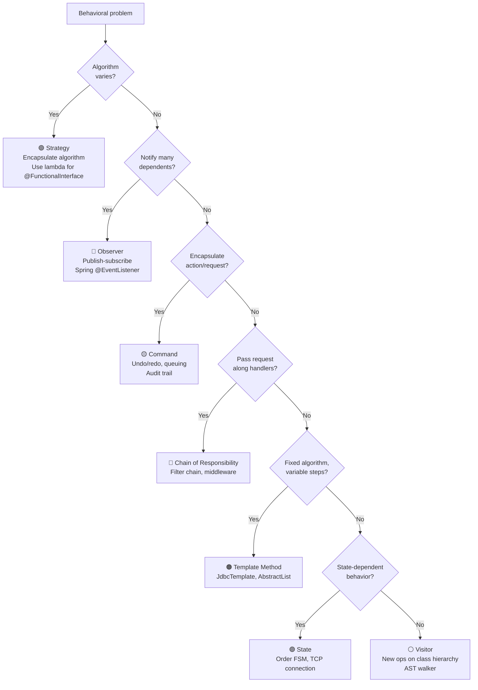

# Behavioral Patterns

## TL;DR

| Pattern | One-liner | Spring / Java Mapping |
|---------|-----------|----------------------|
| **Strategy** | Interchangeable algorithms — swap at runtime | `Comparator`, payment processors |
| **Observer** | Publish-subscribe — publisher notifies all subscribers | `ApplicationEvent`, `@EventListener` |
| **Command** | Encapsulate a request as an object (supports undo, queue, log) | `@Transactional`, undo/redo editors |
| **Chain of Responsibility** | Pass request along a chain of handlers until one handles it | Spring `SecurityFilterChain`, Servlet filters |
| **Template Method** | Skeleton algorithm in base class; variable steps in subclasses | `JdbcTemplate`, `AbstractController` |
| **State** | Behavior changes based on internal state (FSM) | `OrderState`, `ConnectionState` |
| **Visitor** | Add new operations to a class hierarchy without modifying it | AST walkers, serialization, reporting |

---

## Intuition

- **Strategy** = choose a GPS route. Same destination (result), different algorithms (fastest/shortest/scenic). Swap the route at runtime.
- **Observer** = YouTube subscription. When a channel uploads, all subscribers get notified automatically. The channel does not know who subscribed.
- **Command** = a written work order. You can write it, hand it to someone, put it in a queue, delay it, or throw it away. Unlike a phone call, it is an object.
- **Chain of Responsibility** = customer support escalation. Level 1 tries to help; can't → passes to Level 2; can't → passes to Level 3. Each level decides independently whether to handle or forward.
- **Template Method** = a cooking recipe. The recipe (base class) fixes the steps: prepare, cook, plate. But how each step is done (ingredients, technique) varies per dish (subclass).

---

## How It Works

### Pattern Selection Flowchart



---

### STRATEGY

```java
import java.util.*;

// Strategy as a functional interface — lambdas work directly
@FunctionalInterface
interface SortStrategy<T> {
    void sort(List<T> data);
}

// Context — holds a strategy and delegates to it
class DataSorter<T> {
    private SortStrategy<T> strategy;

    public DataSorter(SortStrategy<T> strategy) {
        this.strategy = strategy;
    }

    // Runtime swap — open/closed principle: add new strategy without changing DataSorter
    public void setStrategy(SortStrategy<T> strategy) {
        this.strategy = Objects.requireNonNull(strategy);
    }

    public void sort(List<T> data) {
        strategy.sort(data);
    }
}

// Strategies as lambdas (functional strategy — no need for separate classes)
SortStrategy<Integer> naturalOrder  = data -> Collections.sort(data);
SortStrategy<Integer> reverseOrder  = data -> data.sort(Comparator.reverseOrder());
SortStrategy<String>  byLength      = data -> data.sort(Comparator.comparingInt(String::length));

// Named strategy classes for complex algorithms
class TimSort<T extends Comparable<T>> implements SortStrategy<T> {
    public void sort(List<T> data) {
        Collections.sort(data); // Java's built-in TimSort
    }
}

// Usage:
List<Integer> numbers = new ArrayList<>(Arrays.asList(3, 1, 4, 1, 5, 9, 2, 6));
DataSorter<Integer> sorter = new DataSorter<>(naturalOrder);
sorter.sort(numbers);           // [1, 1, 2, 3, 4, 5, 6, 9]
sorter.setStrategy(reverseOrder);
sorter.sort(numbers);           // [9, 6, 5, 4, 3, 2, 1, 1]
```

---

### OBSERVER (with Spring Integration)

```java
// Custom event — extends ApplicationEvent to integrate with Spring
public class OrderPlacedEvent extends ApplicationEvent {
    private final Order order;

    public OrderPlacedEvent(Object source, Order order) {
        super(source);
        this.order = order;
    }

    public Order getOrder() { return order; }
}

// Publisher — does not know about its listeners
@Service
public class OrderService {
    private final ApplicationEventPublisher eventPublisher;

    public OrderService(ApplicationEventPublisher eventPublisher) {
        this.eventPublisher = eventPublisher;
    }

    @Transactional
    public Order placeOrder(OrderRequest req) {
        Order order = processOrder(req);
        // Publishes AFTER transaction commits (if using @TransactionalEventListener)
        eventPublisher.publishEvent(new OrderPlacedEvent(this, order));
        return order;
    }

    private Order processOrder(OrderRequest req) {
        return new Order(req.getProductId(), req.getQuantity());
    }
}

// Listener 1 — synchronous, same thread
@Component
public class EmailNotificationListener {
    @EventListener
    public void handleOrderPlaced(OrderPlacedEvent event) {
        System.out.println("Sending confirmation email for order: "
            + event.getOrder().getId());
    }
}

// Listener 2 — asynchronous, thread pool (requires @EnableAsync)
@Component
public class InventoryListener {
    @EventListener
    @Async
    public void handleOrderPlaced(OrderPlacedEvent event) {
        System.out.println("Reserving inventory for order: "
            + event.getOrder().getId());
    }
}

// Listener 3 — runs only AFTER transaction commits (prevents partial states)
@Component
public class AuditListener {
    @TransactionalEventListener(phase = TransactionPhase.AFTER_COMMIT)
    public void onOrderPlaced(OrderPlacedEvent event) {
        System.out.println("Audit log: order " + event.getOrder().getId() + " committed");
    }
}
```

---

### COMMAND

```java
import java.util.*;

// Command interface — every action is encapsulated with execute + undo
interface Command {
    void execute();
    void undo();
}

// Receiver — the actual logic lives here
class TextEditor {
    private final StringBuilder text = new StringBuilder();

    public void insertAt(int pos, String str) {
        text.insert(pos, str);
    }

    public void deleteAt(int start, int end) {
        text.delete(start, end);
    }

    public String getText() { return text.toString(); }
}

// Concrete command — encapsulates one operation
class InsertTextCommand implements Command {
    private final TextEditor editor;
    private final int position;
    private final String insertedText;

    public InsertTextCommand(TextEditor editor, int position, String text) {
        this.editor = editor;
        this.position = position;
        this.insertedText = text;
    }

    @Override
    public void execute() {
        editor.insertAt(position, insertedText);
    }

    @Override
    public void undo() {
        editor.deleteAt(position, position + insertedText.length());
    }
}

// Invoker — manages history for undo/redo
class CommandHistory {
    private final Deque<Command> undoStack = new ArrayDeque<>();
    private final Deque<Command> redoStack = new ArrayDeque<>();

    public void execute(Command cmd) {
        cmd.execute();
        undoStack.push(cmd);
        redoStack.clear(); // new action invalidates redo history
    }

    public void undo() {
        if (!undoStack.isEmpty()) {
            Command cmd = undoStack.pop();
            cmd.undo();
            redoStack.push(cmd);
        }
    }

    public void redo() {
        if (!redoStack.isEmpty()) {
            Command cmd = redoStack.pop();
            cmd.execute();
            undoStack.push(cmd);
        }
    }
}

// Usage:
// TextEditor editor = new TextEditor();
// CommandHistory history = new CommandHistory();
// history.execute(new InsertTextCommand(editor, 0, "Hello"));
// history.execute(new InsertTextCommand(editor, 5, " World"));
// editor.getText() → "Hello World"
// history.undo();
// editor.getText() → "Hello"
```

---

### TEMPLATE METHOD

```java
// Abstract base — defines the algorithm skeleton with final method
abstract class DataProcessor {
    // Template method — sealed algorithm structure, cannot be overridden
    public final void process(String source) {
        String raw       = readData(source);          // abstract — must implement
        String validated = validateData(raw);          // hook — optional override
        String processed = transformData(validated);   // abstract — must implement
        writeResult(processed);                        // abstract — must implement
    }

    // Abstract steps — subclasses must provide implementations
    protected abstract String readData(String source);
    protected abstract String transformData(String data);
    protected abstract void   writeResult(String result);

    // Hook method — default implementation, subclass may override
    protected String validateData(String data) {
        if (data == null || data.isBlank()) {
            throw new IllegalArgumentException("Data cannot be blank");
        }
        return data;
    }
}

// Concrete implementation 1
class CsvProcessor extends DataProcessor {
    @Override
    protected String readData(String source) {
        return "raw CSV from " + source;
    }

    @Override
    protected String transformData(String data) {
        return "Parsed CSV: " + data.toUpperCase();
    }

    @Override
    protected void writeResult(String result) {
        System.out.println("[CSV] " + result);
    }
}

// Concrete implementation 2 — overrides the hook
class JsonProcessor extends DataProcessor {
    @Override
    protected String readData(String source) {
        return "{\"source\": \"" + source + "\"}";
    }

    @Override
    protected String validateData(String data) {
        // Custom validation — must be valid JSON
        String base = super.validateData(data);
        if (!base.startsWith("{")) throw new IllegalArgumentException("Not JSON");
        return base;
    }

    @Override
    protected String transformData(String data) {
        return "Transformed JSON: " + data;
    }

    @Override
    protected void writeResult(String result) {
        System.out.println("[JSON] " + result);
    }
}

// Usage:
// new CsvProcessor().process("sales.csv");
// new JsonProcessor().process("api-response.json");
```

---

### CHAIN OF RESPONSIBILITY

```java
// Abstract handler — defines the chain structure
abstract class RequestHandler {
    private RequestHandler next;

    public RequestHandler setNext(RequestHandler next) {
        this.next = next;
        return next; // allows fluent chaining: auth.setNext(rateLimit).setNext(business)
    }

    public abstract void handle(Request request);

    protected void passToNext(Request request) {
        if (next != null) {
            next.handle(request);
        } else {
            System.out.println("No handler could process the request");
        }
    }
}

// Concrete handlers — each decides to handle or forward
class AuthenticationHandler extends RequestHandler {
    @Override
    public void handle(Request request) {
        if (request.hasValidToken()) {
            System.out.println("Auth OK for user: " + request.getUser());
            passToNext(request);
        } else {
            System.out.println("Authentication failed → 401 Unauthorized");
        }
    }
}

class RateLimitHandler extends RequestHandler {
    private final Map<String, Integer> requestCounts = new HashMap<>();
    private static final int MAX_REQUESTS_PER_MINUTE = 100;

    @Override
    public void handle(Request request) {
        String user = request.getUser();
        int count = requestCounts.merge(user, 1, Integer::sum);
        if (count <= MAX_REQUESTS_PER_MINUTE) {
            System.out.println("Rate limit OK: " + count + "/" + MAX_REQUESTS_PER_MINUTE);
            passToNext(request);
        } else {
            System.out.println("Rate limited → 429 Too Many Requests");
        }
    }
}

class BusinessLogicHandler extends RequestHandler {
    @Override
    public void handle(Request request) {
        System.out.println("Processing business logic for: " + request.getPath());
        // Actual business logic here
    }
}

// Build the chain:
// RequestHandler chain = new AuthenticationHandler();
// chain.setNext(new RateLimitHandler()).setNext(new BusinessLogicHandler());
// chain.handle(new Request("/api/orders", "Bearer token123", "alice"));
```

---

## Pattern Comparison Table

| Pattern | GoF Category | Key Java Usage | Lambda-Friendly? | Spring Equivalent | When to Use |
|---------|-------------|----------------|-----------------|------------------|-------------|
| Strategy | Behavioral | `Comparator`, `Predicate`, payment | Yes — `@FunctionalInterface` | `AuthenticationProvider` list | Algorithm varies; runtime swap needed |
| Observer | Behavioral | `PropertyChangeListener`, streams | Partial (listeners) | `@EventListener`, `ApplicationEvent` | One-to-many notification; decoupled events |
| Command | Behavioral | Button click handlers, batch jobs | Partial | `@Transactional` wrapper | Undo/redo, queuing, macro commands |
| Chain of Responsibility | Behavioral | `Filter`, logging handlers | No — order matters | `SecurityFilterChain`, Servlet `FilterChain` | Middleware; multiple potential handlers |
| Template Method | Behavioral | `AbstractList`, `JdbcTemplate` | No — uses inheritance | `JdbcTemplate.query()`, `RestTemplate` | Fixed skeleton, variable steps |
| State | Behavioral | `Thread.State`, `Order.Status` | No — state objects | Spring State Machine project | FSM; eliminating state-based if/else |
| Visitor | Behavioral | AST processors, serializers | No | Jackson `JsonSerializer` per type | New ops on stable hierarchy |

---

## Key Concepts

### Strategy: Composition Over Inheritance for Algorithms

Strategy replaces conditional dispatch (`if paymentType == CARD`) with polymorphism — the correct strategy is injected rather than switched on. In modern Java, any `@FunctionalInterface` is naturally a Strategy. Lambdas ARE strategies. This means `Comparator.comparing(User::getName).thenComparing(User::getAge)` is composing strategies. Use named strategy classes for complex algorithms that need their own state or tests.

### Observer: Push vs Pull Model

In the **push model**, the publisher sends all relevant data in the event object. In the **pull model**, the publisher sends only a reference, and subscribers fetch what they need. Spring uses push. Beware of **memory leaks**: if listeners hold references to the subject and are never unregistered, they (and everything they reference) cannot be garbage collected. Use `WeakReference`-based listener lists or explicit unsubscription (`removeListener()`).

### Command: Enabling Undo, Queuing, and Audit

The command pattern is powerful because requests become first-class objects. You can: store them in a history stack for undo/redo; serialize them for remote execution; put them in a queue with priority ordering; log them to a database for audit trails; retry them on failure. Spring's `@Transactional` is conceptually a command wrapper — it wraps the method invocation and manages commit/rollback.

### Chain of Responsibility: Order Matters

Unlike Observer (all listeners run), Chain stops when a handler handles the request. Order is critical: authenticate before rate-limit; rate-limit before business logic. Spring Security's `FilterChain` is a classic Chain implementation — adding a filter at the wrong position causes security holes. Each handler in the chain should have a single responsibility, following the Single Responsibility Principle.

### Template Method: Hollywood Principle

"Don't call us, we'll call you." The base class calls the overridden steps at the right time — subclasses don't drive the flow. `JdbcTemplate.query(sql, rowMapper)` is a template method: the template handles connection lifecycle, exception translation, and resource cleanup; you supply only the `RowMapper` callback (hook). Avoid calling overridable methods from constructors — the subclass constructor has not run yet when the parent constructor executes.

### State: Replacing State-Based Switch Statements

When behavior changes significantly based on state (Order: PLACED → PAID → SHIPPED → DELIVERED → RETURNED), State pattern replaces a large `switch(state)` in every method with dedicated State objects. Each state knows its valid transitions. `Thread` in Java uses State internally (`Thread.State` enum + OS-level state objects). The Spring State Machine project provides a full framework implementation.

### Visitor: Double Dispatch

The Visitor pattern solves a specific problem: you have a stable class hierarchy (AST nodes, document elements) and want to add new operations frequently. Without Visitor, adding `prettyPrint()` means modifying every class in the hierarchy. With Visitor: `element.accept(visitor)` calls `visitor.visit(this)` (double dispatch). The tradeoff: adding new element types requires updating all visitors. Choose Visitor when operations are unstable but elements are stable.

---

## Real-World Spring Connections

- **Spring Security `FilterChain`** = Chain of Responsibility (authentication → authorization → CSRF → CORS → business)
- **Spring `@EventListener` / `ApplicationEvent`** = Observer pattern (loose coupling between services)
- **`JdbcTemplate.query()` / `execute()`** = Template Method (framework controls JDBC lifecycle, you provide callbacks)
- **`@Transactional` AOP proxy** = Command pattern (wraps method invocation with transaction management)
- **`Comparator.comparing()`** = Strategy pattern (sorting algorithm is pluggable)
- **Spring Security `AuthenticationManager.authenticate()`** = Chain of Responsibility (tries each `AuthenticationProvider` in order)
- **Jackson `JsonSerializer`** = Visitor-like (different serialization per type)

---

## Common Pitfalls

1. **Observer memory leak**: Registering listeners without ever removing them causes the subject to hold references, preventing GC. Use `WeakReference` for listeners, or ensure explicit unsubscription in `@PreDestroy`. In Spring, `@EventListener` beans are managed so this is less of an issue.
2. **Command without undo when undo is needed later**: Retrofitting undo into a command that does not store pre-execution state requires rethinking. Design commands with undo from the start — store the inverse operation state in the constructor.
3. **Strategy class proliferation**: Creating 20 strategy classes for simple one-liner algorithms adds noise. Prefer lambdas for `@FunctionalInterface` strategies; use named classes only when the strategy has complex state or its own test coverage.
4. **Template Method calling overridable methods from constructor**: If the base constructor calls `validateData()` and the subclass overrides it, the override runs before the subclass fields are initialized — a classic NullPointerException source. Finalize initialization in a separate `init()` method.
5. **Chain of Responsibility with no default handler**: If no handler processes the request and you do not have a fallback, the request silently disappears. Always implement a final catch-all handler or throw a meaningful exception.

---

## Review Questions

1. Explain the difference between Strategy and Template Method. When would you prefer one over the other? Give a concrete example of each in a Spring application.
2. A Spring `@EventListener` can cause a memory leak if used improperly. When does this happen and how do you prevent it? What is the difference between `@EventListener` and `@TransactionalEventListener`?
3. Implement a simple Chain of Responsibility for HTTP request validation: check that (a) the request has a valid `Content-Type` header, (b) the payload is under 1MB, (c) the user has the required role. How would you build and chain the handlers?

---

## Related

- [[_MOC_Design_Patterns|↑ Section MOC]]
- [[Creational_Patterns]]
- [[Structural_Patterns]]
- [[SOLID_Principles]]
- [[_MOC_Java_OOP]]

#Java #DesignPatterns #Behavioral
