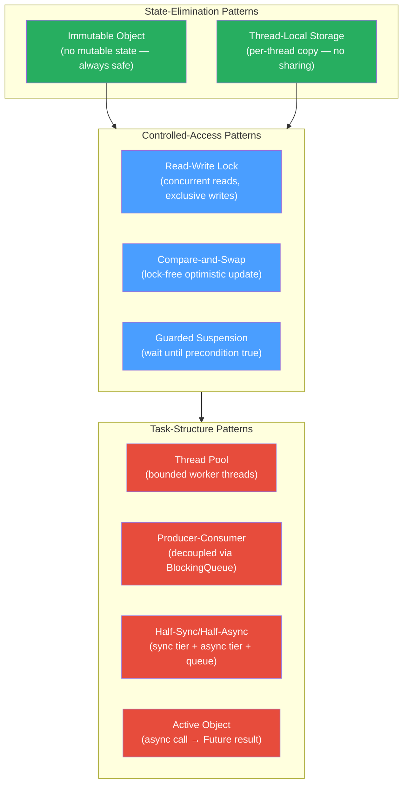

# 🔀 Concurrency Design Patterns in Java

> [!abstract] TL;DR
> Concurrency patterns are proven solutions to recurring thread-safety problems. The core insight: **eliminate shared mutable state where possible** (Immutable Object, Thread-Local Storage) and **serialize access to it where necessary** (Read-Write Lock, Compare-and-Swap, Guarded Suspension). Higher-level patterns (Thread Pool, Producer-Consumer, Active Object) structure how concurrent tasks are created and coordinated. Anti-patterns — nested locking and shared mutable state without synchronization — are the root cause of the majority of production threading bugs.

---

## Intuition — the Office Building Analogy

- **Thread Pool** = a building with a fixed number of desks. When a task (visitor) arrives, a free desk (thread) handles them. No new desks are built per visitor — the pool is reused. Visitors queue if all desks are busy.
- **Producer-Consumer** = a mail room (queue) between the mail sorters (producers) and the delivery drivers (consumers). Neither group needs to know when the other is working.
- **Read-Write Lock** = a library reading room. Many readers may sit simultaneously; a writer must wait for everyone to leave, then gets the room alone.
- **Immutable Object** = a printed book in a library. Once printed, no one can change it — everyone reads their own copy safely without locking.
- **Compare-and-Swap** = an optimistic checkout at the library: check the book in if the return-stamp matches what you read; retry if someone else stamped it in the meantime.
- **Active Object** = a receptionist who takes your request, gives you a ticket (Future), and later delivers the result asynchronously — the receptionist (actor's thread) processes requests one at a time from their own queue.

---

## How It Works



---

## Key Concepts / Details

### Thread Pool Pattern

```java
// ── Thread Pool: reuse a bounded set of worker threads ───────────────────────
// Creating OS threads is expensive (~1 MB stack, kernel structures).
// A pool creates N threads once and reuses them for M tasks (M >> N).

import java.util.concurrent.*;

// Fixed pool: always N threads, unbounded queue (be careful of OOM)
ExecutorService fixed = Executors.newFixedThreadPool(
    Runtime.getRuntime().availableProcessors()  // CPU-bound: #cores
);

// Custom ThreadPoolExecutor: explicit control over all parameters
ThreadPoolExecutor pool = new ThreadPoolExecutor(
    4,                                     // corePoolSize: always-alive threads
    8,                                     // maximumPoolSize: max threads under load
    60, TimeUnit.SECONDS,                  // keepAliveTime for idle threads above core
    new ArrayBlockingQueue<>(200),         // work queue: BOUNDED → back-pressure
    new ThreadFactory() {
        int n = 0;
        public Thread newThread(Runnable r) {
            Thread t = new Thread(r, "worker-" + n++);
            t.setDaemon(false);
            return t;
        }
    },
    new ThreadPoolExecutor.CallerRunsPolicy() // rejection: caller thread executes the task
    // Alternatives: AbortPolicy (throw), DiscardPolicy (silently drop), DiscardOldestPolicy
);

// Pool sizing heuristics:
//   CPU-bound:  N = availableProcessors()  (no I/O waiting → keep cores busy)
//   I/O-bound:  N = availableProcessors() * (1 + wait_time / compute_time)
//               e.g., 50% I/O waiting: N = cores * 2
//   Virtual threads (Java 21+): just use newVirtualThreadPerTaskExecutor()

// Graceful shutdown
pool.shutdown();                            // stop accepting; finish queued tasks
boolean done = pool.awaitTermination(30, TimeUnit.SECONDS);
if (!done) pool.shutdownNow();             // interrupt remaining workers
```

### Producer-Consumer (BlockingQueue)

```java
// ── Producer-Consumer: decouple producers from consumers via a queue ──────────
// Producers do not block on consumers; consumers do not poll; the queue absorbs bursts.
// See Concurrent_Data_Structures.md for BlockingQueue variants.

public class ImageProcessingPipeline {
    private static final int QUEUE_CAPACITY = 100;
    private final BlockingQueue<Path> inputQueue = new ArrayBlockingQueue<>(QUEUE_CAPACITY);
    private final BlockingQueue<BufferedImage> outputQueue = new ArrayBlockingQueue<>(QUEUE_CAPACITY);
    private volatile boolean loadingDone = false;

    // Stage 1: Load raw files onto the queue
    private void fileLoader(List<Path> files) {
        try {
            for (Path p : files) inputQueue.put(p);   // back-pressure if stage 2 is slow
        } catch (InterruptedException e) {
            Thread.currentThread().interrupt();
        } finally {
            loadingDone = true;
        }
    }

    // Stage 2: Decode and transform
    private void imageDecoder() {
        try {
            while (!loadingDone || !inputQueue.isEmpty()) {
                Path path = inputQueue.poll(100, TimeUnit.MILLISECONDS);
                if (path != null) {
                    BufferedImage img = ImageIO.read(path.toFile());
                    outputQueue.put(applyFilters(img));
                }
            }
        } catch (InterruptedException | IOException e) {
            Thread.currentThread().interrupt();
        }
    }

    // Stage 3: Encode and write output
    private void imageWriter() {
        try {
            while (!outputQueue.isEmpty() || /* stage2 still running */ true) {
                BufferedImage img = outputQueue.poll(100, TimeUnit.MILLISECONDS);
                if (img != null) writeToFile(img);
            }
        } catch (InterruptedException e) {
            Thread.currentThread().interrupt();
        }
    }
}
```

### Read-Write Lock

```java
// ── ReentrantReadWriteLock: concurrent reads, exclusive writes ────────────────
import java.util.concurrent.locks.ReentrantReadWriteLock;
import java.util.concurrent.locks.StampedLock;

public class CachedConfig {
    private final Map<String, String> cache = new HashMap<>();
    private final ReentrantReadWriteLock rwLock = new ReentrantReadWriteLock();
    private final ReentrantReadWriteLock.ReadLock  readLock  = rwLock.readLock();
    private final ReentrantReadWriteLock.WriteLock writeLock = rwLock.writeLock();

    // Many threads can read simultaneously
    public String get(String key) {
        readLock.lock();
        try {
            return cache.get(key);         // shared read: multiple threads here concurrently
        } finally {
            readLock.unlock();
        }
    }

    // Only one thread writes; all readers must finish first
    public void put(String key, String value) {
        writeLock.lock();
        try {
            cache.put(key, value);         // exclusive write: all readers wait
        } finally {
            writeLock.unlock();
        }
    }

    // Lock upgrade (read → write) requires releasing read lock first:
    public String computeIfAbsent(String key, Supplier<String> loader) {
        readLock.lock();
        try {
            String v = cache.get(key);
            if (v != null) return v;
        } finally {
            readLock.unlock();   // release read lock before acquiring write lock
        }
        writeLock.lock();        // check-then-act: may need to re-check after upgrade
        try {
            return cache.computeIfAbsent(key, k -> loader.get());
        } finally {
            writeLock.unlock();
        }
    }
}


// ── StampedLock: optimistic read (fastest, no lock contention) ───────────────
public class OptimisticPoint {
    private final StampedLock sl = new StampedLock();
    private double x, y;

    public double distanceFromOrigin() {
        long stamp = sl.tryOptimisticRead(); // no lock acquired — fastest path
        double cx = x, cy = y;
        if (!sl.validate(stamp)) {           // check if a write occurred during read
            stamp = sl.readLock();           // fall back to real read lock
            try { cx = x; cy = y; }
            finally { sl.unlockRead(stamp); }
        }
        return Math.sqrt(cx * cx + cy * cy);
    }

    public void move(double dx, double dy) {
        long stamp = sl.writeLock();
        try { x += dx; y += dy; }
        finally { sl.unlockWrite(stamp); }
    }
}
```

### Immutable Object

```java
// ── Immutable Object: thread-safe by design, no synchronization needed ────────
// All fields final, no setters, defensive copies of mutable inputs/outputs

import java.util.Collections;
import java.util.List;

public final class FlightRoute {              // final: no subclass can add mutability
    private final String origin;
    private final String destination;
    private final List<String> stops;        // defensive copy of mutable input

    public FlightRoute(String origin, String destination, List<String> stops) {
        this.origin      = Objects.requireNonNull(origin);
        this.destination = Objects.requireNonNull(destination);
        this.stops       = List.copyOf(stops); // Java 10+ unmodifiable copy
    }

    public String getOrigin()      { return origin; }
    public String getDestination() { return destination; }
    public List<String> getStops() { return stops; }  // already unmodifiable

    // "Modification" returns a NEW instance — original unchanged
    public FlightRoute withAdditionalStop(String stop) {
        List<String> newStops = new ArrayList<>(stops);
        newStops.add(stop);
        return new FlightRoute(origin, destination, newStops);
    }
}

// Immutable collections (Java 9+): unmodifiable and safely shareable
List<String> immutableList = List.of("A", "B", "C");  // throws on add/remove
Map<String, Integer>  immutableMap  = Map.of("k1", 1, "k2", 2);
Set<String>           immutableSet  = Set.of("X", "Y");

// Collections.unmodifiableList: wrapper, NOT a copy — original can still be mutated
List<String> original  = new ArrayList<>(List.of("A", "B"));
List<String> view      = Collections.unmodifiableList(original);
original.add("C");     // original mutated
System.out.println(view); // [A, B, C] — the "unmodifiable" view reflects the change!
// Use List.copyOf() or List.of() for true immutability
```

### Guarded Suspension

```java
// ── Guarded Suspension: wait until a precondition is true ────────────────────
// Modern style: use Lock + Condition instead of raw wait/notify

import java.util.concurrent.locks.*;

public class TransferQueue<T> {
    private final Queue<T>      queue    = new LinkedList<>();
    private final int           capacity;
    private final Lock          lock     = new ReentrantLock();
    private final Condition     notFull  = lock.newCondition();
    private final Condition     notEmpty = lock.newCondition();

    public TransferQueue(int capacity) { this.capacity = capacity; }

    public void put(T item) throws InterruptedException {
        lock.lock();
        try {
            while (queue.size() == capacity) {
                notFull.await();      // release lock + suspend; re-acquire on wake
            }
            queue.add(item);
            notEmpty.signal();        // wake one waiting consumer (more precise than signalAll)
        } finally {
            lock.unlock();
        }
    }

    public T take() throws InterruptedException {
        lock.lock();
        try {
            while (queue.isEmpty()) {
                notEmpty.await();
            }
            T item = queue.poll();
            notFull.signal();         // wake one waiting producer
            return item;
        } finally {
            lock.unlock();
        }
    }
}
// Advantage over wait/notify: separate Conditions for "not full" and "not empty"
// — only relevant waiters are woken (avoid thundering herd on notifyAll)
```

### Half-Sync/Half-Async

```java
// ── Half-Sync/Half-Async: sync tier processes async requests via a queue ──────
// Web servers use this: async I/O accepts connections (async tier),
// hands them to a thread pool (sync tier) via a request queue.

// Simplified model:
public class HalfSyncHalfAsync {
    private final BlockingQueue<Request>  requestQueue = new ArrayBlockingQueue<>(500);
    private final ExecutorService         syncWorkers  = Executors.newFixedThreadPool(8);

    // ASYNC TIER: non-blocking I/O callback (e.g., NIO Selector, Netty event loop)
    // Runs on a single thread; just enqueues work — no blocking I/O here
    public void onNetworkDataReceived(Request req) {
        if (!requestQueue.offer(req)) {
            req.respondServiceUnavailable(); // back-pressure: queue full
        }
    }

    // SYNC TIER: blocking worker threads dequeue and process
    public void startWorkers() {
        for (int i = 0; i < 8; i++) {
            syncWorkers.submit(() -> {
                while (!Thread.interrupted()) {
                    try {
                        Request req = requestQueue.take(); // blocks until work arrives
                        processRequest(req);               // safe to block here
                    } catch (InterruptedException e) {
                        Thread.currentThread().interrupt();
                    }
                }
            });
        }
    }
}
// This is the architecture of Tomcat (NIO connector + thread pool), Netty, and Vert.x
```

### Active Object

```java
// ── Active Object: async method calls with Future result ─────────────────────
// The "active object" has its own thread and a work queue.
// Callers submit requests and receive a Future; the active object processes sequentially.
// Prevents concurrent access to the object's internal state.

public class ActiveDatabase {
    private final ExecutorService executor = Executors.newSingleThreadExecutor(
        r -> new Thread(r, "db-active-object")
    );
    // Underlying DB connection — only accessed by executor's single thread (thread-safe)
    private final Connection connection;

    public ActiveDatabase(Connection connection) { this.connection = connection; }

    // Public API: submit to single-threaded executor → inherently serialized
    public Future<List<User>> findUsers(String query) {
        return executor.submit(() -> {
            // This runs on db-active-object thread — no concurrent access to connection
            PreparedStatement ps = connection.prepareStatement(query);
            return mapResults(ps.executeQuery());
        });
    }

    public Future<Void> updateUser(User user) {
        return executor.submit(() -> {
            connection.prepareStatement("UPDATE ...").executeUpdate();
            return null;
        });
    }

    public void shutdown() { executor.shutdown(); }
}

// Caller: non-blocking submission
ActiveDatabase db = new ActiveDatabase(conn);
Future<List<User>> future = db.findUsers("SELECT * FROM users");
// ... do other work ...
List<User> users = future.get(); // block only when result actually needed
```

### Thread-Local Storage

```java
// ── ThreadLocal: per-thread variable, no sharing ─────────────────────────────
// Each thread gets its own independent copy. No synchronization needed.
// See Threads_and_Synchronization.md for full details.

// ScopedValue (Java 21+): immutable, structured, preferred for virtual threads
import jdk.incubator.concurrent.ScopedValue;

static final ScopedValue<Locale> LOCALE = ScopedValue.newInstance();

void handleRequest(String lang) {
    ScopedValue.where(LOCALE, Locale.forLanguageTag(lang)).run(() -> {
        renderPage();  // can call LOCALE.get() anywhere in the call tree
    });
}
```

### Compare-and-Swap (CAS) — Lock-Free Updates

```java
// ── AtomicInteger: CAS-based lock-free counter ────────────────────────────────
import java.util.concurrent.atomic.*;

AtomicInteger counter = new AtomicInteger(0);
counter.incrementAndGet();                  // atomic i++; returns new value
counter.getAndAdd(5);                       // atomic +=5; returns old value
counter.compareAndSet(10, 20);              // CAS: if value==10, set to 20; returns boolean

// Custom CAS loop (when built-in methods aren't enough)
public void multiplyBy(AtomicInteger ref, int factor) {
    int current, next;
    do {
        current = ref.get();
        next    = current * factor;
    } while (!ref.compareAndSet(current, next)); // retry if another thread changed current
}

// ── LongAdder: high-concurrency counter (better than AtomicLong under contention) ──
// LongAdder maintains per-CPU-stripe accumulators; sum() combines them
// Lower CAS contention at the cost of a more complex sum operation
LongAdder hits = new LongAdder();
hits.increment();         // fast under high concurrency (each thread hits its own stripe)
long total = hits.sum();  // reads and sums all stripes — slightly more expensive

// Use AtomicLong when you need a single consistent value at read time
// Use LongAdder for counters that are read infrequently but updated often

// ── AtomicReference: CAS on object reference ─────────────────────────────────
AtomicReference<String> ref = new AtomicReference<>("v1");
ref.compareAndSet("v1", "v2");  // update only if still "v1"

// ABA problem: CAS sees "A → B → A" as unchanged
// Fix: AtomicStampedReference carries a version stamp alongside the value
AtomicStampedReference<String> stamped = new AtomicStampedReference<>("A", 0);
int[] stampHolder = new int[1];
String val = stamped.get(stampHolder);     // val="A", stampHolder[0]=0
stamped.compareAndSet("A", "B", 0, 1);    // sets to "B" with stamp 1
stamped.compareAndSet("B", "A", 1, 2);    // sets back to "A" with stamp 2
stamped.compareAndSet("A", "X", 0, 3);    // FAILS: stamp mismatch (0 != 2)
```

### Anti-Patterns Table

| Anti-Pattern | Description | Fix |
|---|---|---|
| Shared mutable state without sync | Two threads read-modify-write the same variable | `synchronized`, `AtomicXxx`, or immutable design |
| Nested locking (lock ordering violation) | `lock(A)→lock(B)` and `lock(B)→lock(A)` → deadlock | Enforce global lock ordering by stable ID |
| Holding locks during I/O | `synchronized` around network/DB call → starves other threads | Use `ReentrantLock`; unlock before I/O |
| `notify()` when `notifyAll()` needed | Wakes wrong waiter; correct waiter stays suspended | Use `notifyAll()` or separate `Condition` objects |
| `if` instead of `while` for `wait()` | Spurious wakeup → proceed with invalid state | Always use `while (condition) { wait(); }` |
| ThreadLocal leak in thread pool | Previous request's data seen by next request | Always `threadLocal.remove()` in `finally` |
| Double-Checked Locking without volatile | Partially constructed object visible to other threads | Declare the field `volatile` |
| Calling overridable method from constructor | Subclass method runs before subclass fields initialized | Don't; or make the class final/method private |

---

## Real-World Notes

- **Tomcat's NIO connector** is the canonical Half-Sync/Half-Async implementation: one or two `Selector` threads accept connections, then hand them off to the `Executor` thread pool for request processing.
- **Spring `@Async`** + `CompletableFuture` is the most common Active Object implementation in Spring apps — methods tagged `@Async` run on a separate `ThreadPoolTaskExecutor`, returning a `Future` or `CompletableFuture` to the caller.
- **Akka actors** are the full Active Object pattern at scale — each actor has a mailbox (queue) and processes messages sequentially on a thread pool.
- **`LongAdder` vs `AtomicLong`**: In a benchmark of 16 threads hammering a counter, `LongAdder.increment()` is 5–10x faster than `AtomicLong.incrementAndGet()` under high contention because each thread updates its own cell.
- **`StampedLock` vs `ReentrantReadWriteLock`**: `StampedLock` is faster (no reentrancy, pure CAS) but does not support condition variables or reentrancy. Use `StampedLock` for high-read-throughput data structures without complex waiting logic.

---

## Common Pitfalls

1. **Nested locks without ordering**: The single most common deadlock cause. Always acquire multiple locks in the same global order — sort by `System.identityHashCode(obj)` if no natural key exists.

2. **`synchronized` on `this` in a public class**: External code can also `synchronized(yourObject)` and create unexpected lock contention or deadlock. Prefer a private final `Object lock = new Object()` to prevent external interference.

3. **Double-checked locking without `volatile`**:
   ```java
   // BROKEN — JIT may reorder constructor write before reference assignment
   if (instance == null) { synchronized(lock) { if (instance == null) instance = new Heavy(); } }
   // FIX: declare field as `private static volatile Heavy instance;`
   ```

4. **CAS spin under high contention**: A CAS retry loop on a highly contested `AtomicInteger` degenerates to O(N²) work as all threads spin simultaneously. Use `LongAdder` for counters or a queue-based `ReentrantLock` for complex critical sections.

5. **`ThreadLocal` with inheritance**: `InheritableThreadLocal` copies values to child threads at creation time — values diverge afterward. If a child thread modifies its copy, the parent doesn't see it. Use `ScopedValue` (Java 21) for structured propagation.

---

## Related Concepts

- [[Threads_and_Synchronization]] — JMM, wait/notify, synchronized fundamentals
- [[Concurrent_Data_Structures]] — BlockingQueue, CopyOnWriteArrayList, Phaser
- [[Concurrent_Utilities]] — ReentrantLock, CountDownLatch, Semaphore, CyclicBarrier
- [[Virtual_Threads_Java21]] — virtual threads complement many of these patterns
- [[Enterprise_Patterns]] — Active Object / Domain Events connect to application architecture
- [[_MOC_Design_Patterns|↑ Section MOC]]

---

## Review Questions

1. Explain the Double-Checked Locking anti-pattern: why is it broken without `volatile`, and how does the Java Memory Model allow the bug to manifest?

2. Compare `ReentrantReadWriteLock` and `StampedLock` for a read-heavy cache. When would you choose each, and what limitation of `StampedLock` rules it out in certain scenarios?

3. Describe the Active Object pattern. How does it achieve thread safety without explicit locking, and how is it implemented with a `SingleThreadExecutor` in Java?

---

## Sources

- Brian Goetz — Java Concurrency in Practice (2006), Chapters 10–13
- Doug Schmidt — Pattern-Oriented Software Architecture Vol. 2 (POSA2), Concurrency Patterns
- Java SE 21 API — `java.util.concurrent.atomic`: https://docs.oracle.com/en/java/docs/api/java.base/java/util/concurrent/atomic/package-summary.html

#Java #DesignPatterns #Concurrency #ThreadPool #ImmutableObject #CAS #ReadWriteLock #ActiveObject
