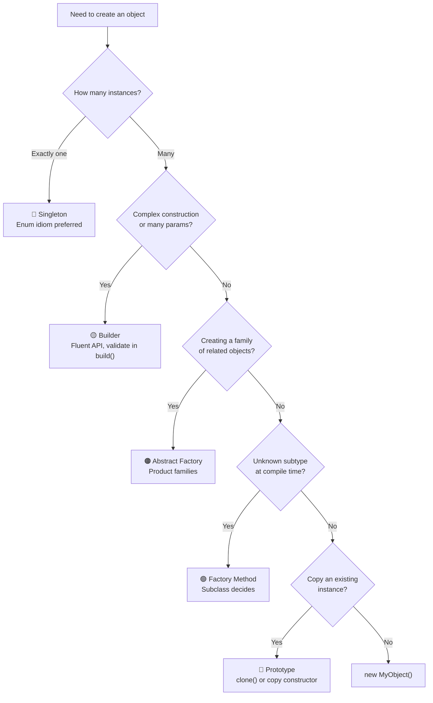

# Creational Patterns

## TL;DR

| Pattern | One-liner | Spring mapping |
|---------|-----------|---------------|
| **Singleton** | One and only one instance; enum idiom is thread-safe, serialization-safe, and reflection-safe | Spring beans are Singleton scope by default |
| **Factory Method** | Subclass decides which concrete type to instantiate; decouples client from implementation | `BeanFactory`, `@Bean` methods |
| **Abstract Factory** | Creates families of related objects without specifying concrete classes | Spring auto-configuration conditions |
| **Builder** | Fluent step-by-step construction of complex objects; prevents telescoping constructors | Lombok `@Builder`; `UriComponentsBuilder` |
| **Prototype** | Clone an existing object rather than constructing from scratch; be aware of deep vs shallow copy | Spring `@Scope("prototype")`; `ObjectMapper.copy()` |

---

## Intuition

- **Factory** = restaurant menu. You say "pizza" and the chef decides whether to make margherita or pepperoni. You don't care how it's made.
- **Builder** = IKEA furniture assembly. You follow numbered steps — attach leg 1, then leg 2, then table top. You cannot do step 5 before step 3.
- **Singleton** = one CEO of a company. The organization has exactly one at any time.
- **Prototype** = photocopying an existing filled-in form to start a new one rather than starting blank.
- **Abstract Factory** = a furniture store that guarantees all items (sofa, chair, table) in a set have a matching style (Victorian, Modern, Art Deco).

---

## How It Works

### Pattern Selection Decision Tree



---

### SINGLETON — All Four Approaches

```java
// 1. Eager initialization (simplest — always initialized at class load)
public class EagerSingleton {
    private static final EagerSingleton INSTANCE = new EagerSingleton();
    private EagerSingleton() {}
    public static EagerSingleton getInstance() { return INSTANCE; }
}

// 2. Lazy with synchronized (thread-safe but slow — lock on every call)
public class LazySingleton {
    private static LazySingleton instance;
    private LazySingleton() {}
    public static synchronized LazySingleton getInstance() {
        if (instance == null) instance = new LazySingleton();
        return instance;
    }
}

// 3. Double-Checked Locking (requires volatile to prevent reordering)
public class DCLSingleton {
    private static volatile DCLSingleton instance; // volatile is MANDATORY
    private DCLSingleton() {}
    public static DCLSingleton getInstance() {
        if (instance == null) {                          // first check (no lock)
            synchronized (DCLSingleton.class) {
                if (instance == null) {                  // second check (with lock)
                    instance = new DCLSingleton();
                }
            }
        }
        return instance;
    }
}

// 4. Enum Singleton — BEST APPROACH (Joshua Bloch, Effective Java Item 3)
// Thread-safe via JVM class loading, serialization-safe, reflection-proof
public enum BestSingleton {
    INSTANCE;

    private final DatabaseConnection connection = new DatabaseConnection();

    public void doSomething() {
        connection.execute("SELECT 1");
    }

    public DatabaseConnection getConnection() {
        return connection;
    }
}

// Usage: BestSingleton.INSTANCE.doSomething();
```

---

### FACTORY METHOD

```java
// Product interface
interface Notification {
    void send(String message);
}

// Concrete products
class EmailNotification implements Notification {
    public void send(String message) {
        System.out.println("Email: " + message);
    }
}

class SMSNotification implements Notification {
    public void send(String message) {
        System.out.println("SMS: " + message);
    }
}

class PushNotification implements Notification {
    public void send(String message) {
        System.out.println("Push: " + message);
    }
}

// Creator abstract class with factory method
abstract class NotificationFactory {
    // Factory method — subclass overrides to decide which product to create
    public abstract Notification createNotification();

    // Template method that uses the factory method
    public void notifyUser(String msg) {
        Notification n = createNotification();
        n.send(msg);
    }
}

// Concrete creators
class EmailFactory extends NotificationFactory {
    public Notification createNotification() { return new EmailNotification(); }
}

class SMSFactory extends NotificationFactory {
    public Notification createNotification() { return new SMSNotification(); }
}

// Static factory variant (common in practice)
class NotificationService {
    public static Notification create(String type) {
        return switch (type) {
            case "email" -> new EmailNotification();
            case "sms"   -> new SMSNotification();
            case "push"  -> new PushNotification();
            default -> throw new IllegalArgumentException("Unknown type: " + type);
        };
    }
}

// Usage:
// NotificationFactory factory = new EmailFactory();
// factory.notifyUser("Hello, World!");
```

---

### BUILDER

```java
import java.util.*;

public class HttpRequest {
    private final String url;
    private final String method;
    private final Map<String, String> headers;
    private final String body;
    private final int timeoutMs;

    private HttpRequest(Builder builder) {
        this.url       = Objects.requireNonNull(builder.url, "URL is required");
        this.method    = builder.method;
        this.headers   = Collections.unmodifiableMap(new HashMap<>(builder.headers));
        this.body      = builder.body;
        this.timeoutMs = builder.timeoutMs;
    }

    public static Builder builder(String url) { return new Builder(url); }

    // Getters omitted for brevity
    public String getUrl()     { return url; }
    public String getMethod()  { return method; }

    public static class Builder {
        private final String url;
        private String method = "GET";
        private final Map<String, String> headers = new LinkedHashMap<>();
        private String body;
        private int timeoutMs = 5000;

        public Builder(String url) { this.url = url; }

        public Builder method(String method) {
            this.method = Objects.requireNonNull(method);
            return this;
        }
        public Builder header(String key, String value) {
            headers.put(key, value);
            return this;
        }
        public Builder body(String body) {
            this.body = body;
            return this;
        }
        public Builder timeout(int ms) {
            if (ms <= 0) throw new IllegalArgumentException("Timeout must be positive");
            this.timeoutMs = ms;
            return this;
        }
        public HttpRequest build() {
            if ("POST".equals(method) && body == null) {
                throw new IllegalStateException("POST requests require a body");
            }
            return new HttpRequest(this);
        }
    }
}

// Usage — fluent, readable, self-documenting:
HttpRequest req = HttpRequest.builder("https://api.example.com/users")
    .method("POST")
    .header("Content-Type", "application/json")
    .header("Authorization", "Bearer token123")
    .body("{\"name\":\"Alice\",\"email\":\"alice@example.com\"}")
    .timeout(3000)
    .build();
```

---

### PROTOTYPE

```java
// Shallow copy via Cloneable (avoid — use copy constructor instead)
public class Address implements Cloneable {
    public String street;
    public String city;

    @Override
    public Address clone() {
        try { return (Address) super.clone(); }
        catch (CloneNotSupportedException e) { throw new AssertionError(); }
    }
}

// Deep copy via copy constructor (preferred)
public class UserProfile {
    private String name;
    private List<String> roles;       // mutable — must be deep copied
    private Address address;          // mutable — must be deep copied

    // Copy constructor — creates a deep copy
    public UserProfile(UserProfile source) {
        this.name    = source.name;
        this.roles   = new ArrayList<>(source.roles);  // new list
        this.address = new Address(source.address);     // copy constructor chain
    }

    // Deep copy via Jackson (convenient for complex graphs)
    public UserProfile deepCopy(ObjectMapper mapper) {
        return mapper.convertValue(this, UserProfile.class);
    }
}

// Usage: create a template user and clone for each new user
UserProfile template = new UserProfile("Template", List.of("VIEWER"), new Address("123 Main", "NYC"));
UserProfile alice = new UserProfile(template);  // deep copy
alice.setName("Alice");                          // does not affect template
```

---

### Pattern Comparison Table

| Pattern | Intent | Spring Example | Complexity | When to Use |
|---------|--------|---------------|------------|-------------|
| Singleton | Single shared instance | `@Component` (default scope) | Low | Shared resources: connection pool, config |
| Factory Method | Subclass decides product | `@Bean` method in `@Configuration` | Medium | Decouple client from concrete types |
| Abstract Factory | Create product families | Spring Boot auto-configuration | Medium-High | Cross-platform UI, test vs prod implementations |
| Builder | Complex object step-by-step | `UriComponentsBuilder`, Lombok `@Builder` | Low-Medium | 4+ params, optional fields, immutable result |
| Prototype | Clone existing instance | `@Scope("prototype")` | Medium | Expensive initialization, per-request state |

---

## Key Concepts

### Singleton: Four Approaches Compared

| Approach | Thread-Safe | Lazy | Serialization-Safe | Reflection-Safe | Recommended |
|----------|-------------|------|-------------------|-----------------|-------------|
| Eager | Yes (class load) | No | No (needs readResolve) | No | Simple cases |
| Synchronized | Yes | Yes | No | No | Never (slow) |
| DCL + volatile | Yes | Yes | No | No | OK if volatile present |
| **Enum** | **Yes** | **No** | **Yes** | **Yes** | **Always prefer** |

The enum approach is thread-safe because the JVM guarantees enum constants are initialized exactly once during class loading, under the same guarantees as static initializers. Serialization works because `readResolve()` is built into enum. Reflection cannot instantiate enum constructors — the JVM enforces this at the `Constructor.newInstance()` level.

### Factory Method: Creator + Product Hierarchy

The pattern defines two parallel hierarchies: a Creator hierarchy (base + concrete subclasses) and a Product hierarchy (interface + implementations). The Creator's factory method is the seam — it abstracts which Product gets created. In Spring, `@Bean` methods in `@Configuration` classes are factory methods: they decide which concrete bean implementation to return.

### Abstract Factory: Product Families

Used when you need to enforce that multiple products belong together. A `WindowsUIFactory` creates `WindowsButton + WindowsCheckbox`; a `MacUIFactory` creates `MacButton + MacCheckbox`. The client uses the abstract factory interface and never touches concrete classes. Spring's conditional auto-configuration (e.g., `@ConditionalOnClass(DataSource.class)`) picks the right factory for the environment.

### Builder: Solves Telescoping Constructor Anti-Pattern

Without Builder, adding optional parameters leads to `new User(name, null, null, null, true, false, 30)` — unreadable and error-prone. Builder solves this with a fluent API. Key points: put validation inside `build()` not setters (so partial builders are valid); return an **immutable** object from `build()`; Lombok `@Builder` generates the boilerplate. The **Director** pattern wraps a Builder and constructs common configurations.

### Prototype: Deep vs Shallow Copy

`Object.clone()` performs a shallow copy by default — primitive fields are copied by value, but object references are shared. This is a bug waiting to happen: `alice.getRoles().add("ADMIN")` also modifies `template.getRoles()`. Always deep-copy mutable reference fields. Prefer copy constructors over `Cloneable` — they are explicit, support inheritance, and handle checked exceptions better.

---

## Real-World Spring Connections

- **Spring ApplicationContext** = Abstract Factory that creates and manages beans
- **`@Bean` in `@Configuration`** = Factory Method — the method decides which implementation to return
- **Spring default scope** = Singleton — every `@Component` is shared by default
- **Lombok `@Builder`** = auto-generates Builder pattern for any class
- **`ObjectMapper.copy()`** = creates a configured copy (Prototype) of the mapper
- **`@Scope("prototype")`** = Spring creates a new instance every time the bean is requested

---

## Common Pitfalls

1. **DCL without `volatile`**: The JVM may reorder instructions in object creation (`allocate → assign reference → initialize`). Without `volatile`, another thread may see a non-null but incompletely initialized object.
2. **`clone()` returns shallow copy with shared mutable List**: `clone()` copies the reference, not the list. Always do `this.list = new ArrayList<>(source.list)` in clone or copy constructors.
3. **Static Singleton prevents mock injection in tests**: `MySingleton.getInstance()` in production code cannot be swapped for a mock. Inject singletons via constructor instead.
4. **Builder.build() with no validation**: Validation should live in `build()` so invalid objects cannot be constructed — fail fast.
5. **Abstract Factory interface explosion**: Adding one new product type requires updating all factory implementations. Weigh this cost vs the consistency benefit.

---

## Review Questions

1. Why does the Double-Checked Locking pattern require the `volatile` keyword on the instance field? What instruction reordering problem does it prevent?
2. Given a `UserProfile` class with a `List<Role> roles` field, write a copy constructor that creates a fully independent deep copy. Why is `super.clone()` insufficient here?
3. You have a service with 8 constructor parameters, most of which are optional with sensible defaults. How does Builder pattern solve this? What validation would you add to `build()`?

---

## Related

- [[_MOC_Design_Patterns|↑ Section MOC]]
- [[Structural_Patterns]]
- [[Behavioral_Patterns]]
- [[SOLID_Principles]]

#Java #DesignPatterns #Creational
