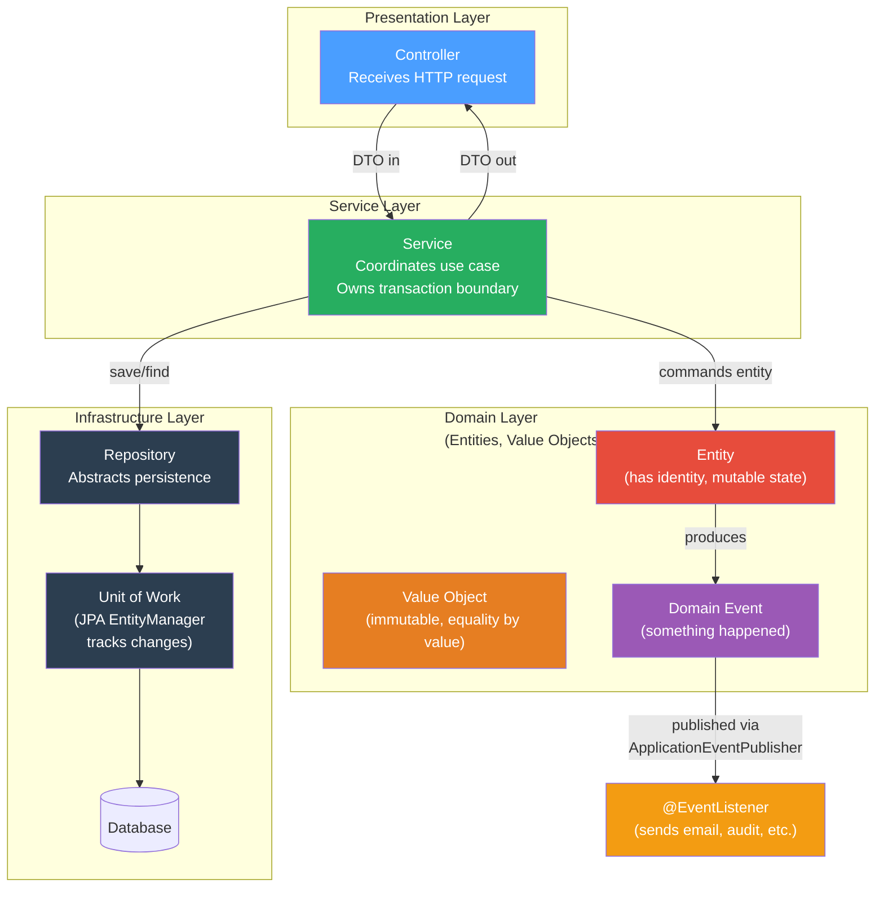

# 🏗️ Enterprise Patterns in Java

> [!abstract] TL;DR
> Martin Fowler's enterprise application patterns define the vocabulary of layered Java applications: Repository abstracts data access, Unit of Work tracks changes within a transaction boundary, Service Layer coordinates use cases, DTOs carry data across boundaries, Value Objects enforce immutability, the Specification pattern builds composable queries, and Domain Events decouple side effects from the core domain. Spring's annotations (`@Repository`, `@Service`, `@EventListener`) are direct implementations of these patterns.

---

## Intuition — the Restaurant Kitchen Analogy

- **Repository** = the pantry manager. You ask "give me Order #42" and they retrieve it; you hand them a new Order and they store it. You never care whether the pantry is a fridge, a freezer, or a cloud warehouse.
- **Unit of Work** = the chef's running tally. All changes made during a cooking session (add, modify, remove) are tracked on a notepad and flushed to the pantry in one atomic batch at the end of the session.
- **Service Layer** = the head chef coordinating the kitchen. They receive a table order, call the pantry, delegate to line cooks, and ensure everything leaves the kitchen consistently.
- **DTO** = a takeout container. It carries exactly the data needed across the kitchen-to-dining-room boundary — not the raw ingredients (entities), just the prepared food (response fields).
- **Value Object** = a recipe card. Two cards with identical ingredients are identical — there is no "identity" beyond their content. Immutable by nature.
- **Domain Event** = a ticket on the order wheel. When the kitchen finishes a dish, they ding the bell (publish an event). The waiter and the billing system react independently — the kitchen doesn't know or care who's listening.

---

## How It Works



---

## Key Concepts / Details

### Repository Pattern

```java
// ── Repository: abstracts the persistence mechanism ──────────────────────────
// Clients work with domain objects; the repository translates to/from DB rows.
// Spring Data JPA generates the implementation at runtime from the interface.

import org.springframework.data.jpa.repository.JpaRepository;
import org.springframework.data.jpa.repository.Query;
import org.springframework.stereotype.Repository;

@Repository
public interface OrderRepository extends JpaRepository<Order, Long> {

    // Spring Data derives query from method name
    List<Order> findByCustomerIdAndStatus(Long customerId, OrderStatus status);

    // Custom JPQL query
    @Query("SELECT o FROM Order o WHERE o.totalAmount > :min AND o.createdAt > :since")
    List<Order> findHighValueRecentOrders(BigDecimal min, LocalDateTime since);

    // Projection: fetch only needed columns (avoids loading full entity)
    @Query("SELECT o.id AS id, o.status AS status FROM Order o WHERE o.customerId = :id")
    List<OrderSummary> findSummariesByCustomer(Long id); // OrderSummary is an interface/record projection
}

// Service uses Repository through its interface — no SQL, no JDBC
@Service
@Transactional
public class OrderService {
    private final OrderRepository orderRepo;

    public OrderService(OrderRepository orderRepo) {
        this.orderRepo = orderRepo;
    }

    public Order placeOrder(PlaceOrderCommand cmd) {
        Order order = Order.create(cmd.customerId(), cmd.items());
        return orderRepo.save(order);         // insert or update
    }

    public Optional<Order> findOrder(Long id) {
        return orderRepo.findById(id);        // returns Optional — no null
    }
}
```

### Unit of Work — JPA EntityManager / Hibernate Session

```java
// ── Unit of Work: tracks changes within a transaction ────────────────────────
// JPA's EntityManager IS the Unit of Work.
// It maintains a "persistence context" (identity map) within a transaction:
//   - Tracks all loaded entities ("managed" state)
//   - Detects changes via dirty checking at flush time
//   - Batches INSERT/UPDATE/DELETE into one DB round-trip
// Spring's @Transactional binds the EntityManager to the current thread.

@Service
@Transactional
public class InventoryService {

    @PersistenceContext
    private EntityManager em; // injected by Spring; scoped to current transaction

    public void adjustStock(Long productId, int delta) {
        Product product = em.find(Product.class, productId); // loaded into persistence context
        product.adjustQuantity(delta);  // MUTATE the entity directly — no explicit save needed!
        // At transaction commit, Hibernate dirty-checks and issues UPDATE automatically
    }

    // Explicit flush: send SQL now but keep transaction open
    public void flushNow() {
        em.flush(); // useful before a native query that reads data you just wrote
    }

    // Detach: remove from persistence context (changes no longer tracked)
    public void detachAndModify(Long id) {
        Product p = em.find(Product.class, id);
        em.detach(p);      // now "detached" — mutations NOT tracked
        p.setName("Draft"); // this change will NOT be persisted
    }

    // Merge: reattach a detached entity and merge changes
    public Product reattach(Product detached) {
        return em.merge(detached); // returns the managed copy; original stays detached
    }
}
```

### Service Layer

```java
// ── Service Layer: coordinates use cases, owns transaction boundary ───────────
// Services hold the WHAT (business logic), not the HOW (infrastructure).
// One service method = one use case = one transaction.

@Service
@Transactional                                      // wraps entire method in one TX
public class PaymentService {
    private final OrderRepository orderRepo;
    private final PaymentGateway gateway;           // external dependency (interface)
    private final ApplicationEventPublisher events;

    public PaymentService(OrderRepository orderRepo,
                          PaymentGateway gateway,
                          ApplicationEventPublisher events) {
        this.orderRepo = orderRepo;
        this.gateway = gateway;
        this.events = events;
    }

    public PaymentResult processPayment(Long orderId, PaymentDetails details) {
        Order order = orderRepo.findById(orderId)
                .orElseThrow(() -> new OrderNotFoundException(orderId));

        PaymentResult result = gateway.charge(details); // may throw PaymentException

        if (result.isSuccess()) {
            order.markPaid(result.transactionId()); // entity tracks its own state
            events.publishEvent(new OrderPaidEvent(order.getId(), Instant.now()));
        }

        return result;  // entity changes flushed to DB at TX commit
    }

    @Transactional(readOnly = true)   // optimization: Hibernate skips dirty-checking
    public OrderSummaryDTO getSummary(Long orderId) {
        Order order = orderRepo.findById(orderId).orElseThrow();
        return OrderSummaryDTO.from(order);
    }
}
```

### Data Transfer Object (DTO) with MapStruct

```java
// ── DTO: carries data across layer boundaries ─────────────────────────────────
// Entities MUST NOT escape the service layer — they carry persistence metadata,
// lazy collections, and proxies that break outside a transaction.
// DTOs are plain data carriers (records are ideal in Java 16+).

// Response DTO — immutable Java record
public record OrderDTO(
        Long id,
        String customerName,
        BigDecimal totalAmount,
        String status,
        List<OrderItemDTO> items
) {
    // Factory method from entity (manual mapping)
    public static OrderDTO from(Order order) {
        return new OrderDTO(
            order.getId(),
            order.getCustomer().getFullName(),
            order.getTotalAmount(),
            order.getStatus().name(),
            order.getItems().stream().map(OrderItemDTO::from).toList()
        );
    }
}

// Command/Request DTO
public record PlaceOrderCommand(
        Long customerId,
        @NotEmpty List<OrderItemCommand> items
) {}


// ── MapStruct: compile-time, type-safe mapper generation ─────────────────────
// Add dependency: org.mapstruct:mapstruct + org.mapstruct:mapstruct-processor

import org.mapstruct.Mapper;
import org.mapstruct.Mapping;
import org.mapstruct.factory.Mappers;

@Mapper(componentModel = "spring")  // Spring @Component generated
public interface OrderMapper {

    @Mapping(source = "customer.fullName", target = "customerName")
    @Mapping(source = "status",            target = "status", qualifiedByName = "statusToString")
    OrderDTO toDTO(Order order);

    @Named("statusToString")
    default String statusToString(OrderStatus status) { return status.name(); }

    List<OrderDTO> toDTOs(List<Order> orders);

    // MapStruct generates the implementation at compile time — no reflection at runtime
    // → compatible with GraalVM native image without extra config
}
```

### Value Object

```java
// ── Value Object: immutable, equality by value, no identity ──────────────────
// Java records are perfect Value Objects: auto-generates equals/hashCode/toString
// based on all components. Immutable by default.

public record Money(BigDecimal amount, Currency currency) {

    // Compact canonical constructor: validation
    public Money {
        Objects.requireNonNull(amount, "amount must not be null");
        Objects.requireNonNull(currency, "currency must not be null");
        if (amount.compareTo(BigDecimal.ZERO) < 0) {
            throw new IllegalArgumentException("Amount cannot be negative");
        }
        amount = amount.setScale(2, RoundingMode.HALF_UP); // normalize scale
    }

    // Business methods return new instances (immutable)
    public Money add(Money other) {
        if (!this.currency.equals(other.currency)) {
            throw new CurrencyMismatchException(this.currency, other.currency);
        }
        return new Money(this.amount.add(other.amount), this.currency);
    }

    public Money multiply(int factor) {
        return new Money(this.amount.multiply(BigDecimal.valueOf(factor)), this.currency);
    }

    public static Money of(String amount, String currencyCode) {
        return new Money(new BigDecimal(amount), Currency.getInstance(currencyCode));
    }
}

// Usage:
Money price = Money.of("29.99", "USD");
Money tax   = Money.of("2.40", "USD");
Money total = price.add(tax);  // returns new Money, price and tax unchanged
System.out.println(total);     // Money[amount=32.39, currency=USD]

// In JPA: map Value Object as @Embeddable
@Embeddable
public record Address(String street, String city, String country) {
    // records with @Embeddable work in Hibernate 6.2+ (Spring Boot 3.1+)
}
```

### Specification Pattern

```java
// ── Specification: composable query predicates ────────────────────────────────
// Avoids repository method explosion for dynamic queries.
// Spring Data JPA: extend JpaSpecificationExecutor<T> on your repository.

import org.springframework.data.jpa.domain.Specification;

// Atomic specifications (reusable predicate builders)
public class OrderSpecifications {

    public static Specification<Order> hasStatus(OrderStatus status) {
        return (root, query, cb) ->
            status == null ? cb.conjunction() : cb.equal(root.get("status"), status);
    }

    public static Specification<Order> placedAfter(LocalDateTime date) {
        return (root, query, cb) ->
            date == null ? cb.conjunction() : cb.greaterThan(root.get("createdAt"), date);
    }

    public static Specification<Order> forCustomer(Long customerId) {
        return (root, query, cb) ->
            customerId == null ? cb.conjunction() : cb.equal(root.get("customerId"), customerId);
    }

    public static Specification<Order> highValue(BigDecimal minAmount) {
        return (root, query, cb) ->
            minAmount == null ? cb.conjunction()
                              : cb.greaterThanOrEqualTo(root.get("totalAmount"), minAmount);
    }
}

// Repository must extend JpaSpecificationExecutor
public interface OrderRepository extends JpaRepository<Order, Long>,
                                          JpaSpecificationExecutor<Order> {}

// Service: compose specifications dynamically
@Service
public class OrderQueryService {
    private final OrderRepository repo;

    public Page<Order> search(OrderSearchRequest req, Pageable pageable) {
        Specification<Order> spec = Specification
            .where(OrderSpecifications.hasStatus(req.status()))
            .and(OrderSpecifications.placedAfter(req.since()))
            .and(OrderSpecifications.forCustomer(req.customerId()))
            .and(OrderSpecifications.highValue(req.minAmount()));

        return repo.findAll(spec, pageable);
    }
}
```

### Domain Event Pattern

```java
// ── Domain Event: decouple side effects from the core domain ─────────────────
// When a business event occurs (order placed, payment received), publish an event.
// Listeners react independently — adding a new listener doesn't change the domain.

// 1. Define the event (plain POJO or record)
public record OrderPlacedEvent(Long orderId, Long customerId, BigDecimal amount, Instant occurredAt) {
    public OrderPlacedEvent(Order order) {
        this(order.getId(), order.getCustomerId(), order.getTotalAmount(), Instant.now());
    }
}

// 2. Publish from the service (via Spring ApplicationEventPublisher)
@Service
@Transactional
public class OrderService {
    private final ApplicationEventPublisher events;
    private final OrderRepository repo;

    public Order placeOrder(PlaceOrderCommand cmd) {
        Order order = Order.create(cmd.customerId(), cmd.items());
        repo.save(order);
        events.publishEvent(new OrderPlacedEvent(order)); // published AFTER save
        return order;
    }
}

// 3a. Synchronous listener — runs in same transaction as the publisher
@Component
public class OrderAuditListener {
    @EventListener
    public void onOrderPlaced(OrderPlacedEvent event) {
        auditLog.record("ORDER_PLACED", event.orderId(), event.occurredAt());
        // If this throws, the publisher's transaction rolls back too — same TX
    }
}

// 3b. Transactional listener — runs AFTER the publisher's transaction commits
@Component
public class OrderEmailListener {
    @TransactionalEventListener(phase = TransactionPhase.AFTER_COMMIT)
    public void onOrderPlaced(OrderPlacedEvent event) {
        emailService.sendConfirmation(event.customerId()); // DB is committed — safe to proceed
        // If this throws, the original TX is already committed — handle errors here separately
    }
}

// 3c. Async listener — runs in a different thread (after TX commit)
@Component
public class OrderNotificationListener {
    @Async
    @TransactionalEventListener(phase = TransactionPhase.AFTER_COMMIT)
    public void onOrderPlaced(OrderPlacedEvent event) {
        pushNotificationService.notify(event.customerId(), "Your order has been placed!");
    }
}
```

---

## Real-World Notes

- **`@Transactional(readOnly = true)`** on query-only service methods tells Hibernate to skip dirty checking at flush time — measurable speedup for large persistence contexts.
- **Spring Data projections** (interface or record projections with `@Query`) implement the DTO pattern at the query level — only selected columns are fetched, reducing network and ORM overhead.
- **Domain events vs integration events**: domain events are in-process (`ApplicationEventPublisher`); integration events cross service boundaries (Kafka, RabbitMQ, AWS SNS). `@TransactionalEventListener(AFTER_COMMIT)` is the bridge — publish to the broker only after the DB is committed.
- **Specification vs Querydsl**: Both solve dynamic queries. Querydsl generates type-safe `Q` classes from entities (compile-time checked), while Specifications use strings for field names (runtime failure risk). Querydsl is more type-safe but requires a code generation step.
- **Aggregate root pattern (DDD)**: The domain event pattern works best when only aggregate roots publish events. The Entity manages all internal state; the Service orchestrates aggregates; events flow outward.

---

## Common Pitfalls

1. **Exposing entities from controllers**: Returning `@Entity` objects directly from `@RestController` serializes lazy collections outside a transaction → `LazyInitializationException`. Always map to DTOs in the service layer before returning.

2. **Business logic in DTOs or controllers**: Business rules (pricing, eligibility checks, state transitions) belong in domain entities or domain services, not in DTOs or REST controllers. Controllers are adapters, not orchestrators.

3. **`@Transactional` on private methods**: Spring's proxy-based AOP cannot intercept private method calls — `@Transactional` is silently ignored. Make transactional methods `public` (or use AspectJ weaving).

4. **Mutable Value Objects**: A Value Object with setters is just a poorly-designed entity. Use Java records or `final` fields with no setters; return new instances from "mutation" methods.

5. **`@EventListener` vs `@TransactionalEventListener`**: Using `@EventListener` for side effects that assume the DB is committed (sending emails, calling external APIs) risks acting on data that might roll back. Use `@TransactionalEventListener(AFTER_COMMIT)` for externally visible effects.

6. **Specification with N+1 queries**: Specifications work on the root entity. If your spec needs to filter by a nested collection attribute, add a `JOIN FETCH` or use `EntityGraph` — otherwise you get N+1 SELECT per matching entity.

---

## Related Concepts

- [[Spring_Data_JPA]] — JpaRepository, JPQL, EntityManager, transaction management
- [[Spring_Core_IoC]] — @Service, @Component, dependency injection underlying the layer pattern
- [[Concurrency_Patterns]] — thread-safety considerations when domain objects cross thread boundaries
- [[Test_Driven_Development]] — TDD is most effective at the domain entity and service layer
- [[_MOC_Design_Patterns|↑ Section MOC]]

---

## Review Questions

1. Explain the Repository pattern and how Spring Data JPA implements it. What problem does it solve compared to scattering JDBC calls throughout service classes?

2. What is the difference between `@EventListener` and `@TransactionalEventListener(phase = AFTER_COMMIT)`? Give a concrete scenario where using the wrong one causes a bug.

3. How does the Specification pattern improve on named repository methods (e.g., `findByStatusAndCustomerIdAndAmountGreaterThan`)? What are the trade-offs compared to Querydsl?

---

## Sources

- Martin Fowler — Patterns of Enterprise Application Architecture (2002)
- Spring Data JPA Reference — https://docs.spring.io/spring-data/jpa/docs/current/reference/html/
- MapStruct Documentation — https://mapstruct.org/documentation/stable/reference/html/
- Vaughn Vernon — Implementing Domain-Driven Design (2013)

#Java #DesignPatterns #Enterprise #Repository #DomainEvents #ServiceLayer #DDD #Spring
