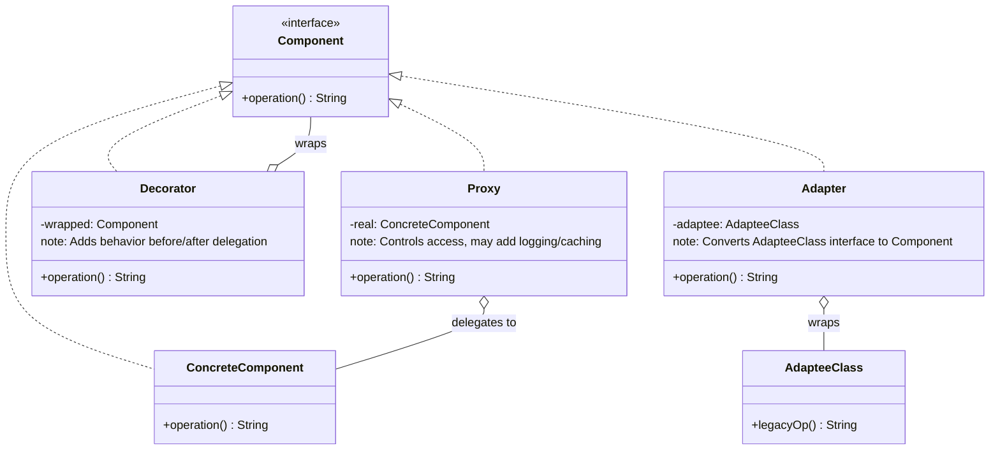

# Structural Patterns

## TL;DR

| Pattern | One-liner | Key Java / Spring usage |
|---------|-----------|------------------------|
| **Adapter** | Wraps an incompatible interface to match the target interface | Integrating legacy APIs; `Arrays.asList()` |
| **Bridge** | Separates abstraction from implementation so both can vary independently | `JDBC` (abstraction=SQL code; impl=driver) |
| **Composite** | Uniform interface for individual objects and compositions (tree structures) | Filesystem, UI widget trees, org charts |
| **Decorator** | Wraps a component with the same interface to add behavior at runtime | `java.io.InputStream` chain; Spring filters |
| **Facade** | Simplified single interface to a complex subsystem | `RestTemplate`, `JdbcTemplate` |
| **Flyweight** | Share intrinsic (immutable) state across many fine-grained objects | `String` pool; `Integer.valueOf()` cache |
| **Proxy** | Controlled access placeholder with the same interface as the real object | Spring AOP (JDK Dynamic + CGLIB) |

---

## Intuition

- **Adapter** = travel plug adapter. A US laptop plug (two flat pins) goes into an adapter that fits a European socket (two round pins). The interface changes; the laptop behavior does not.
- **Decorator** = Russian nesting dolls, each adding a layer. `BufferedInputStream(GZIPInputStream(FileInputStream(...)))` — each outer layer adds behavior around the inner.
- **Proxy** = receptionist screening the CEO's calls. Same interface (answer phone), but the receptionist controls who gets through and can log every call before passing it on.
- **Facade** = hotel concierge. You say "I want to go to the airport." They book your taxi, arrange checkout, and call the porter — complex subsystem, one simple interface.
- **Composite** = company org chart. Whether you call `getTeamSize()` on an individual employee or on a department, the interface is the same — the department just delegates to its members.

---

## How It Works

### Class Relationship: Adapter, Decorator, Proxy Compared



### Composite Tree Structure

```mermaid
graph TD
    ROOT["Directory: /src\n(Composite)"]
    ROOT --> D1["Directory: /main\n(Composite)"]
    ROOT --> D2["Directory: /test\n(Composite)"]
    D1 --> F1["File: Main.java\n(Leaf)"]
    D1 --> F2["File: Utils.java\n(Leaf)"]
    D2 --> F3["File: MainTest.java\n(Leaf)"]

    IFACE["FileSystemComponent\n+getName()\n+getSize()\n+print(indent)"]
    style IFACE fill:#1a2a3a,stroke:#2196f3
    LEAF["File implements\nFileSystemComponent"]
    COMP["Directory implements\nFileSystemComponent\n+add(component)"]
```



---

### ADAPTER (Object Adapter — Composition)

```java
// Target interface — what the client code expects
interface Logger {
    void log(String level, String message);
}

// Adaptee — legacy or third-party class with incompatible interface
class LegacyLogger {
    public void logMessage(String message, int severity) {
        String label = severity == 1 ? "ERROR" : severity == 2 ? "WARN" : "INFO";
        System.out.printf("[%s] %s%n", label, message);
    }
}

// Object Adapter — uses composition (preferred over class adapter)
class LoggerAdapter implements Logger {
    private final LegacyLogger legacy;

    public LoggerAdapter(LegacyLogger legacy) {
        this.legacy = legacy;
    }

    @Override
    public void log(String level, String message) {
        int severity = switch (level) {
            case "ERROR" -> 1;
            case "WARN"  -> 2;
            default      -> 3;
        };
        legacy.logMessage(message, severity);
    }
}

// Client code — only knows about Logger interface
class Application {
    private final Logger logger;

    public Application(Logger logger) { this.logger = logger; }

    public void start() {
        logger.log("INFO", "Application started");
        logger.log("WARN", "Low memory");
    }
}

// Wire up:
// Application app = new Application(new LoggerAdapter(new LegacyLogger()));
// app.start();
```

---

### DECORATOR

```java
// Component interface
interface TextProcessor {
    String process(String text);
}

// Concrete component (the base implementation)
class PlainTextProcessor implements TextProcessor {
    public String process(String text) { return text; }
}

// Abstract decorator — implements the interface and holds a wrapped instance
abstract class TextProcessorDecorator implements TextProcessor {
    protected final TextProcessor wrapped;

    public TextProcessorDecorator(TextProcessor wrapped) {
        this.wrapped = wrapped;
    }
}

// Concrete decorators — each adds one responsibility
class TrimDecorator extends TextProcessorDecorator {
    public TrimDecorator(TextProcessor wrapped) { super(wrapped); }

    @Override
    public String process(String text) {
        return wrapped.process(text).trim();
    }
}

class UpperCaseDecorator extends TextProcessorDecorator {
    public UpperCaseDecorator(TextProcessor wrapped) { super(wrapped); }

    @Override
    public String process(String text) {
        return wrapped.process(text).toUpperCase();
    }
}

class SanitizeDecorator extends TextProcessorDecorator {
    public SanitizeDecorator(TextProcessor wrapped) { super(wrapped); }

    @Override
    public String process(String text) {
        // Remove script tags etc.
        return wrapped.process(text).replaceAll("<[^>]*>", "");
    }
}

// Usage — chain decorators in any order:
TextProcessor processor = new UpperCaseDecorator(
    new TrimDecorator(
        new SanitizeDecorator(
            new PlainTextProcessor()
        )
    )
);
// processor.process("  <b>hello</b>  ") → "HELLO"

// java.io IS the Decorator pattern:
// InputStream stream = new BufferedInputStream(new GZIPInputStream(new FileInputStream("file.gz")));
```

---

### PROXY (JDK Dynamic Proxy)

```java
import java.lang.reflect.*;

interface UserService {
    User findById(Long id);
    void save(User user);
    void delete(Long id);
}

class UserServiceImpl implements UserService {
    public User findById(Long id) { /* DB lookup */ return new User(id, "Alice"); }
    public void save(User user)   { /* DB save   */ System.out.println("Saved: " + user); }
    public void delete(Long id)   { /* DB delete */ System.out.println("Deleted: " + id); }
}

// InvocationHandler — runs for every method call on the proxy
class LoggingProxyHandler implements InvocationHandler {
    private final Object target;

    public LoggingProxyHandler(Object target) { this.target = target; }

    @Override
    public Object invoke(Object proxy, Method method, Object[] args) throws Throwable {
        System.out.printf(">> Calling %s with args %s%n", method.getName(), Arrays.toString(args));
        long start = System.currentTimeMillis();
        try {
            Object result = method.invoke(target, args);
            System.out.printf("<< %s completed in %dms%n",
                method.getName(), System.currentTimeMillis() - start);
            return result;
        } catch (InvocationTargetException e) {
            System.out.printf("!! %s threw %s%n", method.getName(), e.getCause().getClass().getSimpleName());
            throw e.getCause();
        }
    }
}

// Factory method to create the proxy
@SuppressWarnings("unchecked")
static <T> T createProxy(T target, Class<T> iface) {
    return (T) Proxy.newProxyInstance(
        iface.getClassLoader(),
        new Class<?>[]{iface},
        new LoggingProxyHandler(target)
    );
}

// Usage:
// UserService proxy = createProxy(new UserServiceImpl(), UserService.class);
// proxy.findById(42L);  // logs method name, duration, args
```

---

### COMPOSITE

```java
import java.util.*;

// Component interface — uniform for leaf and composite
interface FileSystemComponent {
    String getName();
    long getSize();
    void print(String indent);
}

// Leaf
class File implements FileSystemComponent {
    private final String name;
    private final long size;

    public File(String name, long size) { this.name = name; this.size = size; }

    public String getName() { return name; }
    public long getSize()   { return size; }
    public void print(String indent) {
        System.out.printf("%s%s (%,d bytes)%n", indent, name, size);
    }
}

// Composite — holds children of either type
class Directory implements FileSystemComponent {
    private final String name;
    private final List<FileSystemComponent> children = new ArrayList<>();

    public Directory(String name) { this.name = name; }

    public void add(FileSystemComponent c)    { children.add(c); }
    public void remove(FileSystemComponent c) { children.remove(c); }

    public String getName() { return name; }

    public long getSize() {
        return children.stream().mapToLong(FileSystemComponent::getSize).sum();
    }

    public void print(String indent) {
        System.out.printf("%s%s/ (%,d bytes total)%n", indent, name, getSize());
        children.forEach(c -> c.print(indent + "  "));
    }
}

// Usage:
// Directory root = new Directory("src");
// Directory main = new Directory("main");
// main.add(new File("Main.java", 1024));
// main.add(new File("Utils.java", 512));
// root.add(main);
// root.add(new File("pom.xml", 2048));
// root.print("");
```

---

### FACADE

```java
// Complex subsystem classes
class OrderValidator     { public void validate(Order o)     { /* ... */ } }
class InventoryService   { public void reserve(Order o)      { /* ... */ } }
class PaymentGateway     { public Receipt charge(Order o)    { return new Receipt(); } }
class ShippingService    { public Tracking ship(Order o)     { return new Tracking(); } }
class NotificationSender { public void confirm(Order o, Receipt r) { /* ... */ } }

// Facade — single simple interface over complex subsystem
class OrderFacade {
    private final OrderValidator     validator  = new OrderValidator();
    private final InventoryService   inventory  = new InventoryService();
    private final PaymentGateway     payment    = new PaymentGateway();
    private final ShippingService    shipping   = new ShippingService();
    private final NotificationSender notifier   = new NotificationSender();

    public OrderConfirmation placeOrder(Order order) {
        validator.validate(order);
        inventory.reserve(order);
        Receipt  receipt  = payment.charge(order);
        Tracking tracking = shipping.ship(order);
        notifier.confirm(order, receipt);
        return new OrderConfirmation(receipt, tracking);
    }
}
// Client: new OrderFacade().placeOrder(order);  // one call
```

---

## Pattern Comparison Table

| Pattern | Wraps Component? | Same Interface? | Adds Behavior? | Purpose | Spring Usage |
|---------|-----------------|----------------|---------------|---------|-------------|
| Adapter | Yes (adaptee) | Converts to target | No (translates) | Interface compatibility | `HttpMessageConverter` |
| Decorator | Yes (component) | Yes | Yes | Add responsibilities dynamically | Security filter chain |
| Proxy | Yes (real object) | Yes | Indirectly | Control access, AOP | `@Transactional`, `@Cacheable` |
| Facade | No (uses subsystem) | New simplified | Orchestrates | Reduce subsystem complexity | `JdbcTemplate`, `RestTemplate` |
| Composite | N/A | Yes (leaf+composite) | Via delegation | Tree structures | Spring `BeanDefinition` hierarchy |
| Flyweight | No | N/A | No | Share immutable state | `String` pool, `Integer` cache |
| Bridge | No | Split into two | No | Independent variation | `JDBC` driver model |

---

## Key Concepts

### Adapter: Object vs Class Adapter

Object Adapter (composition) is preferred in Java because it works with the adaptee's entire class hierarchy and does not require a concrete class (can adapt an interface or abstract class). Class Adapter uses multiple inheritance — available in C++ but not Java. Always prefer composition over inheritance for adapters.

Use Adapter when: integrating legacy code, working with third-party libraries that have incompatible interfaces, or wrapping an API to expose a domain-specific interface.

### Bridge: Preventing Class Explosion

Without Bridge, if you have 3 shapes (Circle, Square, Triangle) and 3 colors (Red, Blue, Green), you'd need 9 subclasses. With Bridge, `Shape` has a reference to a `Color` implementation: 3 + 3 = 6 classes. The Shape abstraction and Color implementation hierarchies evolve independently. JDBC is the canonical example: your SQL code (abstraction) runs against any database (implementation/driver).

### Composite: Uniform Tree Treatment

The power of Composite is that `getSize()` on a single File and on a Directory that contains 1000 nested files uses exactly the same call. Recursive delegation handles the tree traversal transparently. Be careful with operations that only make sense on one type (e.g., `Directory.add()`) — these break uniformity. One solution: return `Optional` or throw `UnsupportedOperationException` from the base interface.

### Decorator: Runtime Behavior Extension

The Decorator pattern is the runtime alternative to inheritance. Where inheritance adds behavior at compile time, Decoration adds it at runtime by wrapping. The entire `java.io` package is built on Decorator: `FileInputStream` is a leaf; wrap it in `BufferedInputStream` for buffering, then in `DataInputStream` for typed reads. Key: all decorators share the same interface as the component they wrap.

Spring Security's filter chain is conceptually decorator-like: each filter wraps the next, adding authentication, authorization, and CSRF checks in sequence.

### Flyweight: Intrinsic vs Extrinsic State

**Intrinsic state** = immutable data stored in the flyweight object and shared among all uses (e.g., font type, glyph shape).  
**Extrinsic state** = per-use data passed in as method arguments (e.g., glyph position, color at that location).

`String` interning (pool) is Flyweight: `"hello"` appears once in the pool, all references point to it. `Integer.valueOf(-128 to 127)` caches instances. Good for millions of similar objects (particles in a game, characters on screen, HTTP connection configurations).

### Proxy: JDK Dynamic vs CGLIB

| Aspect | JDK Dynamic Proxy | CGLIB |
|--------|------------------|-------|
| Requirement | Target must implement interface | Works on concrete classes |
| Mechanism | `Proxy.newProxyInstance()` + `InvocationHandler` | Generates subclass bytecode at runtime |
| Performance | Slightly slower (reflection) | Slightly faster (bytecode) |
| Limitation | Cannot proxy `final` methods | Cannot subclass `final` classes |
| Spring default | When interface available | Fallback (or `proxyTargetClass=true`) |

**Self-invocation bypass**: Calling `this.method()` inside a Spring bean calls the real object, not the proxy. `@Transactional` on the called method is ignored. Fix: inject `self` reference via `@Autowired ApplicationContext` and call through context, or use AspectJ load-time weaving.

---

## Real-World Spring Connections

- **Spring AOP** = Proxy pattern (JDK Dynamic or CGLIB wraps beans)
- **`java.io.InputStream`** chain = Decorator pattern
- **Spring `SecurityFilterChain`** = Decorator/Chain pattern (each filter wraps the next)
- **`Integer.valueOf()` cache** = Flyweight pattern
- **`String` pool** = Flyweight pattern
- **`RestTemplate` / `WebClient`** = Facade over HTTP complexity
- **`JdbcTemplate`** = Facade over JDBC boilerplate (connection, statement, result set handling)
- **`Arrays.asList()`** = Adapter (array to `List` interface)

---

## Common Pitfalls

1. **Spring self-invocation bypasses proxy**: Calling `this.serviceMethod()` inside the same bean skips `@Transactional`, `@Cacheable`, etc. Inject the bean's own proxy via `@Autowired ApplicationContext` or `@Self`.
2. **Decorator order matters**: `new LoggingDecorator(new CachingDecorator(service))` logs every call including cache hits. `new CachingDecorator(new LoggingDecorator(service))` only logs cache misses. The order changes observable behavior.
3. **Composite assuming leaf/composite are fully interchangeable**: Operations like `add(child)` only make sense on Composite. Either make the base interface include it (with `UnsupportedOperationException` on Leaf) or use a separate `Container` interface — neither is perfect.
4. **Flyweight with mutable shared state**: If the "intrinsic" state is accidentally mutable (e.g., a shared `StringBuilder`), concurrent modifications cause data races. Flyweight state must be immutable.
5. **Class Adapter in Java**: Trying to adapt via inheritance with `class Adapter extends Adaptee implements Target` works only if `Adaptee` is a class you can subclass. Prefer composition.

---

## Review Questions

1. Spring AOP uses two proxy mechanisms. Name them, explain when Spring uses each, and describe the self-invocation problem with concrete code.
2. Explain the difference between Decorator and Proxy with a concrete Java example. How do their intents differ even though the structure looks similar?
3. The `java.io` package is an example of which pattern? Trace the call chain for `new BufferedReader(new InputStreamReader(new FileInputStream("data.txt")))` and explain what each wrapper adds.

---

## Related

- [[_MOC_Design_Patterns|↑ Section MOC]]
- [[Creational_Patterns]]
- [[Behavioral_Patterns]]
- [[SOLID_Principles]]

#Java #DesignPatterns #Structural
