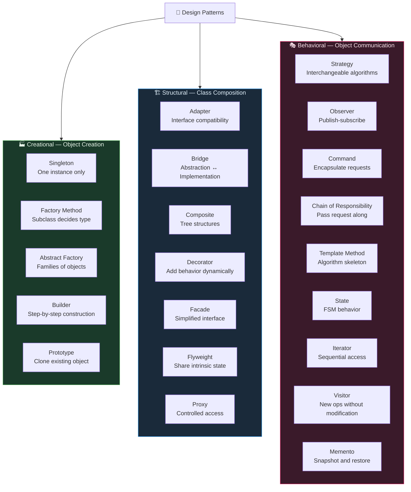
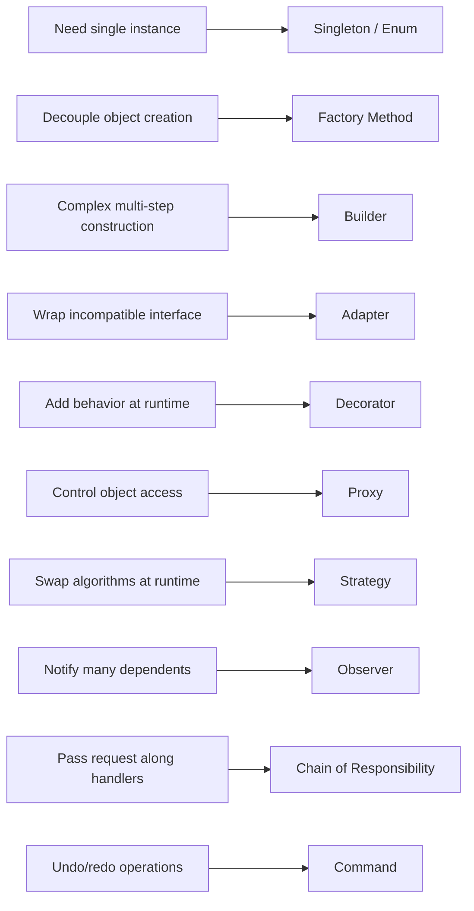

# Design Patterns — Map of Content

Design patterns are reusable solutions to commonly occurring problems in software design. They are not code snippets you copy-paste but rather templates describing how to solve a problem in many different situations. The GoF (Gang of Four) book introduced 23 classic patterns grouped into three families: Creational, Structural, and Behavioral.

---

## Pattern Landscape

---

## Learning Path

| Step | Pattern Group | Key Patterns | Note | Why |
|------|--------------|--------------|------|-----|
| 1 | Creational | Singleton, Factory Method | [[Creational_Patterns]] | Most common in Spring apps and interviews |
| 2 | Creational | Builder, Abstract Factory | [[Creational_Patterns]] | Builder used everywhere (Lombok, HttpRequest) |
| 3 | Creational | Prototype | [[Creational_Patterns]] | Deep vs shallow copy — common gotcha |
| 4 | Structural | Adapter, Decorator | [[Structural_Patterns]] | Legacy integration + java.io chain |
| 5 | Structural | Proxy, Facade | [[Structural_Patterns]] | Spring AOP = Proxy; RestTemplate = Facade |
| 6 | Structural | Composite, Bridge, Flyweight | [[Structural_Patterns]] | String pool, UI trees |
| 7 | Behavioral | Strategy, Observer | [[Behavioral_Patterns]] | Lambda-friendly; Spring events |
| 8 | Behavioral | Command, Chain of Responsibility | [[Behavioral_Patterns]] | Undo/redo; Spring Security filters |
| 9 | Behavioral | Template Method, State, Visitor | [[Behavioral_Patterns]] | JdbcTemplate; FSM; AST walkers |

---

## Notes in This Section

| Note | Patterns Covered | Difficulty | Spring Relevance |
|------|-----------------|------------|-----------------|
| [[Creational_Patterns]] | Singleton, Factory Method, Abstract Factory, Builder, Prototype | Intermediate | BeanFactory, @Bean, Singleton scope, @Builder |
| [[Structural_Patterns]] | Adapter, Bridge, Composite, Decorator, Facade, Flyweight, Proxy | Intermediate | AOP Proxy, java.io Decorator, String pool Flyweight |
| [[Behavioral_Patterns]] | Strategy, Observer, Command, Chain, Template Method, State, Visitor | Intermediate | @EventListener, JdbcTemplate, SecurityFilterChain |

---

## Top 5 Interview Questions

**Q1: What is the difference between Factory Method and Abstract Factory?**
Factory Method uses inheritance — a subclass overrides a method to decide which product to create. Abstract Factory uses composition — a factory object creates families of related products. Abstract Factory = multiple factory methods grouped together.

**Q2: Why is the Enum Singleton considered the best approach?**
The JVM guarantees enum instances are created exactly once, even in multi-threaded environments, without any synchronized overhead. Enum is also serialization-safe by default (deserialization returns the same instance) and prevents reflective instantiation (enum constructors cannot be called reflectively).

**Q3: How does Spring AOP use Proxy and which type does it use?**
Spring AOP wraps beans in proxy objects to apply cross-cutting concerns (logging, transactions, security). It uses JDK Dynamic Proxy when the bean implements an interface (fast, interface-based). When no interface exists, it falls back to CGLIB which creates a subclass of the concrete class. Self-invocation (calling `this.method()`) bypasses the proxy entirely.

**Q4: What is the difference between Decorator and Proxy?**
Both wrap a component. Decorator adds new behavior to the component (e.g., `InputStream` chaining adds buffering, compression). Proxy controls access to the component without changing its interface (e.g., lazy initialization, logging, security checks). The intent differs: Decorator enhances; Proxy manages access.

**Q5: When should you use Strategy vs Template Method?**
Use Strategy when the entire algorithm varies and you want to swap it at runtime — prefer lambdas for simple strategies. Use Template Method when the overall algorithm structure is fixed but specific steps need customization by subclasses. Template Method uses inheritance; Strategy uses composition. Composition (Strategy) is generally preferred per OCP.

---

## Quick Reference: Pattern vs Problem

---

## GoF Pattern Quick Table

| Pattern | Category | Scope | Primary Intent |
|---------|----------|-------|---------------|
| Singleton | Creational | Object | One instance globally |
| Factory Method | Creational | Class | Subclass creates product |
| Abstract Factory | Creational | Object | Create product families |
| Builder | Creational | Object | Construct complex objects step by step |
| Prototype | Creational | Object | Clone existing objects |
| Adapter | Structural | Class/Object | Interface translation |
| Bridge | Structural | Object | Separate abstraction from implementation |
| Composite | Structural | Object | Tree part-whole hierarchies |
| Decorator | Structural | Object | Add responsibilities dynamically |
| Facade | Structural | Object | Simplified unified interface |
| Flyweight | Structural | Object | Fine-grained shared objects |
| Proxy | Structural | Object | Surrogate with controlled access |
| Strategy | Behavioral | Object | Interchangeable algorithms |
| Observer | Behavioral | Object | Dependents notified of state changes |
| Command | Behavioral | Object | Encapsulate requests as objects |
| Chain of Responsibility | Behavioral | Object | Chain of handlers for requests |
| Template Method | Behavioral | Class | Skeleton algorithm, steps in subclasses |
| State | Behavioral | Object | State-dependent behavior |
| Iterator | Behavioral | Object | Sequential access without exposing internals |
| Visitor | Behavioral | Object | New operations on element hierarchy |
| Memento | Behavioral | Object | Capture and restore state snapshot |

---

## Related Sections

- [[_MOC_Java_OOP]] — OOP principles that patterns are built on
- [[_MOC_Java_Testing]] — Testing patterns (mocks bypass Singleton coupling)
- [[_MOC_Java_Concurrency]] — Thread safety in Singleton, Observer, Command
