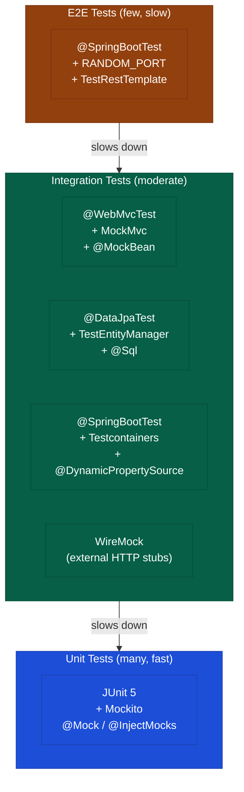
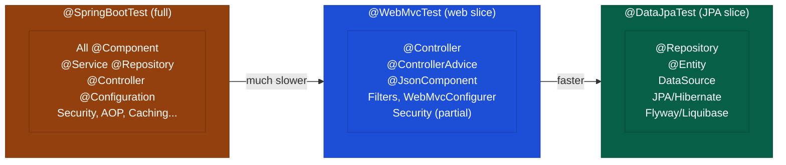
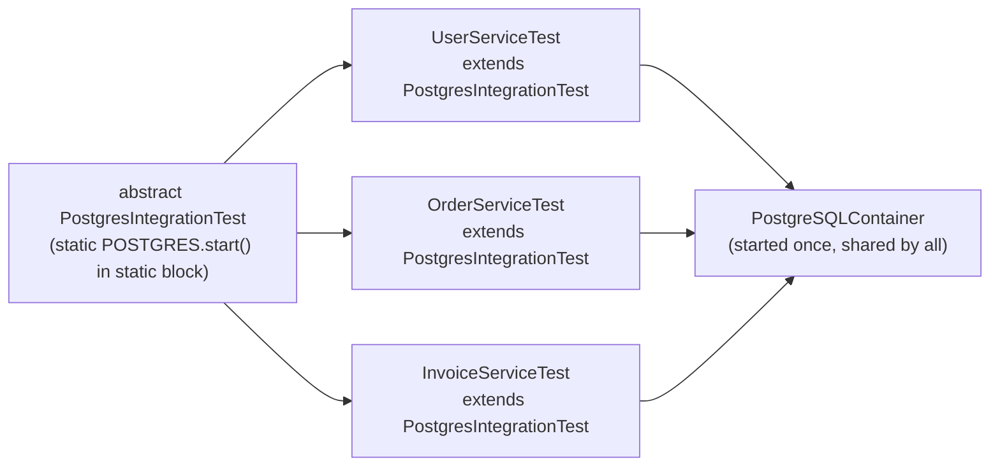

# Integration Testing and Testcontainers

## TL;DR

Spring test slices load a **partial ApplicationContext** for speed: `@WebMvcTest` (controller + web layer only, no service/repo), `@DataJpaTest` (JPA + embedded H2, no web), `@WebFluxTest` (reactive web). `@SpringBootTest` loads the **full context** — use sparingly. `MockMvc` performs mock HTTP requests without a real HTTP server. **Testcontainers** spins up real Docker containers (Postgres, Redis, Kafka) during tests; `@DynamicPropertySource` injects container-specific URLs at runtime. The **singleton container pattern** (static container in an abstract base class) prevents container restart per test class and dramatically reduces CI time. WireMock stubs external HTTP APIs so tests never reach real third-party services.

---

## Intuition

- **Unit test = testing a single gear** — isolated, no external moving parts
- **Integration test = testing the gear train meshing** — multiple components working together
- **`@WebMvcTest` = testing the shop front only** — the shelves behind it don't exist; you mock what the shopfront requests from the warehouse
- **`@DataJpaTest` = testing the warehouse inventory system** — no shop front, just whether the storage and retrieval logic works against a real database schema
- **`@SpringBootTest` = opening the whole shop** — the most realistic but also the slowest; save it for critical end-to-end paths
- **Testcontainers = spinning up a miniature production city for the test session** — real Postgres, real Redis, real Kafka — none of the dialect lies that H2 tells you

---

## How It Works

### Testing Pyramid with Spring Layers



### Spring Context Loading Comparison



---

### Comprehensive Integration Test Examples

```java
// ===== @WebMvcTest — Controller slice =====
@WebMvcTest(UserController.class)
class UserControllerTest {

    @Autowired private MockMvc mockMvc;
    @Autowired private ObjectMapper objectMapper;
    @MockBean private UserService userService;  // mock the service

    @Test
    void shouldReturnUserById() throws Exception {
        UserResponse response = new UserResponse(1L, "Alice", "alice@example.com");
        when(userService.findById(1L)).thenReturn(response);

        mockMvc.perform(get("/api/users/1")
                .accept(MediaType.APPLICATION_JSON))
            .andExpect(status().isOk())
            .andExpect(content().contentType(MediaType.APPLICATION_JSON))
            .andExpect(jsonPath("$.id").value(1))
            .andExpect(jsonPath("$.name").value("Alice"))
            .andExpect(jsonPath("$.email").value("alice@example.com"))
            .andDo(print()); // prints request/response for debugging
    }

    @Test
    void shouldReturn404WhenUserNotFound() throws Exception {
        when(userService.findById(99L)).thenThrow(new UserNotFoundException(99L));

        mockMvc.perform(get("/api/users/99"))
            .andExpect(status().isNotFound())
            .andExpect(jsonPath("$.error").value("User not found: 99"));
    }

    @Test
    void shouldCreateUser() throws Exception {
        CreateUserRequest request = new CreateUserRequest("Bob", "bob@example.com");
        UserResponse response = new UserResponse(2L, "Bob", "bob@example.com");
        when(userService.create(any())).thenReturn(response);

        mockMvc.perform(post("/api/users")
                .contentType(MediaType.APPLICATION_JSON)
                .content(objectMapper.writeValueAsString(request)))
            .andExpect(status().isCreated())
            .andExpect(jsonPath("$.id").value(2))
            .andExpect(header().string("Location", containsString("/api/users/2")));
    }

    @Test
    @WithMockUser(roles = "ADMIN")
    void shouldAllowAdminToDeleteUser() throws Exception {
        mockMvc.perform(delete("/api/users/1"))
            .andExpect(status().isNoContent());
        verify(userService).delete(1L);
    }

    @Test
    @WithMockUser(roles = "USER")
    void shouldForbidUserToDeleteUser() throws Exception {
        mockMvc.perform(delete("/api/users/1"))
            .andExpect(status().isForbidden());
    }
}

// ===== @DataJpaTest — JPA slice =====
@DataJpaTest
@AutoConfigureTestDatabase(replace = AutoConfigureTestDatabase.Replace.NONE) // use real DB
class UserRepositoryTest {

    @Autowired private TestEntityManager entityManager;
    @Autowired private UserRepository userRepository;

    @Test
    void shouldFindUserByEmail() {
        User user = new User("Charlie", "charlie@example.com");
        entityManager.persistAndFlush(user);

        Optional<User> found = userRepository.findByEmail("charlie@example.com");

        assertTrue(found.isPresent());
        assertEquals("Charlie", found.get().getName());
    }

    @Test
    @Sql("/sql/test-data.sql")  // execute SQL before test
    void shouldReturnActiveUsers() {
        List<User> active = userRepository.findByActiveTrue();
        assertFalse(active.isEmpty());
        assertTrue(active.stream().allMatch(User::isActive));
    }
}

// ===== Testcontainers — real database =====
@SpringBootTest
@Testcontainers
class UserServiceIntegrationTest {

    @Container
    static PostgreSQLContainer<?> postgres = new PostgreSQLContainer<>("postgres:15")
        .withDatabaseName("testdb")
        .withUsername("test")
        .withPassword("test");

    @DynamicPropertySource
    static void configureProperties(DynamicPropertyRegistry registry) {
        registry.add("spring.datasource.url", postgres::getJdbcUrl);
        registry.add("spring.datasource.username", postgres::getUsername);
        registry.add("spring.datasource.password", postgres::getPassword);
    }

    @Autowired private UserService userService;
    @Autowired private UserRepository userRepository;

    @Test
    @Transactional
    void shouldCreateAndRetrieveUser() {
        UserResponse created = userService.create(new CreateUserRequest("Dave", "dave@example.com"));

        assertNotNull(created.getId());
        Optional<User> found = userRepository.findById(created.getId());
        assertTrue(found.isPresent());
        assertEquals("Dave", found.get().getName());
    }
}

// ===== Singleton Testcontainer pattern (shared across test classes) =====
abstract class PostgresIntegrationTest {

    static final PostgreSQLContainer<?> POSTGRES;

    static {
        POSTGRES = new PostgreSQLContainer<>("postgres:15")
            .withDatabaseName("integration_test")
            .withUsername("test")
            .withPassword("test");
        POSTGRES.start();
    }

    @DynamicPropertySource
    static void properties(DynamicPropertyRegistry registry) {
        registry.add("spring.datasource.url", POSTGRES::getJdbcUrl);
        registry.add("spring.datasource.username", POSTGRES::getUsername);
        registry.add("spring.datasource.password", POSTGRES::getPassword);
    }
}

@SpringBootTest
class UserServiceTest extends PostgresIntegrationTest { /* ... */ }

@SpringBootTest
class OrderServiceTest extends PostgresIntegrationTest { /* ... */ }
// Both share the same Postgres container — starts only once

// ===== Full context test with TestRestTemplate =====
@SpringBootTest(webEnvironment = SpringBootTest.WebEnvironment.RANDOM_PORT)
class UserApiFullTest {

    @Autowired private TestRestTemplate restTemplate;
    @LocalServerPort private int port;

    @Test
    void shouldReturnHealthCheck() {
        ResponseEntity<String> response = restTemplate.getForEntity(
            "http://localhost:" + port + "/actuator/health",
            String.class
        );
        assertEquals(HttpStatus.OK, response.getStatusCode());
    }
}

// ===== WireMock for external service stubbing =====
@SpringBootTest
@WireMockTest(httpPort = 8089)
class PaymentGatewayIntegrationTest {

    @Autowired private PaymentGatewayClient paymentClient;

    @Test
    void shouldProcessPaymentSuccessfully() {
        stubFor(post(urlEqualTo("/payments/charge"))
            .withRequestBody(matchingJsonPath("$.amount"))
            .willReturn(aResponse()
                .withStatus(200)
                .withHeader("Content-Type", "application/json")
                .withBody("{\"transactionId\":\"txn-123\",\"status\":\"SUCCESS\"}")));

        PaymentResult result = paymentClient.charge(new ChargeRequest(99.99, "USD"));

        assertEquals("txn-123", result.getTransactionId());
        verify(postRequestedFor(urlEqualTo("/payments/charge")));
    }
}
```

---

### Spring Test Annotation Comparison

| Annotation | Context loaded | Web layer? | DB | Speed | Use when |
|------------|---------------|------------|-----|-------|----------|
| `@WebMvcTest` | Controllers, Filters, Security, ControllerAdvice | MockMvc (no real server) | None — `@MockBean` everything | Fast | Testing routing, serialisation, validation, security rules |
| `@DataJpaTest` | Repositories, JPA, DataSource, Flyway | None | H2 (embedded) by default | Fast | Testing custom queries, repository methods, JPA mappings |
| `@SpringBootTest(MOCK)` | Full ApplicationContext | MockMvc | Real (with Testcontainers) | Slow | Full stack without real HTTP; good with Testcontainers |
| `@SpringBootTest(RANDOM_PORT)` | Full ApplicationContext | Real HTTP server | Real | Very slow | True end-to-end; `TestRestTemplate` / `WebTestClient` |
| `@DataRedisTest` | Redis repositories | None | Redis (embedded or Testcontainers) | Fast | Testing Redis operations only |
| `@WebFluxTest` | Reactive controllers | `WebTestClient` (no real server) | None | Fast | Reactive controller layer |

---

## Key Concepts

### @SpringBootTest

Loads the **full `ApplicationContext`** — all beans, configurations, AOP proxies, security filters. Key parameters:
- `webEnvironment = MOCK` (default) — MockMvc; no real network I/O
- `webEnvironment = RANDOM_PORT` — starts real embedded Tomcat/Jetty; use `@LocalServerPort` and `TestRestTemplate`
- `webEnvironment = NONE` — no web layer at all; pure service/repository testing

Add `@DirtiesContext` if a test modifies shared Spring state (e.g., application properties), but use sparingly — it forces a full context reload for subsequent tests.

### @WebMvcTest

Loads only web-layer beans: `@Controller`, `@ControllerAdvice`, `@JsonComponent`, `WebMvcConfigurer`, `Filter`, Spring Security. Does NOT load `@Service` or `@Repository` — declare all dependencies with `@MockBean`. Automatically configures MockMvc. Great for testing:
- HTTP routing and request mapping
- Request/response serialisation (Jackson)
- Bean Validation (`@Valid`, constraint violations)
- Security rules (`@PreAuthorize`, role-based access)
- `@ControllerAdvice` exception handlers

### @DataJpaTest

Loads JPA infrastructure: `@Entity`, `@Repository`, `DataSource`, `EntityManager`, transaction support, Flyway/Liquibase migrations. By default, uses embedded H2 in-memory DB. Override with `@AutoConfigureTestDatabase(replace = NONE)` to use the configured real database (pair with Testcontainers). Each test is `@Transactional` and rolls back automatically — use `TestEntityManager.persistAndFlush()` to write data that the repository query can find.

### MockMvc

Performs mock HTTP calls that exercise the full Spring MVC dispatch chain (mapping, conversion, validation, exception handling) without real network I/O:

```java
mockMvc.perform(get("/path").param("sort", "name"))
       .andExpect(status().isOk())
       .andExpect(jsonPath("$[0].name").value("Alice"))
       .andExpect(header().exists("X-Total-Count"))
       .andDo(print());              // console debug output
```

Use `MockMvcRequestBuilders` for all HTTP verbs. `jsonPath` uses Jayway JsonPath syntax (`$` = root, `$.field`, `$[0]`, `$[?(@.active == true)]`).

### Testcontainers

Real Docker containers managed by the test JVM:

```java
@Container
static PostgreSQLContainer<?> postgres = new PostgreSQLContainer<>("postgres:15")
    .withDatabaseName("testdb")
    .withUsername("test")
    .withPassword("test")
    .withInitScript("schema.sql");  // optional init script
```

- `static` field + `@Container` = class-level lifecycle (starts once, stops after class)
- Instance field + `@Container` = restarted before each test (slow; rarely needed)
- Requires Docker daemon running; uses `ryuk` container for cleanup
- Available containers: `PostgreSQLContainer`, `MySQLContainer`, `MongoDBContainer`, `KafkaContainer`, `LocalStackContainer`, `ElasticsearchContainer`, `GenericContainer`

### Singleton Container Pattern

The most important Testcontainers optimisation. Without it, each test class starts and stops its own container — CI with 50 test classes means 50 Postgres starts. With the singleton pattern, all classes share one container started once in a `static` initialiser:



### WireMock

Stubs external HTTP APIs at the network level, replacing `@MockBean` for HTTP clients (RestTemplate, Feign, WebClient). Use `@WireMockTest` (JUnit 5 extension) for auto-configured stub server. Supports:
- Request matching: URL, method, headers, body (JSONPath, XPath, regex)
- Response templating (dynamic response bodies)
- Stateful scenarios (simulate multi-step interactions)
- Recording and playback of real API traffic

### Test Configuration and Profiles

```java
@TestConfiguration       // additional beans for test only, not prod
class TestConfig {
    @Bean
    public Clock fixedClock() {
        return Clock.fixed(Instant.parse("2026-07-26T00:00:00Z"), ZoneOffset.UTC);
    }
}

@TestPropertySource(properties = {"feature.flag=true", "timeout.ms=100"})
@ActiveProfiles("test")   // activates application-test.yml
```

Put integration test overrides in `src/test/resources/application-test.yml` so they never affect production config.

---

## Real-World Usage

- `spring-boot-starter-test` includes JUnit 5, Mockito, AssertJ, MockMvc, Hamcrest, and JsonPath — no extra dependencies needed for most tests
- **Testcontainers Cloud** (paid): runs containers remotely without Docker on CI agents (useful in constrained environments)
- **REST Assured** alternative to MockMvc with BDD style: `given().when().get("/path").then().statusCode(200)`
- **Awaitility** for async assertions: `await().atMost(5, SECONDS).until(() -> repo.count() == 3)`
- **Flyway/Liquibase** migrations run automatically in `@DataJpaTest` — ensures test schema matches production
- Spring Boot 3.1+ `@ServiceConnection` annotation auto-configures Testcontainers without `@DynamicPropertySource`

---

## Common Pitfalls

1. **Using `@SpringBootTest` for every test** — loads 100+ beans when you only need 3; use `@WebMvcTest` or `@DataJpaTest` slices; tests are 5-10x slower than necessary

2. **`@DirtiesContext` overuse** — forces full Spring context recreation; if 20 tests each use `@DirtiesContext`, you pay 20 full context loads; fix the root cause (stateful beans) instead

3. **Testcontainers without the singleton pattern** — each test class starts a fresh container; with 30 classes, that is 30 Docker starts/stops; suite takes minutes instead of seconds; always use the abstract base class singleton pattern for shared infra

4. **Not mocking external HTTP calls** — tests that call real third-party services are slow, flaky (network issues), non-deterministic (response changes), and potentially costly (API charges); use WireMock or `@MockBean` for all external HTTP

5. **H2 SQL dialect differences causing false-positive green tests** — H2 accepts many non-standard SQL constructs; `CONCAT_WS`, window functions, generated columns, `JSON` types, `ILIKE` may work in H2 but not PostgreSQL or vice versa; use `@AutoConfigureTestDatabase(replace = NONE)` + Testcontainers for repository tests to ensure dialect fidelity

6. **Missing `@Transactional` on `@DataJpaTest` test methods** — by default, tests are transactional and roll back; if you explicitly commit or use `@Commit`, data persists between tests; be intentional about rollback behaviour

---

## Related Notes

- [[_MOC_Java_Testing|↑ Section MOC]]
- [[JUnit5_and_Assertions]]
- [[Mockito]]
- [[SOLID_Principles]]

---

## Review Questions

1. What is the difference between `@WebMvcTest` and `@SpringBootTest`? When would you use each, and what are the performance trade-offs?
2. How does the Testcontainers singleton pattern reduce test suite time, and what class structure implements it?
3. Why might a test pass against H2 embedded database but fail against real PostgreSQL in production?

---

#Java #Testing #Integration #Testcontainers #MockMvc
