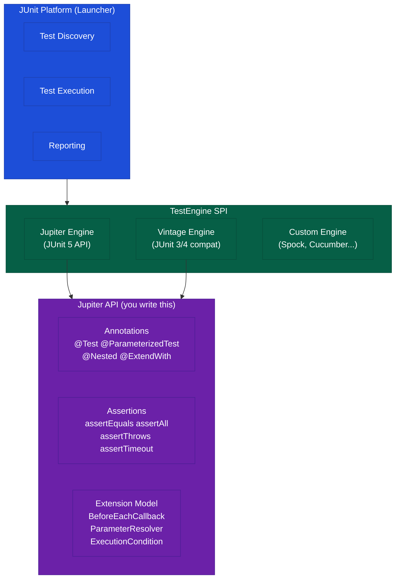
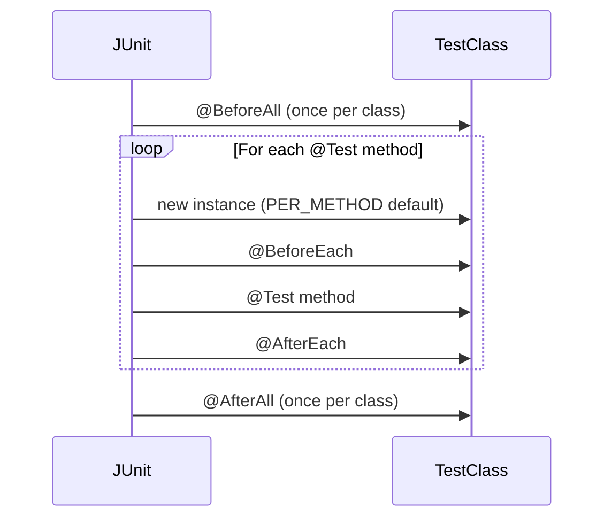

# JUnit 5 and Assertions

## TL;DR

JUnit 5 = **Jupiter API** (new annotation model) + **Platform** (test engine launcher) + **Vintage** (JUnit 3/4 compatibility). The test lifecycle flows: `@BeforeAll` → `@BeforeEach` → `@Test` → `@AfterEach` → `@AfterAll`. Use `@ParameterizedTest` with `@ValueSource` / `@CsvSource` / `@MethodSource` for data-driven tests without duplication. `@Nested` organises related tests into inner classes with their own lifecycle. `assertAll` groups multiple assertions that all run regardless of individual failures (no short-circuit). `assertThrows` verifies both the exception type and returns the exception for further inspection. `@ExtendWith` registers extensions like `MockitoExtension` or `SpringExtension`. `@DisplayName` and `@Tag` enable human-readable names and suite-level filtering.

---

## Intuition

- **JUnit as a safety net** — every test is a guardrail that prevents regressions from reaching production
- **`@BeforeEach` = prep your workbench** — wipe the slate before each experiment so no experiment contaminates the next
- **`@ParameterizedTest` = automated repetition** — instead of copy-pasting the same test 10 times with different inputs, write it once and let JUnit drive it with a data source
- **`@Nested` = filing cabinet** — group related test scenarios (happy path, error path, edge cases) into labelled folders without creating new test classes
- **`assertAll` = run all checks, not just the first failure** — like a doctor checking all vital signs rather than stopping at the first anomaly

---

## How It Works

### JUnit 5 Architecture



### Test Lifecycle



---

### Complete Comprehensive Test Class

```java
@ExtendWith(MockitoExtension.class)
@TestInstance(TestInstance.Lifecycle.PER_CLASS)
@DisplayName("OrderService Tests")
class OrderServiceTest {

    @Mock private OrderRepository orderRepository;
    @Mock private PaymentService paymentService;
    @InjectMocks private OrderService orderService;

    @BeforeAll
    void setUpAll() {
        System.out.println("Setting up test class");
    }

    @BeforeEach
    void setUp() {
        // runs before each test
    }

    @AfterEach
    void tearDown() {
        // cleanup after each test
    }

    @Test
    @DisplayName("Should place order successfully when payment succeeds")
    void shouldPlaceOrderWhenPaymentSucceeds() {
        // Arrange
        Order order = new Order("item1", 2, 99.99);
        when(paymentService.charge(any())).thenReturn(PaymentResult.success("txn-123"));
        when(orderRepository.save(any())).thenAnswer(inv -> inv.getArgument(0));

        // Act
        Order result = orderService.placeOrder(order);

        // Assert
        assertAll("order validation",
            () -> assertNotNull(result.getId()),
            () -> assertEquals(OrderStatus.CONFIRMED, result.getStatus()),
            () -> assertEquals("txn-123", result.getTransactionId())
        );
    }

    @Test
    @DisplayName("Should throw PaymentException when payment fails")
    void shouldThrowWhenPaymentFails() {
        Order order = new Order("item1", 1, 50.0);
        when(paymentService.charge(any())).thenReturn(PaymentResult.failure("Insufficient funds"));

        PaymentException ex = assertThrows(PaymentException.class,
            () -> orderService.placeOrder(order));

        assertEquals("Insufficient funds", ex.getMessage());
    }

    @ParameterizedTest(name = "Order with {0} items at ${1} each")
    @CsvSource({
        "1, 100.00, 100.00",
        "2, 50.00,  100.00",
        "3, 33.33,  99.99",
        "0, 99.00,  0.00"
    })
    void shouldCalculateOrderTotal(int quantity, double price, double expectedTotal) {
        assertEquals(expectedTotal, quantity * price, 0.01);
    }

    @ParameterizedTest
    @ValueSource(strings = {"", "   ", "\t", "\n"})
    void shouldRejectBlankProductNames(String blankName) {
        assertThrows(IllegalArgumentException.class,
            () -> new Order(blankName, 1, 10.0));
    }

    @ParameterizedTest
    @MethodSource("validOrderProvider")
    void shouldAcceptValidOrders(Order order, OrderStatus expectedStatus) {
        // ...
    }

    static Stream<Arguments> validOrderProvider() {
        return Stream.of(
            Arguments.of(new Order("book", 1, 15.0), OrderStatus.PENDING),
            Arguments.of(new Order("laptop", 1, 999.0), OrderStatus.PENDING)
        );
    }

    @Nested
    @DisplayName("Order Cancellation")
    class CancelOrderTests {

        @Test
        @DisplayName("Should cancel a PENDING order")
        void shouldCancelPendingOrder() {
            Order order = Order.builder().status(OrderStatus.PENDING).build();
            when(orderRepository.findById(1L)).thenReturn(Optional.of(order));

            orderService.cancel(1L);

            assertEquals(OrderStatus.CANCELLED, order.getStatus());
        }

        @Test
        @DisplayName("Should throw when cancelling a SHIPPED order")
        void shouldThrowWhenCancellingShippedOrder() {
            Order order = Order.builder().status(OrderStatus.SHIPPED).build();
            when(orderRepository.findById(2L)).thenReturn(Optional.of(order));

            assertThrows(InvalidOperationException.class, () -> orderService.cancel(2L));
        }
    }

    @Test
    @Timeout(value = 500, unit = TimeUnit.MILLISECONDS)
    void shouldCompleteWithinTimeout() throws InterruptedException {
        // Should complete fast
        orderService.getOrderSummary(1L);
    }

    @Test
    @Disabled("Skipping until feature XYZ is implemented")
    void pendingTest() { }

    @TempDir
    Path tempDir;

    @Test
    void shouldWriteOrderReport() throws IOException {
        Path report = tempDir.resolve("report.txt");
        orderService.exportReport(1L, report);
        assertTrue(Files.exists(report));
    }
}
```

---

### JUnit 4 → JUnit 5 Migration Reference

| JUnit 4 Annotation | JUnit 5 Equivalent | Notes | Key Difference |
|--------------------|-------------------|-------|----------------|
| `@Test` | `@Test` | Different import: `org.junit.jupiter.api` | JUnit 5 `@Test` has no `expected` / `timeout` attrs |
| `@Before` | `@BeforeEach` | Same semantics | More descriptive name |
| `@After` | `@AfterEach` | Same semantics | More descriptive name |
| `@BeforeClass` | `@BeforeAll` | Must be static (unless PER_CLASS) | Same semantics, clearer name |
| `@AfterClass` | `@AfterAll` | Must be static (unless PER_CLASS) | Same semantics, clearer name |
| `@Ignore` | `@Disabled` | Accepts optional reason string | JUnit 5 can disable conditionally too |
| `@Category` | `@Tag` | More flexible | JUnit 5 `@Tag` is string-based, composable |
| `@RunWith` | `@ExtendWith` | Composable — multiple extensions allowed | JUnit 4 only allowed one runner |
| `@Rule` | `@ExtendWith` / `@RegisterExtension` | Rules replaced by Extension model | Extensions are more powerful |
| `Assert.assertEquals` | `Assertions.assertEquals` | Fluent arg order same | `assertAll`, `assertThrows` added |

---

## Key Concepts

### JUnit 5 Architecture (Platform / Jupiter / Vintage)

The **Platform** is the foundation that handles test discovery and execution via the `TestEngine` SPI. The **Jupiter** module provides the `@Test`, `@ParameterizedTest`, and all new annotation-based APIs you write daily. The **Vintage** module bridges JUnit 3/4 tests so you can run them on the platform during migration. Third-party engines (Spock, Cucumber, TestNG) can plug in via the same SPI. Build tools (Maven Surefire 2.22+, Gradle test) speak directly to the platform launcher.

### Test Lifecycle

`@BeforeAll` runs once after the test class is instantiated; it must be `static` by default because JUnit creates a new instance per test (`PER_METHOD` lifecycle). With `@TestInstance(Lifecycle.PER_CLASS)`, a single instance is reused across all tests in the class and `@BeforeAll` no longer needs to be static — but you must be careful about shared mutable state. `@BeforeEach` runs before every individual test method.

### @TestInstance (PER_CLASS vs PER_METHOD)

| Setting | Instance per | `@BeforeAll` static? | Shared state risk | Recommended for |
|---------|-------------|---------------------|------------------|-----------------|
| `PER_METHOD` (default) | Each `@Test` | Yes (required) | None | Most unit tests |
| `PER_CLASS` | Entire class | No | High (intentional) | Expensive setup, Kotlin/Mockito-with-non-static |

### Assertions

- `assertEquals(expected, actual)` — use `message` supplier (lambda) as 3rd arg: `() -> "computed lazily"` for zero cost when passing
- `assertSame` — reference equality (`==`), not `.equals()`
- `assertAll("group", () -> ..., () -> ...)` — runs ALL lambdas, collects ALL failures — never short-circuits
- `assertThrows(ExceptionType.class, () -> sut.method())` — returns the thrown exception so you can assert on `.getMessage()`, `.getCause()`, etc.
- `assertTimeout(Duration.ofMillis(100), () -> ...)` — waits for completion then checks; `assertTimeoutPreemptively` kills the test thread if exceeded

### @ParameterizedTest Sources

| Source | Input type | Example |
|--------|-----------|---------|
| `@ValueSource` | Single primitives/Strings/Classes | `@ValueSource(ints = {1, 2, 3})` |
| `@CsvSource` | Rows of multiple values | `@CsvSource({"1, alice", "2, bob"})` |
| `@CsvFileSource` | External CSV file | `@CsvFileSource(resources = "/data.csv")` |
| `@MethodSource` | Stream / Collection / Iterable | `@MethodSource("myFactory")` |
| `@EnumSource` | Enum values | `@EnumSource(value = Day.class, names = {"MON","TUE"})` |
| `@ArgumentsSource` | Custom `ArgumentsProvider` | Full flexibility |

JUnit 5 performs **implicit type conversion** — a `@ValueSource(strings = {"1","2"})` can feed a `long` parameter automatically.

### @Nested

Inner classes annotated with `@Nested` create a hierarchical test structure. Each nested class can define its own `@BeforeEach` / `@AfterEach` that compose with the outer class lifecycle. This is ideal for grouping tests by feature scenario (creation, update, deletion) without creating multiple separate files. Nesting can go multiple levels deep.

### Extensions

`@ExtendWith(MockitoExtension.class)` hooks into JUnit 5's extension points:
- `BeforeEachCallback` — runs setup logic (Mockito initialises mocks here)
- `ParameterResolver` — injects parameters into test methods
- `ExecutionCondition` — for `@EnabledOnOs`, `@EnabledOnJre`
- `TestInstancePostProcessor` — for `@SpringExtension` to wire the Spring context

### Conditional Execution

```java
@EnabledOnOs(OS.LINUX)
@EnabledOnJre(JRE.JAVA_21)
@EnabledIfEnvironmentVariable(named = "CI", matches = "true")
@EnabledIfSystemProperty(named = "db.type", matches = "postgres")
```

---

## Real-World Usage

Spring Boot's `spring-boot-starter-test` pulls in JUnit 5 Jupiter automatically. Maven Surefire 2.22+ and Gradle 4.6+ run JUnit 5 tests natively. JaCoCo integrates with the platform to produce per-test coverage reports. Use `@Tag("integration")` on slow tests and configure Surefire to exclude them from default builds (`mvn test -Dgroups=!integration`). `@TestMethodOrder(MethodOrderer.OrderAnnotation.class)` with `@Order(n)` enables explicit ordering for tests that must run in sequence (use sparingly — tests should be independent).

---

## Common Pitfalls

1. **Test order dependency** — tests that rely on execution order are fragile; each `@Test` must set up its own state via `@BeforeEach` or Arrange block; use `@TestMethodOrder` only when truly unavoidable (e.g., database migration sequence tests)

2. **`@BeforeAll` not static without `@TestInstance(PER_CLASS)`** — JUnit 5 throws an error at runtime; either add `static` or switch lifecycle; forgetting this after migrating from JUnit 4 is very common

3. **Not capturing the exception from `assertThrows`** — many developers write `assertThrows(Ex.class, () -> ...)` and then try to verify the message separately; the correct pattern is `Ex ex = assertThrows(...); assertEquals("msg", ex.getMessage())`

4. **Mixing JUnit 4 `@Test` import with JUnit 5** — `import org.junit.Test` (JUnit 4) will not be recognised by the Jupiter engine; always use `import org.junit.jupiter.api.Test`

5. **Overusing `@TestInstance(PER_CLASS)` with Mockito** — shared mock state between tests causes false positives; if using `PER_CLASS`, call `Mockito.reset(mock)` in `@BeforeEach` or add `@MockitoSettings(strictness = STRICT_STUBS)` to catch unused stubs

---

## Related Notes

- [[_MOC_Java_Testing|↑ Section MOC]]
- [[Mockito]]
- [[Integration_Testing_and_Testcontainers]]

---

## Review Questions

1. What is the difference between `assertAll` and multiple separate assertions? When would each approach be preferred?
2. When would you choose `@TestInstance(PER_CLASS)` and what risks does it introduce?
3. How do you test that a method throws the correct exception type AND message in a single test?

---

#Java #Testing #JUnit5 #Assertions
