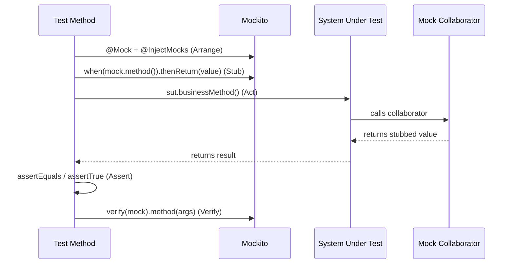

# Mockito

## TL;DR

Mockito is the dominant Java mocking library. `@Mock` creates a fully synthetic object where all methods return defaults unless stubbed; `@Spy` wraps a real object and calls real methods unless explicitly stubbed. `@InjectMocks` instantiates the System Under Test and injects all annotated mocks. `@Captor` captures arguments passed to mocks for later assertion. Stub non-void methods with `when(mock.method()).thenReturn() / thenThrow() / thenAnswer()`; stub void/spy methods with the `doReturn() / doThrow() / doNothing()` family. Use `verify()` with `times()` / `never()` / `atLeast()` to assert interactions. `ArgumentMatchers` (`any()`, `eq()`, `argThat()`) enable flexible matching. `BDDMockito` provides `given() / willReturn()` / `then().should()` for BDD-style tests. `STRICT_STUBS` mode eliminates unused stubs and unnecessary stubbing exceptions.

---

## Intuition

- **Mock = stunt double** — a synthetic actor who follows a precise script; every call is recorded, returns controlled values, has no real implementation
- **Spy = real actor with director's intervention** — the real class does real work, but you can intercept specific methods and script them
- **Captor = court stenographer** — silently records every argument passed to a method so you can inspect it after the fact
- **`@InjectMocks` = assembling your test subject with fake parts** — like building a car with dummy engine blocks to test the chassis geometry without combustion
- **`STRICT_STUBS` = a strict director** — fails the scene if you wrote a script line (stub) that was never delivered (used), keeping tests honest and minimal

---

## How It Works

### Test Double Taxonomy


### Mockito Test Flow



---

### Comprehensive Mockito Examples

```java
@ExtendWith(MockitoExtension.class)
class UserServiceTest {

    @Mock private UserRepository userRepository;
    @Mock private EmailService emailService;
    @Mock private AuditLogger auditLogger;
    @InjectMocks private UserService userService;

    @Captor private ArgumentCaptor<User> userCaptor;
    @Captor private ArgumentCaptor<String> emailCaptor;

    // Basic stubbing
    @Test
    void shouldReturnUserById() {
        User user = new User(1L, "Alice", "alice@example.com");
        when(userRepository.findById(1L)).thenReturn(Optional.of(user));

        Optional<User> result = userService.findById(1L);

        assertTrue(result.isPresent());
        assertEquals("Alice", result.get().getName());
    }

    // Exception stubbing
    @Test
    void shouldThrowWhenRepositoryFails() {
        when(userRepository.findById(anyLong()))
            .thenThrow(new DataAccessException("DB connection failed") {});

        assertThrows(ServiceException.class, () -> userService.findById(1L));
    }

    // Multiple return values (first call, second call, ...)
    @Test
    void shouldHandleSequentialCalls() {
        when(userRepository.count())
            .thenReturn(0L)   // first call
            .thenReturn(1L)   // second call
            .thenReturn(2L);  // subsequent calls

        assertEquals(0L, userRepository.count());
        assertEquals(1L, userRepository.count());
        assertEquals(2L, userRepository.count());
        assertEquals(2L, userRepository.count()); // repeats last
    }

    // thenAnswer for dynamic response
    @Test
    void shouldReturnSavedUserWithId() {
        when(userRepository.save(any(User.class)))
            .thenAnswer(invocation -> {
                User user = invocation.getArgument(0);
                user.setId(ThreadLocalRandom.current().nextLong(1, 1000));
                return user;
            });

        User saved = userService.createUser("Bob", "bob@example.com");
        assertNotNull(saved.getId());
    }

    // Void method stubbing
    @Test
    void shouldSendWelcomeEmail() {
        doNothing().when(emailService).sendWelcome(anyString());
        // or: doThrow(new MailException()).when(emailService).sendWelcome(anyString());

        userService.registerUser("Carol", "carol@example.com");

        verify(emailService).sendWelcome("carol@example.com");
    }

    // ArgumentCaptor
    @Test
    void shouldSaveUserWithCorrectData() {
        when(userRepository.save(any())).thenAnswer(i -> i.getArgument(0));

        userService.createUser("David", "david@example.com");

        verify(userRepository).save(userCaptor.capture());
        User captured = userCaptor.getValue();
        assertEquals("David", captured.getName());
        assertEquals("david@example.com", captured.getEmail());
        assertNotNull(captured.getCreatedAt());
    }

    // Argument matchers
    @Test
    void shouldUpdateUserWithAnyValidId() {
        when(userRepository.findById(argThat(id -> id > 0)))
            .thenReturn(Optional.of(new User(1L, "Eve", "eve@example.com")));

        assertTrue(userService.findById(5L).isPresent());
        assertTrue(userService.findById(100L).isPresent());
    }

    // Verify with times, never, atLeast
    @Test
    void shouldAuditOnce() {
        User user = new User(1L, "Frank", "frank@example.com");
        when(userRepository.findById(1L)).thenReturn(Optional.of(user));

        userService.findById(1L);

        verify(auditLogger, times(1)).log(anyString(), anyLong());
        verify(emailService, never()).sendWelcome(anyString());
    }

    // InOrder verification
    @Test
    void shouldAuditAfterSave() {
        InOrder inOrder = inOrder(userRepository, auditLogger);

        userService.createUser("Grace", "grace@example.com");

        inOrder.verify(userRepository).save(any());
        inOrder.verify(auditLogger).log(eq("USER_CREATED"), anyLong());
    }
}

// BDDMockito style
@ExtendWith(MockitoExtension.class)
class UserServiceBDDTest {
    @Mock private UserRepository userRepository;
    @InjectMocks private UserService userService;

    @Test
    void shouldFindUser() {
        // given
        User user = new User(1L, "Alice", "alice@example.com");
        given(userRepository.findById(1L)).willReturn(Optional.of(user));

        // when
        Optional<User> result = userService.findById(1L);

        // then
        then(userRepository).should(times(1)).findById(1L);
        assertThat(result).isPresent().get().extracting(User::getName).isEqualTo("Alice");
    }
}

// Spy example
@ExtendWith(MockitoExtension.class)
class CacheServiceTest {
    @Spy
    private CacheService cacheService = new CacheService(); // real object

    @Test
    void shouldUseCacheForRepeatedCalls() {
        // Spy calls real method by default
        String result1 = cacheService.getValue("key1");
        String result2 = cacheService.getValue("key1");

        // Verify real method was called only once (cache hit on second)
        verify(cacheService, times(1)).loadFromDatabase("key1");
        assertEquals(result1, result2);
    }

    @Test
    void shouldStubExpensiveMethod() {
        // Use doReturn (not when) with spy to avoid calling real method
        doReturn("mock-data").when(cacheService).loadFromDatabase("key2");

        String result = cacheService.getValue("key2");
        assertEquals("mock-data", result);
    }
}
```

---

### Test Double Comparison Table

| Double type | Real implementation? | Records calls? | Stubbable? | Mockito annotation | Use case |
|-------------|---------------------|---------------|------------|--------------------|----------|
| Dummy | No | No | No | — | Fill unused method parameter; never called |
| Stub | No | No | Yes | `@Mock` (no verify) | Return controlled values; not interested in verification |
| Fake | Yes (simplified) | No | No | — | In-memory repository, embedded server |
| Mock | No | Yes | Yes | `@Mock` | Verify collaborator interactions + stub returns |
| Spy | Yes (real) | Yes | Yes (partial) | `@Spy` | Intercept specific methods of an existing class |

---

## Key Concepts

### Mock vs Stub vs Spy vs Fake vs Dummy

- **Dummy**: passed as an argument to satisfy compiler; never actually invoked during test; no Mockito annotation needed
- **Stub**: returns pre-programmed answers (e.g., `when(repo.find()).thenReturn(list)`); no interaction verification; think "canned response"
- **Mock**: stub + verification; you assert that specific methods were called with specific arguments; this is `@Mock`
- **Spy**: wraps a real object; real methods execute unless you stub them; useful when only a few methods need interception
- **Fake**: a working but simplified implementation (e.g., `HashMap`-backed repository) — written by hand, not Mockito-generated

### @InjectMocks Injection Strategy

Mockito tries injection in this order:
1. **Constructor injection** — preferred; finds a constructor whose parameter types match available mocks; fails loudly if wrong
2. **Setter injection** — finds setters matching available mocks by type
3. **Field injection** — directly injects into fields by type; silently skips if no match

Constructor injection is best for testability because it makes dependencies explicit and the class compiles only with all required collaborators.

### Stubbing Non-Void Methods

```java
when(mock.method(args))
    .thenReturn(value)           // return fixed value
    .thenThrow(exception)        // throw exception
    .thenAnswer(invocation -> {  // dynamic, access args
        String arg = invocation.getArgument(0);
        return "processed-" + arg;
    })
    .thenCallRealMethod();       // delegate to real implementation (Spy)
```

Chain multiple calls for sequential behaviour: `.thenReturn(a).thenReturn(b).thenReturn(c)` — last answer repeats for all subsequent calls.

### Stubbing Void Methods (doX family)

```java
doNothing().when(mock).voidMethod(args);     // explicit no-op (default for mocks)
doThrow(new Ex()).when(mock).voidMethod();    // throw from void
doReturn(val).when(spy).nonVoidMethod();     // avoid calling real method on spy
doAnswer(inv -> { ... }).when(mock).method();// dynamic for void
```

**Critical rule**: with a `@Spy`, ALWAYS use `doReturn()` instead of `when().thenReturn()`. Using `when()` on a spy calls the real method BEFORE the stub is applied — if the real method has side effects or throws, your test breaks before any stubbing occurs.

### Argument Matchers

Matchers must be used for ALL arguments in a call, or none. You cannot mix matchers and raw values — wrap raw values with `eq()`:

```java
// WRONG: mixes raw and matcher
when(mock.find(1L, anyString())).thenReturn(result);

// CORRECT: wrap raw value with eq()
when(mock.find(eq(1L), anyString())).thenReturn(result);
```

| Matcher | Meaning |
|---------|---------|
| `any()` / `any(Class)` | Any object (typed) |
| `anyString()` / `anyLong()` | Any primitive/String |
| `eq(value)` | Specific value (uses `.equals()`) |
| `same(ref)` | Reference equality (`==`) |
| `argThat(pred)` | Custom `ArgumentMatcher` predicate |
| `isNull()` / `notNull()` | Null / non-null |
| `contains("str")` | String contains |

### Verification

```java
verify(mock).method(args);                      // exactly once (default)
verify(mock, times(3)).method(args);            // exactly 3 times
verify(mock, never()).method(args);             // never called
verify(mock, atLeast(2)).method(args);          // 2 or more times
verify(mock, atMost(5)).method(args);           // 5 or fewer times
verify(mock, atLeastOnce()).method(args);       // 1 or more times
verifyNoMoreInteractions(mock1, mock2);         // no other calls after verified ones
verifyNoInteractions(mock);                     // zero calls to this mock
```

`InOrder inOrder = inOrder(mock1, mock2)` verifies that calls happened in the specified sequence across mocks.

### ArgumentCaptor

Useful when you want to assert on a complex object that was passed to a collaborator and `eq()` is too blunt:

```java
@Captor ArgumentCaptor<EmailMessage> emailCaptor;

// After act:
verify(emailService).send(emailCaptor.capture());
EmailMessage sent = emailCaptor.getValue();             // single capture
List<EmailMessage> all = emailCaptor.getAllValues();    // multiple calls captured

assertEquals("Welcome!", sent.getSubject());
assertTrue(sent.getTo().contains("alice@example.com"));
```

### BDDMockito

Provides `given/when/then` language that mirrors Gherkin BDD syntax, eliminating the semantic confusion of Mockito's `when` in the Arrange phase:

```java
import static org.mockito.BDDMockito.*;

// given
given(repo.findById(1L)).willReturn(Optional.of(user));
willThrow(new Ex()).given(service).doSomething();

// then (verify)
then(repo).should(times(1)).findById(1L);
then(emailService).shouldHaveNoInteractions();
```

### STRICT_STUBS Mode

```java
@MockitoSettings(strictness = Strictness.STRICT_STUBS)
class MyTest { ... }
// or via: MockitoExtension uses STRICT_STUBS by default in recent versions
```

Benefits:
- **Fails on unused stubs** — stub was set up but the test never triggered it → test was over-specified or the code changed
- **Prevents unnecessary stubbing** — each stub must be used at least once
- Produces cleaner, minimal tests; stubs document actual behaviour paths taken

---

## Real-World Usage

Spring Boot Test includes Mockito out of the box. `@MockBean` creates a Mockito mock that is registered in the Spring application context and replaces any real bean of that type; `@SpyBean` wraps the real bean. Spring Security test (`@WithMockUser`) uses a mock `SecurityContext`. AssertJ's `assertThat` pairs well with Mockito — use `assertThat(result)` chains alongside Mockito `verify` for expressive tests.

---

## Common Pitfalls

1. **Using `when()` instead of `doReturn()` with a Spy** — calls the real method before stubbing; use `doReturn().when(spy).method()` without exception

2. **Mixing matchers and raw values in argument list** — throws `InvalidUseOfMatchersException` at runtime; always wrap raw values with `eq()` when any argument uses a matcher

3. **Verifying before stubbing causes `UnnecessaryStubbingException`** — in `STRICT_STUBS` mode, every stub must be exercised by the test; remove stubs that are never reached or move them to the test that uses them

4. **Unstubbed mock returns null for complex types** — `@Mock` returns `null` for any unstubbed method returning a reference type; if the SUT calls a method on the returned `null`, you get an NPE in the SUT, which is confusing to diagnose; use `thenReturn(empty collection)` or `Optional.empty()` proactively

5. **`@InjectMocks` silently fails field injection** — if Mockito cannot inject a mock (type mismatch, no matching constructor/setter), it silently leaves the field `null`; prefer constructor injection in production code so missing mocks cause compilation errors, not NPEs

---

## Related Notes

- [[_MOC_Java_Testing|↑ Section MOC]]
- [[JUnit5_and_Assertions]]
- [[Integration_Testing_and_Testcontainers]]

---

## Review Questions

1. What is the difference between `@Mock` and `@Spy`? When would you choose a Spy over a Mock?
2. Why must you use `doReturn()` instead of `when().thenReturn()` when stubbing a Spy method?
3. How does `ArgumentCaptor` help you assert on complex objects passed to a collaborator, and when is it preferable to `eq()` matcher?

---

#Java #Testing #Mockito #Mocking
