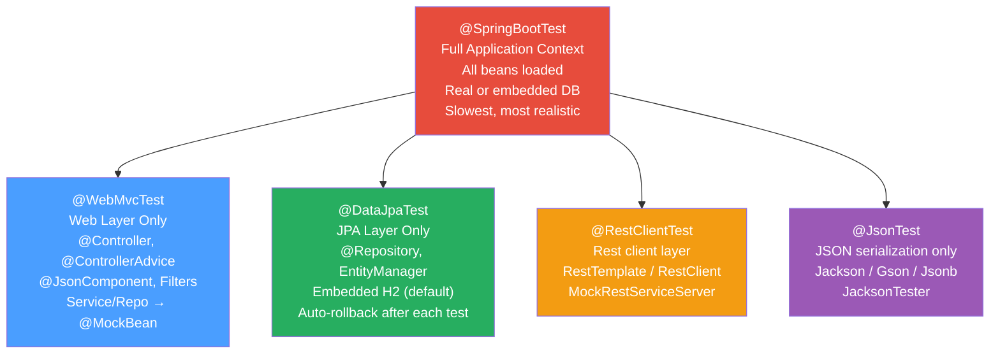

# 🌱 Spring Boot Testing

> [!abstract] TL;DR
> Spring Boot provides **test slices** — targeted annotations that load only the portion of the Spring context relevant to a layer, making tests faster and more focused than a full `@SpringBootTest`. Use `@WebMvcTest` for the web layer, `@DataJpaTest` for the persistence layer, and full `@SpringBootTest` only for end-to-end integration tests. `@MockBean` replaces a bean in the context with a Mockito mock; `@DynamicPropertySource` injects Testcontainers connection strings at runtime without touching config files.

---

## Intuition — the Film Studio Set Analogy

- **`@SpringBootTest`** = building the entire movie studio (every department: lighting, catering, wardrobe, editing) to film one scene. Correct but slow and expensive.
- **Test slices (`@WebMvcTest`, `@DataJpaTest`, etc.)** = filming on a purpose-built minimal set. Need a restaurant scene? Build just the restaurant set. The rest of the studio doesn't exist during this shot — tests are faster, focused, and failures are easier to diagnose.
- **`@MockBean`** = a cardboard prop replacing a real actor. The web-layer test doesn't need a real database — a `@MockBean` OrderService returns scripted answers.
- **`@DynamicPropertySource`** = a last-minute script change delivered to actors (Spring's property resolver) — Testcontainers starts a real PostgreSQL container and injects its random port into `spring.datasource.url` before any test runs.
- **`@Sql`** = a prop master who sets the stage (inserts DB rows) before filming and strikes the set (rolls back) after the scene.

---

## How It Works



---

## Key Concepts / Details

### @SpringBootTest — Full Context Integration Test

```java
import org.springframework.boot.test.context.SpringBootTest;
import org.springframework.boot.test.web.client.TestRestTemplate;
import org.springframework.boot.test.web.server.LocalServerPort;

// Loads ALL beans; spins up embedded Tomcat on a random port
@SpringBootTest(webEnvironment = SpringBootTest.WebEnvironment.RANDOM_PORT)
class OrderApiIntegrationTest {

    @LocalServerPort
    private int port;                      // inject the random port assigned by Tomcat

    @Autowired
    private TestRestTemplate restTemplate; // preconfigured HTTP client pointing at local server

    @Test
    void should_return_201_when_placing_valid_order() {
        PlaceOrderRequest body = new PlaceOrderRequest(1L, List.of(
            new OrderItem("book-1", 1)
        ));

        ResponseEntity<OrderDTO> response = restTemplate.postForEntity(
            "http://localhost:" + port + "/api/orders",
            body,
            OrderDTO.class
        );

        assertThat(response.getStatusCode()).isEqualTo(HttpStatus.CREATED);
        assertThat(response.getBody()).isNotNull();
        assertThat(response.getBody().status()).isEqualTo("PLACED");
    }
}


// WebEnvironment options:
//   RANDOM_PORT        — real servlet container on a random port (full HTTP stack)
//   DEFINED_PORT       — real servlet container on server.port (8080 by default)
//   MOCK               — mock servlet environment; use MockMvc (no real HTTP)
//   NONE               — no web environment (for non-web integration tests)
```

### @WebMvcTest — Web Layer Slice

```java
import org.springframework.boot.test.autoconfigure.web.servlet.WebMvcTest;
import org.springframework.test.web.servlet.MockMvc;
import org.springframework.boot.test.mock.mockito.MockBean;

// Loads ONLY: @Controller, @ControllerAdvice, @JsonComponent, WebMvcConfigurer
// Does NOT load: @Service, @Repository, @Component (they must be @MockBean)
// Uses mock servlet environment — no real HTTP port
@WebMvcTest(OrderController.class)   // optionally narrow to one controller
class OrderControllerTest {

    @Autowired
    private MockMvc mockMvc;           // pre-configured — no setup needed

    @MockBean
    private OrderService orderService; // replaces OrderService bean in context with Mockito mock

    @MockBean
    private OrderMapper mapper;

    @Test
    void should_return_201_with_order_body_when_request_is_valid() throws Exception {
        // Given
        OrderDTO dto = new OrderDTO(1L, "John", new BigDecimal("50.00"), "PLACED", List.of());
        when(orderService.placeOrder(any())).thenReturn(dto);

        // When / Then
        mockMvc.perform(post("/api/orders")
                .contentType(MediaType.APPLICATION_JSON)
                .content("""
                        {
                          "customerId": 1,
                          "items": [{"sku": "book-1", "quantity": 1}]
                        }
                        """))
               .andExpect(status().isCreated())
               .andExpect(jsonPath("$.status").value("PLACED"))
               .andExpect(jsonPath("$.id").value(1));

        verify(orderService).placeOrder(any(PlaceOrderCommand.class));
    }

    @Test
    void should_return_400_when_items_list_is_empty() throws Exception {
        mockMvc.perform(post("/api/orders")
                .contentType(MediaType.APPLICATION_JSON)
                .content("""{ "customerId": 1, "items": [] }"""))
               .andExpect(status().isBadRequest())
               .andExpect(jsonPath("$.errors[0]").exists());
    }

    // Test security: @WithMockUser simulates an authenticated principal
    @Test
    @WithMockUser(roles = "ADMIN")
    void should_return_200_for_admin_on_secured_endpoint() throws Exception {
        mockMvc.perform(get("/api/admin/orders"))
               .andExpect(status().isOk());
    }
}
```

### @DataJpaTest — JPA / Repository Slice

```java
import org.springframework.boot.test.autoconfigure.orm.jpa.DataJpaTest;
import org.springframework.boot.test.autoconfigure.orm.jpa.TestEntityManager;

// Loads: JPA repositories, @Entity classes, EntityManager, H2 in-memory DB (default)
// Does NOT load: @Service, @Component, @Controller
// Each test runs in a transaction that is ROLLED BACK after the test (auto-rollback)
@DataJpaTest
class OrderRepositoryTest {

    @Autowired
    private OrderRepository repo;

    @Autowired
    private TestEntityManager em;  // lightweight helper for test setup (persist + flush)

    @Test
    void should_find_orders_by_customer_and_status() {
        // Arrange: use TestEntityManager to bypass the repository and insert directly
        Order o1 = em.persistAndFlush(Order.create(42L, List.of(item("Book", "20"))));
        Order o2 = em.persistAndFlush(Order.create(42L, List.of(item("Pen", "5"))));
        em.persistAndFlush(Order.create(99L, List.of(item("Lamp", "30")))); // different customer

        em.clear(); // clear persistence context so subsequent finds hit DB, not L1 cache

        // Act
        List<Order> found = repo.findByCustomerIdAndStatus(42L, OrderStatus.PLACED);

        // Assert
        assertThat(found).hasSize(2)
                         .extracting(Order::getCustomerId)
                         .containsOnly(42L);
    }

    @Test
    void should_persist_order_and_generate_id() {
        Order order = repo.save(Order.create(1L, List.of(item("Chair", "80"))));
        assertThat(order.getId()).isNotNull().isPositive();
    }
}


// Using real DB with Testcontainers instead of H2:
// Add @AutoConfigureTestDatabase(replace = NONE) to disable H2 replacement
// + @DynamicPropertySource to inject Testcontainers URL

@DataJpaTest
@AutoConfigureTestDatabase(replace = AutoConfigureTestDatabase.Replace.NONE)
class OrderRepositoryPostgresTest {

    @Container
    static PostgreSQLContainer<?> postgres = new PostgreSQLContainer<>("postgres:16");

    @DynamicPropertySource
    static void overrideProperties(DynamicPropertyRegistry registry) {
        registry.add("spring.datasource.url",      postgres::getJdbcUrl);
        registry.add("spring.datasource.username", postgres::getUsername);
        registry.add("spring.datasource.password", postgres::getPassword);
    }

    @Autowired private OrderRepository repo;

    @Test
    void should_persist_and_reload_from_postgres() {
        Order saved = repo.save(Order.create(1L, List.of(item("Keyboard", "60"))));
        assertThat(repo.findById(saved.getId())).isPresent();
    }
}
```

### @RestClientTest — HTTP Client Slice

```java
import org.springframework.boot.test.autoconfigure.web.client.RestClientTest;
import org.springframework.test.web.client.MockRestServiceServer;
import org.springframework.test.web.client.match.MockRestRequestMatchers.*;
import org.springframework.test.web.client.response.MockRestResponseCreators.*;

// Loads: RestTemplate / RestClient beans declared in the target component
// @MockRestServiceServer intercepts HTTP calls — no real network
@RestClientTest(WeatherClient.class)
class WeatherClientTest {

    @Autowired
    private WeatherClient client;        // the @Component being tested

    @Autowired
    private MockRestServiceServer server; // wired automatically

    @Test
    void should_return_temperature_for_city() {
        server.expect(requestTo("https://api.weather.com/current?city=London"))
              .andExpect(method(HttpMethod.GET))
              .andRespond(withSuccess("""
                      {"temp": 18.5, "unit": "C"}
                      """, MediaType.APPLICATION_JSON));

        WeatherResponse result = client.getWeather("London");

        assertThat(result.temp()).isEqualTo(18.5);
        server.verify(); // assert all expected requests were made
    }
}
```

### @JsonTest — Serialization Slice

```java
import org.springframework.boot.test.autoconfigure.json.JsonTest;
import org.springframework.boot.test.json.JacksonTester;

// Loads: Jackson ObjectMapper (configured as per your application), no other beans
@JsonTest
class OrderDTOJsonTest {

    @Autowired
    private JacksonTester<OrderDTO> json;

    @Test
    void should_serialize_order_dto_correctly() throws Exception {
        OrderDTO dto = new OrderDTO(1L, "Alice", new BigDecimal("99.99"), "PLACED", List.of());

        assertThat(json.write(dto))
            .hasJsonPathNumberValue("$.id", 1)
            .hasJsonPathStringValue("$.customerName", "Alice")
            .hasJsonPathStringValue("$.status", "PLACED")
            .doesNotHaveJsonPath("$.internalField"); // ensure sensitive fields are excluded
    }

    @Test
    void should_deserialize_json_to_order_dto() throws Exception {
        String content = """
            {"id": 1, "customerName": "Alice", "totalAmount": 99.99, "status": "PLACED"}
            """;

        assertThat(json.parse(content))
            .usingRecursiveComparison()
            .isEqualTo(new OrderDTO(1L, "Alice", new BigDecimal("99.99"), "PLACED", List.of()));
    }
}
```

### @MockBean vs @SpyBean

```java
// @MockBean: replaces the bean in the Spring context with a Mockito mock
//   - All methods return Mockito defaults (null, 0, false, empty collections)
//   - You stub methods explicitly with when(...).thenReturn(...)
//   - Use when you want to control the collaborator completely
@MockBean
private OrderService orderService;
when(orderService.placeOrder(any())).thenReturn(fakeOrder);


// @SpyBean: wraps the REAL Spring bean with a Mockito spy
//   - Real methods are called by default
//   - You can selectively stub individual methods
//   - Use when you want REAL behavior with specific overrides
@SpyBean
private EmailService emailService;
doNothing().when(emailService).sendEmail(any());  // stub just the email send; rest is real

// When to use which:
//   @MockBean  → external integrations (DB, external API, file system)
//   @SpyBean   → partially mock a real service (verify calls + override side effects)
```

### @Sql — Test Data Setup

```java
import org.springframework.test.context.jdbc.Sql;

// Execute SQL scripts before/after tests (works with @SpringBootTest and @DataJpaTest)
@SpringBootTest
@Sql("/test-data/orders.sql")                                   // run before each test
@Sql(scripts = "/test-data/cleanup.sql", executionPhase = Sql.ExecutionPhase.AFTER_TEST_METHOD)
class OrderSearchIntegrationTest {
    // orders.sql inserts 10 test orders; cleanup.sql deletes them after each test
}

// Per-method override:
@Test
@Sql("/test-data/premium-customer.sql")  // additional script for this test only
void should_apply_premium_discount() { ... }

// orders.sql example:
// INSERT INTO orders (id, customer_id, status, total_amount)
// VALUES (1, 100, 'PLACED', 50.00),
//        (2, 100, 'SHIPPED', 120.00),
//        (3, 200, 'PLACED', 30.00);
```

### @DynamicPropertySource — Testcontainers Integration

```java
import org.testcontainers.containers.PostgreSQLContainer;
import org.testcontainers.junit.jupiter.Container;
import org.testcontainers.junit.jupiter.Testcontainers;
import org.springframework.test.context.DynamicPropertyRegistry;
import org.springframework.test.context.DynamicPropertySource;

// @Testcontainers: JUnit 5 extension — starts/stops containers automatically
// @Container + static: single container reused across ALL tests in the class (faster)
@SpringBootTest
@Testcontainers
class FullStackIntegrationTest {

    @Container
    static PostgreSQLContainer<?> postgres =
        new PostgreSQLContainer<>("postgres:16-alpine")
            .withInitScript("schema.sql");   // run schema on container start

    @Container
    static GenericContainer<?> redis =
        new GenericContainer<>("redis:7-alpine").withExposedPorts(6379);

    @DynamicPropertySource
    static void registerProperties(DynamicPropertyRegistry registry) {
        // Called BEFORE Spring context starts — overrides application.properties
        registry.add("spring.datasource.url",      postgres::getJdbcUrl);
        registry.add("spring.datasource.username", postgres::getUsername);
        registry.add("spring.datasource.password", postgres::getPassword);
        registry.add("spring.data.redis.host",     redis::getHost);
        registry.add("spring.data.redis.port",     () -> redis.getMappedPort(6379));
    }
}
```

### Test Execution Order and Parallel Tests

```java
// ── @TestMethodOrder: control execution order within a class ─────────────────
import org.junit.jupiter.api.MethodOrderer;
import org.junit.jupiter.api.TestMethodOrder;

@TestMethodOrder(MethodOrderer.OrderAnnotation.class)  // use @Order on methods
class OrderedWorkflowTest {
    @Test @Order(1) void placeOrder() { ... }
    @Test @Order(2) void processPayment() { ... }
    @Test @Order(3) void shipOrder() { ... }
}
// Note: Prefer independent tests over ordered ones. Use @TestMethodOrder only for
// stateful integration tests (e.g., verifying a full workflow against a real DB).


// ── Parallel test execution ───────────────────────────────────────────────────
// junit-platform.properties (src/test/resources):
//   junit.jupiter.execution.parallel.enabled = true
//   junit.jupiter.execution.parallel.mode.default = concurrent       # test methods
//   junit.jupiter.execution.parallel.mode.classes.default = concurrent # test classes
//   junit.jupiter.execution.parallel.config.strategy = dynamic        # auto-size pool
//   junit.jupiter.execution.parallel.config.dynamic.factor = 1        # cores * factor

// Mark non-parallelizable tests with @ResourceLock or @Isolated:
@Isolated               // run this test class in isolation (not concurrent with others)
class SharedResourceTest { ... }

@ResourceLock("db")     // only one test with "db" lock runs at a time
@Test void requiresExclusiveDbAccess() { ... }
```

### Test Slices Comparison Table

| Annotation | What's Loaded | What's Excluded | DB | Use When |
|---|---|---|---|---|
| `@SpringBootTest` | Entire context | Nothing | Real/embedded | Full E2E, cross-layer |
| `@WebMvcTest` | Web layer only | Services, repos | None | Controller logic, request mapping, validation |
| `@DataJpaTest` | JPA repos + entities | Web, services | H2 (default) or Testcontainers | Repository queries, entity mapping |
| `@RestClientTest` | RestTemplate bean | Services, web | None | Outbound HTTP client |
| `@JsonTest` | Jackson config | Everything else | None | JSON serialization contracts |
| `@DataMongoTest` | MongoDB repos | Web, services | Embedded Mongo | MongoDB repositories |
| `@DataRedisTest` | Redis repos | Web, services | None | Redis repository operations |
| `@JdbcTest` | JdbcTemplate | JPA, web | H2 (default) | Raw SQL with JdbcTemplate |

---

## Real-World Notes

- **Context caching**: Spring caches application contexts across tests — as long as the configuration is identical, the second test class reuses the same context (much faster). Adding `@MockBean` or `@DynamicPropertySource` creates a new context variant. Minimize `@MockBean` to maximize cache hits.
- **`@ActiveProfiles("test")`**: switch to a test-specific profile (`application-test.properties`) to override DB URLs, disable security, or configure stubs without polluting production config.
- **WireMock** is the preferred alternative to `MockRestServiceServer` for stubbing external HTTP services — it supports more realistic scenarios (response delays, error codes, request body matching) via a local HTTP server.
- **Testcontainers `@ServiceConnection`** (Spring Boot 3.1+): automatically configures the datasource from a `@Container` without `@DynamicPropertySource`:
  ```java
  @Container
  @ServiceConnection
  static PostgreSQLContainer<?> postgres = new PostgreSQLContainer<>("postgres:16");
  // Spring Boot detects @ServiceConnection and wires up datasource automatically
  ```
- **`@TestConfiguration`**: add beans to the context for tests only — useful for providing a test-specific implementation of an interface without `@MockBean`.

---

## Common Pitfalls

1. **Overusing `@SpringBootTest`**: Loading the full context for every test inflates the test suite from seconds to minutes. Use the appropriate slice (`@WebMvcTest`, `@DataJpaTest`) for 80% of tests.

2. **`@MockBean` breaking context cache**: Each unique set of `@MockBean` declarations in the test class results in a new Spring context being created. If ten test classes each add a different set of `@MockBean`, you get ten contexts — multiply startup time by ten. Group tests with the same mock requirements.

3. **`@DataJpaTest` with real DB dialect differences**: H2 accepts SQL that PostgreSQL rejects (e.g., sequence behavior, JSON operators, window functions). Tests pass in H2 but fail in production. Use Testcontainers with `@AutoConfigureTestDatabase(replace = NONE)` for dialect-sensitive queries.

4. **Forgetting `em.clear()` in `@DataJpaTest`**: Hibernate's L1 cache means `repo.findById()` after `em.persist()` may return the cached in-memory object, never hitting the DB. Call `em.clear()` after setup to force a fresh load from the DB.

5. **`@Transactional` on `@SpringBootTest` with real HTTP**: Wrapping an `@SpringBootTest(RANDOM_PORT)` test in `@Transactional` does not work — the HTTP request runs in a different thread (different transaction). The transaction around the test method rolls back, but the service's transaction already committed. Use `@Sql` with cleanup scripts instead.

6. **Not testing `@ControllerAdvice` in `@WebMvcTest`**: `@WebMvcTest` loads `@ControllerAdvice` automatically — add tests for validation error responses and exception handling to ensure the advice is correctly wired.

---

## Related Concepts

- [[Test_Driven_Development]] — TDD workflow that drives when to use each test slice
- [[JUnit5_Basics]] — @BeforeEach, @Nested, @ParameterizedTest, test lifecycle
- [[Mockito_Essentials]] — when/thenReturn, verify, ArgumentCaptor used inside @WebMvcTest
- [[Spring_Data_JPA]] — understanding what @DataJpaTest loads and why
- [[_MOC_Testing|↑ Section MOC]]

---

## Review Questions

1. What is a Spring Boot test slice? Name three slice annotations and describe exactly which beans each loads and which it excludes.

2. Explain the difference between `@MockBean` and `@SpyBean`. In a `@WebMvcTest`, when would you prefer `@SpyBean` over `@MockBean`?

3. Why does `@DynamicPropertySource` exist and how does it solve the Testcontainers configuration problem? What does `@ServiceConnection` (Spring Boot 3.1+) offer as an improvement?

---

## Sources

- Spring Boot Testing Reference — https://docs.spring.io/spring-boot/docs/current/reference/html/features.html#features.testing
- Testcontainers for Java — https://java.testcontainers.org/
- JUnit 5 User Guide — https://junit.org/junit5/docs/current/user-guide/
- Baeldung — Spring Boot Test: https://www.baeldung.com/spring-boot-testing

#Java #Testing #SpringBoot #WebMvcTest #DataJpaTest #Testcontainers #MockBean #TestSlices
