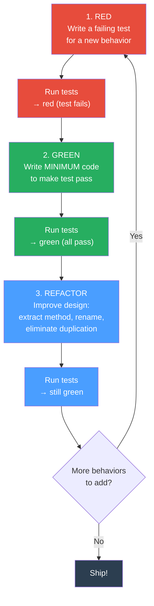

# 🔴🟢♻️ Test-Driven Development in Java

> [!abstract] TL;DR
> TDD is a design practice, not just a testing practice: write a **failing test first** (Red), write the **minimal code to pass it** (Green), then **improve the design** without breaking tests (Refactor). The test suite becomes executable documentation and a safety net, catching regressions in milliseconds. TDD's biggest payoff is in forcing small, testable, decoupled units of code — classes that are hard to test are often hard to reason about.

---

## Intuition — the Sculptor's Approach

- **Traditional coding** = build a marble statue, then find out the client wanted a bust, not a full figure. You may need to break off a lot of marble.
- **TDD** = the client describes the finished shape (test) before you pick up the chisel. You carve only what passes the description (minimum code), then refine the surface (refactor). Each description gates the next — you always know exactly when you're done.
- **Red** = the test is an X-ray of expected behavior — it defines the interface before implementation.
- **Green** = even ugly code that makes the test pass is valid here. Correctness first, elegance later.
- **Refactor** = now that you know the code works, you can safely improve its design because the tests will catch any breakage.

---

## How It Works



---

## Key Concepts / Details

### Red-Green-Refactor Cycle — Step by Step

```java
// ══════════════════════════════════════════════════════════════════════════════
// SCENARIO: TDD a ShoppingCart domain service from scratch
// Requirement: "The cart total should equal the sum of item prices,
//               and a 10% discount applies when total > 100."
// ══════════════════════════════════════════════════════════════════════════════


// ── STEP 1: RED ───────────────────────────────────────────────────────────────
// Write the test BEFORE any implementation exists
// The class ShoppingCart doesn't exist yet — this test MUST fail to compile first.

import org.junit.jupiter.api.*;
import static org.assertj.core.api.Assertions.*;

class ShoppingCartTest {

    // Test name: should_<expected>_when_<condition> (or given_when_then)
    @Test
    void should_return_zero_total_when_cart_is_empty() {
        ShoppingCart cart = new ShoppingCart();    // doesn't exist yet → RED (compile error)
        assertThat(cart.total()).isEqualByComparingTo("0.00");
    }
}
// Run → FAIL (won't compile). Good. We now know exactly what to build.


// ── STEP 2: GREEN (minimum code) ─────────────────────────────────────────────
// Create JUST enough to make the test pass. No more.

public class ShoppingCart {
    public BigDecimal total() {
        return BigDecimal.ZERO;   // simplest possible implementation
    }
}
// Run → PASS. Now add the next behavior.


// ── STEP 3: RED (next behavior) ───────────────────────────────────────────────
// TDD one behavior at a time

    @Test
    void should_sum_item_prices() {
        ShoppingCart cart = new ShoppingCart();
        cart.add(new Item("Book",  new BigDecimal("20.00")));
        cart.add(new Item("Pen",   new BigDecimal("5.00")));

        assertThat(cart.total()).isEqualByComparingTo("25.00");
    }
// Run → FAIL. cart.add() doesn't exist and total() always returns 0.


// ── STEP 4: GREEN ─────────────────────────────────────────────────────────────
public class ShoppingCart {
    private final List<Item> items = new ArrayList<>();

    public void add(Item item) { items.add(item); }

    public BigDecimal total() {
        return items.stream()
                    .map(Item::price)
                    .reduce(BigDecimal.ZERO, BigDecimal::add);
    }
}
// Run all tests → both PASS.


// ── STEP 5: RED (discount behavior) ──────────────────────────────────────────

    @Test
    void should_apply_10_percent_discount_when_total_exceeds_100() {
        ShoppingCart cart = new ShoppingCart();
        cart.add(new Item("Laptop", new BigDecimal("120.00")));

        // 120.00 * 0.90 = 108.00
        assertThat(cart.total()).isEqualByComparingTo("108.00");
    }

    @Test
    void should_not_apply_discount_when_total_is_exactly_100() {
        ShoppingCart cart = new ShoppingCart();
        cart.add(new Item("Chair", new BigDecimal("100.00")));

        assertThat(cart.total()).isEqualByComparingTo("100.00"); // no discount
    }


// ── STEP 6: GREEN ─────────────────────────────────────────────────────────────
public BigDecimal total() {
    BigDecimal subtotal = items.stream()
                               .map(Item::price)
                               .reduce(BigDecimal.ZERO, BigDecimal::add);

    if (subtotal.compareTo(new BigDecimal("100")) > 0) {
        return subtotal.multiply(new BigDecimal("0.90"))
                       .setScale(2, RoundingMode.HALF_UP);
    }
    return subtotal.setScale(2, RoundingMode.HALF_UP);
}
// All 4 tests pass.


// ── STEP 7: REFACTOR ──────────────────────────────────────────────────────────
// Extract magic values; improve readability. Tests remain green throughout.

public class ShoppingCart {
    private static final BigDecimal DISCOUNT_THRESHOLD = new BigDecimal("100");
    private static final BigDecimal DISCOUNT_RATE      = new BigDecimal("0.90");

    private final List<Item> items = new ArrayList<>();

    public void add(Item item) {
        Objects.requireNonNull(item, "Item must not be null");
        items.add(item);
    }

    public BigDecimal total() {
        BigDecimal subtotal = calculateSubtotal();
        return isEligibleForDiscount(subtotal) ? applyDiscount(subtotal) : subtotal;
    }

    private BigDecimal calculateSubtotal() {
        return items.stream()
                    .map(Item::price)
                    .reduce(BigDecimal.ZERO, BigDecimal::add)
                    .setScale(2, RoundingMode.HALF_UP);
    }

    private boolean isEligibleForDiscount(BigDecimal amount) {
        return amount.compareTo(DISCOUNT_THRESHOLD) > 0;
    }

    private BigDecimal applyDiscount(BigDecimal amount) {
        return amount.multiply(DISCOUNT_RATE).setScale(2, RoundingMode.HALF_UP);
    }
}
// Run all tests → still green. Design improved without breaking anything.
```

### FIRST Properties — What Makes a Good Unit Test

```java
// FIRST acronym for unit test quality:
//
//  F — Fast:        Runs in milliseconds. No DB, no network, no filesystem.
//                   Slow tests are skipped; skipped tests catch nothing.
//
//  I — Isolated:    Each test sets up its own state. No shared mutable state
//                   between tests (ordering must not matter).
//
//  R — Repeatable:  Same result every run, every environment, every time.
//                   No time dependencies, no randomness, no environment assumptions.
//
//  S — Self-validating: Pass or fail without a human reading output.
//                   Use assertions, not println statements.
//
//  T — Timely:      Written at the same time as (ideally BEFORE) the production code.
//                   Tests written months later are retrofitting, not TDD.

// Good test (FIRST-compliant):
@Test
void should_throw_when_adding_null_item() {
    ShoppingCart cart = new ShoppingCart();  // F: no I/O; I: own setup; R: no side effects
    assertThatThrownBy(() -> cart.add(null)) // S: assertion-based
        .isInstanceOf(NullPointerException.class)
        .hasMessage("Item must not be null");
}

// Bad test (violates FIRST):
@Test
void testTotal() {                            // ❌ vague name; no "when" condition stated
    ShoppingCart cart = sharedCart;           // ❌ not Isolated — depends on global state
    System.out.println(cart.total());         // ❌ not Self-validating
    Thread.sleep(1000);                       // ❌ not Fast
}
```

### Test Naming Conventions

```java
// Convention 1: should_expectedBehavior_when_condition (most common in Java)
@Test void should_return_empty_list_when_no_orders_exist() {}
@Test void should_throw_IllegalArgument_when_amount_is_negative() {}
@Test void should_apply_vat_when_customer_is_in_eu() {}

// Convention 2: BDD-style given_when_then
@Test void given_premium_user_when_checkout_then_free_shipping_applied() {}

// Convention 3: JUnit 5 @DisplayName for full sentences
@Test
@DisplayName("Cart total equals sum of item prices plus tax, rounded to 2 decimal places")
void totalIncludesTax() {}

// Use @Nested classes to group related tests (also creates readable hierarchies in reports):
class ShoppingCartTest {
    @Nested
    class WhenEmpty {
        @Test void should_return_zero_total() {}
        @Test void should_throw_when_checking_out() {}
    }
    @Nested
    class WhenContainingItems {
        @Test void should_sum_all_item_prices() {}
        @Test void should_apply_discount_above_threshold() {}
    }
}
```

### Test Pyramid

```
                    /\
                   /  \       E2E Tests (10%)
                  /    \      Selenium, REST Assured against running system
                 /──────\     Slow, brittle, expensive, catch integration bugs
                /        \
               /          \   Integration Tests (20%)
              /   INTEG    \  @SpringBootTest, @DataJpaTest, Testcontainers
             /──────────────\ Real DB, real Spring context, slower but realistic
            /                \
           /    UNIT   (70%)  \ JUnit 5 + Mockito
          /                    \ Fast (ms), isolated, cover all edge cases
         /──────────────────────\
```

```java
// Unit test (no Spring, no DB — pure business logic)
// Fast: < 1ms; run on every keystroke in IDE
class DiscountCalculatorTest {
    private final DiscountCalculator calc = new DiscountCalculator();

    @Test
    void should_give_20_percent_for_premium_customers() {
        BigDecimal price = new BigDecimal("100");
        BigDecimal result = calc.apply(price, CustomerTier.PREMIUM);
        assertThat(result).isEqualByComparingTo("80.00");
    }
}

// Integration test (Spring context, real H2 DB)
// Slower: ~500ms; run before commit
@DataJpaTest
class OrderRepositoryTest {
    @Autowired private OrderRepository repo;

    @Test
    void should_find_orders_by_customer() {
        repo.save(new Order(1L, OrderStatus.PLACED));
        List<Order> found = repo.findByCustomerId(1L);
        assertThat(found).hasSize(1);
    }
}

// E2E test (full running service, HTTP calls)
// Slow: seconds; run in CI only
@SpringBootTest(webEnvironment = WebEnvironment.RANDOM_PORT)
class CheckoutE2ETest {
    @Autowired private TestRestTemplate restTemplate;

    @Test
    void should_return_201_on_valid_order() {
        ResponseEntity<OrderDTO> resp = restTemplate.postForEntity(
            "/api/orders", new PlaceOrderRequest(...), OrderDTO.class);
        assertThat(resp.getStatusCode()).isEqualTo(HttpStatus.CREATED);
    }
}
```

### Applying TDD to Spring Boot — Domain-First

```java
// TDD works best starting from the INSIDE (domain) and working OUT.
// 1. TDD the domain entity (pure Java, no Spring, no mocks)
// 2. TDD the service layer (mock the repository)
// 3. TDD the repository (use @DataJpaTest with H2)
// 4. TDD the controller (use @WebMvcTest with MockMvc)

// Step 1: Domain entity TDD — NO Spring annotations
class OrderTest {
    @Test
    void should_be_in_placed_status_after_creation() {
        Order order = Order.create(42L, List.of(item("Book", "20.00")));
        assertThat(order.getStatus()).isEqualTo(OrderStatus.PLACED);
        assertThat(order.getItems()).hasSize(1);
    }

    @Test
    void should_throw_when_created_with_no_items() {
        assertThatThrownBy(() -> Order.create(42L, List.of()))
            .isInstanceOf(IllegalArgumentException.class)
            .hasMessage("Order must have at least one item");
    }
}

// Step 2: Service layer TDD — Mockito mocks the repository
@ExtendWith(MockitoExtension.class)
class OrderServiceTest {
    @Mock    private OrderRepository  repo;
    @Mock    private ApplicationEventPublisher events;
    @InjectMocks private OrderService service;

    @Test
    void should_save_order_and_publish_event() {
        Order order = Order.create(1L, List.of(item("Book", "20.00")));
        when(repo.save(any())).thenReturn(order);

        Order result = service.placeOrder(new PlaceOrderCommand(1L, List.of(...)));

        verify(repo).save(any(Order.class));
        verify(events).publishEvent(any(OrderPlacedEvent.class));
        assertThat(result.getStatus()).isEqualTo(OrderStatus.PLACED);
    }
}
```

### Mutation Testing with PIT

```java
// ── Mutation testing: do your tests actually catch bugs? ─────────────────────
// PIT (Pitest) introduces "mutations" (changes) to production code one at a time:
//   - Changes > to >= (boundary condition)
//   - Changes + to -
//   - Removes return statements
//   - Negates conditionals
// If a test suite FAILS when the mutation is introduced → mutant is "killed" (good)
// If all tests still PASS with the mutation → mutant "survived" (test gap found)

// pom.xml:
// <plugin>
//   <groupId>org.pitest</groupId>
//   <artifactId>pitest-maven</artifactId>
//   <version>1.15.3</version>
//   <dependencies>
//     <dependency>
//       <groupId>org.pitest</groupId>
//       <artifactId>pitest-junit5-plugin</artifactId>
//       <version>1.2.1</version>
//     </dependency>
//   </dependencies>
//   <configuration>
//     <targetClasses>com.example.domain.*</targetClasses>
//     <targetTests>com.example.*Test</targetTests>
//     <mutationThreshold>80</mutationThreshold>  <!-- fail build below 80% kill rate -->
//   </configuration>
// </plugin>
//
// Run: mvn test-compile org.pitest:pitest-maven:mutationCoverage
// Report: target/pit-reports/index.html

// Surviving mutant example → missing boundary test:
//   Production code: if (amount.compareTo(THRESHOLD) > 0)
//   Mutation:        if (amount.compareTo(THRESHOLD) >= 0)
//   → If you have no test for amount == THRESHOLD, this mutant survives
//   Fix: add @Test void should_not_discount_when_total_is_exactly_100()
```

---

## Real-World Notes

- **TDD is a design tool first**: Classes that are hard to instantiate in a test usually have too many dependencies, are not cohesive, or violate the Single Responsibility Principle. Test pain = design feedback.
- **The test should not know about implementation details**: Test behavior (inputs/outputs), not internals. A test that calls private methods or checks internal field values breaks on every refactor.
- **100% code coverage ≠ correct tests**: Coverage measures which lines are *executed*, not whether your assertions are meaningful. A test `assertThat(result).isNotNull()` on a complex domain operation gives coverage but catches almost nothing. Mutation testing reveals this gap.
- **Spring Boot TDD workflow**: use `@SpringBootTest` sparingly — only for true end-to-end scenarios. The majority of TDD cycles should involve pure Java tests with Mockito and complete in milliseconds.
- **Legacy code TDD**: when adding tests to untested code, use the Characterization Test technique — write tests that document the *current* behavior (even if wrong), then safely refactor to the correct behavior.

---

## Common Pitfalls

1. **Writing tests after the code**: Code written without tests is usually not testable — you find yourself fighting constructors with too many params, static methods, and singletons. The discipline of writing the test first forces testable design.

2. **Testing implementation, not behavior**: `verify(cache).put(key, value)` in every test couples the test to the implementation. If you change caching strategy, every test breaks. Test the outcome (`assertThat(service.getUser(id)).isEqualTo(expected)`) and let the implementation change freely.

3. **Giant test methods**: One test method testing five behaviors. When it fails, you don't know which behavior is broken. One test method = one behavior = one assertion group.

4. **Skipping the refactor step**: "Red → Green → move on." Without refactor, TDD produces tests-first spaghetti code. The refactor step is where TDD pays design dividends.

5. **Mocking everything (over-mocking)**: Mocking the class under test; mocking value objects; mocking the standard library. Tests that mock everything test nothing except the mock setup itself. Mock only external dependencies (DB, network, time).

6. **Slow tests in the unit test suite**: If a single unit test takes > 100ms, something is wrong (probably hitting a real DB or network). The rule: unit tests run in total < 10 seconds — this keeps developers running them continuously.

---

## Related Concepts

- [[Spring_Boot_Testing]] — @WebMvcTest, @DataJpaTest, test slices for integration tests
- [[JUnit5_Basics]] — parameterized tests, @BeforeEach, @Nested, extension model
- [[Mockito_Essentials]] — mock, stub, verify, ArgumentCaptor
- [[Enterprise_Patterns]] — TDD is most effective at the domain entity and service layer
- [[_MOC_Testing|↑ Section MOC]]

---

## Review Questions

1. What is the Red-Green-Refactor cycle? Why is the "refactor" step essential, and what happens to code quality when developers consistently skip it?

2. Describe the FIRST properties for unit tests. Give a concrete example of a test that violates each property and explain the real-world consequence of each violation.

3. What is mutation testing and how does it expose weaknesses that code-coverage metrics hide? Give an example of a surviving mutant and the missing test that would kill it.

---

## Sources

- Kent Beck — Test-Driven Development: By Example (2002)
- Robert C. Martin — Clean Code, Chapter 9 (Unit Tests)
- PIT Mutation Testing — https://pitest.org/
- Martin Fowler — https://martinfowler.com/bliki/TestDrivenDevelopment.html

#Java #Testing #TDD #RedGreenRefactor #JUnit5 #Pitest #MutationTesting #UnitTests
