# Java Testing — Map of Content

> Master modern Java testing: unit, integration, and end-to-end — with JUnit 5, Mockito, Spring test slices, and Testcontainers.

---

## Concept Map

```mermaid
graph TD
    PYRAMID["Testing Pyramid"]:::moc

    PYRAMID --> UNIT["Unit Tests"]:::unit
    PYRAMID --> INTEGRATION["Integration Tests"]:::integration
    PYRAMID --> E2E["E2E Tests"]:::e2e

    UNIT --> JUNIT["JUnit 5\n(Jupiter API)"]:::tool
    UNIT --> MOCKITO["Mockito\n(Test Doubles)"]:::tool

    INTEGRATION --> SBT["@SpringBootTest\n(Full Context)"]:::spring
    INTEGRATION --> WMVC["@WebMvcTest\n(Controller Slice)"]:::spring
    INTEGRATION --> DJPA["@DataJpaTest\n(Repository Slice)"]:::spring
    INTEGRATION --> MMVC["MockMvc\n(HTTP simulation)"]:::spring
    INTEGRATION --> TC["Testcontainers\n(Real Docker DB)"]:::tool

    E2E --> SELENIUM["Selenium / Playwright"]:::e2e
    E2E --> RESTASSURED["REST Assured"]:::tool

    DOUBLES["Test Doubles Taxonomy"]:::moc
    DOUBLES --> DUMMY["Dummy\n(placeholder, unused)"]:::td
    DOUBLES --> STUB["Stub\n(pre-programmed answers)"]:::td
    DOUBLES --> FAKE["Fake\n(working impl, e.g. in-mem DB)"]:::td
    DOUBLES --> MOCK["Mock\n(verifiable expectations)"]:::td
    DOUBLES --> SPY["Spy\n(real + selective stubbing)"]:::td

    classDef moc fill:#6b21a8,color:#fff,stroke:#4c1d95
    classDef unit fill:#1d4ed8,color:#fff,stroke:#1e40af
    classDef integration fill:#065f46,color:#fff,stroke:#064e3b
    classDef e2e fill:#92400e,color:#fff,stroke:#78350f
    classDef tool fill:#0f766e,color:#fff,stroke:#0d5954
    classDef spring fill:#166534,color:#fff,stroke:#14532d
    classDef td fill:#374151,color:#fff,stroke:#1f2937
```



---

## Learning Path

| Step | Topic | Note | Why | Duration |
|------|-------|------|-----|----------|
| 1 | JUnit 5 Basics | [[JUnit5_and_Assertions]] | Foundation for all Java testing; lifecycle, assertions, parameterized | 2 hours |
| 2 | Test Doubles with Mockito | [[Mockito]] | Isolate units from real dependencies; mock vs spy; verification | 2 hours |
| 3 | Spring Integration Tests | [[Integration_Testing_and_Testcontainers]] | Test slices (@WebMvcTest, @DataJpaTest); MockMvc; Testcontainers | 3 hours |
| 4 | Full Test Suite Design | All notes | Combine unit + integration; coverage; CI pipeline integration | 2 hours |

---

## Notes in This Section

| Note | Topics Covered | Difficulty |
|------|---------------|-----------|
| [[JUnit5_and_Assertions]] | Jupiter API, @ParameterizedTest, @Nested, lifecycle, assertAll, assertThrows, extensions | Intermediate |
| [[Mockito]] | @Mock/@Spy/@Captor/@InjectMocks, when/thenReturn, verify, BDDMockito, ArgumentCaptor, STRICT_STUBS | Intermediate |
| [[Integration_Testing_and_Testcontainers]] | @SpringBootTest, @WebMvcTest, @DataJpaTest, MockMvc, Testcontainers, WireMock, singleton pattern | Advanced |

---

## Key Interview Questions

1. **What is the difference between a Mock and a Spy in Mockito?**
   A mock is a fully synthetic object where all methods return defaults unless stubbed; a spy wraps a real object and calls real methods unless explicitly stubbed. Use a spy when you want to intercept only specific methods of an existing class.

2. **When should you use @WebMvcTest vs @SpringBootTest?**
   Use `@WebMvcTest` when testing only the controller layer (routing, validation, serialization, security) — it loads only web components and is fast. Use `@SpringBootTest` when you need the full application context, e.g., for end-to-end flow tests or when slices are insufficient.

3. **What is Testcontainers and why use it over H2?**
   Testcontainers spins up real Docker containers (PostgreSQL, Redis, Kafka) for tests. H2 is convenient but its SQL dialect differs from production DBs, causing tests to pass locally but fail in prod. Testcontainers ensures tests run against the exact same engine as production.

4. **How does @ParameterizedTest work?**
   `@ParameterizedTest` runs the same test method multiple times with different inputs provided by a source annotation (`@ValueSource`, `@CsvSource`, `@MethodSource`, `@EnumSource`). JUnit 5 handles type conversion automatically and labels each run via the `name` attribute.

5. **What is the testing pyramid and why does it matter?**
   The testing pyramid advocates for many fast unit tests at the base, fewer integration tests in the middle, and a small number of slow E2E tests at the top. This optimises for fast feedback loops, low flakiness, and maintainable test suites — inverting it (too many E2E tests) leads to slow, brittle CI.

---

## Test Double Taxonomy Quick Reference

| Double | Real Logic? | Verifiable? | Stubbable? | Mockito Annotation | Typical Use |
|--------|-------------|-------------|------------|--------------------|-------------|
| Dummy | No | No | No | — | Fill parameter, never called |
| Stub | No | No | Yes | — | Return fixed values, no verification |
| Fake | Yes (simplified) | No | No | — | In-memory repository, embedded server |
| Mock | No | Yes | Yes | `@Mock` | Verify interactions + stub returns |
| Spy | Yes (real) | Yes | Yes (partial) | `@Spy` | Intercept specific methods of real object |

---

## Testing Annotations Quick Reference

```
@Test                   → single test method
@ParameterizedTest      → data-driven test
@RepeatedTest(n)        → run n times
@Nested                 → inner class grouping
@BeforeAll / @AfterAll  → once per class (static or PER_CLASS lifecycle)
@BeforeEach / @AfterEach→ before/after every test
@DisplayName            → human-readable name
@Tag                    → filtering ("unit", "slow", "integration")
@Disabled               → skip test
@Timeout                → fail if exceeds duration
@TempDir                → inject temp directory
@ExtendWith             → register extensions (MockitoExtension, SpringExtension)
```

---

## Related Sections

- [[_MOC_Java_OOP]] — Object-oriented design underpins testable code
- [[_MOC_Design_Patterns]] — Dependency Injection, Strategy, Factory make code mockable
