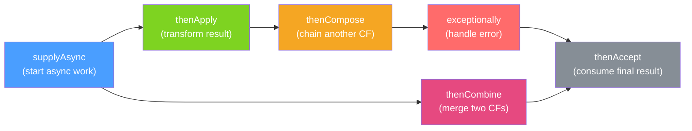

# ⚡ CompletableFuture

> [!abstract] TL;DR
> `CompletableFuture<T>` is Java's non-blocking, composable async primitive introduced in Java 8. Unlike `Future<T>`, you can chain transformations, combine multiple futures, and handle errors declaratively — all without blocking a thread to wait for a result. It is the foundation for `@Async` in Spring and is replaced by reactive `Mono<T>` in Spring WebFlux for true backpressure scenarios.

## Intuition — analogy FIRST
Imagine ordering food at a restaurant that gives you a buzzer. The buzzer (`CompletableFuture`) lets you sit at your table and do other things instead of standing at the counter. When the food is ready, it buzzes (`completes`). You can chain instructions: "when the main course arrives (`thenApply`), plate it nicely; when both the main and dessert arrive (`thenCombine`), bring the bill; if something goes wrong in the kitchen (`exceptionally`), offer an apology voucher." You never block at the counter — the flow is declarative and non-blocking.

---

## How It Works



## Key Concepts / Details

### Starting Async Computation

```java
// supplyAsync: async, returns a value
CompletableFuture<String> userFuture = CompletableFuture.supplyAsync(() -> {
    return fetchUserFromDB(userId); // runs on ForkJoinPool.commonPool() by default
});

// ALWAYS supply a custom executor — don't rely on the common pool
ExecutorService executor = Executors.newFixedThreadPool(10);
CompletableFuture<String> userFutureCustom = CompletableFuture.supplyAsync(
    () -> fetchUserFromDB(userId),
    executor
);

// runAsync: async, no return value
CompletableFuture<Void> logFuture = CompletableFuture.runAsync(
    () -> auditLog.record(event),
    executor
);

// completedFuture: already-completed (useful for testing or default values)
CompletableFuture<String> cached = CompletableFuture.completedFuture("from-cache");
```

### Transformation Operators

```java
CompletableFuture<User> userFuture = CompletableFuture.supplyAsync(() -> fetchUser(id));

// thenApply: sync transform on result (like map in streams)
CompletableFuture<String> nameFuture = userFuture.thenApply(user -> user.getName());

// thenApplyAsync: transform on a different thread
CompletableFuture<String> nameAsync = userFuture.thenApplyAsync(
    user -> user.getName(), executor
);

// thenCompose: flatMap — when transform returns another CompletableFuture
CompletableFuture<Order> orderFuture = userFuture
    .thenCompose(user -> fetchOrders(user.getId())); // avoids CF<CF<Order>>

// thenAccept: consume result, returns CF<Void>
userFuture.thenAccept(user -> cache.put(user.getId(), user));

// thenRun: side effect, no access to result
userFuture.thenRun(() -> metrics.increment("user.fetched"));
```

### Combining Multiple Futures

```java
// thenCombine: combine two independent CFs when both complete
CompletableFuture<User> userCF = fetchUserAsync(userId);
CompletableFuture<Profile> profileCF = fetchProfileAsync(userId);

CompletableFuture<UserDTO> combined = userCF.thenCombine(
    profileCF,
    (user, profile) -> new UserDTO(user, profile)
);

// allOf: wait for ALL futures to complete (returns CF<Void>)
CompletableFuture<Void> all = CompletableFuture.allOf(userCF, profileCF, ordersCF);
all.thenRun(() -> System.out.println("All done!"));

// Collect results from allOf (common pattern)
List<CompletableFuture<Result>> futures = items.stream()
    .map(item -> processAsync(item, executor))
    .collect(Collectors.toList());

CompletableFuture<List<Result>> allResults = CompletableFuture
    .allOf(futures.toArray(new CompletableFuture[0]))
    .thenApply(v -> futures.stream()
        .map(CompletableFuture::join) // safe — all already completed
        .collect(Collectors.toList()));

// anyOf: complete when ANY future completes first
CompletableFuture<Object> fastest = CompletableFuture.anyOf(cf1, cf2, cf3);
```

### Error Handling

```java
CompletableFuture<User> safe = CompletableFuture.supplyAsync(() -> fetchUser(id))

    // exceptionally: replace error with a default value (stream continues normally)
    .exceptionally(ex -> {
        log.warn("Fetch failed, returning guest user", ex);
        return User.GUEST;
    })

    // handle: access both result AND exception (always called)
    .handle((user, ex) -> {
        if (ex != null) {
            return User.GUEST;
        }
        return user;
    })

    // whenComplete: side effects for both success and failure (does not change value)
    .whenComplete((user, ex) -> {
        if (ex != null) metrics.increment("user.fetch.error");
        else metrics.increment("user.fetch.success");
    });
```

### Timeouts (Java 9+)

```java
CompletableFuture<String> result = CompletableFuture
    .supplyAsync(() -> slowExternalCall())
    .orTimeout(5, TimeUnit.SECONDS) // completes exceptionally with TimeoutException
    .exceptionally(ex -> "default-on-timeout");

// completeOnTimeout: complete with value on timeout (no exception)
CompletableFuture<String> withDefault = CompletableFuture
    .supplyAsync(() -> slowExternalCall())
    .completeOnTimeout("default", 5, TimeUnit.SECONDS);
```

### Real Parallel Fan-Out Pattern

```java
// Parallel calls to multiple microservices
public CompletableFuture<OrderSummary> getOrderSummary(String orderId) {
    CompletableFuture<Order> orderCF =
        CompletableFuture.supplyAsync(() -> orderService.find(orderId), executor);
    CompletableFuture<Customer> customerCF =
        CompletableFuture.supplyAsync(() -> customerService.find(orderId), executor);
    CompletableFuture<List<Item>> itemsCF =
        CompletableFuture.supplyAsync(() -> inventoryService.findItems(orderId), executor);

    return CompletableFuture.allOf(orderCF, customerCF, itemsCF)
        .thenApply(v -> new OrderSummary(
            orderCF.join(),    // join() is safe here — all already done
            customerCF.join(),
            itemsCF.join()
        ));
}
// Wall-clock time = slowest single call, not sum of all calls
```

---

## Real-World Notes

- **Spring `@Async`** wraps method return types of `CompletableFuture<T>` and executes them on a `TaskExecutor` — it is `CompletableFuture` under the hood.
- **`join()` vs `get()`**: `join()` throws `CompletionException` (unchecked); `get()` throws `ExecutionException` (checked) + `InterruptedException`. Prefer `join()` inside lambda chains.
- **`exceptionally` only catches upstream errors**: if your `exceptionally` handler itself throws, it propagates as a new exception.
- **Virtual threads + CompletableFuture**: with Java 21 virtual threads, blocking `.get()` is cheap; you can simplify by just using structured concurrency instead.
- **Testing**: use `CompletableFuture.completedFuture()` and `CompletableFuture.failedFuture()` to mock async services in unit tests.

---

## Common Pitfalls

- **Not specifying a custom executor**: `supplyAsync` without executor uses `ForkJoinPool.commonPool()`, which is shared across the JVM and limited to `N_cpu - 1` threads — IO-bound tasks will starve it.
- **Calling `get()` on every step**: this turns async into sync. Chain instead.
- **Swallowing exceptions**: without `exceptionally` or `handle`, exceptions silently disappear and the `CompletableFuture` completes exceptionally — callers who don't call `get()` never see them.
- **`thenApply` returning a `CompletableFuture`**: this gives `CF<CF<T>>` — use `thenCompose` to flatten.
- **Using `join()` on the main request thread**: `join()` blocks — if used inside a web handler, it blocks the Tomcat thread, negating the benefit.

---

## Related Concepts

- [[Executor_Framework]] — Thread pools that power CompletableFuture execution
- [[Virtual_Threads_Java21]] — Java 21 alternative for simpler concurrent code
- [[Reactive_Streams]] — Reactive alternative for backpressure-aware pipelines
- [[Project_Reactor]] — Mono<T> is the reactive counterpart to CompletableFuture<T>

---

## Review Questions

1. What is the difference between `thenApply` and `thenCompose`? Give a scenario where each is correct.
2. Why should you always pass a custom `Executor` to `supplyAsync`?
3. How does `CompletableFuture.allOf` work, and how do you collect the results from each future after it returns?
4. What is the difference between `exceptionally`, `handle`, and `whenComplete`?
5. How does `orTimeout` differ from `completeOnTimeout`?

---

## Sources

- Java Documentation: `java.util.concurrent.CompletableFuture`
- Reactive Programming with CompletableFuture — Oracle Blog
- Baeldung: Guide to CompletableFuture

#java #concurrency #completablefuture #async #futures
