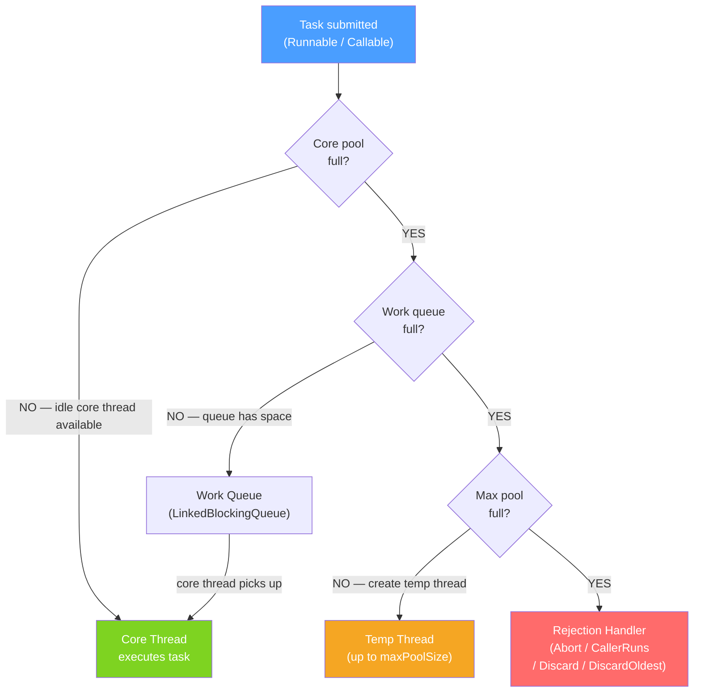

# 🏭 Executor Framework

> [!abstract] TL;DR
> The Executor framework separates task submission from thread management. `ThreadPoolExecutor` maintains a pool of reusable threads, queues overflow tasks, and applies configurable rejection policies — all without your code creating raw `Thread` objects. `ScheduledExecutorService` adds fixed-rate and fixed-delay scheduling. `Future<T>` lets you retrieve results from `Callable` tasks submitted to a pool.

## Intuition — analogy FIRST
A coffee shop analogy: raw `Thread` creation is like hiring a new barista for every single order and firing them when the drink is ready. Wildly expensive and slow. `ExecutorService` is like a properly staffed coffee shop: you have 4 baristas (threads) who take orders from a ticket queue (task queue). When all 4 are busy, new orders wait in the queue. If the queue fills up too, the shop applies a policy — maybe a manager takes the order themselves (CallerRunsPolicy), or puts up a "not taking orders" sign (AbortPolicy). At closing time, the manager waits for all current orders to finish before sending baristas home (graceful shutdown).

---

## How It Works



## Key Concepts / Details

### ThreadPoolExecutor Parameters

```java
ThreadPoolExecutor executor = new ThreadPoolExecutor(
    4,                              // corePoolSize: always-on threads
    8,                              // maximumPoolSize: max threads under load
    60, TimeUnit.SECONDS,           // keepAliveTime: how long idle temp threads live
    new LinkedBlockingQueue<>(1000),// workQueue: bounded queue prevents OOM
    new ThreadFactory() {           // optional: custom thread naming
        private final AtomicInteger count = new AtomicInteger(0);
        @Override
        public Thread newThread(Runnable r) {
            Thread t = new Thread(r, "worker-" + count.incrementAndGet());
            t.setDaemon(false);
            return t;
        }
    },
    new ThreadPoolExecutor.CallerRunsPolicy() // rejection handler
);
```

### Factory Methods (Convenience, Use with Care)

```java
// Fixed pool: corePoolSize = maxPoolSize, unbounded queue — risky OOM
ExecutorService fixed = Executors.newFixedThreadPool(4);

// Cached pool: 0 core threads, SynchronousQueue (no buffering), threads grow unboundedly — risky thread explosion
ExecutorService cached = Executors.newCachedThreadPool();

// Single thread pool: guarantees sequential execution
ExecutorService single = Executors.newSingleThreadExecutor();

// Work-stealing pool: ForkJoinPool.commonPool() sized to available processors
ExecutorService workStealing = Executors.newWorkStealingPool();

// Virtual thread executor (Java 21): one virtual thread per task
ExecutorService virtual = Executors.newVirtualThreadPerTaskExecutor();
```

> [!warning] Avoid unbounded queues and pools
> `newFixedThreadPool` uses an unbounded `LinkedBlockingQueue` — tasks queue forever and may exhaust memory. Always use a bounded queue with explicit `ThreadPoolExecutor` for production code.

### Thread Pool Sizing Heuristics

| Workload | Formula | Reasoning |
|----------|---------|-----------|
| CPU-bound | `N_cpu + 1` | One extra for preemption gaps |
| IO-bound (blocking) | `N_cpu × (1 + W/C)` where W=wait time, C=compute time | Threads sleep during IO — more can run |
| IO-bound (rule of thumb) | `N_cpu × 2` to `N_cpu × 4` | Practical starting point |
| Mixed | Profile and benchmark | No universal formula |

```java
int cpus = Runtime.getRuntime().availableProcessors();
// IO-heavy microservice example: 4 CPUs, 80% time waiting
int poolSize = cpus * (1 + 4); // = 20 threads
```

### Submitting Tasks and Getting Results

```java
ExecutorService exec = Executors.newFixedThreadPool(4);

// Submit Runnable (no result)
exec.execute(() -> processEvent(event)); // fire and forget

// Submit Callable and get Future
Future<Integer> future = exec.submit(() -> compute(data));

// Get result (blocks until done)
try {
    Integer result = future.get(5, TimeUnit.SECONDS); // with timeout
} catch (TimeoutException e) {
    future.cancel(true); // interrupt the task
} catch (ExecutionException e) {
    Throwable cause = e.getCause(); // unwrap the actual exception
}

// invokeAll: submit all, wait for all
List<Callable<Result>> tasks = buildTasks();
List<Future<Result>> futures = exec.invokeAll(tasks, 10, TimeUnit.SECONDS);

// invokeAny: return first successful result, cancel others
Result fastest = exec.invokeAny(tasks);
```

### ScheduledExecutorService

```java
ScheduledExecutorService scheduler = Executors.newScheduledThreadPool(2);

// Fixed delay: waits AFTER previous execution finishes
ScheduledFuture<?> fixedDelay = scheduler.scheduleWithFixedDelay(
    () -> sendHeartbeat(),
    0,     // initial delay
    30,    // period AFTER completion
    TimeUnit.SECONDS
);

// Fixed rate: fires at constant rate (may overlap if task > period)
ScheduledFuture<?> fixedRate = scheduler.scheduleAtFixedRate(
    () -> collectMetrics(),
    0,     // initial delay
    10,    // period from start of last execution
    TimeUnit.SECONDS
);

// Cancel scheduled task
fixedDelay.cancel(false); // false: let current execution finish
```

### Proper Shutdown

```java
public void shutdownGracefully(ExecutorService exec) {
    exec.shutdown(); // stop accepting new tasks; let queued tasks finish
    try {
        if (!exec.awaitTermination(30, TimeUnit.SECONDS)) {
            exec.shutdownNow(); // interrupt running tasks
            if (!exec.awaitTermination(10, TimeUnit.SECONDS)) {
                log.error("Executor did not terminate");
            }
        }
    } catch (InterruptedException e) {
        exec.shutdownNow();
        Thread.currentThread().interrupt(); // restore interrupt flag
    }
}
```

### Rejection Handlers

| Handler | Behavior | Use Case |
|---------|----------|----------|
| `AbortPolicy` (default) | Throws `RejectedExecutionException` | Fail fast, let caller handle |
| `CallerRunsPolicy` | Caller thread executes the task | Applies backpressure naturally |
| `DiscardPolicy` | Silently drops the task | Acceptable data loss (metrics, logs) |
| `DiscardOldestPolicy` | Drops oldest queued task | Latest data more important |

---

## Real-World Notes

- **Spring's `@Async` and `TaskExecutor`** use `ThreadPoolTaskExecutor` under the hood — same `ThreadPoolExecutor` with Spring-managed configuration via `spring.task.execution.*` properties.
- **Never block threads in a pool**: blocking operations (IO, `Thread.sleep`, `Future.get()`) waste threads. Use more threads (sized for IO-bound) or switch to reactive/virtual threads.
- **Monitor your pools**: expose `ThreadPoolExecutor` metrics (activeCount, queueSize, completedTaskCount) to Micrometer for production visibility.
- **`CompletableFuture.supplyAsync(task, executor)` always specify an executor**: without it, it uses `ForkJoinPool.commonPool()` which is shared and bounded to `N_cpu - 1` threads.

---

## Common Pitfalls

- **Using `newCachedThreadPool()` for slow IO tasks**: with no queue and unbounded thread creation, a spike in requests creates thousands of threads — `OutOfMemoryError`.
- **Not calling `shutdown()`**: thread pool threads are non-daemon by default; the JVM won't exit until they're stopped.
- **Catching `InterruptedException` without re-interrupting**: the thread pool's shutdown mechanism relies on interrupts; swallowing them breaks graceful shutdown.
- **Thread-local state in pools**: `ThreadLocal` values persist across task executions on the same thread. Use `try/finally` to clear them.
- **Submitting to a shutdown executor**: throws `RejectedExecutionException`. Always check lifecycle before submission in long-running applications.

---

## Related Concepts

- [[Threads_and_Runnable]] — Runnable and Callable that are submitted to executors
- [[CompletableFuture]] — Higher-level async composition that uses executors internally
- [[Virtual_Threads_Java21]] — Java 21 executor that creates one virtual thread per task
- [[Spring_Boot_Auto_Configuration]] — Spring's TaskExecutor auto-configuration

---

## Review Questions

1. Explain the order in which `ThreadPoolExecutor` handles a new task: when does it add a thread vs queue the task vs reject?
2. Why is `Executors.newFixedThreadPool(n)` potentially dangerous in production?
3. What is the difference between `scheduleAtFixedRate` and `scheduleWithFixedDelay`?
4. A `Future.get()` throws `ExecutionException` — how do you get the real exception?
5. Why must `shutdownNow()` be called after `shutdown()` in the graceful shutdown pattern?

---

## Sources

- Brian Goetz, *Java Concurrency in Practice*, Chapter 8 — Applying Thread Pools
- Java Documentation: `java.util.concurrent.ThreadPoolExecutor`
- Baeldung: Guide to java.util.concurrent.ExecutorService

#java #concurrency #executor #threadpool #future #scheduled
