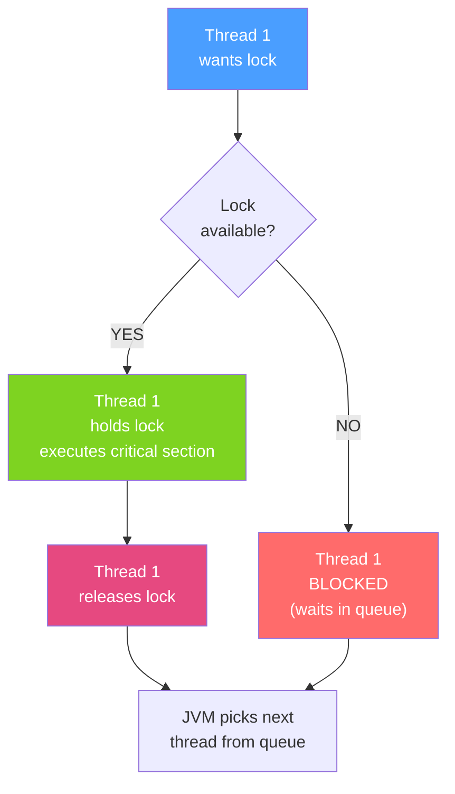

# 🔒 Synchronized and Locks

> [!abstract] TL;DR
> Java provides two tiers of mutual exclusion: the built-in `synchronized` keyword (simple, automatic unlock) and the explicit `java.util.concurrent.locks` hierarchy (tryLock, timed lock, fairness, read-write separation). `AtomicInteger` and friends use CAS hardware instructions for lock-free operations on single values. Deadlock occurs when two threads each hold a lock the other needs — prevention requires consistent lock ordering or timeout-based acquisition.

## Intuition — analogy FIRST
Think of a bathroom with one key hanging by the door. `synchronized` is like that key: you grab it when you enter, return it automatically when you leave (even if you faint inside — the lock is released). `ReentrantLock` is like a modern keycard system: you can try to swipe and give up after 5 seconds if the room is occupied, you can check if the room is available without blocking, and you can have a "VIP lounge" mode where multiple readers share the space but a single writer gets exclusive access. `AtomicInteger` is like a digital counter with a compare-and-swap button — no key needed, the hardware guarantees the update is atomic.

---

## How It Works



## Key Concepts / Details

### synchronized — Intrinsic Monitor Lock

Every Java object has an intrinsic monitor lock. `synchronized` methods lock `this`; `synchronized` blocks lock a specified object.

```java
public class Counter {
    private int count = 0;

    // Locks 'this' — same as synchronized(this) block
    public synchronized void increment() {
        count++; // read-modify-write is now atomic
    }

    public synchronized int getCount() {
        return count;
    }

    // Fine-grained: lock a dedicated object, not 'this'
    private final Object lockA = new Object();
    private final Object lockB = new Object();

    public void operationA() {
        synchronized (lockA) { /* ... */ }
    }
    public void operationB() {
        synchronized (lockB) { /* ... */ }
    }
}
```

**Reentrancy**: `synchronized` is reentrant — the same thread can acquire the same lock multiple times without deadlocking.

### ReentrantLock — Explicit Lock

```java
import java.util.concurrent.locks.ReentrantLock;
import java.util.concurrent.TimeUnit;

public class BetterCounter {
    private int count = 0;
    private final ReentrantLock lock = new ReentrantLock(/* fair= */ false);

    public void increment() {
        lock.lock();
        try {
            count++;
        } finally {
            lock.unlock(); // ALWAYS unlock in finally
        }
    }

    // tryLock: non-blocking attempt
    public boolean tryIncrement() {
        if (lock.tryLock()) {
            try {
                count++;
                return true;
            } finally {
                lock.unlock();
            }
        }
        return false; // lock not available, don't block
    }

    // Timed tryLock: prevent indefinite blocking
    public boolean timedIncrement() throws InterruptedException {
        if (lock.tryLock(500, TimeUnit.MILLISECONDS)) {
            try {
                count++;
                return true;
            } finally {
                lock.unlock();
            }
        }
        return false; // gave up after 500ms
    }
}
```

### ReentrantReadWriteLock — Multiple Readers, One Writer

```java
import java.util.concurrent.locks.ReentrantReadWriteLock;

public class CachedData {
    private final ReentrantReadWriteLock rwLock = new ReentrantReadWriteLock();
    private final ReentrantReadWriteLock.ReadLock readLock = rwLock.readLock();
    private final ReentrantReadWriteLock.WriteLock writeLock = rwLock.writeLock();

    private Map<String, String> cache = new HashMap<>();

    public String get(String key) {
        readLock.lock(); // multiple threads can hold read lock simultaneously
        try {
            return cache.get(key);
        } finally {
            readLock.unlock();
        }
    }

    public void put(String key, String value) {
        writeLock.lock(); // exclusive — no readers or other writers
        try {
            cache.put(key, value);
        } finally {
            writeLock.unlock();
        }
    }
}
```

### StampedLock — Optimistic Reads (Java 8+)

```java
import java.util.concurrent.locks.StampedLock;

public class Point {
    private double x, y;
    private final StampedLock sl = new StampedLock();

    public double distanceFromOrigin() {
        long stamp = sl.tryOptimisticRead(); // no lock acquired
        double curX = x, curY = y;
        if (!sl.validate(stamp)) { // check if write happened during read
            stamp = sl.readLock(); // fall back to full read lock
            try {
                curX = x; curY = y;
            } finally {
                sl.unlockRead(stamp);
            }
        }
        return Math.sqrt(curX * curX + curY * curY);
    }
}
```

### Atomic Classes — Lock-Free CAS Operations

```java
import java.util.concurrent.atomic.*;

AtomicInteger counter = new AtomicInteger(0);
counter.incrementAndGet();      // atomic i++
counter.getAndAdd(5);           // atomic counter += 5
counter.compareAndSet(10, 20);  // CAS: if current==10, set to 20

AtomicReference<String> ref = new AtomicReference<>("initial");
ref.compareAndSet("initial", "updated"); // atomic reference swap

AtomicLong longCounter = new AtomicLong(0);
LongAdder adder = new LongAdder(); // better throughput under high contention
adder.increment();
long total = adder.sum();
```

### synchronized vs ReentrantLock Comparison

| Feature | `synchronized` | `ReentrantLock` |
|---------|---------------|-----------------|
| Syntax | Built-in keyword | Explicit `lock()`/`unlock()` |
| Auto-unlock | Yes (even on exception) | No — must use `finally` |
| tryLock | No | Yes |
| Timed tryLock | No | Yes |
| Fairness | No (no guarantee) | Optional fair mode |
| Condition variables | Single `wait()`/`notify()` | Multiple `Condition` objects |
| Lock monitoring | Limited (JVM tools) | `isLocked()`, `getQueueLength()` |
| Performance | Competitive (JVM optimized) | Slightly more overhead |

### Deadlock — Prevention Strategies

```java
// DEADLOCK: Thread 1 holds lockA, waits for lockB
//           Thread 2 holds lockB, waits for lockA
// Prevention 1: Always acquire locks in the same order
// Prevention 2: Use tryLock with timeout
public void transferWithTimeout(Account from, Account to, int amount) 
        throws InterruptedException {
    while (true) {
        if (from.lock.tryLock(100, TimeUnit.MILLISECONDS)) {
            try {
                if (to.lock.tryLock(100, TimeUnit.MILLISECONDS)) {
                    try {
                        from.deduct(amount);
                        to.credit(amount);
                        return;
                    } finally {
                        to.lock.unlock();
                    }
                }
            } finally {
                from.lock.unlock();
            }
        }
        Thread.sleep(10); // back off before retry
    }
}
```

---

## Real-World Notes

- **Prefer `synchronized` for simple cases**: it's less verbose and the JVM applies optimizations (biased locking, lock elision via escape analysis). Only reach for `ReentrantLock` when you need `tryLock`, timed acquisition, fairness, or multiple `Condition` variables.
- **`LongAdder` beats `AtomicLong` under high contention**: `LongAdder` stripes the counter across cells and sums on read, dramatically reducing CAS contention in counting scenarios.
- **Lock ordering is the canonical deadlock prevention**: always acquire locks in the same global order (e.g., by System.identityHashCode or a numeric ID), regardless of which thread is running.
- **Spring's `@Transactional` uses AOP** to wrap methods with synchronized-like behavior at the database level (via connection locks and isolation levels) — not Java locks.

---

## Common Pitfalls

- **Forgetting `unlock()` in finally**: if an exception occurs between `lock.lock()` and the `try` block, the lock will never be released, causing all other threads to block forever.
- **Locking on a mutable object**: `synchronized (someList)` where `someList` can be reassigned means the lock object changes, breaking synchronization.
- **Synchronizing on `String` or `Integer` literals**: shared from the pool across the JVM; other unrelated code may accidentally lock the same object.
- **Using read lock for write operations**: acquiring a read lock then writing violates the contract and will cause data corruption.
- **Overly coarse locking**: locking the entire service method when only one shared field needs protection — reduces concurrency unnecessarily.

---

## Related Concepts

- [[Threads_and_Runnable]] — Thread lifecycle and the need for synchronization
- [[Executor_Framework]] — Thread pools that encapsulate locking concerns
- [[CompletableFuture]] — Non-blocking alternative to locks for async coordination
- [[Virtual_Threads_Java21]] — Virtual threads and synchronized block pinning issues

---

## Review Questions

1. Why must `ReentrantLock.unlock()` always be called in a `finally` block?
2. What is the difference between `ReentrantReadWriteLock` and `synchronized` for a read-heavy cache?
3. Describe the ABA problem in CAS operations and how `AtomicStampedReference` solves it.
4. Two threads are deadlocked. How would you detect this with `jstack` and what prevention strategy would you apply?
5. When would you prefer `LongAdder` over `AtomicLong`?

---

## Sources

- Brian Goetz, *Java Concurrency in Practice*, Chapter 13 — Explicit Locks
- Java Documentation: `java.util.concurrent.locks` package
- JEP 376: ZGC: Concurrent Thread-Stack Processing

#java #concurrency #synchronized #locks #reentrantlock #atomic
