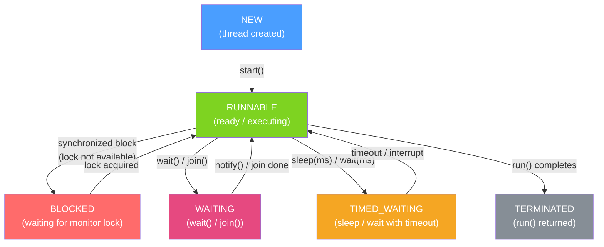

# 🧵 Threads and Runnable

> [!abstract] TL;DR
> A `Thread` is the smallest unit of execution in Java; the JVM maps each platform thread to an OS thread. `Runnable` encapsulates work that produces no result; `Callable<T>` adds a return value and checked exception. The `volatile` keyword guarantees visibility across threads without mutual exclusion, while `wait()`/`notify()` enable threads to coordinate on a shared monitor.

## Intuition — analogy FIRST
Imagine a restaurant kitchen. The **head chef** (main thread) takes orders and delegates tasks to **sous chefs** (worker threads). Each sous chef works independently on their station — one handles salads, another grills. `Runnable` is like a task card: "make this salad." `Callable` is like a task card with a return slot: "make this salad and put the plate here when done." `volatile` is like a whiteboard everyone can read in real time — you write an update and everyone sees it immediately, but it doesn't stop two people from writing at once. `wait()`/`notify()` is like a chef calling "order up!" so the server knows to pick it up.

---

## How It Works



## Key Concepts / Details

### Thread Creation — Three Ways

```java
// 1. Extend Thread (avoid — mixes task with execution mechanism)
class MyThread extends Thread {
    @Override
    public void run() {
        System.out.println("Thread: " + Thread.currentThread().getName());
    }
}
new MyThread().start();

// 2. Implement Runnable (preferred for platform threads)
Runnable task = () -> System.out.println("Runnable: " + Thread.currentThread().getName());
Thread t = new Thread(task, "worker-1");
t.start();

// 3. Implement Callable<T> (when you need a return value or to throw checked exceptions)
Callable<Integer> computation = () -> {
    Thread.sleep(100); // can throw InterruptedException (checked)
    return 42;
};
```

### Runnable vs Callable

| Feature | `Runnable` | `Callable<T>` |
|---------|-----------|---------------|
| Return value | `void` | `T` |
| Checked exceptions | Not allowed | Allowed |
| Java version | Since 1.0 | Since 5.0 |
| Usage | Thread, ExecutorService | ExecutorService only |
| FP interface | `run()` | `call()` |

### volatile — Visibility Without Atomicity

`volatile` guarantees that writes are immediately flushed to main memory and reads always come from main memory — not a CPU cache. This establishes a **happens-before** relationship.

```java
public class StopFlag {
    private volatile boolean stop = false; // without volatile, other thread may never see update

    public void run() {
        while (!stop) {        // always reads from main memory
            doWork();
        }
    }

    public void requestStop() {
        stop = true;           // immediately visible to all threads
    }
}
```

> [!warning] volatile ≠ atomic
> `volatile` does NOT prevent race conditions on compound operations like `count++` (which is read-modify-write: three operations). Use `AtomicInteger` or `synchronized` for that.

### wait() and notify() — Monitor-Based Coordination

Every Java object has an intrinsic monitor lock. `wait()` releases the lock and suspends; `notify()` wakes one waiting thread; `notifyAll()` wakes all.

```java
public class BoundedBuffer<T> {
    private final Queue<T> queue = new LinkedList<>();
    private final int capacity;

    public BoundedBuffer(int capacity) { this.capacity = capacity; }

    public synchronized void put(T item) throws InterruptedException {
        while (queue.size() == capacity) {
            wait(); // release lock and suspend until notified
        }
        queue.add(item);
        notifyAll(); // wake consumers waiting for items
    }

    public synchronized T take() throws InterruptedException {
        while (queue.isEmpty()) {
            wait(); // release lock and suspend
        }
        T item = queue.poll();
        notifyAll(); // wake producers waiting for space
        return item;
    }
}
```

> [!info] Always use `while`, not `if`, with `wait()`
> Spurious wakeups are allowed by the JVM spec — a thread can be woken without `notify()`. The `while` loop re-checks the condition after every wakeup.

### Thread Properties

```java
Thread t = new Thread(task, "background-worker");
t.setDaemon(true);          // daemon threads don't prevent JVM shutdown
t.setPriority(Thread.NORM_PRIORITY); // 1-10, OS best-effort
t.setUncaughtExceptionHandler((thread, ex) -> {
    log.error("Uncaught exception in thread {}", thread.getName(), ex);
});
t.start();

// Interrupt a thread
t.interrupt(); // sets interrupt flag; thread should check Thread.interrupted()

// Check interrupt flag in long-running work
while (!Thread.currentThread().isInterrupted()) {
    processNextItem();
}
```

### Java Memory Model and happens-before

The JMM defines when one thread's writes are **guaranteed** to be visible to another:
- **Program order**: within a thread, each action happens-before later actions
- **Monitor lock**: unlock of a monitor happens-before every subsequent lock
- **volatile write → volatile read**: a volatile write happens-before subsequent volatile reads
- **Thread start**: `Thread.start()` happens-before any action in the started thread
- **Thread join**: all actions in a thread happen-before `join()` returns

---

## Real-World Notes

- **Never extend `Thread` directly** in production code. It mixes the task (what to do) with the execution mechanism (how to run). Use `Runnable` or `Callable` with an `ExecutorService`.
- **Platform threads are expensive**: each one consumes ~1 MB of stack by default (`-Xss`). Creating thousands of them for IO-bound work is the problem that Virtual Threads (Java 21) solve.
- **`Thread.sleep()` does not release the monitor lock** — unlike `wait()`. Sleeping inside a synchronized block blocks other threads from acquiring the lock.
- **Interrupt-based cancellation** is the Java standard: set the interrupt flag with `t.interrupt()`, and cooperative code checks `Thread.interrupted()` or catches `InterruptedException`.

---

## Common Pitfalls

- **Using `if` instead of `while` with `wait()`**: spurious wakeups will cause incorrect behavior.
- **Forgetting to call `start()`**: calling `run()` directly executes the task on the current thread — no new thread is created.
- **`volatile` on compound operations**: `volatile long counter; counter++;` is not atomic. Use `AtomicLong`.
- **Swallowing `InterruptedException`**: catching it and not re-interrupting the thread loses the interrupt signal. Either re-throw or call `Thread.currentThread().interrupt()`.
- **Daemon thread data loss**: if all non-daemon threads finish, daemon threads are killed without running their finally blocks.

---

## Related Concepts

- [[Synchronized_and_Locks]] — Safe shared state access with locks
- [[Executor_Framework]] — Managed thread pools instead of raw Thread creation
- [[CompletableFuture]] — Composable async without blocking threads
- [[Virtual_Threads_Java21]] — Java 21 lightweight threads for IO-bound work
- [[JVM_Architecture]] — How the JVM maps Java threads to OS threads

---

## Review Questions

1. What is the difference between calling `t.run()` and `t.start()` on a Thread object?
2. Why must you always use `while` instead of `if` when calling `wait()`?
3. A `volatile boolean running` flag is used for stopping a thread. Why is this sufficient for a simple stop flag but insufficient for `count++`?
4. What happens to daemon threads when the last non-daemon thread finishes?
5. Explain the happens-before guarantee provided by `volatile` writes and reads.

---

## Sources

- Java Language Specification — Chapter 17: Threads and Locks
- Brian Goetz, *Java Concurrency in Practice*, Chapters 1-4
- Java Documentation: `java.lang.Thread`, `java.lang.Runnable`, `java.util.concurrent.Callable`

#java #concurrency #threads #runnable #volatile
