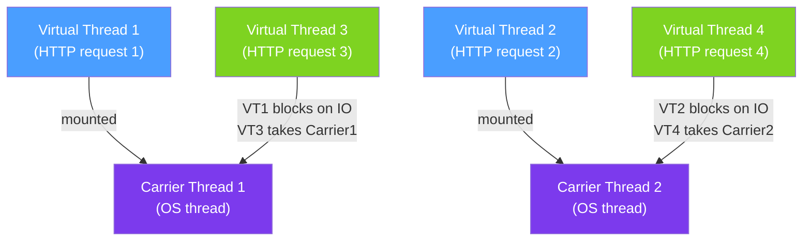

# 🌐 Virtual Threads (Java 21)

> [!abstract] TL;DR
> Virtual threads (Project Loom, GA in Java 21) are lightweight threads managed entirely by the JVM rather than the OS. A single OS thread (carrier thread) multiplexes thousands of virtual threads by unmounting them when they block on IO — making thread-per-request cheap again for IO-bound services. `StructuredTaskScope` provides a safe, scoped way to fan out work across virtual threads and collect results.

## Intuition — analogy FIRST
Classic platform threads are like owning a car: one car per driver, and the car just sits in your driveway while you're at work (blocked on IO). Virtual threads are like a car-sharing service with a dispatcher: when you (virtual thread) are idle waiting at a red light (IO block), the car (carrier thread) immediately picks up another passenger (another virtual thread). One physical car serves dozens of passengers who are mostly waiting anyway. The JVM is the dispatcher — it parks your virtual thread when it would block and resumes it when the IO is ready, transparently.

---

## How It Works



## Key Concepts / Details

### Platform Threads vs Virtual Threads

| Aspect | Platform Thread | Virtual Thread |
|--------|----------------|----------------|
| Created by | OS | JVM |
| Stack size | ~1 MB (fixed) | Flexible (small, grows) |
| Creation cost | High (~1ms, OS syscall) | Very low (microseconds) |
| Blocking behavior | Blocks the OS thread | Unmounts from carrier thread |
| Max practical count | Thousands | Millions |
| CPU scheduling | OS scheduler | JVM scheduler |
| ThreadLocal | Normal | Works but consider alternatives |
| Synchronized block | Normal | Can cause PINNING (see below) |

### Creating Virtual Threads

```java
// 1. Thread.ofVirtual() — direct creation
Thread vt = Thread.ofVirtual()
    .name("virtual-worker-", 0) // name with auto-incrementing index
    .start(() -> handleRequest(request));

// 2. Virtual thread factory
ThreadFactory factory = Thread.ofVirtual()
    .name("vt-", 0)
    .factory();
Thread t = factory.newThread(() -> processTask());
t.start();

// 3. Executor with virtual threads (recommended for web apps)
ExecutorService vtExecutor = Executors.newVirtualThreadPerTaskExecutor();
// One virtual thread per submitted task — no pool sizing needed!
vtExecutor.submit(() -> handleRequest(req));

// Spring Boot: enable virtual threads
// In application.properties:
// spring.threads.virtual.enabled=true
```

### Structured Concurrency (Java 21 Preview, GA in Java 23)

```java
import java.util.concurrent.StructuredTaskScope;

// Fan-out: run tasks in parallel, collect results
public UserSummary buildUserSummary(String userId) throws Exception {
    try (var scope = new StructuredTaskScope.ShutdownOnFailure()) {
        // Fork tasks — each runs on its own virtual thread
        StructuredTaskScope.Subtask<User> userTask =
            scope.fork(() -> userService.find(userId));
        StructuredTaskScope.Subtask<List<Order>> ordersTask =
            scope.fork(() -> orderService.findByUser(userId));
        StructuredTaskScope.Subtask<Profile> profileTask =
            scope.fork(() -> profileService.find(userId));

        scope.join();           // wait for all subtasks
        scope.throwIfFailed();  // propagate first failure (cancels remaining)

        return new UserSummary(
            userTask.get(),
            ordersTask.get(),
            profileTask.get()
        );
    } // scope auto-closes: all subtask threads terminated
}

// ShutdownOnSuccess: return first successful result
public String fetchFromFastestReplica(List<String> replicas) throws Exception {
    try (var scope = new StructuredTaskScope.ShutdownOnSuccess<String>()) {
        replicas.forEach(r -> scope.fork(() -> queryReplica(r)));
        scope.join();
        return scope.result(); // result from the fastest replica
    }
}
```

### Pinning — The Main Gotcha

A virtual thread is **pinned** to its carrier thread and cannot be unmounted when it blocks inside:
1. A `synchronized` block or method
2. A native method or foreign function call

```java
// BAD: synchronized block causes pinning
synchronized (lock) {
    readFromDatabase(); // blocks here → carrier thread BLOCKED (pinning!)
    // Other virtual threads cannot use this carrier during the wait
}

// GOOD: use ReentrantLock instead
private final ReentrantLock lock = new ReentrantLock();
lock.lock();
try {
    readFromDatabase(); // blocks here → virtual thread unmounts, carrier is free
} finally {
    lock.unlock();
}
```

**Detect pinning**: run with `-Djdk.tracePinnedThreads=short` to log pinning events.

### When to Use Virtual Threads

**Great for:**
- IO-bound services: REST APIs calling databases and external services
- High-concurrency servers: thousands of concurrent requests
- Simplifying async code: write synchronous-looking code that is actually concurrent

**NOT for:**
- CPU-bound work: virtual threads don't help when CPU is the bottleneck (use parallel streams or ForkJoinPool)
- Already reactive: if using WebFlux/Project Reactor, virtual threads don't add value and mixing models adds complexity
- Code with heavy `synchronized` usage: pinning will reduce the benefit

### Comparison: Virtual Threads vs CompletableFuture vs WebFlux

| Approach | Code Style | Use Case | Complexity |
|----------|-----------|----------|------------|
| Virtual Threads | Synchronous | IO-bound, simple concurrency | Low |
| CompletableFuture | Async chaining | Fan-out, composition | Medium |
| WebFlux/Reactor | Reactive streams | Backpressure, streaming | High |

---

## Real-World Notes

- **Spring Boot 3.2+ with `spring.threads.virtual.enabled=true`**: Spring automatically uses virtual threads for Tomcat request handling, scheduled tasks, and `@Async`. No code changes needed.
- **Database drivers**: JDBC drivers work with virtual threads (they block, which just unmounts the virtual thread). R2DBC is still useful for reactive pipelines but no longer necessary for concurrency alone.
- **ThreadLocal works** but large ThreadLocals on millions of virtual threads waste memory. Consider using `ScopedValue` (Java 21 preview) as an alternative.
- **Virtual threads are non-daemon by default**: unlike ForkJoinPool threads; this is intentional so they don't get killed mid-request.

---

## Common Pitfalls

- **Using `synchronized` for IO-critical locks**: causes pinning, degrading throughput back toward platform thread behavior. Migrate to `ReentrantLock`.
- **Mixing virtual threads with reactive code**: WebFlux runs on Netty event loops; calling `Thread.ofVirtual()` from a reactive pipeline and blocking on a virtual thread breaks the reactive contract.
- **Expecting virtual threads to speed up CPU work**: they share OS threads and don't add CPU parallelism. For parallel computation, use `ForkJoinPool` or parallel streams.
- **Ignoring structured concurrency**: using raw `ExecutorService.submit()` + `Future.get()` loses the structured lifetime guarantee; leaks subtasks if the parent completes.
- **Monitoring with old tools**: virtual threads overwhelm `jstack` with millions of entries. Use JFR (Java Flight Recorder) events for virtual thread analysis.

---

## Related Concepts

- [[Threads_and_Runnable]] — Platform thread fundamentals that virtual threads build on
- [[Executor_Framework]] — `Executors.newVirtualThreadPerTaskExecutor()` is the key integration
- [[Synchronized_and_Locks]] — `synchronized` causes pinning; use `ReentrantLock` with virtual threads
- [[Spring_WebFlux]] — Reactive alternative; virtual threads make WebFlux less necessary for IO concurrency

---

## Review Questions

1. What is a "carrier thread" and what happens to it when a virtual thread blocks on IO?
2. What is "pinning" and which two scenarios cause a virtual thread to pin to its carrier?
3. How do you enable virtual threads in Spring Boot 3.2+?
4. What is `StructuredTaskScope.ShutdownOnFailure` and how does it differ from `CompletableFuture.allOf`?
5. Why do virtual threads NOT help with CPU-bound workloads?

---

## Sources

- JEP 444: Virtual Threads (Java 21) — https://openjdk.org/jeps/444
- JEP 453: Structured Concurrency (Preview) — https://openjdk.org/jeps/453
- Project Loom documentation — https://openjdk.org/projects/loom/

#java #concurrency #virtual-threads #project-loom #java21 #structured-concurrency
