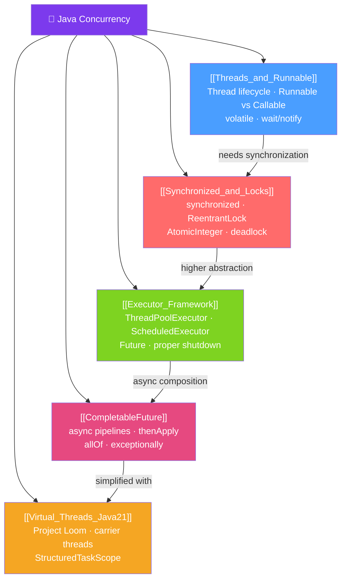

# 🔀 Concurrency — Map of Content

> [!abstract] What This Section Covers
> Java concurrency covers everything from raw Thread objects to the high-level async primitives introduced in modern Java. This section builds from the ground up: the Thread lifecycle and Runnable/Callable contracts, then synchronization primitives (synchronized, locks, atomics), the Executor framework for managed thread pools, CompletableFuture for non-blocking async pipelines, and finally Java 21's Virtual Threads (Project Loom) which fundamentally change how we write concurrent Java.

## Concept Map

## Learning Path
1. [[Threads_and_Runnable]] — Start here to understand the Thread lifecycle, Runnable vs Callable, and the Java Memory Model basics.
2. [[Synchronized_and_Locks]] — Learn how to make shared state safe with synchronized, ReentrantLock, and atomic operations.
3. [[Executor_Framework]] — Stop creating raw threads; use managed thread pools with ExecutorService.
4. [[CompletableFuture]] — Compose non-blocking async operations with the full CompletableFuture API.
5. [[Virtual_Threads_Java21]] — Java 21's Project Loom: lightweight threads that don't block carrier threads.

## All Notes at a Glance
| Note | Difficulty | What You'll Learn |
|------|------------|-------------------|
| [[Threads_and_Runnable]] | Beginner | Thread lifecycle, Runnable vs Callable, volatile, wait/notify |
| [[Synchronized_and_Locks]] | Intermediate | synchronized, ReentrantLock, ReadWriteLock, AtomicInteger, deadlock prevention |
| [[Executor_Framework]] | Intermediate | ThreadPoolExecutor internals, pool sizing, ScheduledExecutorService, Future |
| [[CompletableFuture]] | Intermediate | supplyAsync, thenApply/Compose/Combine, allOf/anyOf, error handling |
| [[Virtual_Threads_Java21]] | Advanced | Project Loom, carrier threads, StructuredTaskScope, pinning pitfalls |

## Key Questions This Section Answers
- What is the difference between Runnable and Callable?
- When should you use `synchronized` vs `ReentrantLock`?
- How do you size a thread pool for CPU-bound vs IO-bound work?
- How do you compose multiple async operations that run in parallel?
- What is a virtual thread and how does it differ from a platform thread?
- What is "pinning" in the context of virtual threads and why does it matter?

## Related Sections
- [[_MOC_Java_Master|↑ Java Master MOC]]
- [[_MOC_JVM_Internals|→ JVM Internals]] — Memory model, happens-before, GC interaction
- [[_MOC_Reactive_Programming|→ Reactive Programming]] — Alternative to thread-per-request with WebFlux

#MOC #java #concurrency
