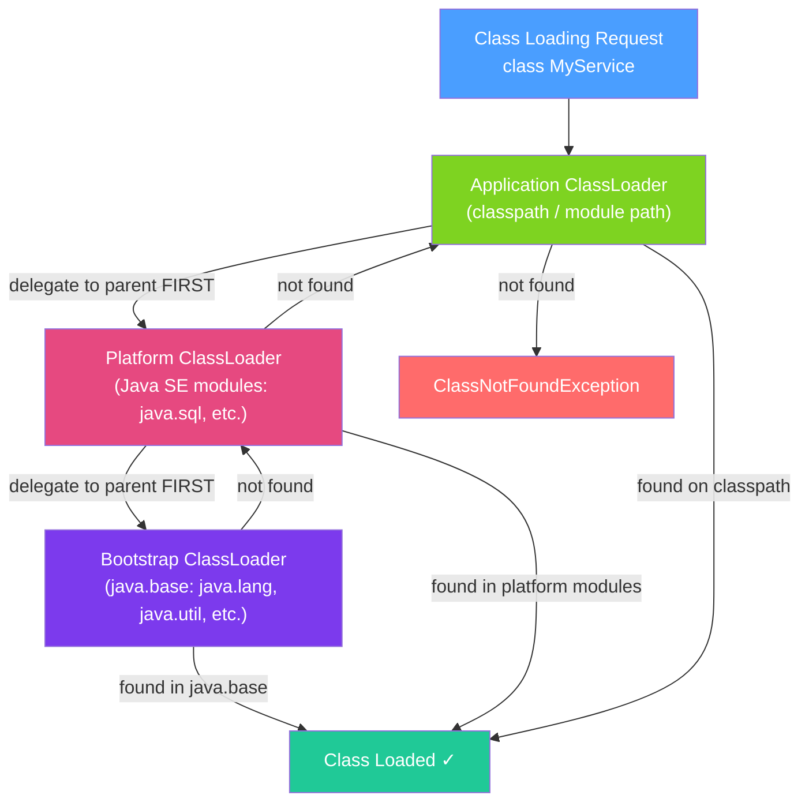

# 📦 ClassLoader System

> [!abstract] TL;DR
> The ClassLoader system finds, loads, verifies, and initializes `.class` files into the JVM. The three built-in loaders (Bootstrap → Platform → Application) follow the **parent delegation model**: always ask the parent first, only load yourself if the parent cannot find the class. This prevents malicious code from shadowing `java.lang.String`. Custom class loaders enable plugin systems, hot-reload, and class isolation.

## Intuition — analogy FIRST
Think of the class loading system as a library's interlibrary loan network. When you need a book (class), you ask your local branch (Application ClassLoader). The local branch first checks with the county library (Platform ClassLoader), which checks with the national library (Bootstrap ClassLoader). Only if the national library doesn't have it does the county look, and only if the county can't find it does your local branch search its own shelves. This ensures rare canonical editions (java.lang.String) always come from the authoritative source, not a local forgery.

---

## How It Works



## Key Concepts / Details

### The Three Built-In Class Loaders

| Class Loader | Java Source | What It Loads |
|-------------|-------------|---------------|
| **Bootstrap** | Written in native C | `java.lang.*`, `java.util.*`, all `java.base` module classes |
| **Platform** (formerly Extension) | `sun.misc.Launcher$ExtClassLoader` | Java SE platform modules (`java.sql`, `java.logging`, etc.) |
| **Application** | `sun.misc.Launcher$AppClassLoader` | Your application classes, classpath JARs, module path |

```java
// Viewing class loaders
System.out.println(String.class.getClassLoader()); // null = Bootstrap
System.out.println(java.sql.Connection.class.getClassLoader()); // Platform
System.out.println(MyService.class.getClassLoader()); // App

// Class loaders form a parent chain
ClassLoader appCL = MyService.class.getClassLoader();
ClassLoader platformCL = appCL.getParent(); // Platform
ClassLoader bootstrap = platformCL.getParent(); // null (Bootstrap is native)
```

### Class Loading Phases

```
1. Loading    — find .class file, read bytes, create Class object in Method Area
2. Linking
   2a. Verification — ensure bytecode is valid, no stack overflows, type safety
   2b. Preparation  — allocate memory for static fields, set to defaults (0/null/false)
   2c. Resolution   — resolve symbolic references to direct references
3. Initialization — run static initializers and static blocks; set static field values
```

```java
public class StaticExample {
    static int x = 10;      // Preparation: x=0; Initialization: x=10
    static {
        System.out.println("Static init runs at class initialization"); // step 3
    }
}
// Class only initializes once; the first time it's actively used
StaticExample.x; // triggers initialization if not already done
```

### Parent Delegation — Why It Matters

```java
// Security: you cannot shadow java.lang.String
// If you create a file src/java/lang/String.java and put it on the classpath,
// the Bootstrap ClassLoader finds the real String first — your fake is never loaded

// Uniqueness: same class loaded by two different ClassLoaders = two DIFFERENT classes
// This causes ClassCastException even though it's "the same" class
```

### Custom ClassLoader

```java
public class PluginClassLoader extends ClassLoader {
    private final Path pluginDir;

    public PluginClassLoader(Path pluginDir, ClassLoader parent) {
        super(parent); // ALWAYS chain to parent
        this.pluginDir = pluginDir;
    }

    @Override
    protected Class<?> findClass(String name) throws ClassNotFoundException {
        // Only called if parent delegation failed
        String path = name.replace('.', '/') + ".class";
        Path classFile = pluginDir.resolve(path);

        if (!Files.exists(classFile)) {
            throw new ClassNotFoundException(name);
        }

        try {
            byte[] bytes = Files.readAllBytes(classFile);
            return defineClass(name, bytes, 0, bytes.length); // register with JVM
        } catch (IOException e) {
            throw new ClassNotFoundException(name, e);
        }
    }
}

// Usage: load plugin classes in isolation
ClassLoader pluginCL = new PluginClassLoader(Paths.get("/plugins/my-plugin"), 
                                              Thread.currentThread().getContextClassLoader());
Class<?> pluginClass = pluginCL.loadClass("com.plugin.MyPlugin");
Object plugin = pluginClass.getDeclaredConstructor().newInstance();
```

### Class Loader Isolation

Different class loaders create **isolated class spaces** — crucial for application servers (Tomcat, OSGi, Java EE):

```java
// App A's ClassLoader loads com.app.Service
// App B's ClassLoader loads com.app.Service (same bytecode, different loader)
// These are DIFFERENT Class objects — casting between them fails

ClassLoader loaderA = new URLClassLoader(/* app A jars */);
ClassLoader loaderB = new URLClassLoader(/* app B jars */);

Class<?> serviceA = loaderA.loadClass("com.app.Service");
Class<?> serviceB = loaderB.loadClass("com.app.Service");
System.out.println(serviceA == serviceB); // FALSE — different class objects
```

### Context ClassLoader

Thread's context class loader is used to break parent delegation in frameworks:

```java
// JAXP, JDBC, SLF4J use context class loader for service provider lookup
Thread.currentThread().getContextClassLoader(); // get
Thread.currentThread().setContextClassLoader(customCL); // set

// ServiceLoader uses context class loader
ServiceLoader<MyService> services = ServiceLoader.load(MyService.class);
```

### Java 9+ Module System Impact

With JPMS (Java Platform Module System), the class loader hierarchy changed:
- **Bootstrap** still loads `java.base`
- **Platform** loads named modules
- **Application** loads unnamed module (classpath) and named modules on module path
- Modules add encapsulation: `module-info.java` declares `exports`/`requires`

---

## Real-World Notes

- **Spring uses CGLIB**: CGLIB generates subclass bytecode at runtime for `@Configuration` class proxies and `@Transactional` proxies. These classes are loaded by the Application ClassLoader and contribute to Metaspace usage.
- **Tomcat's class loader hierarchy**: Tomcat adds Common → Catalina → Shared → WebApp class loaders. Each webapp gets its own WebApp ClassLoader, enabling isolation between deployed applications.
- **OSGi**: a framework (used by Eclipse, Apache Felix) that gives each bundle its own class loader, enabling dynamic install/uninstall of modules while the JVM is running.
- **Hot reloading (JRebel, Spring DevTools)**: custom class loaders detect changed `.class` files and reload them, enabling faster development cycles.

---

## Common Pitfalls

- **`ClassCastException` across class loaders**: if you pass an object loaded by ClassLoader A to code that expects the same class from ClassLoader B, you get a `ClassCastException` even though the class names match.
- **Overriding `loadClass` instead of `findClass`**: `loadClass` implements the delegation algorithm. Override `findClass` to add custom loading while preserving delegation.
- **ClassLoader leaks**: a ClassLoader is GC'd only when no classes it loaded are referenced. Any static reference to such a class keeps the entire ClassLoader (and all its loaded classes) alive.
- **Thread context ClassLoader confusion**: some frameworks (JNDI, JAXB) look up services via the context ClassLoader. Ensure you set it correctly in multi-ClassLoader environments.

---

## Related Concepts

- [[JVM_Architecture]] — Where loaded classes live (Method Area / Metaspace)
- [[Garbage_Collection]] — ClassLoaders and their classes must be unreachable before GC can collect them
- [[Spring_AOP]] — CGLIB proxy generation relies on ClassLoader to create subclasses at runtime

---

## Review Questions

1. Describe the parent delegation model. Why does it prevent `java.lang.String` from being replaced?
2. What is the difference between `loadClass()` and `findClass()` in a custom ClassLoader?
3. Why does loading the same class with two different ClassLoaders result in two different `Class` objects?
4. What is the thread context ClassLoader and when is it used?
5. How did the Java 9 module system change the class loading hierarchy?

---

## Sources

- The Java Virtual Machine Specification — Chapter 5: Loading, Linking, and Initializing
- Java Documentation: `java.lang.ClassLoader`
- Understanding the Java ClassLoader — Oracle Blog

#java #jvm #classloader #parent-delegation #class-loading
