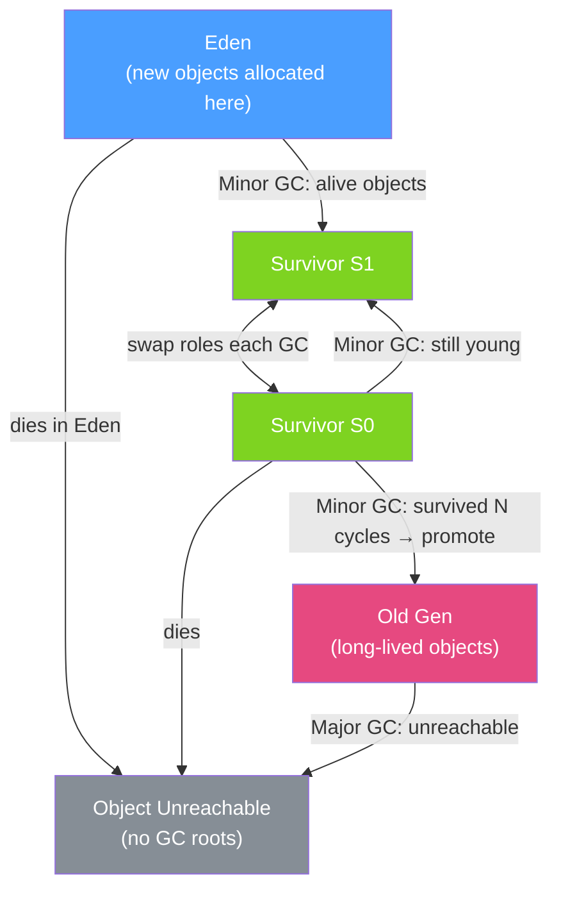

# 🗑️ Garbage Collection

> [!abstract] TL;DR
> Java GC automatically reclaims heap memory from unreachable objects. All modern JVM GC algorithms exploit the **generational hypothesis** (most objects die young), using fast minor GCs on Young Gen and less frequent major GCs on Old Gen. G1 is the default (balanced pause/throughput), ZGC targets sub-millisecond pauses for any heap size, and Shenandoah offers concurrent compaction with low pauses.

## Intuition — analogy FIRST
Imagine a city's trash collection system. **Young Generation** is like your kitchen bin — filled daily and emptied quickly (minor GC). Most trash (short-lived objects) stays in the kitchen; only durable items (wedding photos, furniture) move to long-term storage. **Old Generation** is your attic — collected rarely but the cleanup takes longer. **G1 GC** is like a smart city planner who divides the city into equal-sized blocks and always cleans the blocks with the most garbage first (Garbage First). **ZGC** is like a cleanup crew that works while you're still living in the house — almost zero interruption.

---

## How It Works



## Key Concepts / Details

### Generational Hypothesis
Most objects are short-lived — allocated, used briefly, then immediately unreachable. GC exploits this by:
- Allocating in **Eden**: fast bump-pointer allocation (just increment a pointer)
- **Minor GC**: quickly scans only Young Gen (small); copies survivors to Survivor space
- **Promotion**: objects surviving enough minor GCs move to Old Gen
- **Major/Full GC**: scans entire heap; infrequent but longer

### Mark-Sweep-Compact — The Foundation
All GC algorithms build on this:
1. **Mark**: trace from GC roots (stack frames, static fields, JNI references) and mark all reachable objects
2. **Sweep**: reclaim memory of unmarked (unreachable) objects
3. **Compact**: move surviving objects together to eliminate fragmentation

### GC Algorithms Comparison

| Algorithm | Pause | Throughput | Heap Size | Best For |
|-----------|-------|-----------|-----------|---------|
| **Serial** | High (stop-the-world) | Low | Small (<4GB) | Single-core, small apps, JVM startup |
| **Parallel** | Medium STW | High | Medium | Batch jobs, throughput-first |
| **G1** (default) | Low-medium | Good | 4GB–64GB | Most production apps |
| **ZGC** | <1ms | Good | Any (tested to 16TB) | Latency-critical, large heaps |
| **Shenandoah** | Low | Good | Medium-large | Consistent low pauses |

### G1 GC — Garbage First

G1 divides the heap into equal-sized **regions** (~2048 regions by default) and classifies them dynamically as Eden, Survivor, Old, or Humongous (for large objects).

```
+------+------+------+------+------+------+------+------+
|  E   |  E   |  S   |  O   |  O   |  H   |  E   |  O   |
+------+------+------+------+------+------+------+------+
E = Eden, S = Survivor, O = Old, H = Humongous (>0.5 * region size)
```

G1 GC phases:
1. **Minor (Young) GC**: evacuate Eden and Survivor regions to new Survivor regions
2. **Concurrent Marking**: concurrent background scan to identify live objects in Old Gen
3. **Mixed GC**: combines Young collection with Old Gen regions that have the most garbage (Garbage First!)
4. **Full GC**: last resort; single-threaded compaction (avoid this)

```bash
# G1 key flags
-XX:+UseG1GC
-XX:MaxGCPauseMillis=200      # pause goal (G1 tries to meet this)
-XX:G1HeapRegionSize=16m      # region size 1-32MB (power of 2)
-XX:G1NewSizePercent=5        # min Young Gen as % of heap
-XX:G1MaxNewSizePercent=60    # max Young Gen as % of heap
-XX:InitiatingHeapOccupancyPercent=45  # start concurrent marking at 45% heap usage
```

### ZGC — Ultra-Low Pause

ZGC is a concurrent, region-based, compacting GC targeting < 1ms pauses for any heap size (tested to 16TB):
- **Colored pointers**: 42 bits for address + 4 metadata bits (marked0, marked1, remapped, finalizable)
- **Load barriers**: code inserted at every object reference load to handle concurrent relocation
- **Concurrent relocation**: moves objects while app threads run using pointer remapping

```bash
# ZGC flags
-XX:+UseZGC
-XX:SoftMaxHeapSize=28g      # soft limit; ZGC grows up to Xmx on high pressure
-XX:ZCollectionInterval=5    # proactive GC every 5 seconds (avoid reactive GC)
-Xlog:gc*:file=zgc.log
```

### GC Reference Types

```java
import java.lang.ref.*;

// Strong reference (default): object kept alive as long as reference exists
User user = new User(); // strong reference

// Soft reference: kept in memory under pressure; GC only collects when OOM
SoftReference<byte[]> cache = new SoftReference<>(new byte[10_000_000]);
byte[] data = cache.get(); // returns null if GC collected it

// Weak reference: collected at next GC regardless of memory pressure
WeakReference<User> weakUser = new WeakReference<>(user);
user = null; // original reference gone
// weakUser.get() → null after next GC

// Phantom reference: post-mortem; used for cleanup actions (e.g., native resource release)
ReferenceQueue<User> queue = new ReferenceQueue<>();
PhantomReference<User> phantom = new PhantomReference<>(user, queue);
// phantom.get() always returns null; enqueued when object is finalized
```

### GC Log Analysis

```bash
# Enable GC logging (Java 9+)
-Xlog:gc*:file=gc.log:time,tags

# Sample G1 GC log output:
# [2026-07-26T10:00:01] GC(42) Pause Young (Normal) (G1 Evacuation Pause) 1024M->512M(2048M) 45ms
#  ^timestamp                  ^type                                        ^heap before→after(max)  ^pause
```

Key metrics to watch:
- **Pause duration**: for G1, should be under `MaxGCPauseMillis`; for ZGC, should be < 1ms
- **Heap occupancy**: if consistently > 80%, consider increasing heap
- **GC frequency**: frequent minor GCs with high allocation rate; frequent major GCs = memory leak suspect
- **Promotion failure**: Old Gen full → emergency Full GC → long pause

---

## Real-World Notes

- **Default GC in Java 9+ is G1**: if you're not specifying `-XX:+UseG1GC`, you're already using it.
- **ZGC for latency-sensitive**: trading slightly lower throughput for sub-millisecond pauses makes ZGC ideal for low-latency APIs, trading systems, and real-time applications.
- **Humongous objects in G1**: objects > 50% of region size bypass Young Gen and go directly to Old Gen — can cause premature Old Gen pressure. Increase region size or reduce large object allocations.
- **GC tuning should start with heap sizing**: most GC issues are from undersized heap causing frequent collections. Set reasonable `-Xmx` before tweaking GC parameters.
- **Application pauses ≠ just GC**: thread dumps, deoptimization, and revocation of biased locks also cause safepoint pauses visible in GC logs.

---

## Common Pitfalls

- **Prematurely promoting objects**: too-small Survivor spaces cause objects to be promoted to Old Gen early, filling it prematurely. Increase `-XX:SurvivorRatio` or `-XX:G1NewSizePercent`.
- **Finalizers**: `finalize()` method resurrects objects temporarily; GC must run twice to collect them. Use `Cleaner` (Java 9+) or `PhantomReference` instead.
- **Memory leaks with static collections**: static `Map<String, Object>` that grows without eviction will fill the Old Gen until OOM. Use `WeakHashMap` or Caffeine with eviction.
- **Ignoring GC logs in production**: you need GC logs to diagnose pause spikes. Enable `-Xlog:gc*` with rotation (`filecount=5,filesize=10m`) with near-zero overhead.
- **Choosing Full GC via `System.gc()`**: calling `System.gc()` triggers a full GC (possibly), causing long pauses. Never call it in production code.

---

## Related Concepts

- [[JVM_Architecture]] — Heap structure that GC operates on
- [[JVM_Tuning]] — GC flags and diagnostic tools
- [[Java_Profiling]] — GC log analysis and heap dump analysis
- [[Memory_Management]] — Memory leak detection and heap dump analysis

---

## Review Questions

1. What is the generational hypothesis and how does it shape GC algorithm design?
2. Explain the difference between a minor GC and a major (full) GC.
3. What does "Garbage First" mean in G1 GC?
4. How does ZGC achieve sub-millisecond pauses while compacting?
5. What are the four Java reference types and when would you use a `WeakReference`?

---

## Sources

- Oracle Documentation: Garbage Collection Tuning Guide
- JEP 439: Generational ZGC
- Monica Beckwith, *Java Performance*, Chapter 6 — Garbage Collection
- GC logs interpretation: https://gceasy.io

#java #jvm #garbage-collection #g1gc #zgc #shenandoah #generational
