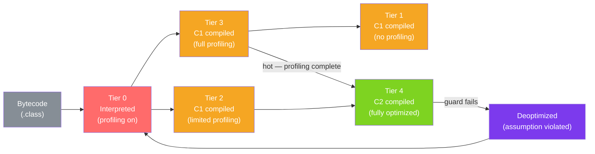

# 🚀 JIT Compilation

> [!abstract] TL;DR
> The JVM's JIT (Just-In-Time) compiler translates hot bytecode into native machine code using tiered compilation: the interpreter (T0) collects profiling data, C1 (T1-T3) applies quick optimizations, and C2 (T4) applies aggressive optimizations like inlining and escape analysis. This is why Java can match C++ performance after warmup — but also why benchmarks must account for warmup time.

## Intuition — analogy FIRST
Imagine a chef who initially follows recipes exactly as written (interpreter). As they cook a dish repeatedly, they start making mental shortcuts: "I always add garlic first" (C1 — basic optimization). After cooking the dish 500 times, they've memorized the entire process and can execute it from muscle memory without even looking at the recipe (C2 — fully optimized native code). The "warmup period" is the chef learning the dish. An order placed before warmup is slower than one placed after. If a recipe assumption changes (e.g., they switch from garlic to shallots), the chef falls back to reading the recipe again (deoptimization).

---

## How It Works



## Key Concepts / Details

### Hotspot Detection

The JVM tracks two counters for each method:
1. **Invocation counter**: incremented every time the method is called
2. **Back-edge counter**: incremented every time a loop iterates

When the sum exceeds `CompileThreshold` (default 10,000 for C2), the method is queued for JIT compilation.

```bash
# Key JIT flags
-XX:CompileThreshold=10000         # invocations before C2 compilation
-XX:+PrintCompilation              # log each JIT compilation event
-XX:+PrintInlining                 # log inlining decisions
-XX:MaxInlineSize=35               # max bytecode size for automatic inlining (bytes)
-XX:FreqInlineSize=325             # max bytecode size for hot method inlining
```

Sample `-XX:+PrintCompilation` output:
```
    139   1       3       java.lang.String::hashCode (55 bytes)
    251   2%      4       com.example.HotMethod::compute @ 42 (127 bytes)
    ^timestamp ^compile_id ^tier ^method (size)   ^ @ = OSR (on-stack replacement), offset
```

### Tiered Compilation Stages

| Tier | Compiler | Profiling | Speed | Code Quality |
|------|---------|----------|-------|-------------|
| T0 | Interpreter | Full | Slow | Bytecode |
| T1 | C1 (client) | None | Fast | Basic native |
| T2 | C1 | Limited | Fast | Better native |
| T3 | C1 | Full | Fast | Profiled native |
| T4 | C2 (server) | None needed | Slow to compile | Optimal native |

The typical flow for a hot method: T0 → T3 (collecting profiles) → T4 (C2 uses profiles for optimization).

### Method Inlining

The most impactful optimization — replaces a method call with the method body at the call site:

```java
// Source code
public int square(int x) { return x * x; }
public int compute(int n) { return square(n) + square(n + 1); }

// After inlining by C2:
// compute(n) becomes: (n * n) + ((n+1) * (n+1))
// No method call overhead, and now the entire expression can be further optimized
```

Inlining is limited by bytecode size thresholds. Methods with `synchronized` blocks are harder to inline. Using `@ForceInline` (JDK internal) is an escape hatch.

### Escape Analysis

C2 analyzes whether an object "escapes" the current method — if not, it can be stack-allocated instead of heap-allocated:

```java
// Does 'point' escape? No — it's only used locally
public double distanceFromOrigin(double x, double y) {
    Point point = new Point(x, y); // could be stack-allocated
    return Math.sqrt(point.x * point.x + point.y * point.y);
}
// C2 may eliminate the heap allocation entirely (scalar replacement)
// Breaking it into local variables: double px = x, py = y;

// 'builder' DOES escape — don't rely on escape analysis here
public String buildMessage(String name) {
    StringBuilder sb = new StringBuilder();  // escapes via toString()
    sb.append("Hello, ").append(name);
    return sb.toString(); // returned to caller — escapes!
}
```

**Lock elision**: if an object doesn't escape, locks on it can be eliminated — `synchronized (localObject)` becomes a no-op when C2 proves `localObject` is thread-local.

### On-Stack Replacement (OSR)

OSR allows compilation of **currently executing** hot loops without waiting for the method to return:

```java
public long countToMillion() {
    long sum = 0;
    for (long i = 0; i < 1_000_000; i++) { // JVM detects this loop is hot
        sum += i;                            // OSR kicks in HERE mid-execution
    }
    return sum; // continues in compiled code
}
```

The `@` symbol in `-XX:+PrintCompilation` output indicates OSR compilation.

### Deoptimization

C2 makes **speculative optimizations** based on profiling data. When assumptions are violated, the compiled code is thrown away and execution falls back to interpreted:

```java
// C2 sees that 'shape' is always a Circle — inlines Circle.area()
// If a Triangle is passed later → assumption violated → deoptimize
public double totalArea(List<Shape> shapes) {
    return shapes.stream().mapToDouble(Shape::area).sum();
}
```

Frequent deoptimization ("deopt loops") severely hurts performance. Detect with:
```bash
-XX:+PrintDeoptimizationEvents  # log every deoptimization
```

### Intrinsics

Certain methods are replaced with hand-optimized native implementations:
- `Math.sqrt()`, `Math.abs()`, `Math.min()`
- `String.equals()`, `String.indexOf()`, `Arrays.fill()`
- `System.arraycopy()`
- Vector operations (Project Panama)

These bypass the normal compilation pipeline and use CPU-specific SIMD instructions directly.

---

## Real-World Notes

- **Benchmark warmup is mandatory**: any Java benchmark without warmup measures interpreted code, not optimized. JMH handles this automatically with its `@Warmup` iterations.
- **Lambda performance**: lambda instances may be more expensive on first call (desugar to anonymous class) but inline perfectly once the JIT analyzes them — typically zero overhead after warmup.
- **JITWatch**: GUI tool for analyzing JIT compilation decisions from compilation logs — invaluable for understanding why a method isn't inlining.
- **GraalVM CE/EE**: replaces C2 with a Java-written JIT compiler (Graal). Used by GraalVM Enterprise for better peak performance. Also used for `native-image` (Ahead-Of-Time compilation).
- **AOT compilation** (`jaotc` in older JDKs, GraalVM native-image): precompile before runtime — eliminates warmup but loses runtime profiling feedback.

---

## Common Pitfalls

- **Writing micro-benchmarks without JMH**: loop unrolling, constant folding, and dead code elimination by the JIT make naive benchmarks measure nothing meaningful.
- **Assuming "small method = fast"**: if a method is too large to inline (> `MaxInlineSize` bytecodes), every call has overhead. Split large methods or mark hot paths separately.
- **Not expecting deoptimization**: type checks (`instanceof`) in tight loops, catching exceptions in hot code, and changing type profiles all trigger deoptimization.
- **Disabling JIT for "consistent benchmarks"**: `-Xint` runs fully interpreted — not representative of production performance.

---

## Related Concepts

- [[JVM_Architecture]] — Code Cache where JIT output lives
- [[JVM_Tuning]] — JIT flags and diagnostic tools
- [[Java_Profiling]] — async-profiler shows hot methods targeted by JIT
- [[Performance_Benchmarking]] — JMH for correct Java microbenchmarks

---

## Review Questions

1. What are the five tiers of tiered compilation and what does each do?
2. Why is method inlining the most impactful JIT optimization?
3. What is escape analysis and how does it enable stack allocation?
4. What is On-Stack Replacement (OSR) and when does it occur?
5. What is deoptimization and what triggers it?

---

## Sources

- OpenJDK: HotSpot JVM Internals
- Chris Newland, JITWatch — https://github.com/AdoptOpenJDK/jitwatch
- Oracle Technical Blog: JIT Compilation and Tiered Compilation
- Alexey Shipilev: JVM Anatomy Quarks series

#java #jvm #jit #tiered-compilation #inlining #escape-analysis #hotspot
