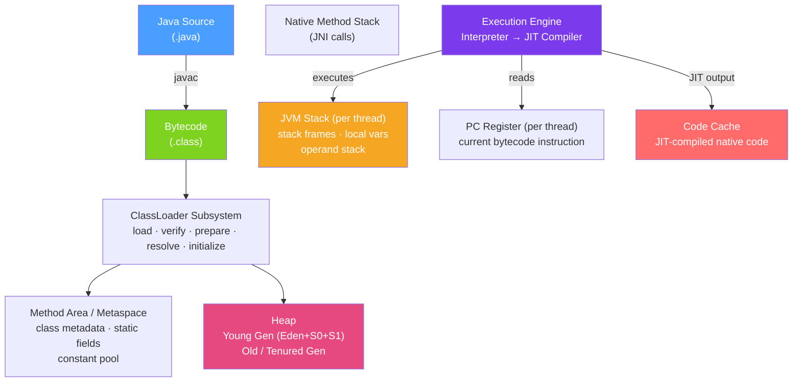

# ⚙️ JVM Architecture

> [!abstract] TL;DR
> The Java Virtual Machine is a stack-based abstract computer that executes Java bytecode, hiding platform differences behind a uniform runtime. Its memory is divided into the heap (all objects), per-thread stacks (frames), metaspace (class metadata), PC registers, and the code cache (JIT-compiled native code). The key flags `-Xms`/`-Xmx` size the heap; `-Xss` sizes each thread's stack.

## Intuition — analogy FIRST
Think of the JVM as a virtual laptop running inside your real laptop. Your Java program runs on this virtual laptop — it doesn't know or care whether the real hardware is x86 or ARM, Windows or Linux. The virtual laptop has its own memory layout: a large **heap** (RAM for objects), a **stack** per thread (call frames, local variables), a **filing cabinet** called metaspace (class blueprints), and a **recipe card holder** called the code cache (hot compiled machine code). The JVM's job is to translate the universal bytecode language your program speaks into the native machine instructions the real CPU understands.

---

## How It Works



## Key Concepts / Details

### Runtime Data Areas

#### Heap
The largest memory area — shared across all threads. All `new` object allocations happen here. Divided into generations:

```
┌─────────────────────────────────────────────────────────┐
│  Heap                                                    │
│  ┌──────────────────────────┐  ┌─────────────────────┐  │
│  │  Young Generation        │  │  Old Generation     │  │
│  │  ┌──────┬──────┬──────┐  │  │  (Tenured)          │  │
│  │  │ Eden │  S0  │  S1  │  │  │  Long-lived objects │  │
│  │  └──────┴──────┴──────┘  │  └─────────────────────┘  │
│  │  new objects born here   │                            │
│  └──────────────────────────┘                            │
└─────────────────────────────────────────────────────────┘
```

- **Eden**: all new objects are allocated here
- **Survivor (S0/S1)**: objects that survive a minor GC move here; toggled each GC cycle
- **Old Gen**: objects that survive multiple GC cycles get promoted here

#### Stack (Per Thread)
Each thread has its own JVM stack. Each method call creates a **stack frame** containing:
- Local variable table
- Operand stack (used for bytecode execution)
- Reference to the constant pool
- Return value

```java
// This code creates 3 stack frames:
public int add(int a, int b) {    // frame 3 (innermost)
    return a + b;
}
public int calculate(int x) {      // frame 2
    return add(x, x * 2);
}
public void main() {               // frame 1
    int r = calculate(5);
}
```

Stack overflow (`StackOverflowError`) happens when recursion is too deep and the stack fills up.

#### Metaspace (Replaced PermGen in Java 8)
Stores class metadata: class structure, method signatures, constant pools, static variables. Lives in native memory (not heap) — no `OutOfMemoryError: PermGen space` anymore, but can still run out with excessive class generation (dynamic proxies, CGLIB).

Key flags:
```
-XX:MetaspaceSize=64m          # initial metaspace commit
-XX:MaxMetaspaceSize=256m      # cap; without this, metaspace grows unboundedly
```

#### Code Cache
Stores JIT-compiled native code. Size matters for large applications:
```
-XX:ReservedCodeCacheSize=256m  # default 240m; increase for large apps
```

#### PC Register (Per Thread)
A tiny register holding the address of the currently executing bytecode instruction. Undefined for native methods.

### Platform Independence — Write Once, Run Anywhere

```
┌────────────────────────────────────────────────────┐
│  Developer writes Java source code                 │
└────────────────────────┬───────────────────────────┘
                         │  javac compiles
                         ▼
┌────────────────────────────────────────────────────┐
│  Java bytecode (.class) — platform-neutral         │
└────────────────────────┬───────────────────────────┘
                         │
          ┌──────────────┼──────────────────┐
          ▼              ▼                  ▼
    JVM (Linux x86)  JVM (Windows x64)  JVM (macOS ARM)
```

The bytecode is the portable unit. Each JVM implementation translates it to the native CPU instructions of its host platform.

### Key JVM Flags Reference

```bash
# Heap sizing
-Xms512m                    # initial heap size (set equal to Xmx to avoid resizing)
-Xmx4g                      # maximum heap size
-XX:NewRatio=3              # ratio of Old:Young (default 2; Old = 2/3 of heap)
-XX:NewSize=256m            # explicit Young Gen size

# Stack
-Xss512k                    # stack size per thread (default 512k-1m)

# Metaspace
-XX:MaxMetaspaceSize=256m   # cap metaspace

# GC selection
-XX:+UseG1GC                # G1 (default Java 9+)
-XX:+UseZGC                 # ZGC (ultra-low pause, Java 15+ production)
-XX:+UseShenandoahGC        # Shenandoah

# Diagnostics
-verbose:gc                 # simple GC output (legacy)
-Xlog:gc*:file=gc.log       # structured GC log (Java 9+)
-XX:+HeapDumpOnOutOfMemoryError -XX:HeapDumpPath=/tmp/heap.hprof
```

### Off-Heap Memory

`DirectByteBuffer` allocates memory outside the heap — useful for file IO, network, native libraries:
```java
ByteBuffer direct = ByteBuffer.allocateDirect(1024 * 1024); // 1 MB off-heap
```
This memory is not managed by GC. Control with:
```
-XX:MaxDirectMemorySize=256m
```

---

## Real-World Notes

- **Set `-Xms` equal to `-Xmx`**: prevents heap resizing under load which causes GC pauses and fragmentation. In containers, set to ~75% of container memory.
- **Metaspace leaks**: applications that generate classes dynamically (Spring CGLIB, Javassist, Hibernate) can exhaust metaspace. Always set `-XX:MaxMetaspaceSize`.
- **Container awareness**: JDK 8u191+ and JDK 11+ respect cgroup memory limits (`-XX:+UseContainerSupport` is default ON). Before this, JVM saw the host machine's memory and sized the heap too large for the container.
- **Stack size and virtual threads**: with virtual threads (Java 21), each virtual thread has a very small initial stack that grows as needed — `-Xss` still applies to carrier (platform) threads.

---

## Common Pitfalls

- **Not setting `-Xmx`**: JVM defaults to 25% of physical RAM, which may be too large or too small for your deployment.
- **Setting heap too large**: with old GC algorithms, a 32GB heap meant 32GB to scan — massive GC pauses. Use G1/ZGC for large heaps.
- **Ignoring off-heap**: a service that appears to have plenty of heap may run out of native memory due to DirectByteBuffer or NIO usage.
- **PermGen vs Metaspace confusion**: PermGen was removed in Java 8. `-XX:MaxPermSize` is silently ignored in Java 8+ — set `-XX:MaxMetaspaceSize` instead.

---

## Related Concepts

- [[ClassLoader_System]] — How classes get loaded into the Method Area
- [[Garbage_Collection]] — How the heap is managed and reclaimed
- [[JIT_Compilation]] — How bytecode is compiled to native code in the Code Cache
- [[JVM_Tuning]] — Production JVM configuration and diagnostic tools

---

## Review Questions

1. What does each JVM memory area (heap, stack, metaspace, code cache) store?
2. Why was PermGen replaced by Metaspace in Java 8?
3. What is the difference between Eden, Survivor, and Old Generation?
4. Why should you set `-Xms` equal to `-Xmx` in production?
5. What is platform independence and how does bytecode enable it?

---

## Sources

- The Java Virtual Machine Specification — Chapter 2: The Structure of the Java Virtual Machine
- Java Documentation: JVM Tool Interface (JVMTI)
- OpenJDK Wiki: HotSpot Runtime Overview

#java #jvm #architecture #heap #stack #metaspace
