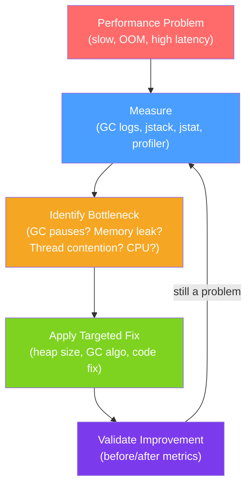

# 🔧 JVM Tuning

> [!abstract] TL;DR
> JVM tuning involves selecting the right GC algorithm, sizing heap and thread stacks, and using diagnostic tools to identify problems. The golden rule: measure first, tune second. Key tools: `jstack` for thread dumps, `jmap` for heap dumps, `jstat` for GC statistics, `jcmd` for on-the-fly diagnostics, and async-profiler / JFR for production profiling.

## Intuition — analogy FIRST
Tuning a JVM is like tuning a car engine for a specific race track. You wouldn't use the same settings for a Formula 1 circuit (low latency → ZGC, small heap) as for a Le Mans endurance race (throughput → Parallel GC, large heap). Before you tune anything, you put the car on a dynamometer (profiler) to measure actual behavior — guessing what to adjust without data is how you make things worse. The JVM provides a full instrument panel: GC logs, thread dumps, heap dumps, and flight recorders.

---

## How It Works



## Key Concepts / Details

### Essential JVM Flags Reference

#### Heap Sizing
```bash
# Set Xms = Xmx to avoid heap resizing
-Xms4g -Xmx4g

# In containers: set to ~75% of container memory limit
# Container = 8GB → -Xmx6g

# New Gen sizing (affects GC frequency/pause trade-off)
-XX:NewRatio=2              # OldGen:YoungGen ratio (default 2: 1/3 Young, 2/3 Old)
-XX:NewSize=1g              # explicit Young Gen minimum size
-XX:MaxNewSize=2g           # explicit Young Gen maximum size
```

#### GC Selection and Tuning
```bash
# G1 (default Java 9+, recommended for most workloads)
-XX:+UseG1GC
-XX:MaxGCPauseMillis=200    # pause time goal (G1 tries to meet this; not guaranteed)
-XX:G1HeapRegionSize=16m    # region size (1-32MB, power of 2)
-XX:G1NewSizePercent=5      # minimum Young Gen
-XX:G1MaxNewSizePercent=60  # maximum Young Gen
-XX:InitiatingHeapOccupancyPercent=45  # start marking at 45% heap usage

# ZGC (ultra-low pause, Java 15+ production)
-XX:+UseZGC
-XX:SoftMaxHeapSize=28g     # soft cap; ZGC tries to stay under this
-XX:ZCollectionInterval=5   # proactive GC every 5 seconds

# Shenandoah
-XX:+UseShenandoahGC
-XX:ShenandoahGCHeuristics=adaptive  # default heuristic

# Parallel (batch jobs, throughput-first)
-XX:+UseParallelGC
-XX:ParallelGCThreads=8
```

#### GC Logging (Java 9+)
```bash
-Xlog:gc:file=/logs/gc.log:time,tags
-Xlog:gc*:file=/logs/gc-detail.log:time,tags,level:filecount=5,filesize=10m
```

#### Diagnostics Flags
```bash
-XX:+HeapDumpOnOutOfMemoryError
-XX:HeapDumpPath=/tmp/heap.hprof
-XX:ErrorFile=/tmp/hs_err_%p.log   # fatal error log

# JIT diagnostics
-XX:+PrintCompilation
-XX:+PrintInlining

# Thread-level
-Xss512k                    # stack size per thread
```

### Diagnostic Tools

#### jstack — Thread Dumps
```bash
# Get thread dump (replace PID)
jstack -l <pid> > thread-dump.txt

# Look for:
# - BLOCKED threads waiting on a lock
# - WAITING/TIMED_WAITING piled up on the same lock
# - Deadlock section at bottom (jstack detects deadlocks)
```

Sample output interpretation:
```
"http-nio-8080-exec-1" #26 daemon prio=5 os_prio=0 tid=... nid=0x1234 waiting for monitor entry
   java.lang.Thread.State: BLOCKED (on object monitor)
   at com.example.UserService.getUser(UserService.java:42)
   - waiting to lock <0x0000000781234567> (a java.util.HashMap)
   at com.example.Controller.handleRequest(Controller.java:18)
```
This shows a thread blocked on a HashMap lock — likely a non-thread-safe map used in a synchronized context.

#### jmap — Heap Operations
```bash
# Trigger heap dump (live: only reachable objects)
jmap -dump:live,format=b,file=heap.hprof <pid>

# Heap histogram (quick view without full dump)
jmap -histo:live <pid> | head -30
```

#### jstat — GC Statistics
```bash
# GC utilization every 1 second
jstat -gcutil <pid> 1000

# Output columns: S0%  S1%  E%   O%   M%   CCS%  YGC  YGCT  FGC  FGCT  CGC  CGCT    GCT
#                  0.0  0.0  23.5 45.2 97.3  90.1   42  1.234   2  0.456   0  0.000  1.690
# E=Eden usage, O=Old Gen usage, YGC=Young GC count, FGC=Full GC count
```

#### jcmd — Swiss Army Knife (Java 8+)
```bash
# List available commands for a process
jcmd <pid> help

# Thread dump
jcmd <pid> Thread.print

# Heap dump
jcmd <pid> GC.heap_dump filename=/tmp/heap.hprof

# Force GC
jcmd <pid> GC.run

# JVM flags currently active
jcmd <pid> VM.flags

# JFR recording
jcmd <pid> JFR.start name=myrecording maxage=5m filename=/tmp/recording.jfr
jcmd <pid> JFR.stop name=myrecording
```

#### Java Flight Recorder (JFR)
```bash
# Enable JFR at startup (continuous recording)
-XX:StartFlightRecording=maxsize=256m,maxage=1h,name=continuous,filename=/logs/recording.jfr

# Or trigger via jcmd (production safe, < 1% overhead)
jcmd <pid> JFR.start name=profile duration=60s filename=/tmp/profile.jfr
# After duration: JFR.stop writes the file

# Analyze with JDK Mission Control (GUI)
```

### Common Tuning Scenarios

#### Scenario 1: High GC Pause Times
```bash
# Symptoms: latency spikes correlating with GC events
# Diagnosis: -Xlog:gc* shows long STW pauses

# Fix 1: Switch to ZGC (if Java 15+)
-XX:+UseZGC

# Fix 2: Tune G1 pause goal
-XX:MaxGCPauseMillis=100

# Fix 3: Increase heap (if heap too small → frequent GC)
-Xmx8g
```

#### Scenario 2: OutOfMemoryError: Java heap space
```bash
# Symptoms: OOM, app crashes
# Diagnosis: heap dump analysis with MAT

# Immediate fix: increase heap
-Xmx12g

# Real fix: find memory leak in heap dump
# Look for: unexpected large retained heap, growing collections
```

#### Scenario 3: OutOfMemoryError: Metaspace
```bash
# Symptoms: OOM after dynamic class generation
# Fix: cap metaspace
-XX:MaxMetaspaceSize=256m
# Root cause: CGLIB/dynamic proxies generating too many classes
```

### Container-Aware JVM Settings

```bash
# Modern JVM (11+) respects cgroup limits automatically
# With 4GB container limit:
-Xmx3g                 # 75% of container memory
-Xms3g                 # same as Xmx (no resizing)
-XX:MaxMetaspaceSize=256m
-Xss512k               # smaller stacks if many threads

# Kubernetes resource limits → JVM sees them correctly
# resources:
#   limits:
#     memory: "4Gi"
```

---

## Real-World Notes

- **GC logs are free**: enable them always in production. The overhead is negligible (< 1%) and they're invaluable for diagnosing issues post-mortem.
- **Heap dump on OOM**: `-XX:+HeapDumpOnOutOfMemoryError` is essential for production — without it, you restart the pod and lose all forensic data.
- **async-profiler over JVM sampling profilers**: sampling profilers using JVMTI have safepoint bias. async-profiler uses `AsyncGetCallTrace` which doesn't require safepoints — gives accurate hot method data.
- **JFR is production-safe**: Java Flight Recorder has < 1% overhead even when recording continuously. Use it; don't save profiling only for problems.
- **Thread pool monitoring**: expose `ThreadPoolExecutor` metrics via Micrometer (`hikaricp.*`, `executor.*`) to Prometheus. Pool exhaustion is often the root cause of latency issues.

---

## Common Pitfalls

- **Tuning before measuring**: changing GC flags randomly without profiling data rarely helps and often hurts.
- **Setting heap too large for GC algorithm**: G1 on a 64GB heap with a 200ms pause goal may not be achievable. ZGC scales better at large heap sizes.
- **Ignoring non-heap memory**: native memory (`DirectByteBuffer`, thread stacks, Metaspace) is invisible to heap analysis. Use `NativeMemoryTracking`:
  ```bash
  -XX:NativeMemoryTracking=summary
  jcmd <pid> VM.native_memory summary
  ```
- **Over-tuning**: the JVM defaults are good. Most production issues are code problems (memory leaks, thread contention, bad queries), not JVM flag problems.

---

## Related Concepts

- [[JVM_Architecture]] — Memory areas that flags control
- [[Garbage_Collection]] — GC algorithms referenced by flags
- [[JIT_Compilation]] — JIT flags for compilation diagnostics
- [[Java_Profiling]] — async-profiler, JFR for production profiling

---

## Review Questions

1. What is the purpose of setting `-Xms` equal to `-Xmx` in production?
2. How do you take a thread dump and what would a deadlock look like in the output?
3. What does `jstat -gcutil` show and how do you interpret the E%, O%, and FGC columns?
4. What is Java Flight Recorder and why is it preferred for production profiling?
5. A pod is crashing with OOM. What flags would you add to capture forensic data?

---

## Sources

- Oracle Java Documentation: Garbage Collection Tuning Guide
- Oracle Java Documentation: Troubleshooting Guide
- async-profiler: https://github.com/async-profiler/async-profiler
- JDK Mission Control: https://www.oracle.com/java/technologies/jdk-mission-control.html

#java #jvm #tuning #jstack #jmap #jstat #jcmd #jfr #gc-tuning
