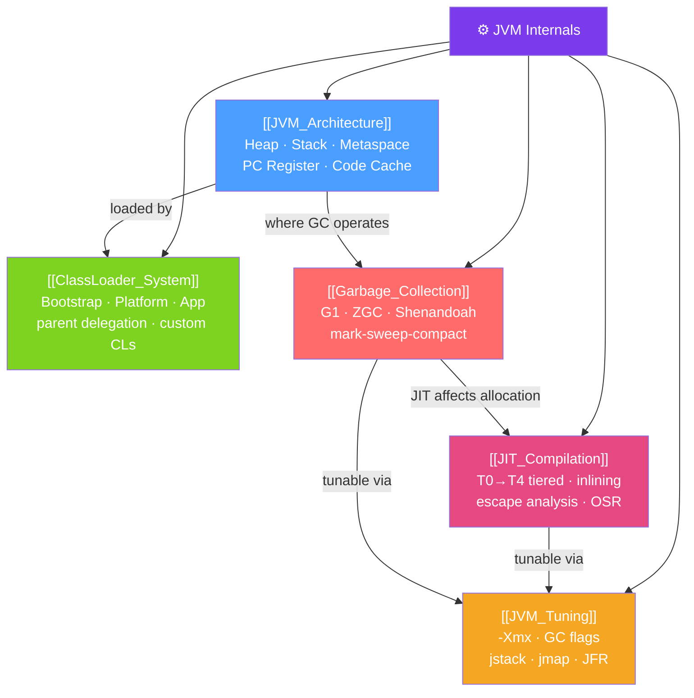

# ⚙️ JVM Internals — Map of Content

> [!abstract] What This Section Covers
> The JVM is the engine that runs all Java (and Kotlin, Scala, Groovy, Clojure) code. This section opens the hood: the runtime data areas that hold every object and frame, the class loading hierarchy that finds and verifies bytecode, the garbage collection algorithms that reclaim memory without stopping the world (or pausing for <1ms with ZGC), the JIT compiler tiers that translate bytecode into native machine code, and the tuning flags that let you shape JVM behavior for your workload.

## Concept Map

## Learning Path
1. [[JVM_Architecture]] — Understand the runtime data areas: heap, stack, metaspace, and code cache.
2. [[ClassLoader_System]] — Learn how classes are found, loaded, and isolated using the delegation model.
3. [[Garbage_Collection]] — Study GC algorithms from Serial to ZGC and when to choose each.
4. [[JIT_Compilation]] — Explore how the JVM compiles hot bytecode to native machine code.
5. [[JVM_Tuning]] — Apply flags and diagnostic tools to tune and troubleshoot JVM behavior.

## All Notes at a Glance
| Note | Difficulty | What You'll Learn |
|------|------------|-------------------|
| [[JVM_Architecture]] | Intermediate | Runtime data areas, heap structure, platform independence |
| [[ClassLoader_System]] | Intermediate | Parent delegation, bootstrap/platform/app CLs, custom class loaders |
| [[Garbage_Collection]] | Advanced | Generational GC, G1, ZGC, Shenandoah, GC log analysis |
| [[JIT_Compilation]] | Advanced | Tiered compilation T0-T4, inlining, escape analysis, OSR |
| [[JVM_Tuning]] | Advanced | Heap flags, GC selection, jstack/jmap/jstat/jcmd diagnostic tools |

## Key Questions This Section Answers
- What are the different memory areas in the JVM and what does each hold?
- Why does Java achieve platform independence?
- How does the parent-delegation model prevent class shadowing attacks?
- What is the generational hypothesis and how does it shape GC algorithm design?
- How does G1 GC differ from ZGC?
- What is escape analysis and how does it enable stack allocation of heap objects?
- How do you diagnose a memory leak using jmap and heap dump analysis?

## Related Sections
- [[_MOC_Java_Master|↑ Java Master MOC]]
- [[_MOC_Concurrency|→ Concurrency]] — Threads interact with JVM memory model
- [[_MOC_Performance_Java|→ Performance]] — Profiling and GC tuning in production

#MOC #java #jvm #internals
