# 🎭 Behavioral Patterns

> [!abstract] TL;DR
> Behavioral patterns define how objects communicate and distribute responsibility. Strategy makes algorithms interchangeable (Java's `Comparator` IS a Strategy); Observer decouples event producers from consumers (Spring events); Command encapsulates requests as objects enabling undo; Template Method defines an algorithm skeleton with customizable steps; Chain of Responsibility passes requests along a handler chain (Servlet filters).

## Intuition — analogy FIRST
Think of behavioral patterns as rules of engagement in a team. **Strategy**: the team manager (context) delegates the "how to score" to different players (strategies) — a sprinter strategy, a strength strategy. **Observer**: the stadium announcer (publisher) broadcasts events; fans (subscribers) react however they choose. **Command**: military orders are written on paper — they can be queued, logged, undone ("stand down"). **Template Method**: a training regimen has fixed steps (warmup, drill, cooldown) but each team fills in different drills. **Chain of Responsibility**: a support ticket escalates from L1 to L2 to L3 — each level handles if they can, otherwise passes it up.

---

## How It Works

```mermaid
graph TD
    Strategy["Strategy\nEncapsulate algorithms\nswap at runtime\nComparator, Predicate"]
    Observer["Observer\nEvent notification\none-to-many dependency\nSpring events, listeners"]
    Command["Command\nEncapsulate request\nas object\nundo/redo, queuing"]
    Template["Template Method\nSkeleton algorithm\nsubclasses fill steps\nAbstractClass"]
    Chain["Chain of Responsibility\nPass request along chain\nServlet filters, middleware"]
    State["State\nBehavior changes\nwith internal state\nOrder: PENDING→SHIPPED"]
    Iterator["Iterator\nSequential access\nwithout exposing structure\njava.util.Iterator"]
    Mediator["Mediator\nReduce direct coupling\nchat room, MVC controller"]
    Visitor["Visitor\nAdd operations\nwithout changing classes\nAST visitors"]

    style Strategy fill:#4a9eff,color:#fff
    style Observer fill:#7ed321,color:#fff
    style Command fill:#e64980,color:#fff
    style Template fill:#f5a623,color:#fff
    style Chain fill:#ff6b6b,color:#fff
    style State fill:#7c3aed,color:#fff
    style Iterator fill:#868e96,color:#fff
    style Mediator fill:#20c997,color:#fff
    style Visitor fill:#fd7e14,color:#fff
```



## Key Concepts / Details

### 1. Strategy — Swappable Algorithms

```java
// Strategy interface
@FunctionalInterface
public interface SortStrategy<T> {
    void sort(List<T> list);
}

// Context: uses a strategy
public class DataSorter<T> {
    private SortStrategy<T> strategy;

    public void setStrategy(SortStrategy<T> strategy) {
        this.strategy = strategy;
    }

    public void sort(List<T> data) {
        strategy.sort(data); // delegates to chosen strategy
    }
}

// Usage: Java's Comparator IS a Strategy
List<User> users = new ArrayList<>(/*...*/);
users.sort(Comparator.comparing(User::getName));             // alphabetical strategy
users.sort(Comparator.comparing(User::getAge).reversed());  // age descending strategy

// Functional strategies with lambdas
DataSorter<Integer> sorter = new DataSorter<>();
sorter.setStrategy(list -> Collections.sort(list));          // natural order
sorter.setStrategy(list -> list.sort(Comparator.reverseOrder())); // reversed
```

### 2. Observer — Publish-Subscribe

```java
// Classic Observer
public interface EventListener<T> {
    void onEvent(T event);
}

public class EventBus<T> {
    private final List<EventListener<T>> listeners = new CopyOnWriteArrayList<>();

    public void subscribe(EventListener<T> listener) { listeners.add(listener); }
    public void unsubscribe(EventListener<T> listener) { listeners.remove(listener); }

    public void publish(T event) {
        listeners.forEach(listener -> listener.onEvent(event));
    }
}

// Spring events (preferred in Spring apps)
// Publisher
@Service
public class OrderService {
    @Autowired private ApplicationEventPublisher eventPublisher;

    public void placeOrder(Order order) {
        processOrder(order);
        eventPublisher.publishEvent(new OrderPlacedEvent(this, order)); // publish
    }
}

// Subscriber — decoupled from publisher
@Component
public class EmailNotificationListener {
    @EventListener
    public void onOrderPlaced(OrderPlacedEvent event) {
        emailService.sendConfirmation(event.getOrder().getCustomerEmail());
    }
}

@Component
public class InventoryListener {
    @EventListener
    @Async // async listener — runs in separate thread
    public void onOrderPlaced(OrderPlacedEvent event) {
        inventory.deduct(event.getOrder().getItems());
    }
}
```

### 3. Command — Encapsulate Requests as Objects

```java
// Command interface
public interface Command {
    void execute();
    void undo(); // supports undo/redo
}

// Concrete commands
public class CreateUserCommand implements Command {
    private final UserRepository repo;
    private final User user;
    private String createdUserId; // state for undo

    public CreateUserCommand(UserRepository repo, User user) {
        this.repo = repo;
        this.user = user;
    }

    @Override
    public void execute() {
        createdUserId = repo.save(user).getId();
    }

    @Override
    public void undo() {
        repo.deleteById(createdUserId);
    }
}

// Invoker: queues and executes commands
public class CommandProcessor {
    private final Deque<Command> history = new ArrayDeque<>();

    public void execute(Command command) {
        command.execute();
        history.push(command);
    }

    public void undo() {
        if (!history.isEmpty()) {
            history.pop().undo();
        }
    }
}
```

### 4. Template Method — Algorithm Skeleton

```java
// Abstract class defines the template
public abstract class DataMigration {
    // Template method — defines the algorithm skeleton
    public final void migrate() { // final: subclasses cannot change the order
        connect();
        readData();
        transformData(); // hook — optional override
        writeData();
        cleanup();
    }

    protected abstract void readData();
    protected abstract void writeData();

    protected void transformData() { /* default: no-op */ }

    private void connect() { System.out.println("Connecting..."); }
    private void cleanup() { System.out.println("Cleaning up..."); }
}

// Concrete implementations fill in the abstract steps
public class CSVToDBMigration extends DataMigration {
    @Override
    protected void readData() { /* read from CSV */ }

    @Override
    protected void writeData() { /* write to DB */ }

    @Override
    protected void transformData() { /* custom CSV→DB transformation */ }
}

// Java 8+ alternative with functional hooks
public class DataPipeline {
    public <T> void process(
            Supplier<List<T>> reader,       // strategy for reading
            Function<T, T> transformer,     // strategy for transforming
            Consumer<List<T>> writer) {     // strategy for writing
        List<T> data = reader.get();
        List<T> transformed = data.stream().map(transformer).collect(Collectors.toList());
        writer.accept(transformed);
    }
}
```

### 5. Chain of Responsibility — Handler Pipeline

```java
// Handler interface
public abstract class RequestHandler {
    protected RequestHandler next;

    public RequestHandler setNext(RequestHandler next) {
        this.next = next;
        return next; // for chaining: h1.setNext(h2).setNext(h3)
    }

    public abstract void handle(Request request);

    protected void passToNext(Request request) {
        if (next != null) next.handle(request);
    }
}

// Concrete handlers
public class AuthenticationHandler extends RequestHandler {
    @Override
    public void handle(Request request) {
        if (!request.hasValidToken()) {
            throw new UnauthorizedException("Missing or invalid token");
        }
        passToNext(request); // authenticated — pass along
    }
}

public class RateLimitHandler extends RequestHandler {
    @Override
    public void handle(Request request) {
        if (rateLimiter.isExceeded(request.getClientId())) {
            throw new TooManyRequestsException("Rate limit exceeded");
        }
        passToNext(request);
    }
}

// Spring's Servlet Filter chain IS Chain of Responsibility
// Spring Security builds its entire filter chain with this pattern
```

### 6. State Pattern

```java
// Order state machine
public interface OrderState {
    void confirm(Order order);
    void ship(Order order);
    void deliver(Order order);
    void cancel(Order order);
}

public class PendingState implements OrderState {
    @Override public void confirm(Order order) { order.setState(new ConfirmedState()); }
    @Override public void ship(Order order) { throw new IllegalStateException("Must confirm first"); }
    @Override public void deliver(Order order) { throw new IllegalStateException("Must ship first"); }
    @Override public void cancel(Order order) { order.setState(new CancelledState()); }
}

public class Order {
    private OrderState state = new PendingState();
    public void setState(OrderState state) { this.state = state; }
    public void confirm() { state.confirm(this); }
    public void ship() { state.ship(this); }
    // ...
}
```

### Pattern Summary Table

| Pattern | Core Idea | Java API Example |
|---------|-----------|-----------------|
| Strategy | Swappable algorithms | `Comparator`, `Predicate`, `Function` |
| Observer | Event notification | `EventListener`, Spring `@EventListener` |
| Command | Encapsulate request | `Runnable`, Spring `@Scheduled` |
| Template Method | Algorithm skeleton | `HttpServlet`, `AbstractList` |
| Chain of Responsibility | Ordered handler pipeline | Servlet `Filter`, Spring Security |
| State | State-dependent behavior | Enum state machines, workflow engines |
| Iterator | Sequential access | `java.util.Iterator`, enhanced `for` |
| Mediator | Reduce direct coupling | Spring MVC `DispatcherServlet` |
| Visitor | Add operations to object structure | Java compiler AST, Jackson |

---

## Real-World Notes

- **Functional interfaces as Strategies**: Java 8's `@FunctionalInterface` lets you express Strategy as a lambda — no need for explicit Strategy classes. `Comparator`, `Predicate`, `Function`, `Consumer`, `Supplier` are all Strategy patterns.
- **Spring's filter chain**: Spring Security adds filters to the Servlet filter chain — AuthenticationFilter, ExceptionTranslationFilter, FilterSecurityInterceptor — each is a handler in the chain.
- **Template Method vs Strategy**: Template Method uses inheritance (subclass fills in steps); Strategy uses composition (inject the algorithm). Prefer Strategy for flexibility; Template Method for when the algorithm structure must not change.

---

## Common Pitfalls

- **Observer memory leaks**: if listeners are never unregistered, they prevent garbage collection of the listener objects (and everything they reference). Use weak references or explicit unsubscribe.
- **Command pattern without bounded history**: storing unlimited undo history causes memory growth. Limit history depth.
- **Overusing Chain of Responsibility**: deeply nested chains are hard to debug. Prefer when handlers are truly independent and the chain composition is data-driven.

---

## Related Concepts

- [[Creational_Patterns]] — Strategies and Commands are often created with Factory patterns
- [[Spring_Events]] — Spring's built-in Observer pattern implementation
- [[Spring_AOP]] — Advice chain is Chain of Responsibility applied to method calls

---

## Review Questions

1. How is Java's `Comparator` an example of the Strategy pattern?
2. What is the difference between Observer and Chain of Responsibility?
3. Why would you choose Template Method over Strategy?
4. How does Spring's filter chain implement Chain of Responsibility?
5. What is the memory leak risk with Observer and how do you prevent it?

---

## Sources

- Gang of Four, *Design Patterns* — Chapter 5: Behavioral Patterns
- Refactoring.guru: Behavioral Patterns
- Spring Framework Source: SecurityFilterChain, ApplicationEventMulticaster

#java #design-patterns #strategy #observer #command #template-method #chain-of-responsibility #behavioral
