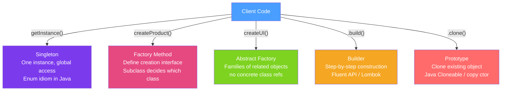

# 🏭 Creational Patterns

> [!abstract] TL;DR
> Creational patterns abstract the instantiation process, making systems independent of how their objects are created, composed, and represented. The five GoF creational patterns — Singleton, Factory Method, Abstract Factory, Builder, and Prototype — each solve a different object creation problem. In modern Java, Builder is ubiquitous (Lombok, record builders), and Singleton is best implemented with an enum.

## Intuition — analogy FIRST
Creating objects is like commissioning a piece of custom furniture. **Singleton** means there's only one master craftsman for this type — everyone uses the same one. **Factory Method** lets each showroom decide which craftsman they hire — you request "a chair maker" and the showroom provides their preferred supplier. **Abstract Factory** is a coordinated furniture suite — you pick a style (Modern or Victorian) and get a matched set of chair, table, and lamp from that style. **Builder** is building your IKEA kit step by step — screw this, attach that, then get the finished product. **Prototype** is cloning an existing piece of furniture rather than building from scratch.

---

## How It Works



## Key Concepts / Details

### 1. Singleton — Thread-Safe, Lazy, Serialization-Safe

```java
// BEST: Enum Singleton — thread-safe, lazy, serialization-safe, clone-safe
public enum DatabaseConnection {
    INSTANCE;

    private final Connection connection;

    DatabaseConnection() {
        this.connection = createConnection();
    }

    public Connection getConnection() { return connection; }
}
// Usage: DatabaseConnection.INSTANCE.getConnection()

// ACCEPTABLE: Double-Checked Locking with volatile
public class Config {
    private static volatile Config instance; // volatile prevents instruction reordering

    private Config() {}

    public static Config getInstance() {
        if (instance == null) {
            synchronized (Config.class) {
                if (instance == null) {  // double-check
                    instance = new Config();
                }
            }
        }
        return instance;
    }
}

// SIMPLEST (eager): class-level static — loaded when class is first used
public class AppConfig {
    private static final AppConfig INSTANCE = new AppConfig();
    private AppConfig() {}
    public static AppConfig getInstance() { return INSTANCE; }
}
```

### 2. Factory Method — Defer Instantiation to Subclass

```java
// Abstract creator defines the factory method
public abstract class DocumentParser {
    public Document parse(String filePath) {
        DocumentReader reader = createReader(filePath); // factory method
        return reader.read();
    }

    protected abstract DocumentReader createReader(String filePath); // subclasses override
}

// Concrete creators provide specific implementations
public class PdfParser extends DocumentParser {
    @Override
    protected DocumentReader createReader(String filePath) {
        return new PdfDocumentReader(filePath);
    }
}

public class WordParser extends DocumentParser {
    @Override
    protected DocumentReader createReader(String filePath) {
        return new WordDocumentReader(filePath);
    }
}

// Static factory method (alternative, not strictly GoF Factory Method)
public class LocalDate {
    public static LocalDate of(int year, int month, int day) { /* ... */ }
    public static LocalDate now() { /* ... */ }
    public static LocalDate parse(CharSequence text) { /* ... */ }
}
```

### 3. Abstract Factory — Families of Related Objects

```java
// Abstract factory: creates families of related objects
public interface UIFactory {
    Button createButton();
    TextField createTextField();
    Dialog createDialog();
}

// Concrete factories for different platforms
public class WindowsUIFactory implements UIFactory {
    @Override public Button createButton() { return new WindowsButton(); }
    @Override public TextField createTextField() { return new WindowsTextField(); }
    @Override public Dialog createDialog() { return new WindowsDialog(); }
}

public class MacUIFactory implements UIFactory {
    @Override public Button createButton() { return new MacButton(); }
    @Override public TextField createTextField() { return new MacTextField(); }
    @Override public Dialog createDialog() { return new MacDialog(); }
}

// Client depends only on the abstract factory interface
public class Application {
    private final UIFactory factory;
    public Application(UIFactory factory) { this.factory = factory; }

    public void buildUI() {
        Button btn = factory.createButton();  // doesn't know Windows vs Mac
        TextField tf = factory.createTextField();
    }
}
```

### 4. Builder — Step-by-Step Construction

```java
// Classic Builder pattern
public class HttpRequest {
    private final String method;
    private final String url;
    private final Map<String, String> headers;
    private final String body;
    private final int timeoutMs;

    private HttpRequest(Builder builder) {
        this.method = builder.method;
        this.url = builder.url;
        this.headers = Collections.unmodifiableMap(builder.headers);
        this.body = builder.body;
        this.timeoutMs = builder.timeoutMs;
    }

    public static class Builder {
        private final String method; // required
        private final String url;   // required
        private Map<String, String> headers = new HashMap<>();
        private String body;
        private int timeoutMs = 5000; // default

        public Builder(String method, String url) {
            this.method = method;
            this.url = url;
        }

        public Builder header(String key, String value) {
            headers.put(key, value);
            return this; // fluent API
        }
        public Builder body(String body) { this.body = body; return this; }
        public Builder timeout(int ms) { this.timeoutMs = ms; return this; }
        public HttpRequest build() { return new HttpRequest(this); }
    }
}

// Usage:
HttpRequest request = new HttpRequest.Builder("POST", "https://api.example.com/users")
    .header("Content-Type", "application/json")
    .header("Authorization", "Bearer token123")
    .body("{\"name\": \"Alice\"}")
    .timeout(3000)
    .build();

// Lombok @Builder (auto-generates builder)
@Builder
@Value // immutable + getters
public class UserDTO {
    String id;
    String name;
    @Builder.Default int age = 0;
}
UserDTO user = UserDTO.builder().id("1").name("Alice").age(30).build();
```

### 5. Prototype — Clone Existing Objects

```java
// Using copy constructors (preferred over Cloneable)
public class UserSettings {
    private String theme;
    private int fontSize;
    private List<String> shortcuts;

    // Copy constructor
    public UserSettings(UserSettings other) {
        this.theme = other.theme;
        this.fontSize = other.fontSize;
        this.shortcuts = new ArrayList<>(other.shortcuts); // deep copy collections!
    }

    public UserSettings withTheme(String newTheme) {
        UserSettings copy = new UserSettings(this); // clone
        copy.theme = newTheme;
        return copy;
    }
}

// Java records are naturally copy-constructable
record Point(double x, double y) {
    Point translate(double dx, double dy) {
        return new Point(x + dx, y + dy); // immutable "clone with change"
    }
}
```

### Comparison Table

| Pattern | Problem Solved | Key Players | Java Examples |
|---------|---------------|-------------|---------------|
| Singleton | One instance, global access | Instance, `getInstance()` | Spring beans (default scope), `Runtime.getRuntime()` |
| Factory Method | Subclass decides which class | Creator, ConcreteCreator | `Calendar.getInstance()`, `LocalDate.of()` |
| Abstract Factory | Families of related objects | AbstractFactory, ConcreteFactory | JDBC DriverManager, Spring BeanFactory |
| Builder | Complex object construction | Builder, Product | `StringBuilder`, Lombok `@Builder`, Stream.Builder |
| Prototype | Clone existing object | Prototype interface | `Object.clone()`, copy constructors |

---

## Real-World Notes

- **Prefer enum Singleton**: it's the only implementation that is immune to reflection attacks (`Constructor.setAccessible(true)`), serialization (single enum value survives deserialization), and clone attacks.
- **Spring IoC replaces Singleton and Factory**: when using Spring, you rarely need to implement these patterns manually — the container manages bean creation and lifetime.
- **Lombok `@Builder` pitfall with JPA**: Lombok's generated all-args constructor breaks Hibernate's requirement for a no-args constructor. Add `@NoArgsConstructor` or use `@Builder(toBuilder=true)` carefully.
- **Java records as immutable value objects**: Java 16+ records are natural prototypes — create a modified copy with compact constructors.

---

## Common Pitfalls

- **Singleton with mutable state**: Singletons are effectively global variables. Mutable Singletons create hidden coupling and make testing nearly impossible.
- **Not deep-copying in Prototype**: shallow copy shares references to mutable collections, causing aliasing bugs where modifying the clone modifies the original.
- **Builder not validating in `build()`**: the `build()` method should validate required fields and throw `IllegalStateException` on invalid state.
- **Overusing Factory Method**: if you only ever have one product, a factory adds indirection without benefit. Only use when you need to vary the product independently of its use.

---

## Related Concepts

- [[Structural_Patterns]] — Proxy pattern uses Singleton-like instances via Spring beans
- [[Enterprise_Patterns]] — Repository uses Factory patterns for query objects
- [[Spring_IoC_Container]] — Spring container implements Factory and Singleton patterns at framework level

---

## Review Questions

1. Why is the enum idiom the safest Singleton implementation in Java?
2. What is the difference between Factory Method and Abstract Factory?
3. When would you use Builder over a constructor with many parameters?
4. What is the shallow copy problem with `Object.clone()` and how do copy constructors solve it?
5. How does Spring's `ApplicationContext` implement the Factory pattern?

---

## Sources

- Gang of Four, *Design Patterns: Elements of Reusable Object-Oriented Software* (1994)
- Effective Java (3rd ed.), Joshua Bloch — Item 3 (Singleton), Item 2 (Builder)
- Refactoring.guru: Creational Patterns — https://refactoring.guru/design-patterns/creational-patterns

#java #design-patterns #singleton #factory #builder #prototype #creational
