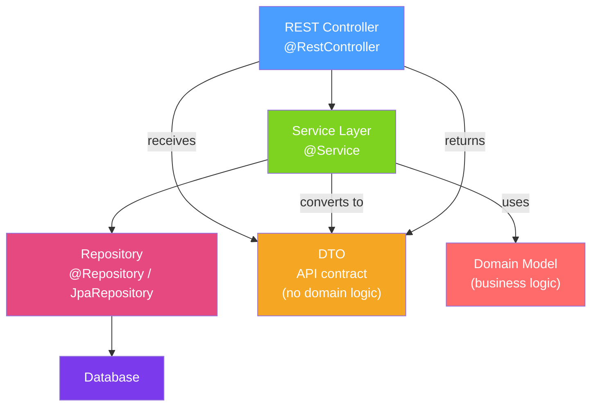

# 🏢 Enterprise Patterns

> [!abstract] TL;DR
> Enterprise patterns extend GoF patterns to the challenges of layered architecture and distributed systems. Repository abstracts data access; DTO transfers data across boundaries; Service Layer coordinates business logic; CQRS separates reads and writes; Event Sourcing stores events as the source of truth. These patterns are the vocabulary of DDD (Domain-Driven Design) and microservices architecture.

## Intuition — analogy FIRST
Think of a bank. The **Repository** is the vault records system — you say "get account #12345" and the system handles whether it's in files, a database, or microfilm; you don't care. **DTO** is the bank statement — a read-only snapshot of your account for a specific purpose, not the live account object itself. **Service Layer** is the teller — orchestrating "debit this, credit that, notify fraud detection." **CQRS** is having separate windows for deposits (writes, complex business rules) and balance inquiries (reads, optimized for display). **Event Sourcing** is the full transaction ledger — your balance is calculated by replaying all transactions from the beginning, not stored directly.

---

## How It Works



## Key Concepts / Details

### 1. Repository Pattern

The Repository pattern abstracts the data access layer behind a domain-focused collection-like interface. The client code thinks in terms of domain objects, not SQL.

```java
// Repository interface: domain language, no persistence details
public interface UserRepository extends JpaRepository<User, Long> {
    Optional<User> findByEmail(String email);
    List<User> findByStatusAndCreatedAtAfter(Status status, LocalDateTime since);

    @Query("SELECT u FROM User u WHERE u.department.name = :dept AND u.active = true")
    List<User> findActivesInDepartment(@Param("dept") String department);
}

// Domain aggregate — no persistence annotations (in pure DDD)
public class User {
    private UserId id;
    private EmailAddress email;
    private List<Order> orders;

    public void placeOrder(Product product, int quantity) {
        orders.add(new Order(product, quantity, LocalDateTime.now()));
        // Business rule: max 10 orders per user
        if (orders.size() > 10) throw new BusinessException("Order limit exceeded");
    }
}

// Service uses repository without knowing the database
@Service
public class UserService {
    private final UserRepository userRepository;

    public User createUser(CreateUserRequest request) {
        if (userRepository.existsByEmail(request.email())) {
            throw new ConflictException("Email already registered");
        }
        User user = new User(new UserId(), new EmailAddress(request.email()));
        return userRepository.save(user);
    }
}
```

### 2. Data Transfer Object (DTO)

DTOs decouple the API contract from the domain model:

```java
// Domain entity (internal)
@Entity
public class User {
    @Id Long id;
    String email;
    String passwordHash; // sensitive — should NEVER appear in API response!
    LocalDateTime createdAt;
    @OneToMany List<Order> orders;
}

// DTO for API response (external contract)
public record UserResponse(
    Long id,
    String email,
    LocalDateTime createdAt,
    int orderCount
) {}

// DTO for API request
public record CreateUserRequest(
    @NotBlank String email,
    @Size(min=8) String password
) {}

// Mapper (using MapStruct for compile-time mapping)
@Mapper(componentModel = "spring")
public interface UserMapper {
    @Mapping(target = "orderCount", expression = "java(user.getOrders().size())")
    UserResponse toResponse(User user);

    @Mapping(target = "id", ignore = true)
    @Mapping(target = "passwordHash", ignore = true)
    User toEntity(CreateUserRequest request);
}
```

### 3. Specification Pattern — Dynamic Queries

```java
// Specification encapsulates a query predicate
public class UserSpecification {
    public static Specification<User> hasEmail(String email) {
        return (root, query, cb) -> cb.equal(root.get("email"), email);
    }

    public static Specification<User> isActive() {
        return (root, query, cb) -> cb.isTrue(root.get("active"));
    }

    public static Specification<User> createdAfter(LocalDate date) {
        return (root, query, cb) ->
            cb.greaterThan(root.get("createdAt"), date.atStartOfDay());
    }
}

// Composing specifications
public List<User> search(UserSearchCriteria criteria) {
    Specification<User> spec = Specification.where(null);

    if (criteria.email() != null) {
        spec = spec.and(UserSpecification.hasEmail(criteria.email()));
    }
    if (criteria.activeOnly()) {
        spec = spec.and(UserSpecification.isActive());
    }
    if (criteria.since() != null) {
        spec = spec.and(UserSpecification.createdAfter(criteria.since()));
    }

    return userRepository.findAll(spec);
}
```

### 4. CQRS — Command Query Responsibility Segregation

```java
// Write model (Command side): full domain logic, rich objects
@Service
public class OrderCommandService {
    public OrderId placeOrder(PlaceOrderCommand command) {
        Customer customer = customerRepo.findById(command.customerId());
        customer.validateCanPlaceOrder();
        Order order = customer.placeOrder(command.items());
        orderRepo.save(order);
        eventBus.publish(new OrderPlacedEvent(order.getId(), order.getItems()));
        return order.getId();
    }
}

// Read model (Query side): optimized for display, denormalized, no domain logic
@Service
public class OrderQueryService {
    // Uses a separate read model (could be different DB, materialized view, etc.)
    public OrderSummaryDTO getOrderSummary(OrderId id) {
        return orderReadRepository.findSummaryById(id); // flat DTO, no joins at query time
    }

    public List<OrderListItemDTO> getCustomerOrders(CustomerId customerId, Pageable page) {
        return orderReadRepository.findByCustomerId(customerId, page);
    }
}

// Read model is updated by event handlers (eventual consistency)
@EventListener
public void onOrderPlaced(OrderPlacedEvent event) {
    orderReadRepository.upsert(new OrderReadModel(event)); // update read side
}
```

### 5. Event Sourcing

```java
// Events as immutable facts
public sealed interface OrderEvent permits
    OrderPlaced, ItemAdded, ItemRemoved, OrderShipped, OrderCancelled {}

public record OrderPlaced(String orderId, String customerId, Instant timestamp) implements OrderEvent {}
public record ItemAdded(String orderId, String sku, int qty, Instant timestamp) implements OrderEvent {}

// Aggregate rebuilt by replaying events
public class Order {
    private String id;
    private String customerId;
    private List<LineItem> items = new ArrayList<>();
    private OrderStatus status;

    public static Order replay(List<OrderEvent> events) {
        Order order = new Order();
        events.forEach(order::apply);
        return order;
    }

    private void apply(OrderEvent event) {
        switch (event) {
            case OrderPlaced e -> { id = e.orderId(); customerId = e.customerId(); status = OrderStatus.PLACED; }
            case ItemAdded e -> items.add(new LineItem(e.sku(), e.qty()));
            case OrderShipped e -> status = OrderStatus.SHIPPED;
            case OrderCancelled e -> status = OrderStatus.CANCELLED;
            default -> {}
        }
    }
}

// Event store: append-only log of events
public interface EventStore {
    void append(String aggregateId, List<OrderEvent> newEvents, int expectedVersion);
    List<OrderEvent> load(String aggregateId);
    List<OrderEvent> loadFrom(String aggregateId, int fromVersion);
}
```

### Pattern Application Guide

| Pattern | Use When | Spring Implementation |
|---------|----------|----------------------|
| Repository | All data access | Spring Data `JpaRepository` |
| DTO | Layer separation | Records + MapStruct |
| Service Layer | Business orchestration | `@Service` |
| Specification | Dynamic queries | Spring Data `Specification<T>` |
| CQRS | Read/write scaling, complex domain | Separate command/query services |
| Event Sourcing | Audit trail, temporal queries | Custom event store + Axon Framework |

---

## Real-World Notes

- **Start simple, add CQRS when needed**: CQRS adds complexity (eventual consistency, dual model maintenance). Start with a single model and extract the read model when query performance or complexity demands it.
- **Event Sourcing requires infrastructure**: you need an event store (EventStoreDB, Kafka, or custom), snapshots for large aggregate histories, and projections to rebuild read models. Don't use it "just because."
- **MapStruct at compile time**: MapStruct generates mapping code at compile time (annotation processing), making it much faster than reflection-based mappers like ModelMapper.
- **DTO explosion**: having one DTO per use case (CreateUserRequest, UpdateUserRequest, UserResponse, UserSummary) is correct. Reusing DTOs across different operations creates coupling.

---

## Common Pitfalls

- **Anemic domain model with Repository**: putting all business logic in Service and using domain objects as plain data holders defeats DDD. Put behavior in the domain.
- **Repository wrapping repository**: avoid creating service-level abstractions over Spring Data repositories unless you have a good reason (e.g., adapting to a non-Spring persistence mechanism).
- **CQRS without event-driven updates**: updating the read model synchronously in the command handler defeats the purpose; use events for eventual consistency.
- **Event Sourcing with mutable events**: events are immutable facts. Never update or delete events — create corrective events instead.

---

## Related Concepts

- [[Spring_Data_JPA]] — Spring implementation of the Repository pattern
- [[Repository_Pattern]] — Deep dive into Spring Data repositories
- [[Event_Driven_Architecture]] — Event Sourcing and CQRS in microservices
- [[Saga_Pattern]] — Distributed transactions using events and compensating actions

---

## Review Questions

1. What is the difference between a Repository and a DAO (Data Access Object)?
2. When should you use a DTO vs returning the domain entity directly from a controller?
3. What problem does CQRS solve and what complexity does it add?
4. How does Event Sourcing differ from a traditional database with a change log?
5. How does the Specification pattern enable dynamic query composition?

---

## Sources

- Martin Fowler, *Patterns of Enterprise Application Architecture* (2002)
- Eric Evans, *Domain-Driven Design* (2003)
- Vaughn Vernon, *Implementing Domain-Driven Design* (2013)
- Spring Data Documentation: Specifications

#java #design-patterns #repository #dto #cqrs #event-sourcing #specification #enterprise
