# ⚠️ Pattern Anti-Patterns

> [!abstract] TL;DR
> Anti-patterns are recurring solutions that seem reasonable but cause long-term problems — poor maintainability, testability, or performance. Recognizing them is as important as knowing patterns. The most dangerous are Singleton overuse (hidden global state), Anemic Domain Model (logic scattered in services), Service Locator (hidden dependencies), and God Object (one class doing everything).

## Intuition — analogy FIRST
Anti-patterns are like "kitchen shortcuts" that create more work later. Using a butter knife as a screwdriver (wrong tool) works once but strips the screw head and makes future maintenance harder. The **God Object** is like one "super employee" handling everything — reception, accounting, marketing, IT — who becomes a single point of failure and makes the whole company grind to a halt when they're sick. **Anemic Domain Model** is like having all your chefs (domain objects) just stand around while the manager (service) does all the actual cooking — wasted expertise and tight coupling.

---

## How It Works

```mermaid
graph TD
    GodObject["🚫 God Object\nOne class, too many responsibilities\nviolates SRP"]
    Anemic["🚫 Anemic Domain\nDomain = data bags\nLogic scattered in services"]
    ServiceLocator["🚫 Service Locator\nGlobal registry lookup\nhidden dependencies"]
    Singleton["🚫 Singleton Overuse\nGlobal mutable state\nhurts testability"]
    PrematureOpt["🚫 Premature Optimization\nOptimize before profiling\ncomplex, often wrong"]
    LavaFlow["🚫 Lava Flow\nDead code nobody\ndares remove"]
    MagicNumbers["🚫 Magic Numbers\nLiteral values in code\nno context, no docs"]
    ShotgunSurgery["🚫 Shotgun Surgery\nOne change → many small edits\npoor cohesion"]

    style GodObject fill:#ff6b6b,color:#fff
    style Anemic fill:#ff6b6b,color:#fff
    style ServiceLocator fill:#ff6b6b,color:#fff
    style Singleton fill:#ff6b6b,color:#fff
    style PrematureOpt fill:#f5a623,color:#fff
    style LavaFlow fill:#f5a623,color:#fff
    style MagicNumbers fill:#f5a623,color:#fff
    style ShotgunSurgery fill:#f5a623,color:#fff
```



## Key Concepts / Details

### 1. God Object / God Class

**Problem**: one class has too many responsibilities, knows too much, and becomes impossible to maintain or test.

```java
// BAD: OrderManager does EVERYTHING
public class OrderManager {
    public void createOrder(/*...*/) { /* DB logic */ }
    public void validatePayment(/*...*/) { /* payment logic */ }
    public void sendEmail(/*...*/) { /* email logic */ }
    public void updateInventory(/*...*/) { /* inventory logic */ }
    public void generateInvoice(/*...*/) { /* PDF generation logic */ }
    public void calculateShipping(/*...*/) { /* shipping logic */ }
    public void applyDiscount(/*...*/) { /* pricing logic */ }
    // ... 3000 more lines
}

// GOOD: Single Responsibility — separate classes for each concern
@Service public class OrderService { /* orchestration only */ }
@Service public class PaymentService { /* payment processing */ }
@Service public class EmailService { /* email sending */ }
@Service public class InventoryService { /* inventory management */ }
@Component public class InvoiceGenerator { /* PDF generation */ }
```

**Detection**: a class with > 300 lines, > 10 dependencies, or touching more than 2-3 layers.

### 2. Anemic Domain Model

**Problem**: domain objects are just data holders (getters/setters) with no behavior. All logic is in Services, creating procedural code dressed in OO clothes.

```java
// BAD: Anemic domain — Order is just data
public class Order {
    private String id;
    private List<Item> items;
    private BigDecimal total;
    private String status;
    // ... only getters/setters
}

// BAD: All logic in service — knows too much about Order internals
@Service
public class OrderService {
    public void addItem(Order order, Item item) {
        if (order.getStatus().equals("SHIPPED")) throw new IllegalStateException();
        order.getItems().add(item);
        order.setTotal(order.getTotal().add(item.getPrice())); // breaking encapsulation
    }
}

// GOOD: Rich domain model — business logic lives in the domain
public class Order {
    private final String id;
    private final List<Item> items = new ArrayList<>();
    private BigDecimal total = BigDecimal.ZERO;
    private OrderStatus status = OrderStatus.PENDING;

    public void addItem(Item item) {
        if (status == OrderStatus.SHIPPED) throw new IllegalStateException("Cannot modify shipped order");
        items.add(item);
        total = total.add(item.getPrice()); // encapsulated
    }

    public boolean canBeCancelled() {
        return status == OrderStatus.PENDING || status == OrderStatus.CONFIRMED;
    }
}
```

### 3. Service Locator (Hidden Dependencies)

**Problem**: classes look up their dependencies from a global registry instead of receiving them via injection. Dependencies are hidden, making code hard to test.

```java
// BAD: Service Locator — hidden dependencies
public class UserController {
    public Response getUser(String id) {
        UserService userService = ServiceLocator.get(UserService.class); // hidden dep!
        EmailService email = ServiceLocator.get(EmailService.class);    // hidden dep!
        return userService.find(id);
    }
}
// To test: must configure ServiceLocator properly — not obvious from code

// GOOD: Dependency Injection — explicit, testable
@RestController
public class UserController {
    private final UserService userService; // explicit dependency

    public UserController(UserService userService) { // declared at construction
        this.userService = userService;
    }

    @GetMapping("/users/{id}")
    public UserResponse getUser(@PathVariable String id) {
        return userService.find(id);
    }
}
// To test: just pass a mock UserService in constructor
```

### 4. Singleton Overuse

**Problem**: overusing Singleton creates hidden global state, makes testing hard, and introduces subtle ordering bugs.

```java
// BAD: Singleton with mutable state = global variable with extra steps
public class ApplicationState {
    private static final ApplicationState INSTANCE = new ApplicationState();
    private Map<String, Object> state = new HashMap<>(); // mutable global state!

    public void put(String key, Object value) { state.put(key, value); }
    public Object get(String key) { return state.get(key); }
}

// Consequences:
// - Tests interfere with each other (shared state between tests)
// - Ordering matters: state from test A leaks into test B
// - Impossible to run tests in parallel

// GOOD: Inject dependencies; let the IoC container manage lifecycle
@Service  // Spring singleton scope, but injected — testable with mocks
public class UserSessionService {
    private final SessionRepository sessionRepository; // injected, testable
    // ...
}
```

### 5. Premature Optimization

**Problem**: optimizing code before measuring, based on guesses rather than profiling data.

```java
// BAD: Hand-optimized code before profiling
public int calculateTotal(List<Integer> values) {
    // "Optimized" to avoid iterator overhead (unnecessary and wrong assumption)
    int[] arr = values.stream().mapToInt(Integer::intValue).toArray();
    int sum = 0;
    for (int i = 0; i < arr.length; i++) { // manual array loop
        sum += arr[i];
    }
    return sum;
}

// GOOD: Write clear code first, profile, then optimize the actual bottleneck
public int calculateTotal(List<Integer> values) {
    return values.stream().mapToInt(Integer::intValue).sum(); // clear, readable
    // Profile first: if THIS is the bottleneck, then optimize with data
}
```

### 6. Other Common Anti-Patterns

```java
// LAVA FLOW: dead code nobody dares remove (for fear of breaking something)
public class UserProcessor {
    @Deprecated // "no one uses this but we're afraid to delete it"
    public void processUserV1(User user) { /* dead code */ }

    public void processUser(User user) { /* current code */ }
}
// Fix: write tests covering current behavior, then delete old code with confidence

// MAGIC NUMBERS: unexplained constants
if (retryCount > 3) { // What is 3? Why 3? Not 5?
    throw new MaxRetriesExceededException();
}
// Fix:
private static final int MAX_RETRIES = 3; // named, documented
if (retryCount > MAX_RETRIES) { throw new MaxRetriesExceededException(); }

// SHOTGUN SURGERY: one concept change → edits in 10 different places
// Example: changing "user" to "member" requires changes in UserService, UserDTO,
// UserRepository, UserController, UserMapper, UserEvents, UserConfig...
// Fix: consolidate related code, use refactoring tools

// FEATURE ENVY: a method in class A constantly calls methods on class B
// A.calculate() calls b.getX(), b.getY(), b.getZ() exclusively
// Fix: move the method to class B where the data lives

// DATA CLUMPS: same group of parameters always appear together
void render(int x, int y, int width, int height) // always these 4 together
// Fix: extract to a class: render(Rectangle rect)

// REFUSED BEQUEST: subclass inherits methods it doesn't need or doesn't make sense
// If you have to override 90% of a parent class to disable behavior,
// prefer composition over inheritance
```

### Anti-Pattern Quick Reference

| Anti-Pattern | Violates | Fix |
|-------------|---------|-----|
| God Object | SRP | Split by responsibility |
| Anemic Domain | Encapsulation | Move logic to domain |
| Service Locator | DIP, testability | Dependency injection |
| Singleton overuse | Testability | Inject via IoC container |
| Premature Optimization | YAGNI | Profile first |
| Lava Flow | YAGNI | Test coverage → delete |
| Magic Numbers | Readability | Named constants |
| Shotgun Surgery | Cohesion | Consolidate related code |
| Feature Envy | Encapsulation | Move method to data class |
| Data Clumps | DRY | Extract to a class |

---

## Real-World Notes

- **SonarQube / SpotBugs**: static analysis tools automatically detect many anti-patterns (God Classes over 200 lines, cyclomatic complexity, duplicate code, dead code).
- **Test-Driven Development (TDD)** naturally prevents many anti-patterns: code that's hard to test usually has hidden dependencies (Service Locator), violates SRP (God Class), or has anemic domains.
- **Code reviews as anti-pattern detection**: the most valuable code reviews call out anti-patterns before they become entrenched — especially God Objects and Service Locators.

---

## Common Pitfalls

- **Confusing pattern with anti-pattern by context**: Singleton is a valid pattern in the right context (Spring beans). It becomes an anti-pattern when abused for global mutable state.
- **Refactoring anti-patterns without tests**: removing an anti-pattern without sufficient test coverage risks breaking behavior. Write tests first (characterization tests if needed), then refactor.
- **Perfect is the enemy of good**: don't over-engineer to avoid every anti-pattern. Some "acceptable" duplication is better than premature abstraction.

---

## Related Concepts

- [[Creational_Patterns]] — Singleton done correctly
- [[Enterprise_Patterns]] — Repository replaces Anemic Domain; DTO prevents Leaky Abstraction
- [[Spring_IoC_Container]] — Dependency Injection as the cure for Service Locator

---

## Review Questions

1. What makes an Anemic Domain Model an anti-pattern and how do you fix it?
2. How is Service Locator different from Dependency Injection, and why is DI preferred?
3. Give two examples of Shotgun Surgery in a codebase and how you would fix them.
4. Why is Singleton overuse harmful for testability?
5. When is it acceptable to use a Singleton?

---

## Sources

- Martin Fowler, *Refactoring: Improving the Design of Existing Code*
- Martin Fowler, AntiPattern catalog — https://martinfowler.com/bliki/AnemicDomainModel.html
- Effective Java (3rd ed.), Joshua Bloch — Item 3 (Singleton), Item 17 (Minimize mutability)

#java #design-patterns #anti-patterns #code-smells #god-object #anemic-domain #service-locator
