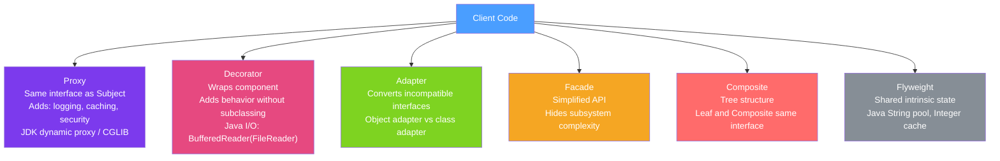

# 🔗 Structural Patterns

> [!abstract] TL;DR
> Structural patterns describe how classes and objects are composed to form larger structures. Proxy adds a layer of indirection (Spring AOP, JDK dynamic proxies); Decorator wraps to add behavior without subclassing (Java I/O streams); Adapter converts interfaces (JDBC); Facade simplifies complex subsystems; Composite treats trees uniformly; Flyweight shares state to reduce memory.

## Intuition — analogy FIRST
Think of these as furniture arrangement strategies. **Adapter** is a plug adapter — your appliance (legacy code) works unchanged, you just put a converter between it and the new socket. **Decorator** is adding accessories to a chair — cushion, armrests, wheels — each add-on wraps the previous without replacing the chair itself. **Facade** is the hotel concierge — they hide the complexity of booking restaurants, arranging transport, and ordering room service behind a single "take care of everything" interface. **Proxy** is a bodyguard who intercepts all interactions with a celebrity — controlling access, adding logging, caching responses. **Composite** is a file system — files and folders are treated the same way (open, move, delete), even though folders contain other items.

---

## How It Works



## Key Concepts / Details

### 1. Proxy — Control Access and Add Behavior

```java
// JDK Dynamic Proxy (interface-based — requires interface)
import java.lang.reflect.*;

public class LoggingProxy {
    @SuppressWarnings("unchecked")
    public static <T> T create(T target, Class<T> iface) {
        return (T) Proxy.newProxyInstance(
            iface.getClassLoader(),
            new Class[]{iface},
            (proxy, method, args) -> {
                long start = System.currentTimeMillis();
                try {
                    Object result = method.invoke(target, args);
                    log.info("{} completed in {}ms", method.getName(),
                             System.currentTimeMillis() - start);
                    return result;
                } catch (InvocationTargetException e) {
                    log.error("{} failed: {}", method.getName(), e.getCause().getMessage());
                    throw e.getCause();
                }
            }
        );
    }
}

UserService proxied = LoggingProxy.create(userService, UserService.class);
```

Spring AOP uses **JDK proxy** when the bean implements an interface, and **CGLIB subclass proxy** when it doesn't. Self-invocation (`this.method()`) bypasses the proxy — a common Spring AOP gotcha.

### 2. Decorator — Wrap to Add Behavior

```java
// Java I/O is the classic Decorator example
InputStream raw = new FileInputStream("data.txt");      // component
InputStream buffered = new BufferedInputStream(raw);     // decorator 1
InputStream gzip = new GZIPInputStream(buffered);        // decorator 2

// Custom Decorator example
public interface TextFormatter {
    String format(String text);
}

public class PlainFormatter implements TextFormatter {
    @Override public String format(String text) { return text; }
}

public class UpperCaseDecorator implements TextFormatter {
    private final TextFormatter wrapped;
    public UpperCaseDecorator(TextFormatter wrapped) { this.wrapped = wrapped; }

    @Override
    public String format(String text) {
        return wrapped.format(text).toUpperCase(); // enhance, then delegate
    }
}

public class TrimDecorator implements TextFormatter {
    private final TextFormatter wrapped;
    public TrimDecorator(TextFormatter wrapped) { this.wrapped = wrapped; }

    @Override
    public String format(String text) {
        return wrapped.format(text.trim()); // trim before delegating
    }
}

// Chain decorators
TextFormatter formatter = new UpperCaseDecorator(new TrimDecorator(new PlainFormatter()));
formatter.format("  hello world  "); // → "HELLO WORLD"
```

### 3. Adapter — Convert Incompatible Interfaces

```java
// Adapting a legacy XML logger to a modern logging interface
public interface Logger {
    void log(String level, String message);
}

// Legacy third-party class (can't modify)
public class LegacyXMLLogger {
    public void writeXMLLog(int severity, String msg) { /* ... */ }
}

// Adapter: wraps legacy, exposes modern interface
public class XMLLoggerAdapter implements Logger {
    private final LegacyXMLLogger legacy;

    public XMLLoggerAdapter(LegacyXMLLogger legacy) {
        this.legacy = legacy;
    }

    @Override
    public void log(String level, String message) {
        int severity = switch (level) {
            case "ERROR" -> 1;
            case "WARN"  -> 2;
            default      -> 3;
        };
        legacy.writeXMLLog(severity, message);
    }
}

// JDBC is the Adapter pattern: different database drivers adapt to java.sql.Connection
```

### 4. Facade — Simplified Interface

```java
// Complex subsystem: order processing involves inventory, payment, shipping, notification
public class OrderFacade {
    private final InventoryService inventory;
    private final PaymentService payment;
    private final ShippingService shipping;
    private final NotificationService notification;

    public OrderFacade(/* inject all services */) { /* ... */ }

    // Facade method hides orchestration complexity
    public OrderResult placeOrder(Cart cart, PaymentInfo paymentInfo, Address address) {
        // Step 1: Reserve inventory
        ReservationId reservation = inventory.reserve(cart.getItems());

        // Step 2: Process payment
        PaymentResult payResult = payment.charge(paymentInfo, cart.getTotalPrice());
        if (!payResult.isSuccess()) {
            inventory.release(reservation);
            return OrderResult.paymentFailed(payResult.getError());
        }

        // Step 3: Create shipment
        ShipmentId shipment = shipping.schedule(cart.getItems(), address);

        // Step 4: Notify customer
        notification.sendOrderConfirmation(cart.getCustomerEmail(), shipment);

        return OrderResult.success(reservation, payResult, shipment);
    }
}

// Client uses simple facade instead of coordinating all services
orderFacade.placeOrder(cart, payment, address);
```

### 5. Composite — Treat Trees Uniformly

```java
public interface FileSystemItem {
    String getName();
    long getSize();
    void print(String indent);
}

public class File implements FileSystemItem {
    private String name;
    private long size;
    // ...
    @Override public long getSize() { return size; }
    @Override public void print(String indent) {
        System.out.println(indent + name + " (" + size + " bytes)");
    }
}

public class Directory implements FileSystemItem {
    private String name;
    private List<FileSystemItem> children = new ArrayList<>();

    public void add(FileSystemItem item) { children.add(item); }

    @Override
    public long getSize() {
        return children.stream().mapToLong(FileSystemItem::getSize).sum(); // recursive!
    }

    @Override
    public void print(String indent) {
        System.out.println(indent + "[" + name + "]");
        children.forEach(child -> child.print(indent + "  "));
    }
}
```

### 6. Flyweight — Share Common State

```java
// Java's String pool is a Flyweight
String a = "hello"; // interned in string pool
String b = "hello"; // same object from pool
System.out.println(a == b); // true — same reference

// Integer cache (-128 to 127)
Integer x = 127;
Integer y = 127;
System.out.println(x == y);  // true — cached
Integer p = 128;
Integer q = 128;
System.out.println(p == q);  // false — not cached — use .equals()

// Custom Flyweight: character glyphs in a document editor
public class CharacterFactory {
    private final Map<Character, CharGlyph> pool = new HashMap<>();

    public CharGlyph getGlyph(char c) {
        return pool.computeIfAbsent(c, CharGlyph::new); // create only once
    }
}
```

### Structural Patterns Comparison

| Pattern | Intent | Relationship | Java Example |
|---------|--------|-------------|-------------|
| Proxy | Control access / add behavior | Same interface | Spring AOP, JDK Proxy |
| Decorator | Add responsibility dynamically | Same interface, wraps | `BufferedInputStream(FileInputStream)` |
| Adapter | Convert incompatible interfaces | Different interface | JDBC drivers |
| Facade | Simplify complex subsystem | Any interfaces | Spring's `JdbcTemplate` |
| Composite | Tree structures, uniform treatment | Component hierarchy | Swing components, XML DOM |
| Flyweight | Share state to reduce memory | Shared instances | String pool, Integer cache |
| Bridge | Decouple abstraction from implementation | Two hierarchies | JDBC: `java.sql.Driver` abstraction |

---

## Real-World Notes

- **Spring AOP is Proxy + Decorator**: each `@Transactional`, `@Cacheable`, `@Async`, `@Secured` annotation wraps your bean in a proxy that adds behavior transparently.
- **`BufferedReader(new FileReader(...))` is the canonical Decorator**: you can stack multiple decorators (compression, encryption) without any class modifying the others.
- **Facade vs Service Layer**: a Facade in Spring MVC is often the `@Service` class — it hides repository and utility complexity from the `@Controller`.

---

## Common Pitfalls

- **Proxy self-invocation**: `this.method()` in Spring bypasses the proxy. Use `ApplicationContext.getBean(MyService.class).method()` or restructure the code.
- **Decorator identity**: `instanceof` checks fail with decorators — the client sees the decorator, not the underlying component.
- **Composite recursion without termination**: recursive operations on Composite (like `getSize()`) need leaf nodes to terminate recursion.

---

## Related Concepts

- [[Spring_AOP]] — Proxy pattern is the foundation of Spring AOP
- [[Behavioral_Patterns]] — Behavioral patterns define what the proxy/decorator does
- [[Creational_Patterns]] — Factory Method often creates the right Adapter or Decorator

---

## Review Questions

1. When does Spring use a JDK dynamic proxy vs a CGLIB proxy?
2. Why does Java I/O use the Decorator pattern and how does it work with `BufferedInputStream`?
3. How does the Adapter pattern differ from the Facade pattern?
4. Implement a simple Composite pattern for a menu system where items can be sub-menus.
5. Why does `Integer.valueOf(127) == Integer.valueOf(127)` return true but not for 128?

---

## Sources

- Gang of Four, *Design Patterns* — Chapter 4: Structural Patterns
- Refactoring.guru: Structural Patterns
- Spring Framework Documentation: AOP — https://docs.spring.io/spring-framework/docs/current/reference/html/core.html#aop

#java #design-patterns #proxy #decorator #adapter #facade #composite #flyweight #structural
