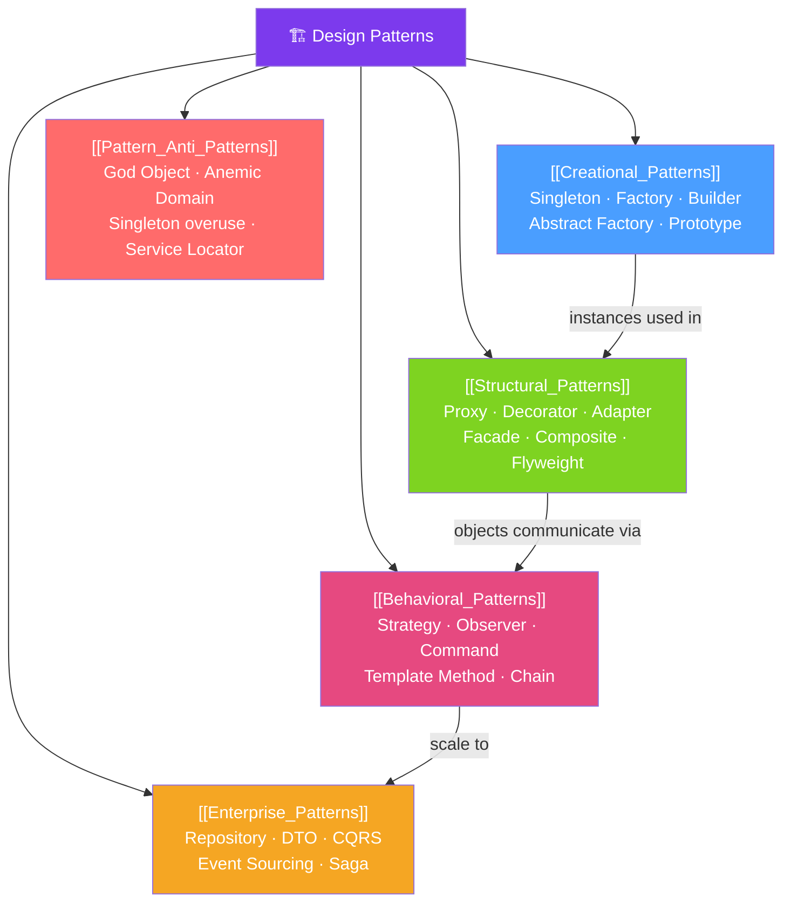

# 🏗️ Design Patterns — Map of Content

> [!abstract] What This Section Covers
> Design patterns are proven, reusable solutions to commonly recurring problems in object-oriented software design. This section covers the Gang of Four (GoF) patterns organized by category: Creational (how objects are created), Structural (how objects are composed), and Behavioral (how objects communicate). Enterprise patterns (Repository, CQRS, Saga) extend these into distributed systems. Anti-patterns teach what to avoid.

## Concept Map

## Learning Path
1. [[Creational_Patterns]] — Control how objects are created: Singleton, Factory, Builder, Prototype.
2. [[Structural_Patterns]] — Compose objects into larger structures: Proxy, Decorator, Adapter, Facade.
3. [[Behavioral_Patterns]] — Define how objects communicate: Strategy, Observer, Command, Template Method.
4. [[Enterprise_Patterns]] — Apply patterns at scale: Repository, CQRS, Event Sourcing, Saga.
5. [[Pattern_Anti_Patterns]] — Recognize and avoid common anti-patterns that make code unmaintainable.

## All Notes at a Glance
| Note | Difficulty | What You'll Learn |
|------|------------|-------------------|
| [[Creational_Patterns]] | Intermediate | Singleton (enum idiom), Factory Method, Abstract Factory, Builder, Prototype |
| [[Structural_Patterns]] | Intermediate | Proxy (JDK/CGLIB), Decorator (I/O streams), Adapter, Facade, Composite, Flyweight |
| [[Behavioral_Patterns]] | Intermediate | Strategy (Comparator), Observer (Spring events), Command, Template Method, Chain |
| [[Enterprise_Patterns]] | Advanced | Repository (Spring Data), DTO, CQRS, Event Sourcing, Specification |
| [[Pattern_Anti_Patterns]] | Intermediate | God Object, Anemic Domain, Service Locator, Lava Flow, Magic Numbers |

## Key Questions This Section Answers
- Which creational pattern should I use when construction logic is complex?
- How does Spring AOP use the Proxy pattern?
- How does Java's `InputStream` hierarchy use the Decorator pattern?
- What is the difference between Factory Method and Abstract Factory?
- When should I use Repository vs DAO pattern?
- What is the difference between choreography and orchestration in Saga pattern?

## Related Sections
- [[_MOC_Java_Master|↑ Java Master MOC]]
- [[_MOC_Spring_Core|→ Spring Core]] — IoC container embodies Dependency Injection pattern
- [[_MOC_Spring_Data|→ Spring Data]] — Repository pattern implementation
- [[_MOC_Microservices_Java|→ Microservices]] — Enterprise patterns at distributed scale

#MOC #java #design-patterns #gof
