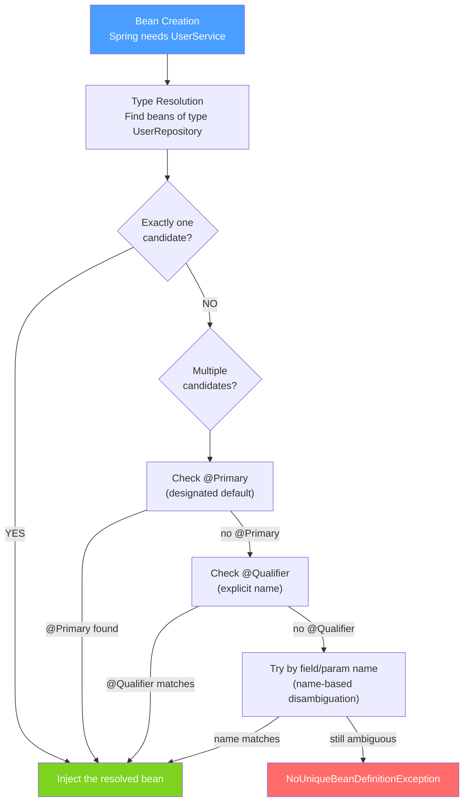

# 💉 Dependency Injection

> [!abstract] TL;DR
> Spring's Dependency Injection (DI) wires beans together automatically. By default it resolves by type (`@Autowired`); when multiple candidates exist, `@Qualifier` specifies by name and `@Primary` marks the default. Constructor injection is strongly preferred over field injection because it enables immutability, makes dependencies explicit, and works without Spring in tests.

## Intuition — analogy FIRST
DI is like a hiring agency. You post a job requirement ("I need someone who can do database work" — an interface), and the agency (Spring container) finds the right candidate (a concrete bean implementing that interface) and sends them to you. You don't go looking; candidates are delivered. If two candidates qualify (two `DataSource` beans), you either flag one as preferred (`@Primary`) or specify exactly who you want (`@Qualifier("primaryDataSource")`). Constructor injection is like requiring the employee on day one — they must show up or the job fails. Field injection is like adding the employee to the org chart after the office is already open, which is messier.

---

## How It Works



## Key Concepts / Details

### Three DI Styles

**Style 1: Constructor Injection (RECOMMENDED)**
```java
@Service
public class UserService {
    private final UserRepository userRepository; // final → immutable
    private final EmailService emailService;

    // Spring auto-injects when there's only one constructor
    // @Autowired optional in Spring 4.3+ (single constructor)
    public UserService(UserRepository userRepository, EmailService emailService) {
        this.userRepository = userRepository;
        this.emailService = emailService;
    }
}
```

**Style 2: Field Injection (AVOID in production)**
```java
@Service
public class UserService {
    @Autowired // injected by reflection — bypasses constructor
    private UserRepository userRepository;

    @Autowired
    private EmailService emailService;
}
```
Why to avoid: fields are not `final`, Spring required for instantiation (breaks unit tests), circular dependency issues are hidden.

**Style 3: Setter Injection (Use for optional dependencies)**
```java
@Service
public class ReportService {
    private NotificationService notificationService; // optional dependency

    @Autowired(required = false) // not required — null if bean not present
    public void setNotificationService(NotificationService ns) {
        this.notificationService = ns;
    }
}
```

### Resolving Ambiguity with Multiple Beans

```java
// Two DataSource implementations
@Configuration
public class DataSourceConfig {

    @Bean
    @Primary // this is the default when multiple candidates exist
    public DataSource primaryDataSource() {
        return createDataSource("jdbc:postgresql://primary:5432/db");
    }

    @Bean
    public DataSource replicaDataSource() {
        return createDataSource("jdbc:postgresql://replica:5432/db");
    }
}

// Injection: @Primary wins when no @Qualifier
@Service
public class UserService {
    @Autowired
    private DataSource dataSource; // gets primaryDataSource (it's @Primary)
}

// Explicit selection with @Qualifier
@Service
public class ReportService {
    private final DataSource dataSource;

    public ReportService(@Qualifier("replicaDataSource") DataSource dataSource) {
        this.dataSource = dataSource; // specifically requests the replica
    }
}
```

### @Value — Inject Configuration Values

```java
@Component
public class AppSettings {
    @Value("${app.max-connections:10}")  // with default value
    private int maxConnections;

    @Value("${app.api-key}")             // required; startup fails if missing
    private String apiKey;

    @Value("#{systemProperties['java.home']}") // SpEL expression
    private String javaHome;

    @Value("#{T(java.lang.Math).PI}")    // SpEL with class method
    private double pi;
}
```

### @Autowired Resolution Order (By Type → @Primary → @Qualifier → By Name)

```java
// When Spring autowires UserRepository:
// Step 1: Find all beans implementing UserRepository interface
// Step 2: If one match → inject it
// Step 3: If multiple → check for @Primary
// Step 4: If no @Primary → check for @Qualifier on the injection point
// Step 5: If no @Qualifier → match by field/parameter name
// Step 6: If still ambiguous → NoUniqueBeanDefinitionException

@Service
public class UserService {
    // Disambiguation by field name (Step 5):
    // Spring finds JpaUserRepository and MongoUserRepository
    // Field is named "jpaUserRepository" → picks JpaUserRepository
    @Autowired
    private UserRepository jpaUserRepository;
}
```

### @Lazy — Lazy Injection

```java
// Inject a proxy; actual bean created on first method call
@Service
public class ExpensiveService {
    @Autowired
    @Lazy
    private HeavyInitService heavyService; // not created until heavyService.doSomething() is called
}

// Useful for:
// - Breaking circular dependencies
// - Avoiding startup cost for rarely-used beans
// - Optional dependencies that are expensive to create
```

### Functional Bean Registration (Spring 5+)

```java
// Register beans programmatically — no annotation scanning needed
// Useful in lightweight contexts or for conditional registration
SpringApplication app = new SpringApplication(Application.class);
app.addInitializers((ApplicationContextInitializer<GenericApplicationContext>) ctx -> {
    ctx.registerBean(UserService.class, () -> new UserService(new UserRepository()));
});
app.run(args);
```

### Constructor Injection — Why It's Preferred

| Concern | Constructor Injection | Field Injection |
|---------|----------------------|----------------|
| Immutability | `final` fields possible ✓ | Cannot be `final` ✗ |
| Testability | Create with `new MyService(mockRepo)` ✓ | Need Spring or Mockito's reflection ✗ |
| Null safety | Compile error if dep missing ✓ | NullPointerException at runtime ✗ |
| Circular dependency | Detected at startup ✓ | Silent until runtime ✗ |
| Mandatory vs optional | Explicit (in constructor vs setter) ✓ | All look the same ✗ |
| Code visibility | Dependencies visible in constructor ✓ | Dependencies hidden ✗ |

---

## Real-World Notes

- **Lombok `@RequiredArgsConstructor`**: generates a constructor for all `final` fields, enabling constructor injection without writing the constructor manually. Very common in Spring code.
  ```java
  @Service
  @RequiredArgsConstructor // generates constructor: UserService(UserRepository repo, EmailService email)
  public class UserService {
      private final UserRepository userRepository;
      private final EmailService emailService;
  }
  ```
- **`@Autowired` is optional in Spring 4.3+**: if a bean has exactly one constructor, Spring uses it automatically without `@Autowired`.
- **Inject `List<T>` for all beans of a type**: `@Autowired List<MessageHandler> handlers` collects all beans implementing `MessageHandler` — useful for plugin architectures.
- **Order injection**: combine with `@Order(1)` or `Ordered` interface to control the order of beans in a list.

---

## Common Pitfalls

- **Field injection in tests**: field injection requires a Spring context to run. This forces integration tests where unit tests would suffice. Constructor injection allows `new MyService(mockDep)`.
- **Circular dependency with constructor injection**: Spring cannot create A if A requires B and B requires A in constructors — this is a design problem, not a Spring limitation. Refactor to break the cycle.
- **`@Autowired(required=false)` not null-checked**: if a bean is optional and absent, the field is null. Always null-check before use.
- **Ambiguous bean injection without qualifier**: adding a second implementation of an interface without `@Primary` or `@Qualifier` causes startup failure — caught immediately in Spring.

---

## Related Concepts

- [[Spring_IoC_Container]] — The container that performs injection
- [[Spring_Bean_Lifecycle]] — When injection happens in the lifecycle
- [[Spring_AOP]] — `@Transactional` and `@Cacheable` use DI to wrap beans with proxies

---

## Review Questions

1. List three reasons to prefer constructor injection over field injection.
2. If two beans implement the same interface, how does Spring decide which to inject?
3. What is the difference between `@Primary` and `@Qualifier`?
4. What happens if you have a circular dependency with constructor injection?
5. How do you inject a list of all beans implementing a certain interface?

---

## Sources

- Spring Framework Documentation: Dependency Injection
- Josh Long, Spring Tips: Constructor Injection Best Practices
- Baeldung: Spring @Qualifier Annotation — https://www.baeldung.com/spring-qualifier-annotation

#java #spring #spring-core #dependency-injection #autowired #qualifier #primary #constructor-injection
