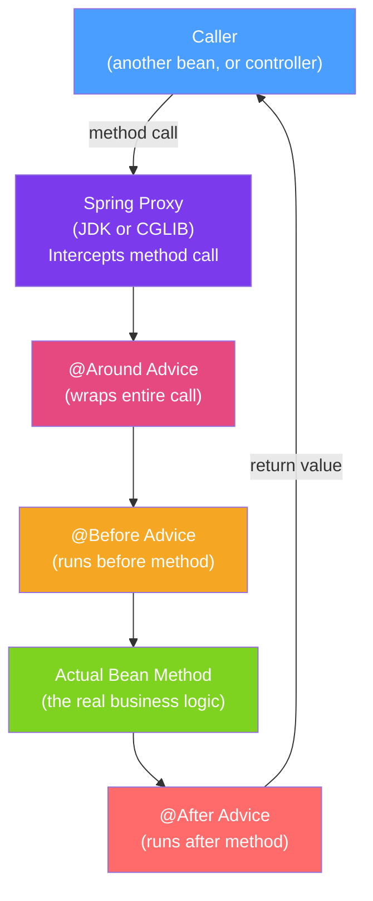

# 🎯 Spring AOP

> [!abstract] TL;DR
> Aspect-Oriented Programming separates cross-cutting concerns (logging, security, transactions, caching) from business logic. Spring AOP is proxy-based: when you call a method on a Spring bean, you're calling it on a proxy that intercepts the call and runs advice before/after. `@Transactional`, `@Cacheable`, `@Async`, and `@Secured` are all implemented via Spring AOP.

## Intuition — analogy FIRST
Imagine a security checkpoint at every office building entrance. Every visitor (method call) goes through the checkpoint (aspect) where guards (advice) verify credentials (security check), log the visit (logging), and potentially turn them away (exception). The actual office (business method) doesn't know about the security checkpoint — it's transparently applied. Spring AOP is that security checkpoint layer: inserted between the caller and the bean without modifying either.

---

## How It Works



## Key Concepts / Details

### Core AOP Concepts

| Term | Meaning | Spring Example |
|------|---------|----------------|
| **Aspect** | Module encapsulating cross-cutting concern | `@Aspect` class |
| **Advice** | Code that runs at a join point | `@Before`, `@After`, `@Around` |
| **Join Point** | Point in execution where advice can run | Method execution |
| **Pointcut** | Expression selecting join points | `execution(* com.example.service.*.*(..))` |
| **Target** | The actual bean being proxied | `UserService` implementation |
| **Proxy** | Wrapper created by Spring around target | CGLIB subclass or JDK proxy |
| **Weaving** | Process of creating the proxy | Done at startup by `BeanPostProcessor` |

### Defining an Aspect

```java
@Aspect
@Component
public class LoggingAspect {

    // Pointcut expression: execution(modifiers? return-type declaring-class? method-name(params) throws?)
    @Pointcut("execution(public * com.example.service.*.*(..))")
    public void serviceLayer() {} // pointcut declaration for reuse

    // @Before: runs before the method
    @Before("serviceLayer()")
    public void logBefore(JoinPoint joinPoint) {
        log.info("Calling {} with args: {}", joinPoint.getSignature().getName(),
                 Arrays.toString(joinPoint.getArgs()));
    }

    // @AfterReturning: runs after successful method return
    @AfterReturning(pointcut = "serviceLayer()", returning = "result")
    public void logAfterReturning(JoinPoint joinPoint, Object result) {
        log.info("{} returned: {}", joinPoint.getSignature().getName(), result);
    }

    // @AfterThrowing: runs after exception is thrown
    @AfterThrowing(pointcut = "serviceLayer()", throwing = "ex")
    public void logAfterThrowing(JoinPoint joinPoint, Throwable ex) {
        log.error("{} threw: {}", joinPoint.getSignature().getName(), ex.getMessage());
    }

    // @After: runs after method (like finally — runs whether success or exception)
    @After("serviceLayer()")
    public void logAfter(JoinPoint joinPoint) {
        log.info("Finished {}", joinPoint.getSignature().getName());
    }

    // @Around: most powerful — controls entire method invocation
    @Around("serviceLayer()")
    public Object measureTime(ProceedingJoinPoint pjp) throws Throwable {
        long start = System.currentTimeMillis();
        try {
            Object result = pjp.proceed(); // call the actual method
            return result;
        } finally {
            long elapsed = System.currentTimeMillis() - start;
            log.info("{} took {}ms", pjp.getSignature().getName(), elapsed);
        }
    }
}
```

### Pointcut Expression Language

```java
// execution: matches method execution
"execution(* com.example..*Service.*(..))"
//           ^ any return type
//             ^ com.example package and subpackages
//                            ^ classes ending in Service
//                                    ^ any method
//                                      ^ any args

// within: matches all methods in a type or package
"within(com.example.service.*)"
"within(@org.springframework.stereotype.Service *)" // all @Service classes

// @annotation: matches methods with a specific annotation
"@annotation(org.springframework.transaction.annotation.Transactional)"
"@annotation(com.example.Audited)"

// args: matches methods with specific argument types
"args(java.lang.String)"
"args(com.example.User, ..)" // User as first arg, then anything

// bean: matches by bean name
"bean(userService)"
"bean(*Service)" // wildcard

// Combining with &&, ||, !
"execution(* com.example.service.*.*(..)) && @annotation(com.example.Audited)"
```

### Advice Execution Order with Multiple Aspects

Use `@Order` to control which aspect runs first:

```java
@Aspect
@Component
@Order(1) // runs outermost (first before, last after)
public class SecurityAspect { /* ... */ }

@Aspect
@Component
@Order(2) // runs inside SecurityAspect
public class LoggingAspect { /* ... */ }
```

Call stack: SecurityAspect.before → LoggingAspect.before → actual method → LoggingAspect.after → SecurityAspect.after

### JDK Proxy vs CGLIB Proxy

| | JDK Dynamic Proxy | CGLIB Proxy |
|--|--|--|
| Mechanism | Implements interface at runtime | Subclasses the target class at runtime |
| Requirement | Bean must implement an interface | Works on any class |
| Self-invocation | Problem (same as both) | Problem (same as both) |
| Spring Boot default | CGLIB for @Configuration | CGLIB for everything (since 2.0) |
| Performance | Slightly faster | Slightly slower (subclass overhead) |

```java
// Force JDK proxy:
@EnableAspectJAutoProxy(proxyTargetClass = false)

// Force CGLIB (Spring Boot default):
@EnableAspectJAutoProxy(proxyTargetClass = true)
// OR in application.properties:
// spring.aop.proxy-target-class=true (default true in Spring Boot)
```

### Self-Invocation — The Most Common Pitfall

```java
@Service
public class OrderService {
    @Transactional
    public void placeOrder(Order order) {
        // ... business logic
        sendConfirmation(order); // calls OWN method — bypasses proxy!
    }

    @Transactional(propagation = Propagation.REQUIRES_NEW)
    public void sendConfirmation(Order order) {
        // This @Transactional is IGNORED because:
        // - 'this' refers to the actual OrderService, not the proxy
        // - AOP only intercepts calls through the proxy
    }
}

// Solutions:
// 1. Inject self (via ApplicationContext or @Autowired self-injection)
@Service
public class OrderService {
    @Autowired
    private OrderService self; // Spring injects the proxy

    public void placeOrder(Order order) {
        self.sendConfirmation(order); // goes through proxy → AOP applies
    }
}

// 2. Move sendConfirmation to a separate service (BETTER — cleaner design)
// 3. Use AspectJ compile-time weaving (no proxy limitation)
```

---

## Real-World Notes

- **`@Transactional` is AOP**: Spring's transaction management is implemented as an aspect. The `@Transactional` annotation is an `@annotation` pointcut, and the advice opens/commits/rolls back the transaction.
- **`@Cacheable` is AOP**: the result caching annotation works the same way — intercepts the method call, checks the cache, and either returns the cached value or calls the method and caches the result.
- **Spring AOP limitation**: Spring AOP only intercepts **Spring bean method calls** through the **proxy**. It does NOT intercept: method calls within the same class (self-invocation), calls on non-Spring objects, `private` methods, or `final` methods.
- **AspectJ for full AOP**: if you need compile-time or load-time weaving (to handle self-invocation, non-Spring objects, private methods), use AspectJ with `@EnableLoadTimeWeaving`.

---

## Common Pitfalls

- **Self-invocation bypasses AOP**: `this.annotatedMethod()` skips the proxy and all its AOP advice. This is the #1 AOP bug in Spring applications.
- **`@Transactional` on private methods**: it is silently ignored! Spring AOP cannot proxy private methods. Always put `@Transactional` on public methods.
- **Aspect on final class/method**: CGLIB cannot subclass final classes or override final methods. Spring throws an error or silently skips the aspect.
- **Circular aspect dependencies**: an Aspect bean cannot have AOP applied to itself (BeanCurrentlyInCreationException). Keep aspects simple and dependency-free.

---

## Related Concepts

- [[Spring_Bean_Lifecycle]] — AOP proxies created in BeanPostProcessor.postProcessAfterInitialization
- [[Structural_Patterns]] — Proxy and Decorator patterns are the foundations of AOP implementation
- [[Spring_Security_Architecture]] — Spring Security filter chain and method security use AOP

---

## Review Questions

1. What is the difference between `@Before`, `@After`, `@AfterReturning`, `@AfterThrowing`, and `@Around`?
2. Why does self-invocation bypass Spring AOP? How do you fix it?
3. When does Spring use JDK dynamic proxy vs CGLIB?
4. Write a pointcut expression that matches all public methods in classes annotated with `@Service`.
5. If you have two aspects on the same method, how do you control execution order?

---

## Sources

- Spring Framework Documentation: AOP — https://docs.spring.io/spring-framework/docs/current/reference/html/core.html#aop
- AspectJ Documentation: Pointcut Expressions
- Baeldung: Introduction to Spring AOP

#java #spring #spring-core #aop #aspect #pointcut #advice #proxy #cglib
