# 🔄 Spring Bean Lifecycle

> [!abstract] TL;DR
> Every Spring bean has a lifecycle: instantiation → dependency injection → initialization callbacks → ready to use → destruction callbacks. Bean scopes determine how many instances exist: singleton (one per context, the default), prototype (new instance per request), and web scopes (request/session per HTTP scope). `BeanPostProcessor` intercepts all beans post-initialization — this is how Spring AOP creates proxies.

## Intuition — analogy FIRST
Think of Spring beans like employees in a company. **Singleton** is the CEO — one person, shared by everyone. **Prototype** is a temporary contractor — a new one is hired each time someone needs help. **Request scope** is a customer service rep assigned to one phone call — dedicated for the duration of the call, gone when the call ends. When an employee joins (`@PostConstruct`), they go through onboarding. When they leave (`@PreDestroy`), they do handover. A `BeanPostProcessor` is like HR who interviews every new employee before and after their onboarding — potentially assigning a mentor (proxy) to shadow them.

---

## How It Works

```mermaid
graph LR
    Inst["1. Instantiation\n(constructor called)"]
    Inject["2. Dependency Injection\n(@Autowired fields filled)"]
    BPP_Before["3. BeanPostProcessor\npostProcessBeforeInitialization"]
    Init["4. Initialization\n(@PostConstruct\nafterPropertiesSet)"]
    BPP_After["5. BeanPostProcessor\npostProcessAfterInitialization\n(AOP proxies created here!)"]
    Ready["6. Bean READY\nin ApplicationContext"]
    Destroy["7. Destruction\n(@PreDestroy\ndestroy)"]

    Inst --> Inject --> BPP_Before --> Init --> BPP_After --> Ready
    Ready -->|"context shutdown"| Destroy

    style Inst fill:#4a9eff,color:#fff
    style BPP_Before fill:#e64980,color:#fff
    style Init fill:#7ed321,color:#fff
    style BPP_After fill:#e64980,color:#fff
    style Ready fill:#7c3aed,color:#fff
    style Destroy fill:#ff6b6b,color:#fff
```



## Key Concepts / Details

### Bean Scopes

```java
@Component
@Scope("singleton")   // DEFAULT: one instance per ApplicationContext (omit for default)
public class UserService { /* ... */ }

@Component
@Scope("prototype")   // new instance every time getBean() or @Autowired resolution occurs
public class ReportBuilder { /* mutable, not thread-safe */ }

// Web scopes (require Spring MVC context)
@Component
@Scope(value = "request", proxyMode = ScopedProxyMode.TARGET_CLASS)
public class RequestContext { /* new instance per HTTP request */ }

@Component
@Scope(value = "session", proxyMode = ScopedProxyMode.TARGET_CLASS)
public class UserSessionData { /* new instance per HTTP session */ }

@Component
@Scope("application") // one per ServletContext (similar to singleton in web apps)
public class AppLevelCache { /* ... */ }
```

### Lifecycle Callbacks

```java
@Component
public class DatabaseConnectionPool implements InitializingBean, DisposableBean {
    private DataSource dataSource;

    // OPTION 1: @PostConstruct (preferred — standard Java, not Spring-specific)
    @PostConstruct
    public void init() {
        // Called after all dependencies are injected
        // Use for: open connections, warm up caches, register listeners
        log.info("Connection pool initialized");
        warmUpConnections(10);
    }

    // OPTION 2: InitializingBean.afterPropertiesSet() (Spring-specific interface)
    @Override
    public void afterPropertiesSet() throws Exception {
        // Same timing as @PostConstruct, but Spring-specific
    }

    // OPTION 3: @Bean(initMethod="init") for @Bean factory methods
    // → Run when bean is configured via @Bean in a @Configuration class

    @PreDestroy
    public void cleanup() {
        // Called before the bean is destroyed (context shutdown)
        // Use for: close connections, deregister listeners, flush buffers
        log.info("Closing connection pool");
        closeAllConnections();
    }

    // OPTION 4: DisposableBean.destroy() (Spring-specific)
    @Override
    public void destroy() throws Exception { /* same as @PreDestroy */ }
}

// OPTION 5: @Bean with explicit init/destroy methods (for third-party classes)
@Bean(initMethod = "start", destroyMethod = "stop")
public Scheduler quartzScheduler() {
    return new StdSchedulerFactory().getScheduler();
}
```

**Callback execution order**:
1. `@PostConstruct` / `afterPropertiesSet()` / `initMethod` (in this order)
2. `@PreDestroy` / `destroy()` / `destroyMethod`

### BeanPostProcessor — The Most Powerful Extension Point

```java
@Component
public class LoggingBeanPostProcessor implements BeanPostProcessor {

    @Override
    public Object postProcessBeforeInitialization(Object bean, String beanName) {
        // Called BEFORE @PostConstruct; can modify or replace the bean
        log.debug("Before init: {}", beanName);
        return bean; // must return the (possibly modified) bean
    }

    @Override
    public Object postProcessAfterInitialization(Object bean, String beanName) {
        // Called AFTER @PostConstruct; most AOP proxies are created here
        if (bean.getClass().isAnnotationPresent(Audited.class)) {
            return createAuditingProxy(bean); // wrap with proxy
        }
        return bean;
    }
}
```

Spring itself uses `BeanPostProcessor` implementations for:
- `AutowiredAnnotationBeanPostProcessor` → processes `@Autowired`
- `AnnotationAwareAspectJAutoProxyCreator` → creates AOP proxies for `@Transactional`, `@Cacheable`, etc.
- `CommonAnnotationBeanPostProcessor` → processes `@PostConstruct`, `@PreDestroy`, `@Resource`

### BeanFactoryPostProcessor — Modify Bean Definitions

```java
// Runs BEFORE any beans are created
@Component
public class PropertyBeanPostProcessor implements BeanFactoryPostProcessor {

    @Override
    public void postProcessBeanFactory(ConfigurableListableBeanFactory beanFactory) {
        // Can modify bean definitions (e.g., change scope, add properties)
        // PropertyPlaceholderConfigurer is a famous BeanFactoryPostProcessor
        // It replaces ${...} placeholders in bean definitions
        BeanDefinition bd = beanFactory.getBeanDefinition("myService");
        bd.setScope(BeanDefinition.SCOPE_PROTOTYPE);
    }
}
```

### Scoped Proxies — Injecting Shorter-Lived into Longer-Lived

```java
// PROBLEM: singleton needs a prototype or request-scoped bean
@Service // singleton
public class OrderService {
    @Autowired
    private RequestContext ctx; // request-scoped — there are many instances!
    // If injected directly, singleton gets ONE RequestContext at startup — wrong!
}

// SOLUTION: scoped proxy — inject a proxy that delegates to the CURRENT instance
@Component
@Scope(value = "request", proxyMode = ScopedProxyMode.TARGET_CLASS)
public class RequestContext {
    private final String requestId = UUID.randomUUID().toString();
    public String getRequestId() { return requestId; }
}

// Now OrderService gets a proxy; each call to ctx.getRequestId()
// delegates to the CURRENT request's RequestContext instance
```

### SmartLifecycle — Ordered Start/Stop

```java
@Component
public class KafkaConsumerManager implements SmartLifecycle {
    private volatile boolean running = false;

    @Override public void start() { running = true; startConsumers(); }
    @Override public void stop() { running = false; stopConsumers(); }
    @Override public boolean isRunning() { return running; }

    @Override
    public int getPhase() {
        return Integer.MAX_VALUE; // higher phase = starts later, stops first
    }

    @Override
    public boolean isAutoStartup() { return true; }
}
```

---

## Real-World Notes

- **`@Autowired` + `@PostConstruct` order guarantee**: Spring guarantees all `@Autowired` dependencies are injected before `@PostConstruct` is called — safe to use dependencies in initialization.
- **Prototype beans are NOT destroyed**: Spring creates prototype beans but doesn't track them after creation — `@PreDestroy` is NOT called for prototype beans. You're responsible for cleanup.
- **Context shutdown hooks**: `SpringApplication.run()` registers a JVM shutdown hook to call `@PreDestroy` on singleton beans. Without this, `@PreDestroy` doesn't run on sudden JVM termination.
- **`@Lazy` on `@PostConstruct` beans**: lazy beans initialize on first access, not at startup. `@PostConstruct` still runs, just deferred.

---

## Common Pitfalls

- **Using uninitialized dependencies in the constructor**: at construction time, `@Autowired` fields are NOT yet injected. Use `@PostConstruct` for work that requires injected dependencies.
- **Expecting `@PreDestroy` on prototype beans**: as noted, Spring doesn't call `@PreDestroy` for prototypes. If cleanup is needed, implement it via a custom `DisposableBean` wrapper or register a destruction callback.
- **Scoped proxy on interface vs class**: `proxyMode = ScopedProxyMode.INTERFACES` requires the bean to implement an interface; `TARGET_CLASS` uses CGLIB and works on concrete classes.
- **BeanPostProcessor dependency ordering**: `BeanPostProcessor` instances and their dependencies are instantiated eagerly and before regular beans — they cannot be `@Autowired` into lazily-instantiated beans.

---

## Related Concepts

- [[Spring_IoC_Container]] — The container that manages the lifecycle
- [[Dependency_Injection]] — Injection happens before lifecycle callbacks
- [[Spring_AOP]] — AOP proxies are created in `postProcessAfterInitialization`

---

## Review Questions

1. In what order do `@PostConstruct`, `afterPropertiesSet()`, and `initMethod` run?
2. Why doesn't Spring call `@PreDestroy` on prototype-scoped beans?
3. What is a scoped proxy and when do you need one?
4. What is the difference between `BeanPostProcessor` and `BeanFactoryPostProcessor`?
5. At what point in the bean lifecycle are AOP proxies created?

---

## Sources

- Spring Framework Documentation: Bean Lifecycle
- Spring Framework Documentation: Scopes
- Baeldung: Spring Bean Lifecycle — https://www.baeldung.com/spring-bean-lifecycle

#java #spring #spring-core #bean-lifecycle #scopes #postConstruct #preDestroy #beanpostprocessor
