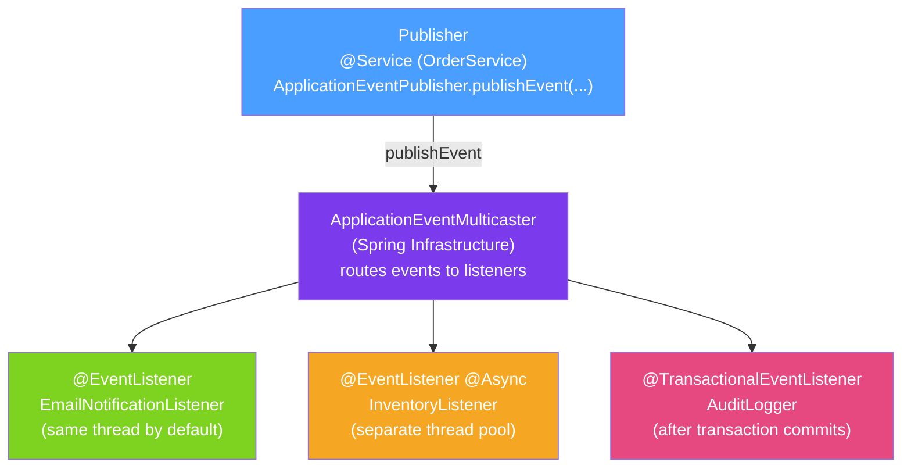

# 📡 Spring Events

> [!abstract] TL;DR
> The Spring event system provides a lightweight publish-subscribe mechanism within a single application context. Publishers fire events via `ApplicationEventPublisher`; listeners receive them via `@EventListener`. Events are synchronous by default but can be made async with `@Async`. `@TransactionalEventListener` coordinates events with transaction boundaries — critical for avoiding messaging-database inconsistencies.

## Intuition — analogy FIRST
Think of a building's fire alarm system. When fire is detected (event published), every floor's alarm (listener) independently reacts — without the fire detector knowing or caring who's listening. The fire detector (publisher) just announces the event. Floor wardens (listeners) do their jobs: evacuate floors, call fire department, notify managers — all independently and without the detector directing them. Spring events work exactly this way: the publisher announces; listeners react; neither knows the other exists.

---

## How It Works



## Key Concepts / Details

### Custom Event and Publisher

```java
// Event class (Java record since Spring 6 / Java 16)
public record OrderPlacedEvent(Order order, String correlationId) {}

// Legacy ApplicationEvent subclass (pre-Spring 4.2 style, still works)
public class UserRegisteredEvent extends ApplicationEvent {
    private final User user;
    public UserRegisteredEvent(Object source, User user) {
        super(source);
        this.user = user;
    }
    public User getUser() { return user; }
}

// Publisher: inject ApplicationEventPublisher
@Service
@RequiredArgsConstructor
public class OrderService {
    private final OrderRepository orderRepository;
    private final ApplicationEventPublisher eventPublisher;

    @Transactional
    public Order placeOrder(PlaceOrderRequest request) {
        Order order = new Order(request.customerId(), request.items());
        order = orderRepository.save(order);

        // Publish event — all listeners called synchronously by default
        eventPublisher.publishEvent(new OrderPlacedEvent(order, request.correlationId()));

        return order;
    }
}
```

### @EventListener — Declaring Listeners

```java
@Component
public class OrderEventHandlers {

    // Simple event listener: method parameter type determines which event it handles
    @EventListener
    public void onOrderPlaced(OrderPlacedEvent event) {
        log.info("Order placed: {}", event.order().getId());
        emailService.sendConfirmation(event.order());
    }

    // Conditional listener: SpEL condition filters events before method is called
    @EventListener(condition = "#event.order.totalAmount > 100")
    public void onLargeOrder(OrderPlacedEvent event) {
        fraudDetectionService.flag(event.order());
    }

    // Listen to multiple event types
    @EventListener({OrderPlacedEvent.class, OrderUpdatedEvent.class})
    public void onOrderChanged(Object event) { /* ... */ }

    // Listen to Spring built-in events
    @EventListener
    public void onContextReady(ApplicationReadyEvent event) {
        log.info("Application started — running startup checks");
        runHealthChecks();
    }

    @EventListener
    public void onContextClosed(ContextClosedEvent event) {
        log.info("Context closing — releasing resources");
    }
}
```

### @Async Event Listeners — Non-Blocking

```java
@Configuration
@EnableAsync
public class AsyncConfig {
    @Bean
    public TaskExecutor eventAsyncExecutor() {
        ThreadPoolTaskExecutor exec = new ThreadPoolTaskExecutor();
        exec.setCorePoolSize(4);
        exec.setMaxPoolSize(16);
        exec.setQueueCapacity(100);
        exec.setThreadNamePrefix("event-async-");
        exec.initialize();
        return exec;
    }
}

@Component
public class InventoryListener {

    @EventListener
    @Async("eventAsyncExecutor") // runs in event-async thread pool, not the calling thread
    public void onOrderPlaced(OrderPlacedEvent event) {
        // Runs asynchronously — caller doesn't wait for this
        inventoryService.deduct(event.order().getItems());
    }
}
```

### @TransactionalEventListener — Coordinate with Transaction

```java
@Component
public class OrderAuditListener {

    // AFTER_COMMIT (default): runs after the triggering transaction COMMITS
    // If transaction rolls back, this listener is NOT called
    @TransactionalEventListener(phase = TransactionPhase.AFTER_COMMIT)
    public void onOrderPlacedAfterCommit(OrderPlacedEvent event) {
        // SAFE: order is definitely in the database now
        auditLog.record("ORDER_PLACED", event.order().getId());
        messageQueue.publish(event); // reliable: DB and message sent consistently
    }

    // BEFORE_COMMIT: runs within the transaction, before commit
    @TransactionalEventListener(phase = TransactionPhase.BEFORE_COMMIT)
    public void onOrderPlacedBeforeCommit(OrderPlacedEvent event) {
        // Still within transaction; can participate in rollback
        orderSummary.update(event.order());
    }

    // AFTER_ROLLBACK: called when transaction rolls back
    @TransactionalEventListener(phase = TransactionPhase.AFTER_ROLLBACK)
    public void onOrderFailed(OrderPlacedEvent event) {
        compensationService.compensate(event.order());
    }

    // fallbackExecution = true: run even if no transaction is active
    @TransactionalEventListener(fallbackExecution = true)
    public void onOrderPlacedFallback(OrderPlacedEvent event) { /* ... */ }
}
```

### Ordering Listeners with @Order

```java
@Component
public class EmailListener {
    @EventListener
    @Order(1) // runs first
    public void send(OrderPlacedEvent event) { emailService.send(event.order()); }
}

@Component
public class AnalyticsListener {
    @EventListener
    @Order(2) // runs second
    public void track(OrderPlacedEvent event) { analytics.track(event.order()); }
}
```

### Built-In Spring Application Events

| Event | When It Fires |
|-------|--------------|
| `ContextRefreshedEvent` | Context fully initialized and refreshed |
| `ApplicationStartedEvent` | After context refresh, before runners |
| `ApplicationReadyEvent` | After `ApplicationRunner`/`CommandLineRunner` |
| `ApplicationFailedEvent` | If startup fails |
| `ContextClosedEvent` | When `close()` is called on context |
| `ContextStoppedEvent` | When `stop()` is called |

---

## Real-World Notes

- **Spring Events vs Kafka/RabbitMQ**: Spring events are in-process, synchronous (by default), and lost on application restart. For inter-service or persistent events, use a message broker. Use Spring events for in-process decoupling within a single Spring Boot application.
- **@TransactionalEventListener + Outbox Pattern**: for reliable cross-service messaging, combine `@TransactionalEventListener(AFTER_COMMIT)` with an outbox table: write the message to an outbox table in the same transaction, then a background process reads and publishes it — guaranteeing at-least-once delivery.
- **Exception in synchronous listener**: if a synchronous listener throws an exception, it propagates back to the publisher and may roll back the transaction. Use `@Async` or handle exceptions inside the listener to prevent this.
- **Generic events**: `OrderEvent<OrderPlaced>` — Spring correctly routes generic events to matching generic listener types.

---

## Common Pitfalls

- **Synchronous listener in `@Transactional` method**: if the listener does expensive work (send email, call external API), it runs within the publisher's transaction — increasing transaction duration and potential rollback risk. Make it `@Async`.
- **`@TransactionalEventListener` without transaction**: if published outside a transaction, `AFTER_COMMIT` listeners are not called (no commit event). Use `fallbackExecution = true` or ensure a transaction exists.
- **Order relying on `publishEvent` return**: the method returns `void` — if you need to collect results from listeners, use a different pattern (e.g., have listeners write to a shared result object).
- **Memory leaks from anonymous listener registration**: if you register listeners programmatically (`eventMulticaster.addApplicationListener(listener)`), ensure you remove them when done. Annotation-based `@EventListener` listeners are Spring beans and managed correctly.

---

## Related Concepts

- [[Spring_IoC_Container]] — EventPublisher is a capability of ApplicationContext
- [[Spring_AOP]] — `@Async` on event listeners uses AOP proxy to offload execution
- [[Event_Driven_Architecture]] — Spring events implement in-process EDA; messaging brokers for cross-service EDA

---

## Review Questions

1. What is the execution model of `@EventListener` by default — synchronous or asynchronous?
2. What does `@TransactionalEventListener(phase = AFTER_COMMIT)` guarantee?
3. Why would an asynchronous event listener miss a database state if not using `@TransactionalEventListener`?
4. How do you handle exceptions thrown by synchronous event listeners?
5. What is the difference between `ApplicationReadyEvent` and `ContextRefreshedEvent`?

---

## Sources

- Spring Framework Documentation: Application Events and Listeners
- Baeldung: Spring Events — https://www.baeldung.com/spring-events
- Spring Framework Blog: @TransactionalEventListener

#java #spring #spring-core #events #applicationeventpublisher #eventlistener #transactional-event
